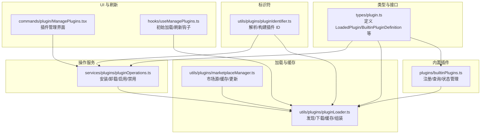
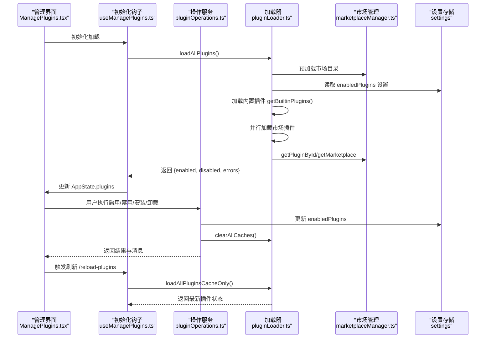
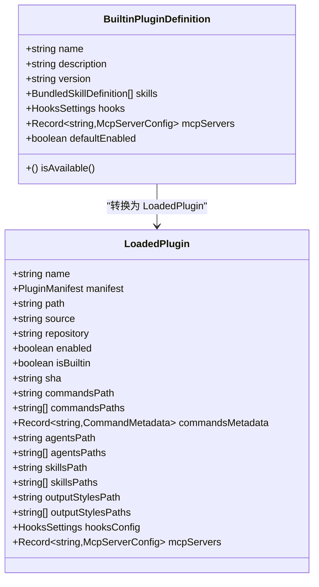
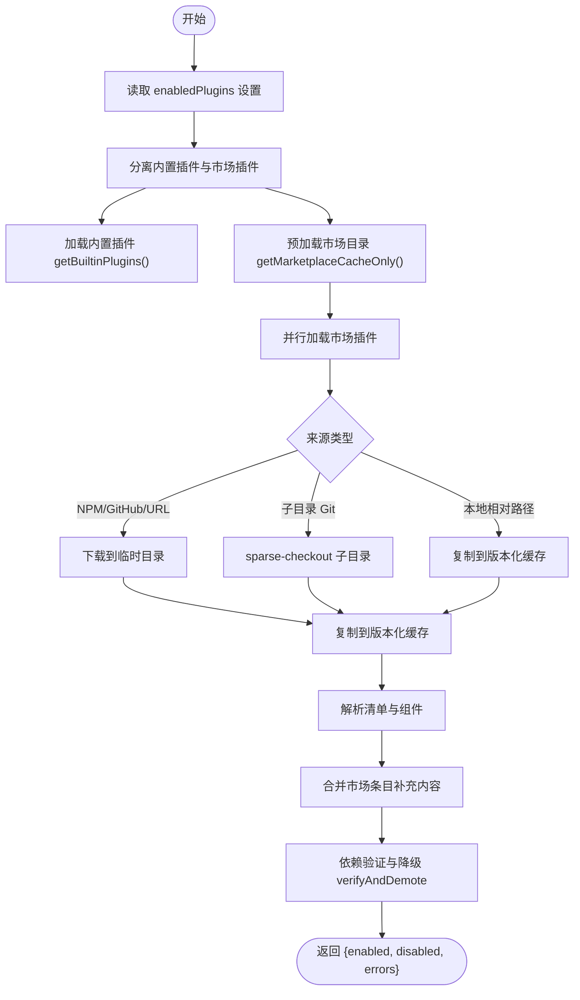
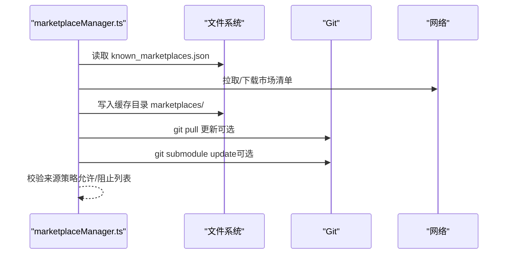
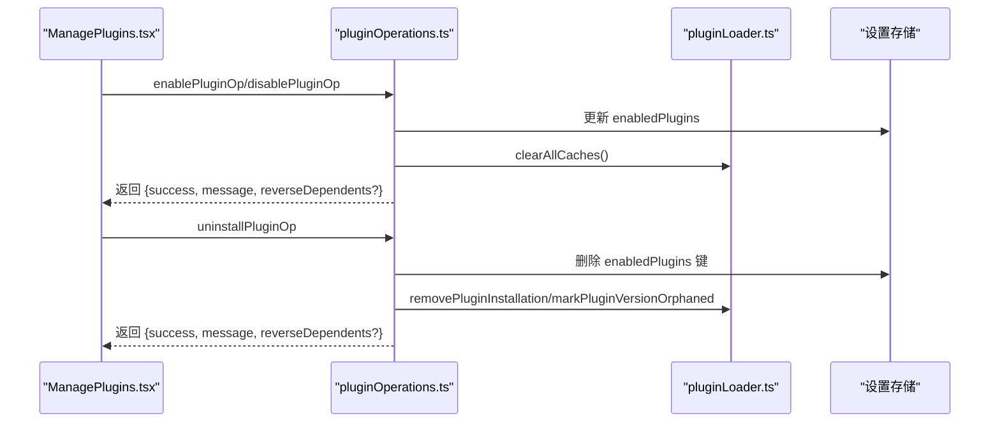
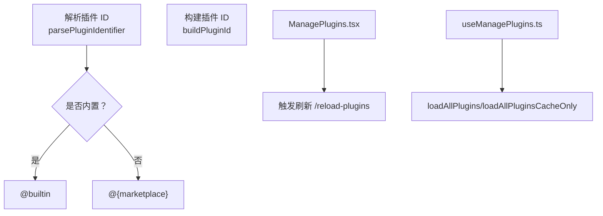
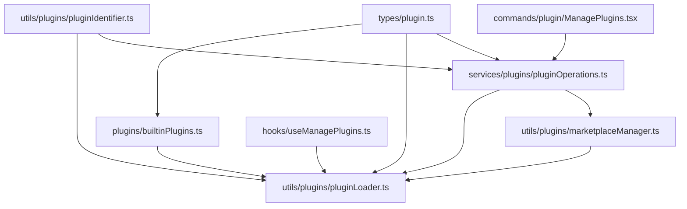

# 插件架构设计

<cite>
**本文档引用的文件**
- [builtinPlugins.ts](file://src/plugins/builtinPlugins.ts)
- [plugin.ts](file://src/types/plugin.ts)
- [pluginLoader.ts](file://src/utils/plugins/pluginLoader.ts)
- [pluginOperations.ts](file://src/services/plugins/pluginOperations.ts)
- [marketplaceManager.ts](file://src/utils/plugins/marketplaceManager.ts)
- [pluginIdentifier.ts](file://src/utils/plugins/pluginIdentifier.ts)
- [ManagePlugins.tsx](file://src/commands/plugin/ManagePlugins.tsx)
- [useManagePlugins.ts](file://src/hooks/useManagePlugins.ts)
</cite>

## 目录
1. [引言](#引言)
2. [项目结构](#项目结构)
3. [核心组件](#核心组件)
4. [架构总览](#架构总览)
5. [详细组件分析](#详细组件分析)
6. [依赖分析](#依赖分析)
7. [性能考虑](#性能考虑)
8. [故障排除指南](#故障排除指南)
9. [结论](#结论)

## 引言

本文件面向 Claude Code 的插件系统，提供从架构设计到实现细节的完整文档。重点涵盖以下方面：
- 插件注册机制与生命周期管理
- 依赖解析与版本缓存策略
- 标识符系统（内置插件 @builtin 与市场插件 @marketplace）
- 状态管理（启用/禁用、可用性检查、用户设置持久化）
- 热重载与缓存失效机制
- 架构图与组件关系说明，帮助开发者快速理解系统工作原理

## 项目结构

插件系统主要分布在以下模块中：
- 类型定义：`src/types/plugin.ts` 定义了插件核心数据结构与错误类型
- 内置插件注册：`src/plugins/builtinPlugins.ts` 提供内置插件注册、查询与状态管理
- 插件加载器：`src/utils/plugins/pluginLoader.ts` 负责发现、下载、缓存与组装插件
- 市场管理：`src/utils/plugins/marketplaceManager.ts` 管理市场源、缓存与更新
- 操作服务：`src/services/plugins/pluginOperations.ts` 提供安装、卸载、启用/禁用等操作
- 标识符解析：`src/utils/plugins/pluginIdentifier.ts` 解析与构建插件 ID
- UI 管理：`src/commands/plugin/ManagePlugins.tsx` 与 `src/hooks/useManagePlugins.ts` 提供插件 UI 与刷新逻辑

**图表来源**
- [plugin.ts:18-70](file://src/types/plugin.ts#L18-L70)
- [builtinPlugins.ts:21-102](file://src/plugins/builtinPlugins.ts#L21-L102)
- [pluginLoader.ts:1888-2089](file://src/utils/plugins/pluginLoader.ts#L1888-L2089)
- [marketplaceManager.ts:264-350](file://src/utils/plugins/marketplaceManager.ts#L264-L350)
- [pluginOperations.ts:321-776](file://src/services/plugins/pluginOperations.ts#L321-L776)
- [pluginIdentifier.ts:34-67](file://src/utils/plugins/pluginIdentifier.ts#L34-L67)
- [ManagePlugins.tsx:423-1310](file://src/commands/plugin/ManagePlugins.tsx#L423-L1310)
- [useManagePlugins.ts:26-55](file://src/hooks/useManagePlugins.ts#L26-L55)

**章节来源**
- [plugin.ts:18-70](file://src/types/plugin.ts#L18-L70)
- [builtinPlugins.ts:1-130](file://src/plugins/builtinPlugins.ts#L1-L130)
- [pluginLoader.ts:1-800](file://src/utils/plugins/pluginLoader.ts#L1-L800)
- [marketplaceManager.ts:1-200](file://src/utils/plugins/marketplaceManager.ts#L1-L200)
- [pluginOperations.ts:1-200](file://src/services/plugins/pluginOperations.ts#L1-L200)
- [pluginIdentifier.ts:34-67](file://src/utils/plugins/pluginIdentifier.ts#L34-L67)
- [ManagePlugins.tsx:423-1310](file://src/commands/plugin/ManagePlugins.tsx#L423-L1310)
- [useManagePlugins.ts:26-55](file://src/hooks/useManagePlugins.ts#L26-L55)

## 核心组件

- 插件类型定义
  - BuiltinPluginDefinition：内置插件定义，包含名称、描述、版本、技能、钩子、MCP 服务器、可用性检查与默认启用状态
  - LoadedPlugin：已加载插件对象，包含清单、路径、来源、仓库、启用状态、组件路径与配置等
  - PluginError：统一的插件错误类型，覆盖路径不存在、网络错误、清单校验失败、市场策略限制等多种场景

- 内置插件注册与状态
  - 注册：通过 registerBuiltinPlugin 在启动时注册
  - 查询：支持按名称获取定义与按启用状态分类返回
  - 标识符：内置插件使用 `{name}@builtin` 格式，便于与市场插件区分

- 插件加载与缓存
  - 发现：从设置中的 enabledPlugins 识别插件 ID，过滤内置插件后进入市场加载流程
  - 下载与缓存：支持本地相对路径、NPM、GitHub、URL、子目录 Git 等多种来源；采用版本化缓存与种子缓存加速
  - 组装：解析清单、命令、代理、技能、输出样式、钩子与设置，并合并市场条目补充内容

- 市场管理
  - 已知市场源：known_marketplaces.json 记录市场名到来源与安装位置的映射
  - 缓存：marketplaces/ 目录缓存市场清单，支持离线访问
  - 更新：支持 git 拉取与子模块更新，带超时与错误增强提示

- 操作服务
  - 安装/卸载/启用/禁用：写入设置、更新缓存、清理依赖关系、处理企业策略限制
  - 反向依赖：在禁用时捕获反向依赖，避免破坏依赖图

- 标识符系统
  - 解析：支持 name 或 name@marketplace 格式，仅以第一个 @ 分隔
  - 构建：根据名称与市场名组合生成插件 ID

**章节来源**
- [plugin.ts:18-70](file://src/types/plugin.ts#L18-L70)
- [builtinPlugins.ts:21-102](file://src/plugins/builtinPlugins.ts#L21-L102)
- [pluginLoader.ts:1888-2089](file://src/utils/plugins/pluginLoader.ts#L1888-L2089)
- [marketplaceManager.ts:264-350](file://src/utils/plugins/marketplaceManager.ts#L264-L350)
- [pluginOperations.ts:321-776](file://src/services/plugins/pluginOperations.ts#L321-L776)
- [pluginIdentifier.ts:34-67](file://src/utils/plugins/pluginIdentifier.ts#L34-L67)

## 架构总览

**图表来源**
- [ManagePlugins.tsx:423-1310](file://src/commands/plugin/ManagePlugins.tsx#L423-L1310)
- [useManagePlugins.ts:26-55](file://src/hooks/useManagePlugins.ts#L26-L55)
- [pluginOperations.ts:574-776](file://src/services/plugins/pluginOperations.ts#L574-L776)
- [pluginLoader.ts:3096-3146](file://src/utils/plugins/pluginLoader.ts#L3096-L3146)
- [marketplaceManager.ts:264-350](file://src/utils/plugins/marketplaceManager.ts#L264-L350)

## 详细组件分析

### 内置插件系统

内置插件由 CLI 自带，可通过 /plugin UI 启用/禁用，并持久化到用户设置。

**图表来源**
- [plugin.ts:18-70](file://src/types/plugin.ts#L18-L70)
- [builtinPlugins.ts:21-102](file://src/plugins/builtinPlugins.ts#L21-L102)

关键流程：
- 注册：registerBuiltinPlugin 将定义存入内存映射
- 查询：getBuiltinPluginDefinition 获取定义；getBuiltinPlugins 按用户设置与默认值分类返回
- 标识符：内置插件 ID 使用 `{name}@builtin`，通过 isBuiltinPluginId 判断

**章节来源**
- [builtinPlugins.ts:21-102](file://src/plugins/builtinPlugins.ts#L21-L102)
- [plugin.ts:18-70](file://src/types/plugin.ts#L18-L70)

### 插件加载与缓存

插件加载器负责从多源发现、下载、缓存与组装插件，支持会话级插件与市场插件。

**图表来源**
- [pluginLoader.ts:1888-2089](file://src/utils/plugins/pluginLoader.ts#L1888-L2089)
- [pluginLoader.ts:2191-2399](file://src/utils/plugins/pluginLoader.ts#L2191-L2399)
- [pluginLoader.ts:2420-2917](file://src/utils/plugins/pluginLoader.ts#L2420-L2917)

关键能力：
- 版本化缓存：按 marketplace/name/version 组织缓存目录，支持 ZIP 缓存模式
- 种子缓存：在容器镜像中预置只读缓存，提升首次启动速度
- 严格模式：marketplace 条目可声明 strict 控制冲突检测
- 会话插件：--plugin-dir 指定的目录直接加载，优先级高于已安装插件（受托管策略限制）

**章节来源**
- [pluginLoader.ts:139-188](file://src/utils/plugins/pluginLoader.ts#L139-L188)
- [pluginLoader.ts:365-465](file://src/utils/plugins/pluginLoader.ts#L365-L465)
- [pluginLoader.ts:2191-2399](file://src/utils/plugins/pluginLoader.ts#L2191-L2399)
- [pluginLoader.ts:2928-2993](file://src/utils/plugins/pluginLoader.ts#L2928-L2993)

### 市场管理与策略

市场管理器负责维护已知市场源、缓存市场清单并支持更新。

**图表来源**
- [marketplaceManager.ts:264-350](file://src/utils/plugins/marketplaceManager.ts#L264-L350)
- [marketplaceManager.ts:509-644](file://src/utils/plugins/marketplaceManager.ts#L509-L644)

策略与来源控制：
- 严格允许列表与阻止列表：未知来源在存在企业策略时拒绝加载
- 来源格式：URL、GitHub、NPM、本地路径等
- 自动更新：支持按配置自动拉取更新

**章节来源**
- [marketplaceManager.ts:161-192](file://src/utils/plugins/marketplaceManager.ts#L161-L192)
- [marketplaceManager.ts:509-644](file://src/utils/plugins/marketplaceManager.ts#L509-L644)

### 插件操作与状态管理

操作服务提供安装、卸载、启用/禁用等纯函数式操作，不直接写日志或退出进程。

**图表来源**
- [pluginOperations.ts:574-776](file://src/services/plugins/pluginOperations.ts#L574-L776)
- [pluginOperations.ts:428-559](file://src/services/plugins/pluginOperations.ts#L428-L559)

状态与持久化：
- 启用/禁用：基于设置源（user/project/local）写入 enabledPlugins
- 反向依赖：禁用前快照，提示可能影响其他插件
- 缓存失效：clearAllCaches 清空 memoized 缓存，确保后续加载获取最新状态

**章节来源**
- [pluginOperations.ts:574-776](file://src/services/plugins/pluginOperations.ts#L574-L776)
- [pluginOperations.ts:428-559](file://src/services/plugins/pluginOperations.ts#L428-L559)

### 标识符系统与 UI 刷新

标识符解析与构建用于统一处理插件 ID，UI 通过钩子实现初始加载与刷新。

**图表来源**
- [pluginIdentifier.ts:34-67](file://src/utils/plugins/pluginIdentifier.ts#L34-L67)
- [ManagePlugins.tsx:423-1310](file://src/commands/plugin/ManagePlugins.tsx#L423-L1310)
- [useManagePlugins.ts:26-55](file://src/hooks/useManagePlugins.ts#L26-L55)

**章节来源**
- [pluginIdentifier.ts:34-67](file://src/utils/plugins/pluginIdentifier.ts#L34-L67)
- [ManagePlugins.tsx:423-1310](file://src/commands/plugin/ManagePlugins.tsx#L423-L1310)
- [useManagePlugins.ts:26-55](file://src/hooks/useManagePlugins.ts#L26-L55)

## 依赖分析

**图表来源**
- [plugin.ts:18-70](file://src/types/plugin.ts#L18-L70)
- [builtinPlugins.ts:21-102](file://src/plugins/builtinPlugins.ts#L21-L102)
- [pluginLoader.ts:1888-2089](file://src/utils/plugins/pluginLoader.ts#L1888-L2089)
- [pluginOperations.ts:321-776](file://src/services/plugins/pluginOperations.ts#L321-L776)
- [pluginIdentifier.ts:34-67](file://src/utils/plugins/pluginIdentifier.ts#L34-L67)
- [marketplaceManager.ts:264-350](file://src/utils/plugins/marketplaceManager.ts#L264-L350)
- [ManagePlugins.tsx:423-1310](file://src/commands/plugin/ManagePlugins.tsx#L423-L1310)
- [useManagePlugins.ts:26-55](file://src/hooks/useManagePlugins.ts#L26-L55)

耦合与内聚：
- 类型定义集中于 types/plugin.ts，降低模块间耦合
- 加载器聚合市场与内置插件，保持单一职责
- 操作服务与加载器解耦，通过设置与缓存交互

潜在循环依赖：
- 未发现直接循环依赖；各模块通过类型与函数边界调用

外部依赖：
- 文件系统与网络访问封装在工具模块中，便于测试替换

**章节来源**
- [plugin.ts:18-70](file://src/types/plugin.ts#L18-L70)
- [pluginLoader.ts:1888-2089](file://src/utils/plugins/pluginLoader.ts#L1888-L2089)
- [pluginOperations.ts:321-776](file://src/services/plugins/pluginOperations.ts#L321-L776)

## 性能考虑

- 并行加载：市场插件与会话插件并行加载，减少启动时间
- 缓存策略：版本化缓存与 ZIP 缓存减少重复下载；种子缓存支持只读镜像预热
- 懒加载：缓存仅在需要时建立，避免不必要的 I/O
- 依赖验证：在并行加载完成后进行，避免复杂拓扑排序
- 设置缓存：合并插件设置后缓存，避免每次读取都重新合并

优化建议：
- 对大型市场清单启用目录缓存，减少磁盘扫描
- 在 CI/CD 中预热种子缓存，缩短首次启动时间
- 合理使用 --plugin-dir，避免与托管策略冲突导致的无效尝试

[本节为通用指导，无需特定文件引用]

## 故障排除指南

常见问题与定位方法：
- 插件未找到：检查 enabledPlugins 设置与市场条目；查看 marketplace-blocked-by-policy 错误
- 缓存缺失：运行 /plugins 刷新缓存；检查 ZIP 缓存与版本化路径
- 依赖冲突：查看反向依赖提示；确认依赖插件已启用
- 来源策略限制：检查允许/阻止列表；必要时调整企业策略

错误类型参考：
- path-not-found：组件路径不存在
- manifest-parse-error/manifest-validation-error：清单解析或校验失败
- marketplace-not-found/marketplace-load-failed：市场源不可用
- marketplace-blocked-by-policy：企业策略阻止加载
- generic-error：通用加载失败

**章节来源**
- [plugin.ts:101-283](file://src/types/plugin.ts#L101-L283)
- [pluginLoader.ts:1988-2036](file://src/utils/plugins/pluginLoader.ts#L1988-L2036)
- [pluginOperations.ts:691-720](file://src/services/plugins/pluginOperations.ts#L691-L720)

## 结论

Claude Code 的插件架构通过清晰的类型定义、严格的加载与缓存策略、灵活的标识符系统以及完善的 UI 刷新机制，实现了可扩展、可维护且高性能的插件生态。内置插件与市场插件并行管理，既保证了 CLI 的即开即用能力，又提供了丰富的扩展空间。企业策略与托管设置进一步增强了在组织环境中的可控性与安全性。