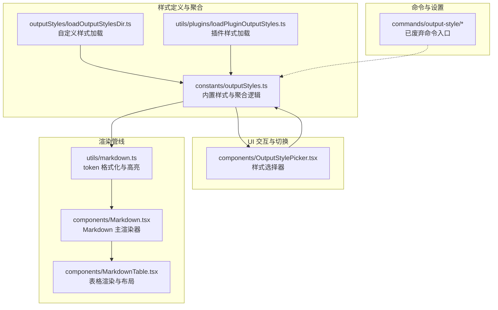
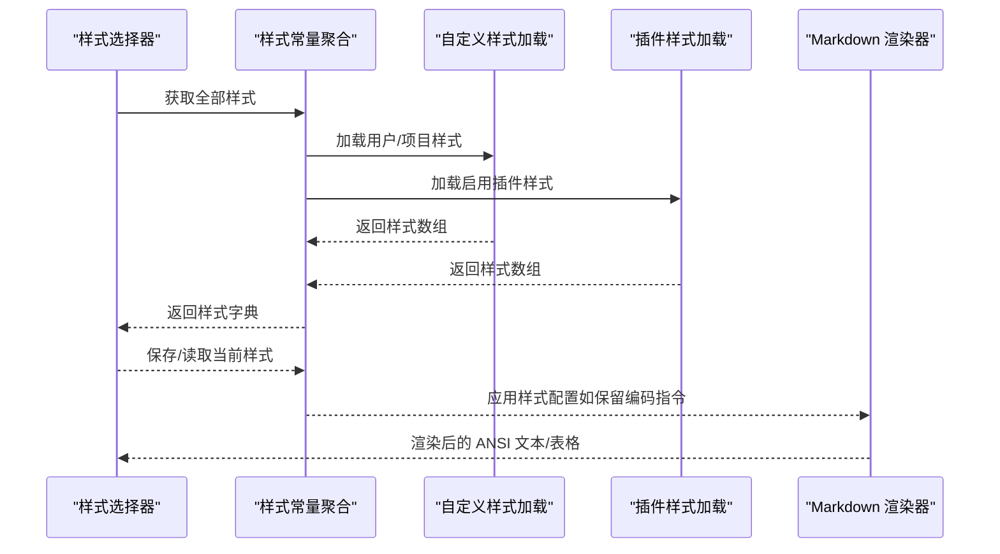
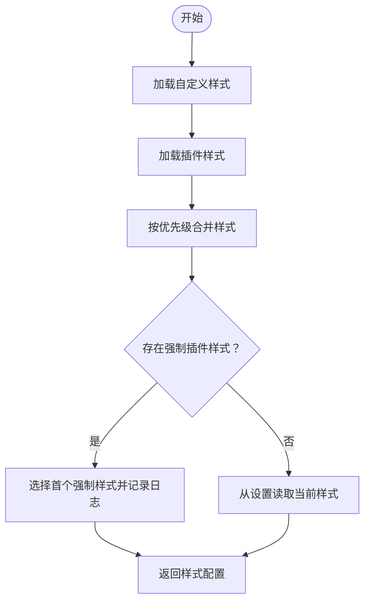
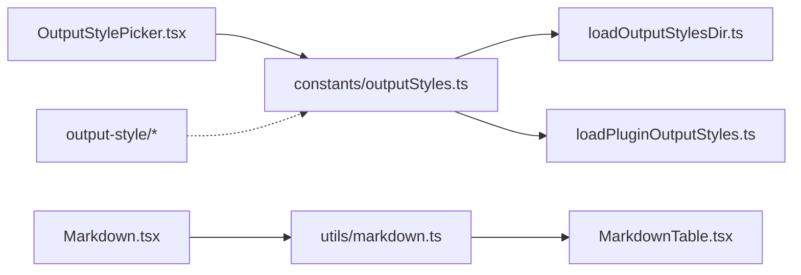

# 输出样式系统

<cite>
**本文引用的文件**
- [src/constants/outputStyles.ts](file://src/constants/outputStyles.ts)
- [src/outputStyles/loadOutputStylesDir.ts](file://src/outputStyles/loadOutputStylesDir.ts)
- [src/utils/plugins/loadPluginOutputStyles.ts](file://src/utils/plugins/loadPluginOutputStyles.ts)
- [src/components/OutputStylePicker.tsx](file://src/components/OutputStylePicker.tsx)
- [src/utils/markdown.ts](file://src/utils/markdown.ts)
- [src/components/Markdown.tsx](file://src/components/Markdown.tsx)
- [src/components/MarkdownTable.tsx](file://src/components/MarkdownTable.tsx)
- [src/commands/output-style/index.ts](file://src/commands/output-style/index.ts)
- [src/commands/output-style/output-style.tsx](file://src/commands/output-style/output-style.tsx)
</cite>

## 目录
1. [简介](#简介)
2. [项目结构](#项目结构)
3. [核心组件](#核心组件)
4. [架构总览](#架构总览)
5. [详细组件分析](#详细组件分析)
6. [依赖关系分析](#依赖关系分析)
7. [性能考量](#性能考量)
8. [故障排查指南](#故障排查指南)
9. [结论](#结论)
10. [附录：样式开发指南与示例](#附录样式开发指南与示例)

## 简介
本文件系统性阐述 Claude Code 的“输出样式”（Output Style）体系，涵盖以下方面：
- 概念与作用：如何通过不同的输出风格影响模型的表达方式，包括文本格式化、代码高亮、表格与列表渲染等。
- 注册与管理：样式加载、配置解析、动态切换与缓存失效策略。
- 内置样式：默认、解释型与学习型三种内置风格及其提示词要点。
- 自定义与扩展：用户自定义样式、插件样式、命名空间与强制应用机制。
- 渲染管线：Markdown 解析、ANSI 格式化、代码高亮、表格布局与流式渲染。
- 开发指南：样式定义规范、渲染机制、兼容性与最佳实践。

## 项目结构
输出样式系统由“样式定义与聚合”“样式加载与缓存”“UI 交互与切换”“Markdown 渲染管线”四部分组成，并与命令系统、插件系统、设置系统协同工作。

**图表来源**
- [src/constants/outputStyles.ts:137-175](file://src/constants/outputStyles.ts#L137-L175)
- [src/outputStyles/loadOutputStylesDir.ts:26-92](file://src/outputStyles/loadOutputStylesDir.ts#L26-L92)
- [src/utils/plugins/loadPluginOutputStyles.ts:87-173](file://src/utils/plugins/loadPluginOutputStyles.ts#L87-L173)
- [src/components/OutputStylePicker.tsx:28-111](file://src/components/OutputStylePicker.tsx#L28-L111)
- [src/utils/markdown.ts:36-205](file://src/utils/markdown.ts#L36-L205)
- [src/components/Markdown.tsx:78-171](file://src/components/Markdown.tsx#L78-L171)
- [src/components/MarkdownTable.tsx:72-321](file://src/components/MarkdownTable.tsx#L72-L321)
- [src/commands/output-style/index.ts:1-11](file://src/commands/output-style/index.ts#L1-L11)

**章节来源**
- [src/constants/outputStyles.ts:11-27](file://src/constants/outputStyles.ts#L11-L27)
- [src/constants/outputStyles.ts:41-135](file://src/constants/outputStyles.ts#L41-L135)
- [src/outputStyles/loadOutputStylesDir.ts:13-25](file://src/outputStyles/loadOutputStylesDir.ts#L13-L25)
- [src/utils/plugins/loadPluginOutputStyles.ts:15-34](file://src/utils/plugins/loadPluginOutputStyles.ts#L15-L34)
- [src/components/OutputStylePicker.tsx:13-27](file://src/components/OutputStylePicker.tsx#L13-L27)
- [src/utils/markdown.ts:21-47](file://src/utils/markdown.ts#L21-L47)
- [src/components/Markdown.tsx:37-71](file://src/components/Markdown.tsx#L37-L71)
- [src/components/MarkdownTable.tsx:17-26](file://src/components/MarkdownTable.tsx#L17-L26)
- [src/commands/output-style/index.ts:1-11](file://src/commands/output-style/index.ts#L1-L11)

## 核心组件
- 样式配置与聚合
  - 定义样式配置结构体与内置样式集合，提供获取全部样式与当前生效样式的函数，并支持缓存清理。
  - 支持从“插件样式”“用户样式”“项目样式”“策略样式”四个来源合并，按优先级覆盖。
- 自定义样式加载
  - 从项目与用户目录扫描 Markdown 文件，解析 Frontmatter，生成样式配置；支持 keep-coding-instructions 标志。
- 插件样式加载
  - 仅加载启用插件中的样式文件，统一以“插件名:样式名”的命名空间；支持 force-for-plugin 强制应用。
- 样式选择器 UI
  - 基于选择器组件展示可用样式，支持异步加载与回退到内置样式。
- Markdown 渲染管线
  - 使用 marked 解析 token，结合 ANSI 颜色与高亮器进行格式化；表格采用专用组件进行布局与换行处理。
- 已废弃命令
  - 提供对旧命令的引导信息，提示改用 /config 或设置文件。

**章节来源**
- [src/constants/outputStyles.ts:11-27](file://src/constants/outputStyles.ts#L11-L27)
- [src/constants/outputStyles.ts:137-175](file://src/constants/outputStyles.ts#L137-L175)
- [src/outputStyles/loadOutputStylesDir.ts:26-92](file://src/outputStyles/loadOutputStylesDir.ts#L26-L92)
- [src/utils/plugins/loadPluginOutputStyles.ts:36-85](file://src/utils/plugins/loadPluginOutputStyles.ts#L36-L85)
- [src/components/OutputStylePicker.tsx:28-111](file://src/components/OutputStylePicker.tsx#L28-L111)
- [src/utils/markdown.ts:36-47](file://src/utils/markdown.ts#L36-L47)
- [src/components/Markdown.tsx:78-171](file://src/components/Markdown.tsx#L78-L171)
- [src/components/MarkdownTable.tsx:72-321](file://src/components/MarkdownTable.tsx#L72-L321)
- [src/commands/output-style/output-style.tsx:1-6](file://src/commands/output-style/output-style.tsx#L1-L6)

## 架构总览
输出样式系统的核心流程如下：
- 启动时聚合所有样式来源，构建“样式字典”。
- 用户在 UI 中选择样式或通过设置生效。
- 渲染消息时，根据当前样式决定是否保留“编码指令”，并调用 Markdown 渲染器进行 ANSI 格式化与高亮。
- 表格内容走专用渲染路径，确保跨终端宽度适配与可读性。

**图表来源**
- [src/constants/outputStyles.ts:137-175](file://src/constants/outputStyles.ts#L137-L175)
- [src/outputStyles/loadOutputStylesDir.ts:26-92](file://src/outputStyles/loadOutputStylesDir.ts#L26-L92)
- [src/utils/plugins/loadPluginOutputStyles.ts:87-173](file://src/utils/plugins/loadPluginOutputStyles.ts#L87-L173)
- [src/components/Markdown.tsx:123-171](file://src/components/Markdown.tsx#L123-L171)

## 详细组件分析

### 组件一：样式配置与聚合（constants/outputStyles.ts）
- 数据结构
  - OutputStyleConfig：包含名称、描述、提示词、来源、是否保留编码指令、是否强制插件应用等字段。
  - OutputStyles：将 OutputStyle 联合类型映射为配置或空值。
- 内置样式
  - 默认样式：用于高效完成任务与简洁回复。
  - 解释型样式：强调对实现选择与代码库模式的教育性洞察。
  - 学习型样式：鼓励学习，请求用户协作编写小段代码，并提供示例模板。
- 聚合逻辑
  - 先复制内置样式，再依次叠加插件样式、用户样式、项目样式、策略样式，后者覆盖前者。
  - 支持“强制插件样式”：当多个插件声明强制样式时，仅应用第一个并记录调试日志。
- 查询与缓存
  - 提供获取全部样式与当前样式配置的异步函数，并暴露缓存清理接口。

**图表来源**
- [src/constants/outputStyles.ts:137-175](file://src/constants/outputStyles.ts#L137-L175)
- [src/constants/outputStyles.ts:181-211](file://src/constants/outputStyles.ts#L181-L211)

**章节来源**
- [src/constants/outputStyles.ts:11-27](file://src/constants/outputStyles.ts#L11-L27)
- [src/constants/outputStyles.ts:41-135](file://src/constants/outputStyles.ts#L41-L135)
- [src/constants/outputStyles.ts:137-175](file://src/constants/outputStyles.ts#L137-L175)
- [src/constants/outputStyles.ts:181-211](file://src/constants/outputStyles.ts#L181-L211)

### 组件二：自定义样式加载（outputStyles/loadOutputStylesDir.ts）
- 加载范围
  - 项目根目录与用户主目录下的 output-styles 子目录。
- 解析规则
  - 文件名为样式名（去后缀），Frontmatter 提供 name 与 description，正文作为提示词。
  - 支持 keep-coding-instructions 标志，接受布尔或字符串形式。
  - 对非插件样式设置 force-for-plugin 会发出警告并忽略。
- 缓存与失效
  - 使用记忆化缓存；提供清理函数以刷新缓存与相关子模块缓存。

**章节来源**
- [src/outputStyles/loadOutputStylesDir.ts:13-25](file://src/outputStyles/loadOutputStylesDir.ts#L13-L25)
- [src/outputStyles/loadOutputStylesDir.ts:26-92](file://src/outputStyles/loadOutputStylesDir.ts#L26-L92)

### 组件三：插件样式加载（utils/plugins/loadPluginOutputStyles.ts）
- 加载策略
  - 仅加载启用插件中的样式文件，默认目录与自定义路径均可。
  - 文件名作为基础样式名，统一以“插件名:样式名”的命名空间避免冲突。
- 标志与错误处理
  - 支持 force-for-plugin 标志；失败时记录调试日志但不中断整体流程。
- 缓存与失效
  - 记忆化缓存；提供清理函数。

**章节来源**
- [src/utils/plugins/loadPluginOutputStyles.ts:15-34](file://src/utils/plugins/loadPluginOutputStyles.ts#L15-L34)
- [src/utils/plugins/loadPluginOutputStyles.ts:36-85](file://src/utils/plugins/loadPluginOutputStyles.ts#L36-L85)
- [src/utils/plugins/loadPluginOutputStyles.ts:87-173](file://src/utils/plugins/loadPluginOutputStyles.ts#L87-L173)

### 组件四：样式选择器（components/OutputStylePicker.tsx）
- 功能
  - 异步加载全部样式，映射为带描述的选项；支持回退到内置样式。
  - 提供回调完成选择或取消操作。
- 交互
  - 在加载期间显示加载状态；默认值为当前样式。

**章节来源**
- [src/components/OutputStylePicker.tsx:13-27](file://src/components/OutputStylePicker.tsx#L13-L27)
- [src/components/OutputStylePicker.tsx:28-111](file://src/components/OutputStylePicker.tsx#L28-L111)

### 组件五：Markdown 渲染管线（utils/markdown.ts 与 components/Markdown.tsx）
- 格式化与高亮
  - 使用 marked 解析 token，逐个格式化为 ANSI 字符串；支持粗体、斜体、引用块、代码块、行内代码、标题、分割线、链接、列表、表格等。
  - 代码块高亮依赖高亮器；不支持的语言回退为明文。
- 性能优化
  - 通过 token 缓存与语法快速检测减少解析开销；支持禁用语法高亮。
- 流式渲染
  - 提供流式渲染组件，按“稳定前缀 + 不稳定后缀”的方式增量解析，避免重复解析已稳定的前缀。

**章节来源**
- [src/utils/markdown.ts:21-47](file://src/utils/markdown.ts#L21-L47)
- [src/utils/markdown.ts:49-205](file://src/utils/markdown.ts#L49-L205)
- [src/components/Markdown.tsx:37-71](file://src/components/Markdown.tsx#L37-L71)
- [src/components/Markdown.tsx:123-171](file://src/components/Markdown.tsx#L123-L171)
- [src/components/Markdown.tsx:186-236](file://src/components/Markdown.tsx#L186-L236)

### 组件六：表格渲染（components/MarkdownTable.tsx）
- 布局策略
  - 计算最小宽度、理想宽度与可用宽度，按比例分配列宽；支持硬换行与软换行。
  - 当行高过大时自动切换为垂直键值对布局，提升可读性。
- 边界与安全
  - 考虑边框与安全边距，防止溢出；在终端宽度变化时进行安全检查并回退到垂直布局。
- 对齐与对齐
  - 表头居中，数据按对齐方式排列；多行单元格垂直居中对齐。

**章节来源**
- [src/components/MarkdownTable.tsx:72-321](file://src/components/MarkdownTable.tsx#L72-L321)

### 组件七：已废弃命令（commands/output-style/*）
- 作用
  - 提示用户使用 /config 或设置文件更改输出样式，变更在下一次会话生效。
- 设计
  - 命令入口标记为隐藏且已废弃，加载时返回引导信息。

**章节来源**
- [src/commands/output-style/index.ts:1-11](file://src/commands/output-style/index.ts#L1-L11)
- [src/commands/output-style/output-style.tsx:1-6](file://src/commands/output-style/output-style.tsx#L1-L6)

## 依赖关系分析
- 聚合层依赖
  - constants/outputStyles.ts 依赖自定义样式加载与插件样式加载模块，以构建最终样式字典。
- UI 层依赖
  - OutputStylePicker.tsx 依赖样式聚合层，用于展示与选择。
- 渲染层依赖
  - Markdown 渲染器依赖样式配置（如是否保留编码指令），并在渲染过程中调用高亮器与表格组件。
- 命令层
  - 已废弃命令仅作迁移提示，不参与运行时样式决策。

**图表来源**
- [src/constants/outputStyles.ts:137-175](file://src/constants/outputStyles.ts#L137-L175)
- [src/outputStyles/loadOutputStylesDir.ts:26-92](file://src/outputStyles/loadOutputStylesDir.ts#L26-L92)
- [src/utils/plugins/loadPluginOutputStyles.ts:87-173](file://src/utils/plugins/loadPluginOutputStyles.ts#L87-L173)
- [src/components/OutputStylePicker.tsx:28-111](file://src/components/OutputStylePicker.tsx#L28-L111)
- [src/utils/markdown.ts:36-47](file://src/utils/markdown.ts#L36-L47)
- [src/components/Markdown.tsx:78-171](file://src/components/Markdown.tsx#L78-L171)
- [src/components/MarkdownTable.tsx:72-321](file://src/components/MarkdownTable.tsx#L72-L321)
- [src/commands/output-style/index.ts:1-11](file://src/commands/output-style/index.ts#L1-L11)

**章节来源**
- [src/constants/outputStyles.ts:137-175](file://src/constants/outputStyles.ts#L137-L175)
- [src/components/OutputStylePicker.tsx:28-111](file://src/components/OutputStylePicker.tsx#L28-L111)
- [src/utils/markdown.ts:36-47](file://src/utils/markdown.ts#L36-L47)
- [src/components/Markdown.tsx:78-171](file://src/components/Markdown.tsx#L78-L171)
- [src/components/MarkdownTable.tsx:72-321](file://src/components/MarkdownTable.tsx#L72-L321)
- [src/commands/output-style/index.ts:1-11](file://src/commands/output-style/index.ts#L1-L11)

## 性能考量
- 解析与缓存
  - marked.lexer 为热点路径，采用 token 缓存与 LRU 淘汰策略；同时提供“无 Markdown 语法”的快速路径。
- 渲染优化
  - 仅对包含可见效果的空间字符的样式进行特殊处理，减少无效绘制。
  - 表格渲染按列宽分配与换行策略，避免截断与闪烁。
- 流式渲染
  - 通过稳定边界增量解析，避免重复解析已稳定的前缀，降低 CPU 占用。

**章节来源**
- [src/components/Markdown.tsx:186-236](file://src/components/Markdown.tsx#L186-L236)
- [src/utils/markdown.ts:36-47](file://src/utils/markdown.ts#L36-L47)
- [src/components/MarkdownTable.tsx:17-26](file://src/components/MarkdownTable.tsx#L17-L26)

## 故障排查指南
- 自定义样式未生效
  - 检查文件是否位于正确的 output-styles 目录，Frontmatter 是否包含 name/description，以及是否正确设置 keep-coding-instructions。
  - 使用缓存清理函数刷新缓存后重试。
- 插件样式冲突或未应用
  - 若多个插件声明强制样式，系统仅应用首个并记录警告；确认插件启用状态与命名空间。
- 表格显示异常
  - 终端宽度变化可能导致布局回退；检查安全边距与最小列宽设置。
- 代码高亮缺失
  - 检查高亮器支持的语言列表；不支持的语言将回退为明文。

**章节来源**
- [src/outputStyles/loadOutputStylesDir.ts:64-70](file://src/outputStyles/loadOutputStylesDir.ts#L64-L70)
- [src/utils/plugins/loadPluginOutputStyles.ts:93-97](file://src/utils/plugins/loadPluginOutputStyles.ts#L93-L97)
- [src/constants/outputStyles.ts:192-204](file://src/constants/outputStyles.ts#L192-L204)
- [src/components/MarkdownTable.tsx:313-317](file://src/components/MarkdownTable.tsx#L313-L317)
- [src/utils/markdown.ts:72-87](file://src/utils/markdown.ts#L72-L87)

## 结论
输出样式系统通过“样式聚合—加载—选择—渲染”的闭环设计，实现了灵活、可扩展且高性能的输出表现。内置样式满足通用需求，自定义与插件样式提供了强大的扩展能力；渲染管线兼顾可读性与性能，适合在 CLI 环境中稳定运行。建议在团队内统一输出样式策略，并通过插件机制共享高质量样式模板。

## 附录：样式开发指南与示例

### 一、内置样式类型与特点
- 默认样式
  - 特点：高效完成任务、回复简洁；适合常规开发场景。
- 解释型样式
  - 特点：强调教育性洞察，帮助理解实现选择与代码库模式。
- 学习型样式
  - 特点：鼓励协作，请求用户编写关键代码片段，提供示例模板与调试建议。

**章节来源**
- [src/constants/outputStyles.ts:41-135](file://src/constants/outputStyles.ts#L41-L135)

### 二、样式注册与管理机制
- 自定义样式
  - 将 Markdown 文件放入项目或用户目录的 output-styles 子目录；Frontmatter 提供 name/description；正文作为提示词。
  - 可选标志：keep-coding-instructions 控制是否保留编码指令。
- 插件样式
  - 插件启用后，系统自动加载其样式文件；样式名以“插件名:样式名”命名，避免冲突。
  - 可选标志：force-for-plugin 使样式在插件启用时自动应用。
- 动态切换
  - 通过样式选择器或设置文件切换；变更在下一次会话生效。

**章节来源**
- [src/outputStyles/loadOutputStylesDir.ts:13-25](file://src/outputStyles/loadOutputStylesDir.ts#L13-L25)
- [src/utils/plugins/loadPluginOutputStyles.ts:15-34](file://src/utils/plugins/loadPluginOutputStyles.ts#L15-L34)
- [src/constants/outputStyles.ts:137-175](file://src/constants/outputStyles.ts#L137-L175)

### 三、渲染机制与兼容性
- 渲染流程
  - marked 解析为 token → formatToken 格式化为 ANSI → 高亮器处理代码块 → 表格组件布局 → UI 渲染。
- 兼容性
  - 不支持的语言回退为明文；表格在窄终端自动切换为垂直布局；支持禁用语法高亮以提升性能。

**章节来源**
- [src/utils/markdown.ts:36-47](file://src/utils/markdown.ts#L36-L47)
- [src/utils/markdown.ts:49-205](file://src/utils/markdown.ts#L49-L205)
- [src/components/MarkdownTable.tsx:182-184](file://src/components/MarkdownTable.tsx#L182-L184)

### 四、开发示例与使用技巧
- 示例：创建一个“教学式”输出样式
  - 在 output-styles 目录新建文件，Frontmatter 设置 name 与 description，正文写入教学型提示词。
  - 如需保留编码指令以便复现步骤，设置 keep-coding-instructions 为真。
- 技巧
  - 使用命名空间（插件样式）避免同名冲突。
  - 在插件中提供多个样式文件，便于团队选择。
  - 利用流式渲染特性，在长输出场景保持响应性。
  - 在窄终端环境中优先选择垂直布局的表格样式。

**章节来源**
- [src/outputStyles/loadOutputStylesDir.ts:34-84](file://src/outputStyles/loadOutputStylesDir.ts#L34-L84)
- [src/utils/plugins/loadPluginOutputStyles.ts:36-85](file://src/utils/plugins/loadPluginOutputStyles.ts#L36-L85)
- [src/components/Markdown.tsx:186-236](file://src/components/Markdown.tsx#L186-L236)
- [src/components/MarkdownTable.tsx:240-288](file://src/components/MarkdownTable.tsx#L240-L288)