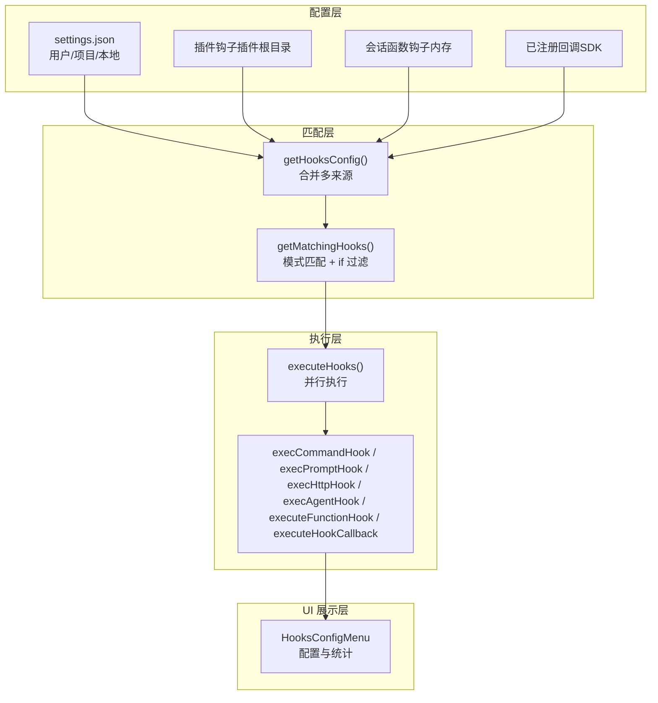
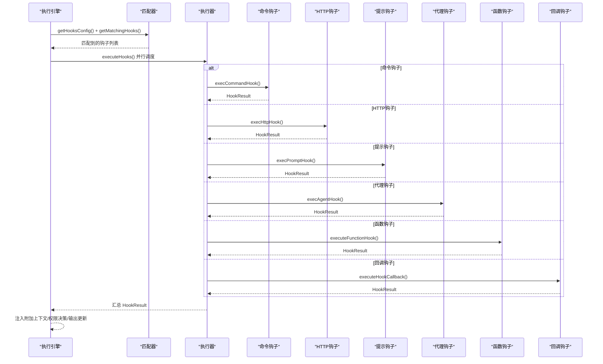
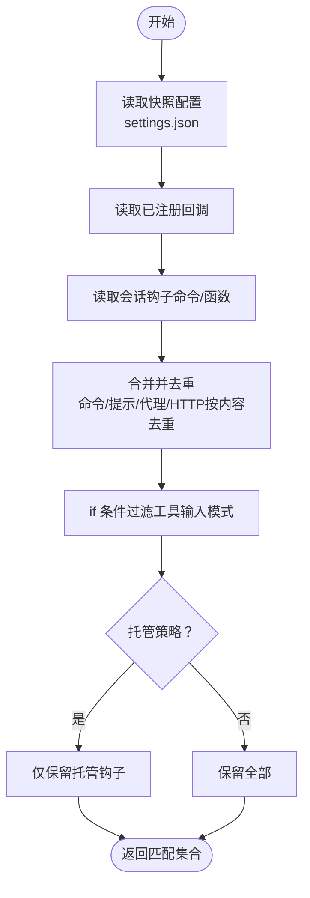
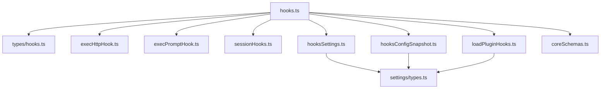

# 钩子机制

<cite>
**本文引用的文件**
- [hooks.mdx](file://docs/extensibility/hooks.mdx)
- [hooks.ts](file://src/utils/hooks.ts)
- [hooks.ts（类型定义）](file://src/types/hooks.ts)
- [execHttpHook.ts](file://src/utils/hooks/execHttpHook.ts)
- [execPromptHook.ts](file://src/utils/hooks/execPromptHook.ts)
- [sessionHooks.ts](file://src/utils/hooks/sessionHooks.ts)
- [hooksSettings.ts](file://src/utils/hooks/hooksSettings.ts)
- [types.ts（设置类型）](file://src/utils/settings/types.ts)
- [hooksConfigSnapshot.ts](file://src/utils/hooks/hooksConfigSnapshot.ts)
- [coreSchemas.ts](file://src/entrypoints/sdk/coreSchemas.ts)
- [permissionsLoader.ts](file://src/utils/permissions/permissionsLoader.ts)
- [loadPluginHooks.ts](file://src/utils/plugins/loadPluginHooks.ts)
- [HooksConfigMenu.tsx](file://src/components/hooks/HooksConfigMenu.tsx)
</cite>

## 目录
1. [简介](#简介)
2. [项目结构](#项目结构)
3. [核心组件](#核心组件)
4. [架构总览](#架构总览)
5. [详细组件分析](#详细组件分析)
6. [依赖关系分析](#依赖关系分析)
7. [性能考量](#性能考量)
8. [故障排查指南](#故障排查指南)
9. [结论](#结论)
10. [附录](#附录)

## 简介
本文件系统性阐述 Claude Code 的钩子机制：从设计原理、注册与匹配、执行顺序与并发策略，到多种钩子类型的实现细节（命令、HTTP、提示、代理、函数钩子），再到配置管理、权限控制、生命周期管理与开发调试实践。文档面向不同技术背景的读者，既提供高层概览，也给出代码级的可视化图示与路径引用，帮助快速定位实现位置并进行二次开发。

## 项目结构
钩子系统由“配置层”“匹配层”“执行层”“UI 展示层”四部分构成：
- 配置层：从多来源（用户/项目/本地设置、插件、会话内函数钩子、已注册回调）合并钩子配置，并支持去重与 if 条件过滤。
- 匹配层：根据事件类型与输入上下文计算匹配查询，应用正则/管道/通配等模式匹配与 if 条件过滤。
- 执行层：并行执行匹配到的钩子，分别处理命令、HTTP、提示、代理、函数与回调五类钩子，产出统一的 HookResult。
- UI 展示层：提供钩子配置菜单、统计与诊断信息展示，便于用户管理与排障。

图表来源
- [hooks.ts:1574-1648](file://src/utils/hooks.ts#L1574-L1648)
- [hooks.ts:1685-1956](file://src/utils/hooks.ts#L1685-L1956)
- [hooks.ts:2034-2399](file://src/utils/hooks.ts#L2034-L2399)
- [sessionHooks.ts:302-330](file://src/utils/hooks/sessionHooks.ts#L302-L330)
- [HooksConfigMenu.tsx:363-405](file://src/components/hooks/HooksConfigMenu.tsx#L363-L405)

章节来源
- [hooks.mdx:1-240](file://docs/extensibility/hooks.mdx#L1-L240)
- [hooks.ts:1574-1648](file://src/utils/hooks.ts#L1574-L1648)
- [hooks.ts:1685-1956](file://src/utils/hooks.ts#L1685-L1956)
- [hooks.ts:2034-2399](file://src/utils/hooks.ts#L2034-L2399)
- [sessionHooks.ts:302-330](file://src/utils/hooks/sessionHooks.ts#L302-L330)
- [HooksConfigMenu.tsx:363-405](file://src/components/hooks/HooksConfigMenu.tsx#L363-L405)

## 核心组件
- 钩子事件与类型
  - 事件：覆盖会话、用户交互、工具执行、权限、子 Agent、压缩、协作、MCP、环境等 22 类事件。
  - 类型：命令、提示、代理、HTTP、回调、函数六类。
- 执行引擎
  - 并行执行匹配到的钩子，统一产出 HookResult，支持超时、取消、进度事件与遥测。
- 匹配与去重
  - 支持精确匹配、管道多值匹配、正则匹配与通配；对命令/提示/代理/HTTP钩子进行去重，保留最后合并层级；回调/函数钩子不参与去重。
- 安全与信任
  - 交互模式下所有钩子均需工作区信任；支持托管策略仅运行托管钩子、禁用全部钩子等策略。
- 会话钩子
  - 会话内函数钩子与命令钩子，随会话生命周期创建与销毁，避免跨会话泄漏。

章节来源
- [hooks.mdx:9-53](file://docs/extensibility/hooks.mdx#L9-L53)
- [hooks.ts（类型定义）:22-290](file://src/types/hooks.ts#L22-L290)
- [hooks.ts:1685-1956](file://src/utils/hooks.ts#L1685-L1956)
- [hooks.ts:1854-1888](file://src/utils/hooks.ts#L1854-L1888)
- [hooks.ts:286-296](file://src/utils/hooks.ts#L286-L296)
- [hooksConfigSnapshot.ts:31-88](file://src/utils/hooks/hooksConfigSnapshot.ts#L31-L88)
- [sessionHooks.ts:68-115](file://src/utils/hooks/sessionHooks.ts#L68-L115)

## 架构总览
钩子系统的整体流程如下：从多来源合并配置，基于事件与输入上下文进行匹配，再并行执行，最终汇总结果并注入到对话或状态中。

图表来源
- [hooks.ts:1574-1648](file://src/utils/hooks.ts#L1574-L1648)
- [hooks.ts:1685-1956](file://src/utils/hooks.ts#L1685-L1956)
- [hooks.ts:2034-2399](file://src/utils/hooks.ts#L2034-L2399)
- [execHttpHook.ts:123-242](file://src/utils/hooks/execHttpHook.ts#L123-L242)
- [execPromptHook.ts:21-212](file://src/utils/hooks/execPromptHook.ts#L21-L212)

章节来源
- [hooks.ts:2034-2399](file://src/utils/hooks.ts#L2034-L2399)
- [execHttpHook.ts:123-242](file://src/utils/hooks/execHttpHook.ts#L123-L242)
- [execPromptHook.ts:21-212](file://src/utils/hooks/execPromptHook.ts#L21-L212)

## 详细组件分析

### 配置与合并（多来源）
- 来源优先级与合并
  - settings.json（用户/项目/本地）按 SOURCES 顺序合并，低优先级被高优先级覆盖。
  - 插件钩子与已注册回调在托管策略下可被限制。
  - 会话钩子（函数/命令）仅在当前会话有效，且托管策略下会被跳过。
- 去重策略
  - 对命令/提示/代理/HTTP钩子按“插件根/技能根 + 内容 + if 条件”做去重，保留最后合并层级；回调/函数钩子不参与去重。
- if 条件过滤
  - 仅对命令/提示/代理/HTTP钩子生效，使用工具输入模式解析器进行匹配，避免不必要的进程开销。

图表来源
- [hooks.ts:1574-1648](file://src/utils/hooks.ts#L1574-L1648)
- [hooks.ts:1817-1888](file://src/utils/hooks.ts#L1817-L1888)
- [hooks.ts:1890-1930](file://src/utils/hooks.ts#L1890-L1930)
- [hooksConfigSnapshot.ts:31-88](file://src/utils/hooks/hooksConfigSnapshot.ts#L31-L88)

章节来源
- [hooks.ts:1574-1648](file://src/utils/hooks.ts#L1574-L1648)
- [hooks.ts:1817-1888](file://src/utils/hooks.ts#L1817-L1888)
- [hooks.ts:1890-1930](file://src/utils/hooks.ts#L1890-L1930)
- [hooksConfigSnapshot.ts:31-88](file://src/utils/hooks/hooksConfigSnapshot.ts#L31-L88)

### 匹配与模式（matcher 与 if）
- 匹配查询
  - 根据事件类型提取匹配查询字符串（如工具名、来源、触发词等）。
- 匹配模式
  - 精确匹配、管道分隔多值、正则、通配符“*”。
- if 条件
  - 使用工具输入模式解析器，支持 Bash 等工具的树状解析，仅在工具相关事件上生效。

章节来源
- [hooks.ts:1685-1956](file://src/utils/hooks.ts#L1685-L1956)
- [hooks.ts:1428-1463](file://src/utils/hooks.ts#L1428-L1463)
- [hooks.ts:1472-1503](file://src/utils/hooks.ts#L1472-L1503)

### 执行引擎与并发
- 并行执行
  - 所有匹配到的钩子并行执行，每个钩子独立超时与取消信号。
- 统一结果
  - 统一产出 HookResult，支持阻止继续、注入系统消息、附加上下文、更新 MCP 工具输出、权限决策等。
- 进度与遥测
  - 发出进度事件与 OTEL 钩子执行开始事件，记录钩子定义与耗时。

章节来源
- [hooks.ts:2034-2399](file://src/utils/hooks.ts#L2034-L2399)
- [hooks.ts（类型定义）:201-290](file://src/types/hooks.ts#L201-L290)

### 钩子类型与实现

#### 命令钩子（command）
- 特点
  - 支持 bash/PowerShell，自动注入项目根、插件根/数据目录、用户配置变量等环境。
  - 支持异步检测协议（首行输出 {"async": true}）与 asyncRewake 唤醒模型。
  - 支持 stdin 输入 JSON，流式收集 stdout/stderr，支持提示请求（prompt request）序列化。
- 安全
  - Windows 下对路径进行 POSIX 转换；支持 CLAUDE_CODE_SHELL_PREFIX；严格错误处理与 EPIPE 检测。

章节来源
- [hooks.ts:829-1417](file://src/utils/hooks.ts#L829-L1417)
- [hooks.ts:1199-1246](file://src/utils/hooks.ts#L1199-L1246)

#### HTTP 钩子（http）
- 特点
  - 通过 axios POST JSON 到 URL，支持沙箱代理与企业代理；支持 env 变量插值与头注入白名单。
  - URL 白名单策略与 MCP 服务器允许列表一致，支持通配符。
- 安全
  - SSRF 防护（私网/链路本地范围限制，保留回环）；禁止 CRLF 注入（移除 CR/LF/NUL）。

章节来源
- [execHttpHook.ts:123-242](file://src/utils/hooks/execHttpHook.ts#L123-L242)
- [types.ts（设置类型）:479-499](file://src/utils/settings/types.ts#L479-L499)

#### 提示钩子（prompt）
- 特点
  - 使用小型快速模型对条件进行判断，返回 JSON schema；满足条件则成功，否则阻断并给出 stopReason。
- 适用
  - 用于轻量逻辑判断与上下文注入，避免外部进程开销。

章节来源
- [execPromptHook.ts:21-212](file://src/utils/hooks/execPromptHook.ts#L21-L212)

#### 代理钩子（agent）
- 特点
  - 启动子 Agent 执行复杂任务，支持消息与工具上下文传递。

章节来源
- [hooks.ts:2338-2376](file://src/utils/hooks.ts#L2338-L2376)

#### 回调钩子（callback）
- 特点
  - SDK 注册的内部钩子，无持久化，适合系统内置能力（如会话文件访问统计）。

章节来源
- [hooks.ts（类型定义）:201-231](file://src/types/hooks.ts#L201-L231)

#### 函数钩子（function）
- 特点
  - 会话内运行的函数钩子，无法持久化；适合验证、结构化输出等运行时逻辑。
- 生命周期
  - 通过 addFunctionHook/addSessionHook 添加，removeFunctionHook 移除，clearSessionHooks 清理。

章节来源
- [sessionHooks.ts:93-115](file://src/utils/hooks/sessionHooks.ts#L93-L115)
- [sessionHooks.ts:120-162](file://src/utils/hooks/sessionHooks.ts#L120-L162)
- [sessionHooks.ts:345-392](file://src/utils/hooks/sessionHooks.ts#L345-L392)

### 权限控制与托管策略
- 托管策略
  - allowManagedHooksOnly：仅运行托管钩子；disableAllHooks：禁用全部钩子（托管仍可运行）。
- 策略来源
  - policySettings 与合并设置；插件热重载时仅保留启用插件对应的钩子。
- 环境变量与 HTTP 钩子
  - httpHookAllowedEnvVars 与 allowedHttpHookUrls 作为白名单，支持数组合并语义。

章节来源
- [hooksConfigSnapshot.ts:31-88](file://src/utils/hooks/hooksConfigSnapshot.ts#L31-L88)
- [loadPluginHooks.ts:186-215](file://src/utils/plugins/loadPluginHooks.ts#L186-L215)
- [types.ts（设置类型）:479-499](file://src/utils/settings/types.ts#L479-L499)
- [permissionsLoader.ts:218-261](file://src/utils/permissions/permissionsLoader.ts#L218-L261)

### 生命周期管理
- 加载与初始化
  - 插件钩子通过 loadPluginHooks 动态加载并原子替换注册表；会话钩子通过 addSessionHook/addFunctionHook 注册。
- 执行
  - executeHooks 并行执行，emitHookStarted/emitHookResponse 事件驱动 UI 与通知。
- 清理
  - 会话结束或 clearSessionHooks 清理；插件热重载时仅保留启用插件对应的钩子。

章节来源
- [loadPluginHooks.ts:129-157](file://src/utils/plugins/loadPluginHooks.ts#L129-L157)
- [loadPluginHooks.ts:186-215](file://src/utils/plugins/loadPluginHooks.ts#L186-L215)
- [sessionHooks.ts:437-448](file://src/utils/hooks/sessionHooks.ts#L437-L448)
- [hooks.ts:2378-2399](file://src/utils/hooks.ts#L2378-L2399)

### 钩子开发指南
- 钩子模板与规范
  - 命令钩子：建议使用 JSON stdin 输入，首行输出 {"async": true} 实现异步；必要时使用 CLAUDE_ENV_FILE 注入环境。
  - HTTP 钩子：使用 allowedHttpHookUrls 与 httpHookAllowedEnvVars 白名单；避免明文敏感信息。
  - 提示钩子：遵循 JSON schema 返回 ok/reason；避免长时等待。
  - 函数钩子：在 addFunctionHook 中提供明确的错误信息与超时；避免跨会话共享状态。
- 调试方法
  - 使用 HooksConfigMenu 查看钩子来源与数量；关注进度事件与 OTEL 钩子执行日志。
  - 通过 shouldDisableAllHooksIncludingManaged 与 CLAUDE_CODE_SIMPLE 快速隔离问题。
- 性能考虑
  - 并行执行与 if 条件过滤减少不必要的进程；HTTP 钩子默认 10 分钟超时；命令钩子默认 10 分钟超时。
  - 回调/函数钩子为内联执行，避免进程开销。

章节来源
- [hooks.mdx:54-96](file://docs/extensibility/hooks.mdx#L54-L96)
- [hooks.ts:2034-2399](file://src/utils/hooks.ts#L2034-L2399)
- [HooksConfigMenu.tsx:363-405](file://src/components/hooks/HooksConfigMenu.tsx#L363-L405)

## 依赖关系分析
钩子系统的关键依赖与耦合关系如下：

图表来源
- [hooks.ts:1-120](file://src/utils/hooks.ts#L1-L120)
- [hooks.ts（类型定义）:1-290](file://src/types/hooks.ts#L1-L290)
- [execHttpHook.ts:1-11](file://src/utils/hooks/execHttpHook.ts#L1-L11)
- [execPromptHook.ts:1-16](file://src/utils/hooks/execPromptHook.ts#L1-L16)
- [sessionHooks.ts:1-8](file://src/utils/hooks/sessionHooks.ts#L1-L8)
- [hooksSettings.ts:1-13](file://src/utils/hooks/hooksSettings.ts#L1-L13)
- [hooksConfigSnapshot.ts:1-20](file://src/utils/hooks/hooksConfigSnapshot.ts#L1-L20)
- [loadPluginHooks.ts:1-30](file://src/utils/plugins/loadPluginHooks.ts#L1-L30)
- [coreSchemas.ts:767-804](file://src/entrypoints/sdk/coreSchemas.ts#L767-L804)
- [types.ts（设置类型）:435-478](file://src/utils/settings/types.ts#L435-L478)

章节来源
- [hooks.ts:1-120](file://src/utils/hooks.ts#L1-L120)
- [hooks.ts（类型定义）:1-290](file://src/types/hooks.ts#L1-L290)
- [execHttpHook.ts:1-11](file://src/utils/hooks/execHttpHook.ts#L1-L11)
- [execPromptHook.ts:1-16](file://src/utils/hooks/execPromptHook.ts#L1-L16)
- [sessionHooks.ts:1-8](file://src/utils/hooks/sessionHooks.ts#L1-L8)
- [hooksSettings.ts:1-13](file://src/utils/hooks/hooksSettings.ts#L1-L13)
- [hooksConfigSnapshot.ts:1-20](file://src/utils/hooks/hooksConfigSnapshot.ts#L1-L20)
- [loadPluginHooks.ts:1-30](file://src/utils/plugins/loadPluginHooks.ts#L1-L30)
- [coreSchemas.ts:767-804](file://src/entrypoints/sdk/coreSchemas.ts#L767-L804)
- [types.ts（设置类型）:435-478](file://src/utils/settings/types.ts#L435-L478)

## 性能考量
- 并行执行与超时
  - executeHooks 并行执行，每个钩子独立超时；命令与 HTTP 钩子默认 10 分钟，SessionEnd 钩子有更紧的默认上限。
- 去重与 if 过滤
  - 对命令/提示/代理/HTTP钩子去重，减少重复执行；if 条件过滤避免非必要工具事件的进程开销。
- 内联钩子
  - 回调/函数钩子内联执行，零进程开销；提示钩子使用小型模型，避免外部进程。
- 诊断与遥测
  - OTEL 钩子执行开始事件与进度事件，便于性能分析与问题定位。

章节来源
- [hooks.ts:160-182](file://src/utils/hooks.ts#L160-L182)
- [hooks.ts:1817-1888](file://src/utils/hooks.ts#L1817-L1888)
- [hooks.ts:1890-1930](file://src/utils/hooks.ts#L1890-L1930)
- [hooks.ts:2151-2174](file://src/utils/hooks.ts#L2151-L2174)

## 故障排查指南
- 工作区信任
  - 交互模式下所有钩子需要信任，未接受信任将被跳过。
- 禁用策略
  - disableAllHooks 或托管策略 allowManagedHooksOnly 会导致钩子被禁用或仅运行托管钩子。
- HTTP 钩子
  - URL 不在 allowedHttpHookUrls 中会被拒绝；env 变量插值受 httpHookAllowedEnvVars 限制；注意 SSRF 防护与代理配置。
- 命令钩子
  - 关注 EPIPE 错误（命令提前退出）与 stdin 写入失败；Windows 路径需 POSIX 转换。
- 提示/代理钩子
  - JSON schema 校验失败会返回非阻断错误；确认模型可用与工具上下文正确。
- UI 与统计
  - 使用 HooksConfigMenu 查看钩子来源与数量；关注进度事件与 OTEL 日志。

章节来源
- [hooks.ts:286-296](file://src/utils/hooks.ts#L286-L296)
- [hooksConfigSnapshot.ts:31-88](file://src/utils/hooks/hooksConfigSnapshot.ts#L31-L88)
- [execHttpHook.ts:135-145](file://src/utils/hooks/execHttpHook.ts#L135-L145)
- [execHttpHook.ts:76-108](file://src/utils/hooks/execHttpHook.ts#L76-L108)
- [hooks.ts:1367-1400](file://src/utils/hooks.ts#L1367-L1400)
- [execPromptHook.ts:133-151](file://src/utils/hooks/execPromptHook.ts#L133-L151)
- [HooksConfigMenu.tsx:363-405](file://src/components/hooks/HooksConfigMenu.tsx#L363-L405)

## 结论
Claude Code 的钩子机制通过“多来源配置 + 模式匹配 + 并行执行 + 统一结果”的设计，在保证安全性与可控性的同时，提供了强大的扩展能力。开发者可依据本文档的类型定义、执行流程与安全策略，快速开发并集成各类钩子，满足从 CI 检查、上下文注入到远程服务联动等多样化需求。

## 附录
- 事件与类型参考
  - 事件列表与匹配字段参见文档“22 种 Hook 事件”。
  - 钩子类型与适用场景参见文档“6 种 Hook 类型”。

章节来源
- [hooks.mdx:9-53](file://docs/extensibility/hooks.mdx#L9-L53)