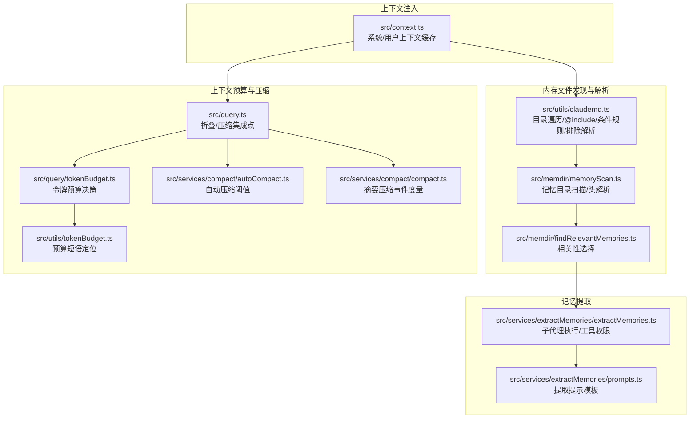
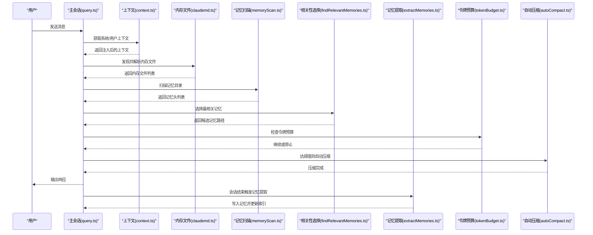
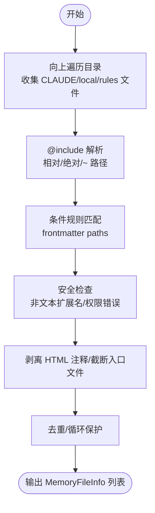
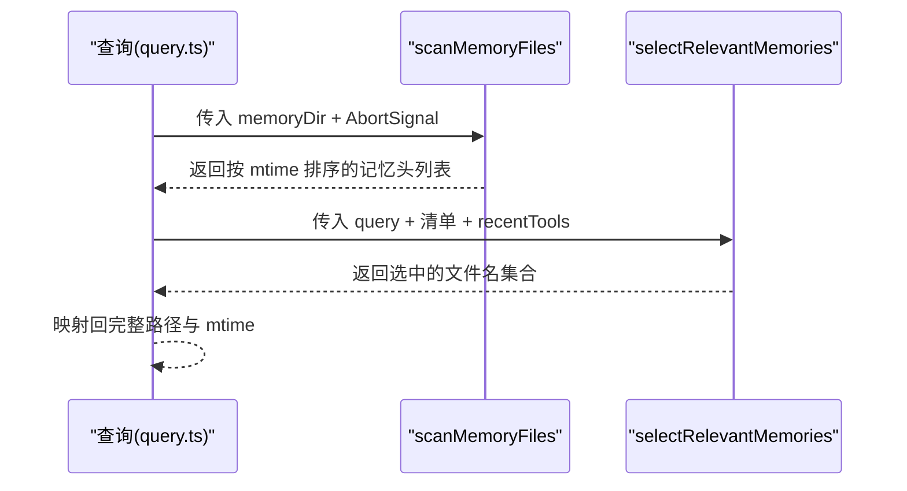
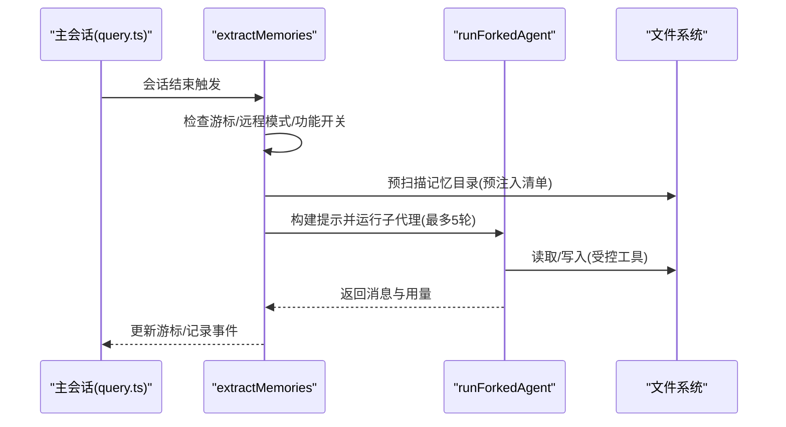
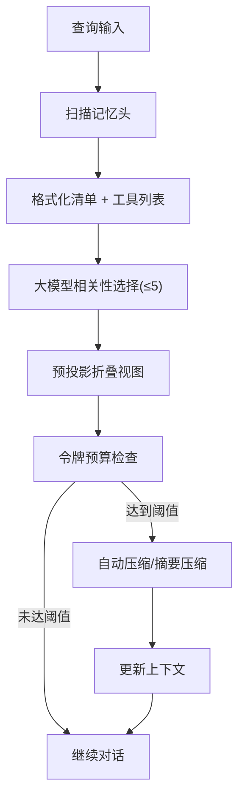
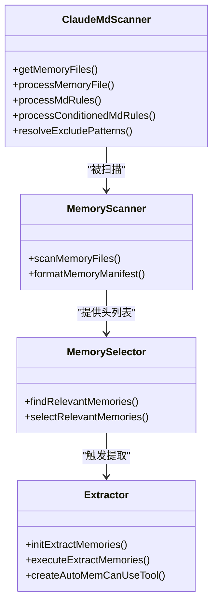
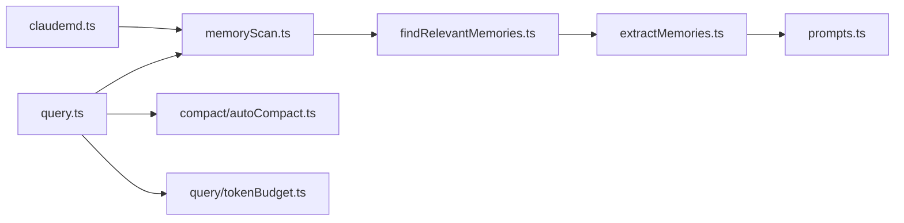

# 上下文提取算法

<cite>
**本文引用的文件**
- [src/context.ts](file://src/context.ts)
- [src/utils/claudemd.ts](file://src/utils/claudemd.ts)
- [src/memdir/memoryScan.ts](file://src/memdir/memoryScan.ts)
- [src/memdir/findRelevantMemories.ts](file://src/memdir/findRelevantMemories.ts)
- [src/services/extractMemories/extractMemories.ts](file://src/services/extractMemories/extractMemories.ts)
- [src/services/extractMemories/prompts.ts](file://src/services/extractMemories/prompts.ts)
- [src/memdir/memoryTypes.ts](file://src/memdir/memoryTypes.ts)
- [src/query/tokenBudget.ts](file://src/query/tokenBudget.ts)
- [src/utils/tokenBudget.ts](file://src/utils/tokenBudget.ts)
- [src/services/compact/autoCompact.ts](file://src/services/compact/autoCompact.ts)
- [src/services/compact/compact.ts](file://src/services/compact/compact.ts)
- [src/query.ts](file://src/query.ts)
- [src/utils/collapseReadSearch.ts](file://src/utils/collapseReadSearch.ts)
- [src/utils/memoryFileDetection.ts](file://src/utils/memoryFileDetection.ts)
</cite>

## 目录
1. [简介](#简介)
2. [项目结构](#项目结构)
3. [核心组件](#核心组件)
4. [架构总览](#架构总览)
5. [详细组件分析](#详细组件分析)
6. [依赖关系分析](#依赖关系分析)
7. [性能考量](#性能考量)
8. [故障排查指南](#故障排查指南)
9. [结论](#结论)
10. [附录](#附录)

## 简介
本文件系统化阐述 Claude Code 的上下文提取算法，覆盖文件扫描策略、代码分析方法、依赖关系识别机制、内存扫描算法、查询上下文构建流程、相关性评分与上下文截断/压缩等关键技术点，并提供可操作的性能优化建议，帮助开发者在大型项目中高效提取有用上下文。

## 项目结构
围绕“上下文提取”的关键模块分布如下：
- 用户与系统上下文注入：通过系统提示与用户上下文缓存，将 CLAUDE.md 指令、Git 状态、日期等注入到会话中。
- 内存文件发现与解析：自上而下的目录遍历、@include 引用处理、条件规则匹配、排除模式解析、HTML 注释剥离、入口文件截断等。
- 记忆文件检索：基于记忆文件头（frontmatter）与工具清单，利用大模型进行相关性选择。
- 记忆提取子代理：在会话末尾自动抽取持久化记忆，写入自动记忆目录并更新索引。
- 上下文预算与压缩：基于令牌预算的继续/停止决策、自动压缩阈值与告警、摘要压缩与会话记忆压缩联动。

**图表来源**
- [src/context.ts:115-189](file://src/context.ts#L115-L189)
- [src/utils/claudemd.ts:790-1075](file://src/utils/claudemd.ts#L790-L1075)
- [src/memdir/memoryScan.ts:35-77](file://src/memdir/memoryScan.ts#L35-L77)
- [src/memdir/findRelevantMemories.ts:39-75](file://src/memdir/findRelevantMemories.ts#L39-L75)
- [src/services/extractMemories/extractMemories.ts:296-587](file://src/services/extractMemories/extractMemories.ts#L296-L587)
- [src/services/extractMemories/prompts.ts:29-94](file://src/services/extractMemories/prompts.ts#L29-L94)
- [src/query/tokenBudget.ts:45-94](file://src/query/tokenBudget.ts#L45-L94)
- [src/utils/tokenBudget.ts:31-73](file://src/utils/tokenBudget.ts#L31-L73)
- [src/services/compact/autoCompact.ts:72-111](file://src/services/compact/autoCompact.ts#L72-L111)
- [src/services/compact/compact.ts:635-650](file://src/services/compact/compact.ts#L635-L650)
- [src/query.ts:282-451](file://src/query.ts#L282-L451)

**章节来源**
- [src/context.ts:115-189](file://src/context.ts#L115-L189)
- [src/utils/claudemd.ts:790-1075](file://src/utils/claudemd.ts#L790-L1075)
- [src/memdir/memoryScan.ts:35-77](file://src/memdir/memoryScan.ts#L35-L77)
- [src/memdir/findRelevantMemories.ts:39-75](file://src/memdir/findRelevantMemories.ts#L39-L75)
- [src/services/extractMemories/extractMemories.ts:296-587](file://src/services/extractMemories/extractMemories.ts#L296-L587)
- [src/services/extractMemories/prompts.ts:29-94](file://src/services/extractMemories/prompts.ts#L29-L94)
- [src/query/tokenBudget.ts:45-94](file://src/query/tokenBudget.ts#L45-L94)
- [src/utils/tokenBudget.ts:31-73](file://src/utils/tokenBudget.ts#L31-L73)
- [src/services/compact/autoCompact.ts:72-111](file://src/services/compact/autoCompact.ts#L72-L111)
- [src/services/compact/compact.ts:635-650](file://src/services/compact/compact.ts#L635-L650)
- [src/query.ts:282-451](file://src/query.ts#L282-L451)

## 核心组件
- 文件扫描与解析
  - 自上而下遍历目录，发现 CLAUDE.md、.claude/CLAUDE.md、CLAUDE.local.md 及 .claude/rules/*.md。
  - 支持 @include 引用（相对/绝对/~ 路径）、循环引用保护、外部包含控制、条件规则（frontmatter paths 匹配目标路径）。
  - 排除模式支持 realpath 解析以兼容符号链接；剥离 HTML 注释；入口文件截断；非文本扩展名过滤。
- 记忆检索
  - 扫描记忆目录，读取 frontmatter，按 mtime 新旧排序，最多返回 200 条。
  - 使用大模型对可用记忆清单进行相关性选择，限制为最多 5 个。
- 记忆提取
  - 会话结束时触发子代理，仅允许只读工具与自动记忆目录内的写入。
  - 提示模板约束四类记忆类型（user/feedback/project/reference），禁止保存可从当前项目状态派生的内容。
- 上下文预算与压缩
  - 令牌预算跟踪与继续/停止决策；自动压缩阈值计算；摘要压缩事件度量；与折叠视图协同减少上下文体积。

**章节来源**
- [src/utils/claudemd.ts:790-1075](file://src/utils/claudemd.ts#L790-L1075)
- [src/memdir/memoryScan.ts:35-77](file://src/memdir/memoryScan.ts#L35-L77)
- [src/memdir/findRelevantMemories.ts:39-75](file://src/memdir/findRelevantMemories.ts#L39-L75)
- [src/services/extractMemories/extractMemories.ts:296-587](file://src/services/extractMemories/extractMemories.ts#L296-L587)
- [src/query/tokenBudget.ts:45-94](file://src/query/tokenBudget.ts#L45-L94)
- [src/services/compact/autoCompact.ts:72-111](file://src/services/compact/autoCompact.ts#L72-L111)

## 架构总览
上下文提取贯穿“发现—检索—提取—预算—压缩”闭环，既保证上下文质量，又控制成本与延迟。

**图表来源**
- [src/query.ts:282-451](file://src/query.ts#L282-L451)
- [src/context.ts:115-189](file://src/context.ts#L115-L189)
- [src/utils/claudemd.ts:790-1075](file://src/utils/claudemd.ts#L790-L1075)
- [src/memdir/memoryScan.ts:35-77](file://src/memdir/memoryScan.ts#L35-L77)
- [src/memdir/findRelevantMemories.ts:39-75](file://src/memdir/findRelevantMemories.ts#L39-L75)
- [src/services/extractMemories/extractMemories.ts:296-587](file://src/services/extractMemories/extractMemories.ts#L296-L587)
- [src/query/tokenBudget.ts:45-94](file://src/query/tokenBudget.ts#L45-L94)
- [src/services/compact/autoCompact.ts:72-111](file://src/services/compact/autoCompact.ts#L72-L111)

## 详细组件分析

### 文件扫描与解析（claudemd）
- 扫描策略
  - 自 CWD 向根递归遍历，收集 CLAUDE.md、.claude/CLAUDE.md、CLAUDE.local.md 与 .claude/rules/*.md。
  - 支持额外目录（--add-dir）与嵌套工作树场景，避免重复加载 Checked-in 内容。
- @include 与条件规则
  - 解析 Markdown token，提取 @path 引用，支持相对/绝对/~ 路径，去 fragment，转义空格，解析为绝对路径。
  - 条件规则：frontmatter paths 匹配目标路径，支持 Managed/User/Project 不同基线。
- 安全与性能
  - 非文本扩展名过滤，防止二进制文件进入上下文。
  - HTML 注释剥离，入口文件截断，避免超长内容。
  - 排除模式支持 realpath 解析，兼容符号链接。
- 输出
  - MemoryFileInfo 列表，含路径、类型、内容、父文件、glob 规则、是否与磁盘内容不同等元数据。

**图表来源**
- [src/utils/claudemd.ts:850-977](file://src/utils/claudemd.ts#L850-L977)
- [src/utils/claudemd.ts:618-685](file://src/utils/claudemd.ts#L618-L685)
- [src/utils/claudemd.ts:697-788](file://src/utils/claudemd.ts#L697-L788)
- [src/utils/claudemd.ts:537-612](file://src/utils/claudemd.ts#L537-L612)

**章节来源**
- [src/utils/claudemd.ts:790-1075](file://src/utils/claudemd.ts#L790-L1075)
- [src/utils/claudemd.ts:537-612](file://src/utils/claudemd.ts#L537-L612)
- [src/utils/claudemd.ts:618-685](file://src/utils/claudemd.ts#L618-L685)
- [src/utils/claudemd.ts:697-788](file://src/utils/claudemd.ts#L697-L788)

### 记忆目录扫描与相关性选择
- 目录扫描
  - 递归读取 .md 文件，限定不包含 MEMORY.md，最多 200 个，按 mtime 降序。
  - 单次读取同时获取前若干行与 mtime，避免二次 stat。
- 相关性选择
  - 将记忆清单格式化为“类型/时间戳/描述”清单，结合“最近使用的工具”列表，调用大模型选择最相关 5 个。
  - 支持遥测记录选择形状，便于后续优化。

**图表来源**
- [src/memdir/memoryScan.ts:35-77](file://src/memdir/memoryScan.ts#L35-L77)
- [src/memdir/findRelevantMemories.ts:39-75](file://src/memdir/findRelevantMemories.ts#L39-L75)
- [src/memdir/findRelevantMemories.ts:77-141](file://src/memdir/findRelevantMemories.ts#L77-L141)

**章节来源**
- [src/memdir/memoryScan.ts:35-77](file://src/memdir/memoryScan.ts#L35-L77)
- [src/memdir/findRelevantMemories.ts:39-75](file://src/memdir/findRelevantMemories.ts#L39-L75)
- [src/memdir/findRelevantMemories.ts:77-141](file://src/memdir/findRelevantMemories.ts#L77-L141)

### 记忆提取子代理
- 触发时机
  - 会话结束（无工具调用）时，通过 stopHooks 触发，避免与主代理冲突。
- 工具权限
  - 允许 Read/Grep/Glob、只读 Bash、以及自动记忆目录内的 Edit/Write；其他一律拒绝。
- 提示模板
  - 四类记忆类型约束与“不可保存内容”清单；根据是否启用团队记忆生成组合提示。
- 执行流程
  - 预注入现有记忆清单（避免一次 ls 转账），fork 子代理两轮完成读取与写入，成功后推进游标，记录用量与统计。

**图表来源**
- [src/services/extractMemories/extractMemories.ts:296-587](file://src/services/extractMemories/extractMemories.ts#L296-L587)
- [src/services/extractMemories/prompts.ts:29-94](file://src/services/extractMemories/prompts.ts#L29-L94)
- [src/services/extractMemories/prompts.ts:101-154](file://src/services/extractMemories/prompts.ts#L101-L154)

**章节来源**
- [src/services/extractMemories/extractMemories.ts:296-587](file://src/services/extractMemories/extractMemories.ts#L296-L587)
- [src/services/extractMemories/prompts.ts:29-94](file://src/services/extractMemories/prompts.ts#L29-L94)
- [src/services/extractMemories/prompts.ts:101-154](file://src/services/extractMemories/prompts.ts#L101-L154)

### 查询上下文构建与相关性评分
- 相关性评分
  - 基于记忆头（类型、时间戳、描述）与查询词，结合“最近使用工具”列表，由大模型给出 JSON Schema 结果，限制最多 5 个。
- 上下文截断与信息压缩
  - 入口文件截断（自动记忆/团队记忆）；摘要压缩；自动压缩阈值；折叠视图投影。
- 信息压缩
  - 摘要压缩事件度量输入/输出 token 与摘要消息；SM-compact 在特定 feature 下直接复用会话记忆作为摘要，避免额外 API 调用。

**图表来源**
- [src/memdir/findRelevantMemories.ts:77-141](file://src/memdir/findRelevantMemories.ts#L77-L141)
- [src/query.ts:440-451](file://src/query.ts#L440-L451)
- [src/services/compact/compact.ts:635-650](file://src/services/compact/compact.ts#L635-L650)
- [src/services/compact/autoCompact.ts:72-111](file://src/services/compact/autoCompact.ts#L72-L111)

**章节来源**
- [src/memdir/findRelevantMemories.ts:77-141](file://src/memdir/findRelevantMemories.ts#L77-L141)
- [src/query.ts:440-451](file://src/query.ts#L440-L451)
- [src/services/compact/compact.ts:635-650](file://src/services/compact/compact.ts#L635-L650)
- [src/services/compact/autoCompact.ts:72-111](file://src/services/compact/autoCompact.ts#L72-L111)

### 依赖关系识别与安全过滤
- 依赖识别
  - @include 引用路径解析与去重；条件规则基于 frontmatter paths；排除模式支持 realpath。
- 安全过滤
  - 非文本扩展名过滤；权限错误日志；外部包含警告与审批；命令行路径检测（自动记忆/记忆目录）。
- 搜索与写入折叠
  - 检测搜索/写入/编辑是否命中记忆文件，必要时进行折叠以减少冗余。

**图表来源**
- [src/utils/claudemd.ts:790-1075](file://src/utils/claudemd.ts#L790-L1075)
- [src/memdir/memoryScan.ts:35-77](file://src/memdir/memoryScan.ts#L35-L77)
- [src/memdir/findRelevantMemories.ts:39-75](file://src/memdir/findRelevantMemories.ts#L39-L75)
- [src/services/extractMemories/extractMemories.ts:296-587](file://src/services/extractMemories/extractMemories.ts#L296-L587)

**章节来源**
- [src/utils/claudemd.ts:537-612](file://src/utils/claudemd.ts#L537-L612)
- [src/utils/claudemd.ts:618-685](file://src/utils/claudemd.ts#L618-L685)
- [src/utils/claudemd.ts:697-788](file://src/utils/claudemd.ts#L697-L788)
- [src/utils/claudemd.ts:1399-1430](file://src/utils/claudemd.ts#L1399-L1430)
- [src/utils/collapseReadSearch.ts:98-138](file://src/utils/collapseReadSearch.ts#L98-L138)
- [src/utils/memoryFileDetection.ts:243-271](file://src/utils/memoryFileDetection.ts#L243-L271)

## 依赖关系分析
- 组件耦合
  - claudemd.ts 与 memoryScan.ts/extractMemories.ts 存在跨模块依赖：前者负责发现与解析，后者负责检索与提取。
  - findRelevantMemories.ts 依赖 memoryScan.ts 的扫描结果，再调用 sideQuery 进行选择。
  - extractMemories.ts 依赖 prompts.ts 的提示模板与工具权限控制。
- 外部依赖
  - 大模型 sideQuery 用于相关性选择与记忆提取。
  - 文件系统 API 用于读取/遍历/统计。
- 循环依赖规避
  - memoryScan.ts 从 findRelevantMemories.ts 中拆分，避免循环导入。

**图表来源**
- [src/utils/claudemd.ts:790-1075](file://src/utils/claudemd.ts#L790-L1075)
- [src/memdir/memoryScan.ts:35-77](file://src/memdir/memoryScan.ts#L35-L77)
- [src/memdir/findRelevantMemories.ts:39-75](file://src/memdir/findRelevantMemories.ts#L39-L75)
- [src/services/extractMemories/extractMemories.ts:296-587](file://src/services/extractMemories/extractMemories.ts#L296-L587)
- [src/services/extractMemories/prompts.ts:29-94](file://src/services/extractMemories/prompts.ts#L29-L94)
- [src/query.ts:282-451](file://src/query.ts#L282-L451)
- [src/services/compact/autoCompact.ts:72-111](file://src/services/compact/autoCompact.ts#L72-L111)
- [src/query/tokenBudget.ts:45-94](file://src/query/tokenBudget.ts#L45-L94)

**章节来源**
- [src/utils/claudemd.ts:790-1075](file://src/utils/claudemd.ts#L790-L1075)
- [src/memdir/memoryScan.ts:35-77](file://src/memdir/memoryScan.ts#L35-L77)
- [src/memdir/findRelevantMemories.ts:39-75](file://src/memdir/findRelevantMemories.ts#L39-L75)
- [src/services/extractMemories/extractMemories.ts:296-587](file://src/services/extractMemories/extractMemories.ts#L296-L587)
- [src/services/extractMemories/prompts.ts:29-94](file://src/services/extractMemories/prompts.ts#L29-L94)
- [src/query.ts:282-451](file://src/query.ts#L282-L451)
- [src/services/compact/autoCompact.ts:72-111](file://src/services/compact/autoCompact.ts#L72-L111)
- [src/query/tokenBudget.ts:45-94](file://src/query/tokenBudget.ts#L45-L94)

## 性能考量
- I/O 优化
  - memoryScan.ts 使用“读取-内排序-截断”，避免双轮 stat；claudemd.ts 对非文本扩展名提前过滤，减少无效读取。
- 并发与节流
  - extractMemories.ts 采用“节流轮次 + 后置尾随运行”策略，合并并发请求，避免重复工作。
- 令牌预算与压缩
  - tokenBudget.ts 提供继续/停止决策；autoCompact.ts 动态阈值；compact.ts 记录摘要压缩事件，指导进一步优化。
- 缓存与去重
  - claudemd.ts 使用 memoize 缓存 getMemoryFiles；processMemoryFile 与 processMdRules 使用 processedPaths 防止循环与重复。

**章节来源**
- [src/memdir/memoryScan.ts:30-34](file://src/memdir/memoryScan.ts#L30-L34)
- [src/utils/claudemd.ts:349-354](file://src/utils/claudemd.ts#L349-L354)
- [src/services/extractMemories/extractMemories.ts:374-386](file://src/services/extractMemories/extractMemories.ts#L374-L386)
- [src/query/tokenBudget.ts:45-94](file://src/query/tokenBudget.ts#L45-L94)
- [src/services/compact/autoCompact.ts:72-111](file://src/services/compact/autoCompact.ts#L72-L111)
- [src/services/compact/compact.ts:635-650](file://src/services/compact/compact.ts#L635-L650)

## 故障排查指南
- 权限与路径问题
  - claudemd.ts 对 EACCES 错误进行专门日志记录；外部包含警告需用户审批。
- 相关性选择失败
  - findRelevantMemories.ts 捕获异常并回退为空结果；可检查 AbortSignal 与 sideQuery 输出格式。
- 内存文件过大
  - claudemd.ts 提供 getLargeMemoryFiles 过滤；MAX_MEMORY_CHARACTER_COUNT 控制单文件字符上限。
- 搜索/写入命中记忆文件
  - collapseReadSearch.ts 与 memoryFileDetection.ts 提供检测逻辑，必要时进行折叠以减少冗余。

**章节来源**
- [src/utils/claudemd.ts:402-416](file://src/utils/claudemd.ts#L402-L416)
- [src/memdir/findRelevantMemories.ts:131-140](file://src/memdir/findRelevantMemories.ts#L131-L140)
- [src/utils/claudemd.ts:1132-1134](file://src/utils/claudemd.ts#L1132-L1134)
- [src/utils/collapseReadSearch.ts:98-138](file://src/utils/collapseReadSearch.ts#L98-L138)
- [src/utils/memoryFileDetection.ts:243-271](file://src/utils/memoryFileDetection.ts#L243-L271)

## 结论
该上下文提取算法以“发现—检索—提取—预算—压缩”为主线，通过严格的文件扫描与解析、基于大模型的相关性选择、受控的自动记忆提取、以及令牌预算与压缩策略，实现了在大型项目中高效、安全、可控的上下文管理。开发者可依据本文档的策略与优化建议，在实际工程中稳定落地并持续迭代。

## 附录
- 记忆类型与不可保存内容
  - memoryTypes.ts 定义四类记忆类型与“不可保存内容”清单，确保上下文聚焦于不可从当前项目状态派生的信息。
- 上下文注入要点
  - context.ts 提供系统/用户上下文缓存，注入 Git 状态、日期等，支持缓存失效与诊断日志。

**章节来源**
- [src/memdir/memoryTypes.ts:14-272](file://src/memdir/memoryTypes.ts#L14-L272)
- [src/context.ts:115-189](file://src/context.ts#L115-L189)