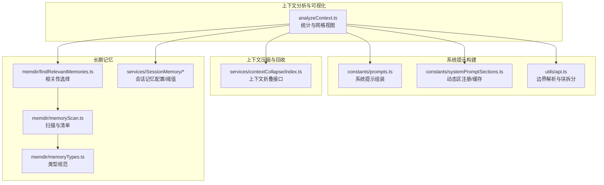
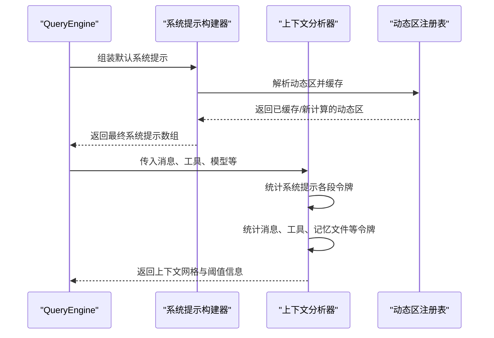
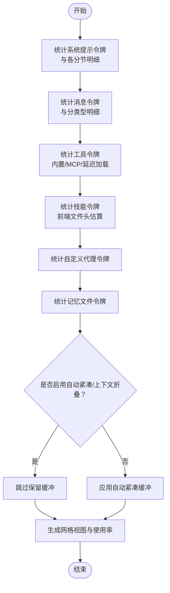
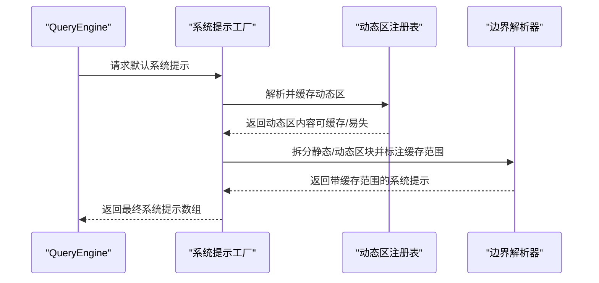
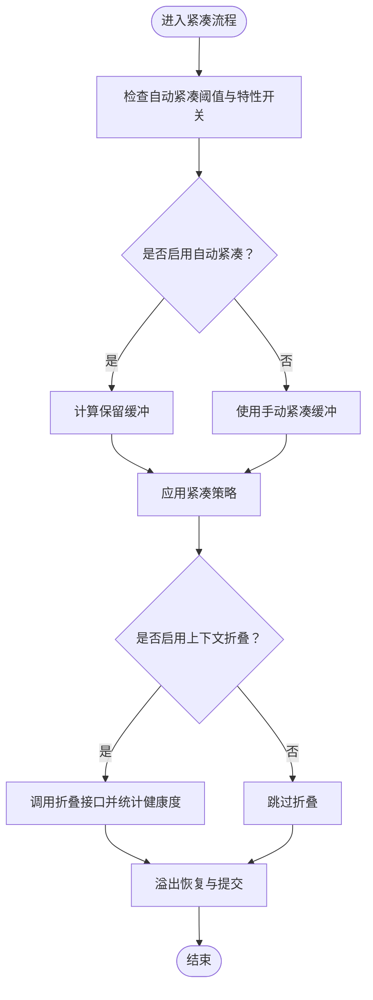
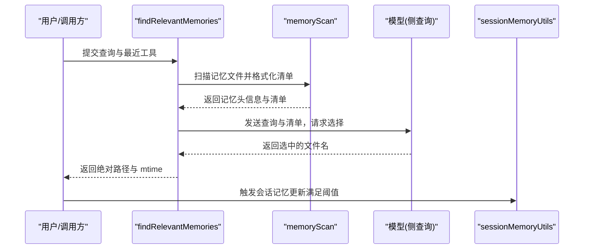
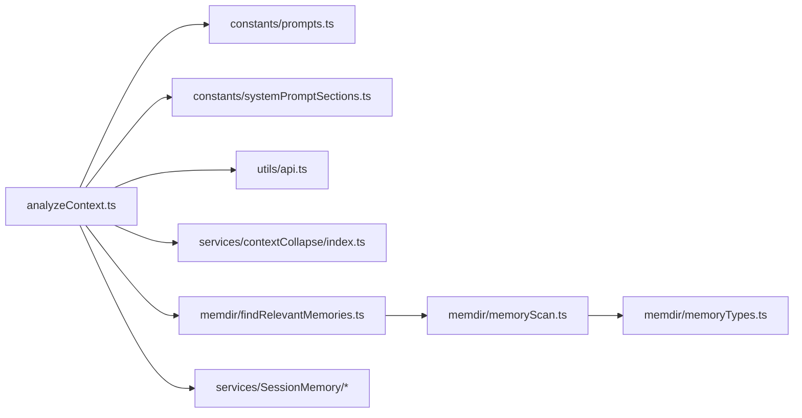

# 上下文窗口管理

<cite>
**本文引用的文件**
- [src/utils/analyzeContext.ts](file://src/utils/analyzeContext.ts)
- [src/constants/prompts.ts](file://src/constants/prompts.ts)
- [src/constants/systemPromptSections.ts](file://src/constants/systemPromptSections.ts)
- [src/services/contextCollapse/index.ts](file://src/services/contextCollapse/index.ts)
- [src/memdir/findRelevantMemories.ts](file://src/memdir/findRelevantMemories.ts)
- [src/memdir/memoryScan.ts](file://src/memdir/memoryScan.ts)
- [src/memdir/memoryTypes.ts](file://src/memdir/memoryTypes.ts)
- [src/services/SessionMemory/sessionMemory.ts](file://src/services/SessionMemory/sessionMemory.ts)
- [src/services/SessionMemory/sessionMemoryUtils.ts](file://src/services/SessionMemory/sessionMemoryUtils.ts)
- [src/utils/api.ts](file://src/utils/api.ts)
- [src/QueryEngine.ts](file://src/QueryEngine.ts)
- [docs/context/system-prompt.mdx](file://docs/context/system-prompt.mdx)
- [docs/context/project-memory.mdx](file://docs/context/project-memory.mdx)
- [docs/context/compaction.mdx](file://docs/context/compaction.mdx)
</cite>

## 目录
1. [引言](#引言)
2. [项目结构](#项目结构)
3. [核心组件](#核心组件)
4. [架构总览](#架构总览)
5. [详细组件分析](#详细组件分析)
6. [依赖关系分析](#依赖关系分析)
7. [性能考量](#性能考量)
8. [故障排查指南](#故障排查指南)
9. [结论](#结论)
10. [附录](#附录)

## 引言
本文件围绕 Claude Code 的“上下文窗口管理”主题，系统阐述上下文长度限制、信息压缩、优先级排序等机制；详解项目上下文提取算法（文件扫描、代码分析、依赖关系识别）、系统提示构建流程（模板选择、动态内容注入、个性化定制）、以及长期记忆管理（存储、检索、更新策略）。同时提供配置示例与优化建议，帮助开发者合理设置上下文窗口以获得最佳对话效果。

## 项目结构
与上下文窗口管理直接相关的核心模块包括：
- 上下文分析与可视化：用于统计消息、工具、技能、系统提示、记忆文件等的令牌占用，并生成网格视图与阈值提示
- 系统提示构建：负责静态/动态分界、动态区注册与缓存控制、边界标记注入
- 上下文压缩与回收：自动紧凑与手动紧凑缓冲区、反应式压缩、上下文折叠
- 长期记忆：记忆类型规范、扫描与清单格式化、相关性选择、会话记忆配置与阈值

**图表来源**
- [src/utils/analyzeContext.ts:1-800](file://src/utils/analyzeContext.ts#L1-L800)
- [src/constants/prompts.ts:186-604](file://src/constants/prompts.ts#L186-L604)
- [src/constants/systemPromptSections.ts:1-69](file://src/constants/systemPromptSections.ts#L1-L69)
- [src/services/contextCollapse/index.ts:1-67](file://src/services/contextCollapse/index.ts#L1-L67)
- [src/memdir/findRelevantMemories.ts:1-142](file://src/memdir/findRelevantMemories.ts#L1-L142)
- [src/memdir/memoryScan.ts:45-94](file://src/memdir/memoryScan.ts#L45-L94)
- [src/memdir/memoryTypes.ts:1-272](file://src/memdir/memoryTypes.ts#L1-L272)
- [src/services/SessionMemory/sessionMemory.ts:228-264](file://src/services/SessionMemory/sessionMemory.ts#L228-L264)
- [src/services/SessionMemory/sessionMemoryUtils.ts:179-207](file://src/services/SessionMemory/sessionMemoryUtils.ts#L179-L207)
- [src/utils/api.ts:376-416](file://src/utils/api.ts#L376-L416)

**章节来源**
- [src/utils/analyzeContext.ts:1-800](file://src/utils/analyzeContext.ts#L1-L800)
- [src/constants/prompts.ts:186-604](file://src/constants/prompts.ts#L186-L604)
- [src/constants/systemPromptSections.ts:1-69](file://src/constants/systemPromptSections.ts#L1-L69)
- [src/services/contextCollapse/index.ts:1-67](file://src/services/contextCollapse/index.ts#L1-L67)
- [src/memdir/findRelevantMemories.ts:1-142](file://src/memdir/findRelevantMemories.ts#L1-L142)
- [src/memdir/memoryScan.ts:45-94](file://src/memdir/memoryScan.ts#L45-L94)
- [src/memdir/memoryTypes.ts:1-272](file://src/memdir/memoryTypes.ts#L1-L272)
- [src/services/SessionMemory/sessionMemory.ts:228-264](file://src/services/SessionMemory/sessionMemory.ts#L228-L264)
- [src/services/SessionMemory/sessionMemoryUtils.ts:179-207](file://src/services/SessionMemory/sessionMemoryUtils.ts#L179-L207)
- [src/utils/api.ts:376-416](file://src/utils/api.ts#L376-L416)

## 核心组件
- 上下文分析器：统计系统提示、消息、工具、MCP 工具、内置工具、技能、自定义代理、记忆文件等的令牌数，输出网格视图与使用百分比，并考虑自动紧凑缓冲区与保留空间
- 系统提示构建器：组装静态区（可全局缓存）与动态区（按会话变化），并在边界处插入分界标记，支持动态区缓存控制
- 上下文压缩与回收：提供自动紧凑阈值、手动紧凑缓冲区、反应式紧凑与上下文折叠接口，处理溢出恢复与健康度统计
- 长期记忆：定义四种记忆类型，扫描并格式化清单，基于查询进行相关性选择，结合会话记忆配置与阈值进行增量抽取与更新

**章节来源**
- [src/utils/analyzeContext.ts:1108-1135](file://src/utils/analyzeContext.ts#L1108-L1135)
- [src/constants/prompts.ts:557-577](file://src/constants/prompts.ts#L557-L577)
- [src/constants/systemPromptSections.ts:43-68](file://src/constants/systemPromptSections.ts#L43-L68)
- [src/services/contextCollapse/index.ts:30-67](file://src/services/contextCollapse/index.ts#L30-L67)
- [src/memdir/memoryTypes.ts:14-31](file://src/memdir/memoryTypes.ts#L14-L31)
- [src/memdir/findRelevantMemories.ts:39-75](file://src/memdir/findRelevantMemories.ts#L39-L75)
- [src/services/SessionMemory/sessionMemoryUtils.ts:184-189](file://src/services/SessionMemory/sessionMemoryUtils.ts#L184-L189)

## 架构总览
系统提示构建与上下文分析协同工作：系统提示由静态区与动态区组成，动态区通过注册表进行缓存控制；上下文分析器在计算令牌时，会分别统计系统提示各部分、消息、工具、记忆文件等，并根据自动紧凑阈值与保留缓冲区给出使用率与网格视图。

**图表来源**
- [src/QueryEngine.ts:324-336](file://src/QueryEngine.ts#L324-L336)
- [src/constants/prompts.ts:557-577](file://src/constants/prompts.ts#L557-L577)
- [src/constants/systemPromptSections.ts:43-68](file://src/constants/systemPromptSections.ts#L43-L68)
- [src/utils/analyzeContext.ts:272-318](file://src/utils/analyzeContext.ts#L272-L318)

## 详细组件分析

### 上下文分析与可视化
- 令牌统计：分别统计系统提示（含系统上下文）、消息、工具（内置/MCP/延迟加载）、技能、自定义代理、记忆文件等，并提供细项分解
- 网格视图：将各类别映射到网格方块，显示类别名称、令牌数、颜色、占比与个体饱和度
- 自动紧凑与保留缓冲：根据特性开关与上下文折叠启用状态决定是否跳过保留缓冲，避免透明紧凑场景下的“虚假预留”
- API 使用反馈：记录上次 API 输入/输出/缓存读取/创建的令牌用量，便于追踪实际消耗

**图表来源**
- [src/utils/analyzeContext.ts:272-318](file://src/utils/analyzeContext.ts#L272-L318)
- [src/utils/analyzeContext.ts:784-800](file://src/utils/analyzeContext.ts#L784-L800)
- [src/utils/analyzeContext.ts:1108-1135](file://src/utils/analyzeContext.ts#L1108-L1135)

**章节来源**
- [src/utils/analyzeContext.ts:1108-1135](file://src/utils/analyzeContext.ts#L1108-L1135)
- [src/utils/analyzeContext.ts:272-318](file://src/utils/analyzeContext.ts#L272-L318)
- [src/utils/analyzeContext.ts:784-800](file://src/utils/analyzeContext.ts#L784-L800)

### 系统提示构建与动态区缓存
- 组装顺序：静态区（可全局缓存）→ 分界标记 → 动态区（按会话变化）
- 边界解析：从系统提示中识别边界标记，将静态与动态内容分离，分别设置缓存作用域
- 动态区注册：通过注册表统一管理动态区，支持可缓存与易失性（每次刷新）两种模式
- 查询引擎集成：在构建系统提示时可追加自定义提示与记忆机制提示

**图表来源**
- [src/QueryEngine.ts:324-336](file://src/QueryEngine.ts#L324-L336)
- [src/constants/prompts.ts:557-577](file://src/constants/prompts.ts#L557-L577)
- [src/constants/systemPromptSections.ts:43-68](file://src/constants/systemPromptSections.ts#L43-L68)
- [src/utils/api.ts:376-416](file://src/utils/api.ts#L376-L416)

**章节来源**
- [src/constants/prompts.ts:557-577](file://src/constants/prompts.ts#L557-L577)
- [src/constants/systemPromptSections.ts:43-68](file://src/constants/systemPromptSections.ts#L43-L68)
- [src/utils/api.ts:376-416](file://src/utils/api.ts#L376-L416)
- [src/QueryEngine.ts:324-336](file://src/QueryEngine.ts#L324-L336)

### 上下文压缩与回收
- 自动紧凑：根据有效上下文窗口与阈值计算保留缓冲，避免透明紧凑场景下的“虚假预留”
- 手动紧凑：提供固定缓冲区，用于用户主动紧凑时的预留
- 上下文折叠：提供启用检测、统计、订阅、应用折叠、溢出恢复等接口，支持健康度监控
- 溢出恢复：当消息超出阈值时，提供回收与提交结果，确保会话连续性

**图表来源**
- [src/utils/analyzeContext.ts:1108-1135](file://src/utils/analyzeContext.ts#L1108-L1135)
- [src/services/contextCollapse/index.ts:30-67](file://src/services/contextCollapse/index.ts#L30-L67)

**章节来源**
- [src/utils/analyzeContext.ts:1108-1135](file://src/utils/analyzeContext.ts#L1108-L1135)
- [src/services/contextCollapse/index.ts:30-67](file://src/services/contextCollapse/index.ts#L30-L67)

### 长期记忆管理
- 记忆类型：限定为 user、feedback、project、reference 四类，强调只存储不可从项目状态推导的信息
- 扫描与清单：扫描记忆目录，读取前若干行解析 frontmatter，格式化为清单文本，供检索与选择
- 相关性选择：基于查询与最近使用工具列表，调用模型选择最相关的记忆文件（最多 5 个）
- 会话记忆配置：初始化最小消息令牌阈值、两次抽取最小令牌间隔、工具调用次数间隔等，支持远程配置覆盖

**图表来源**
- [src/memdir/findRelevantMemories.ts:39-75](file://src/memdir/findRelevantMemories.ts#L39-L75)
- [src/memdir/memoryScan.ts:45-94](file://src/memdir/memoryScan.ts#L45-L94)
- [src/memdir/memoryTypes.ts:14-31](file://src/memdir/memoryTypes.ts#L14-L31)
- [src/services/SessionMemory/sessionMemoryUtils.ts:184-189](file://src/services/SessionMemory/sessionMemoryUtils.ts#L184-L189)

**章节来源**
- [src/memdir/findRelevantMemories.ts:39-75](file://src/memdir/findRelevantMemories.ts#L39-L75)
- [src/memdir/memoryScan.ts:45-94](file://src/memdir/memoryScan.ts#L45-L94)
- [src/memdir/memoryTypes.ts:14-31](file://src/memdir/memoryTypes.ts#L14-L31)
- [src/services/SessionMemory/sessionMemoryUtils.ts:184-189](file://src/services/SessionMemory/sessionMemoryUtils.ts#L184-L189)

## 依赖关系分析
- 上下文分析器依赖系统提示构建器提供的有效系统提示与边界标记，以及工具/消息/记忆文件的令牌统计能力
- 系统提示构建器依赖动态区注册表进行缓存控制，并通过边界解析器区分静态与动态区
- 上下文压缩与回收依赖自动紧凑阈值与上下文折叠接口，处理溢出与健康度
- 长期记忆依赖扫描与清单格式化，结合会话记忆阈值进行增量抽取

**图表来源**
- [src/utils/analyzeContext.ts:1-800](file://src/utils/analyzeContext.ts#L1-L800)
- [src/constants/prompts.ts:186-604](file://src/constants/prompts.ts#L186-L604)
- [src/constants/systemPromptSections.ts:1-69](file://src/constants/systemPromptSections.ts#L1-L69)
- [src/utils/api.ts:376-416](file://src/utils/api.ts#L376-L416)
- [src/services/contextCollapse/index.ts:1-67](file://src/services/contextCollapse/index.ts#L1-L67)
- [src/memdir/findRelevantMemories.ts:1-142](file://src/memdir/findRelevantMemories.ts#L1-L142)
- [src/memdir/memoryScan.ts:45-94](file://src/memdir/memoryScan.ts#L45-L94)
- [src/memdir/memoryTypes.ts:1-272](file://src/memdir/memoryTypes.ts#L1-L272)
- [src/services/SessionMemory/sessionMemory.ts:228-264](file://src/services/SessionMemory/sessionMemory.ts#L228-L264)
- [src/services/SessionMemory/sessionMemoryUtils.ts:179-207](file://src/services/SessionMemory/sessionMemoryUtils.ts#L179-L207)

**章节来源**
- [src/utils/analyzeContext.ts:1-800](file://src/utils/analyzeContext.ts#L1-L800)
- [src/constants/prompts.ts:186-604](file://src/constants/prompts.ts#L186-L604)
- [src/constants/systemPromptSections.ts:1-69](file://src/constants/systemPromptSections.ts#L1-L69)
- [src/utils/api.ts:376-416](file://src/utils/api.ts#L376-L416)
- [src/services/contextCollapse/index.ts:1-67](file://src/services/contextCollapse/index.ts#L1-L67)
- [src/memdir/findRelevantMemories.ts:1-142](file://src/memdir/findRelevantMemories.ts#L1-L142)
- [src/memdir/memoryScan.ts:45-94](file://src/memdir/memoryScan.ts#L45-L94)
- [src/memdir/memoryTypes.ts:1-272](file://src/memdir/memoryTypes.ts#L1-L272)
- [src/services/SessionMemory/sessionMemory.ts:228-264](file://src/services/SessionMemory/sessionMemory.ts#L228-L264)
- [src/services/SessionMemory/sessionMemoryUtils.ts:179-207](file://src/services/SessionMemory/sessionMemoryUtils.ts#L179-L207)

## 性能考量
- 令牌估算与回退：优先使用专用 API 进行令牌计数，失败时回退至轻量模型估算，避免阻塞
- 延迟加载工具：内置工具与 MCP 工具在工具搜索启用时可延迟加载，仅统计已使用的工具令牌，减少冗余
- 动态区缓存：静态区可跨组织缓存，动态区按会话或必要时重新计算，降低重复计算成本
- 记忆扫描与选择：扫描采用并发 Promise 并限制最大文件数量，相关性选择使用结构化输出与有限预算，避免昂贵推理

**章节来源**
- [src/utils/analyzeContext.ts:77-109](file://src/utils/analyzeContext.ts#L77-L109)
- [src/utils/analyzeContext.ts:363-516](file://src/utils/analyzeContext.ts#L363-L516)
- [src/constants/systemPromptSections.ts:43-68](file://src/constants/systemPromptSections.ts#L43-L68)
- [src/memdir/findRelevantMemories.ts:77-141](file://src/memdir/findRelevantMemories.ts#L77-L141)

## 故障排查指南
- 系统提示边界缺失：若未找到边界标记，日志会记录缺失情况，需确保系统提示包含分界标记
- 记忆选择失败：当相关性选择调用失败或中断时，会返回空集并记录调试信息，检查网络与模型可用性
- 令牌计数回退：当专用 API 返回空或抛错时，会尝试回退估算，若仍失败则返回 null，需关注日志错误
- 上下文折叠健康度：折叠接口提供健康度统计与错误计数，出现异常时可据此定位问题

**章节来源**
- [src/utils/api.ts:406-410](file://src/utils/api.ts#L406-L410)
- [src/memdir/findRelevantMemories.ts:131-140](file://src/memdir/findRelevantMemories.ts#L131-L140)
- [src/utils/analyzeContext.ts:86-108](file://src/utils/analyzeContext.ts#L86-L108)
- [src/services/contextCollapse/index.ts:30-41](file://src/services/contextCollapse/index.ts#L30-L41)

## 结论
Claude Code 的上下文窗口管理通过“系统提示构建 + 上下文分析 + 压缩与回收 + 长期记忆”的协同机制，在保证对话连贯性的同时，最大化利用有限的上下文窗口。开发者可通过合理配置自动紧凑阈值、动态区缓存策略、记忆抽取阈值与工具延迟加载，获得更稳定与高效的对话体验。

## 附录

### 配置示例与优化建议
- 自动紧凑阈值与保留缓冲
  - 在透明紧凑或上下文折叠启用时，跳过保留缓冲，避免“虚假预留”
  - 建议根据模型上下文窗口与典型会话规模设定阈值，平衡紧凑频率与稳定性
  - 参考路径：[src/utils/analyzeContext.ts:1108-1135](file://src/utils/analyzeContext.ts#L1108-L1135)

- 系统提示动态区缓存
  - 将稳定内容放入静态区并启用全局缓存，动态区按会话变化
  - 使用边界标记隔离静态/动态区，确保缓存命中与一致性
  - 参考路径：[src/constants/prompts.ts:557-577](file://src/constants/prompts.ts#L557-L577)，[src/utils/api.ts:376-416](file://src/utils/api.ts#L376-L416)，[src/constants/systemPromptSections.ts:43-68](file://src/constants/systemPromptSections.ts#L43-L68)

- 长期记忆抽取阈值
  - 设置最小消息令牌阈值与两次抽取最小令牌间隔，避免频繁抽取
  - 工具调用次数间隔可用于控制记忆更新频率
  - 参考路径：[src/services/SessionMemory/sessionMemory.ts:240-264](file://src/services/SessionMemory/sessionMemory.ts#L240-L264)，[src/services/SessionMemory/sessionMemoryUtils.ts:184-189](file://src/services/SessionMemory/sessionMemoryUtils.ts#L184-L189)

- 记忆类型与清单
  - 严格遵循四类型规范，避免存储可从项目状态推导的信息
  - 清单格式化用于检索与选择，保持描述简洁准确
  - 参考路径：[src/memdir/memoryTypes.ts:14-31](file://src/memdir/memoryTypes.ts#L14-L31)，[src/memdir/memoryScan.ts:84-94](file://src/memdir/memoryScan.ts#L84-L94)

- 文档参考
  - 系统提示与动态区：[docs/context/system-prompt.mdx](file://docs/context/system-prompt.mdx)
  - 长期记忆与类型：[docs/context/project-memory.mdx](file://docs/context/project-memory.mdx)
  - 上下文压缩与回收：[docs/context/compaction.mdx](file://docs/context/compaction.mdx)