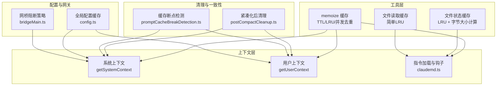
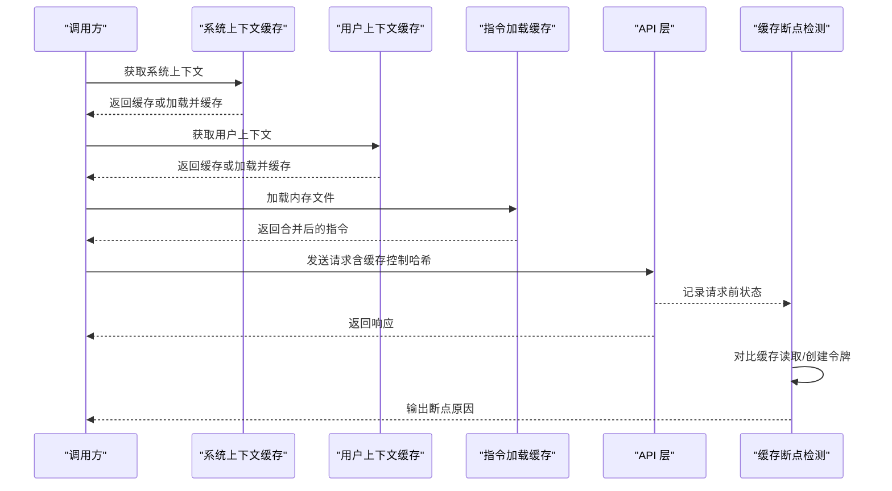
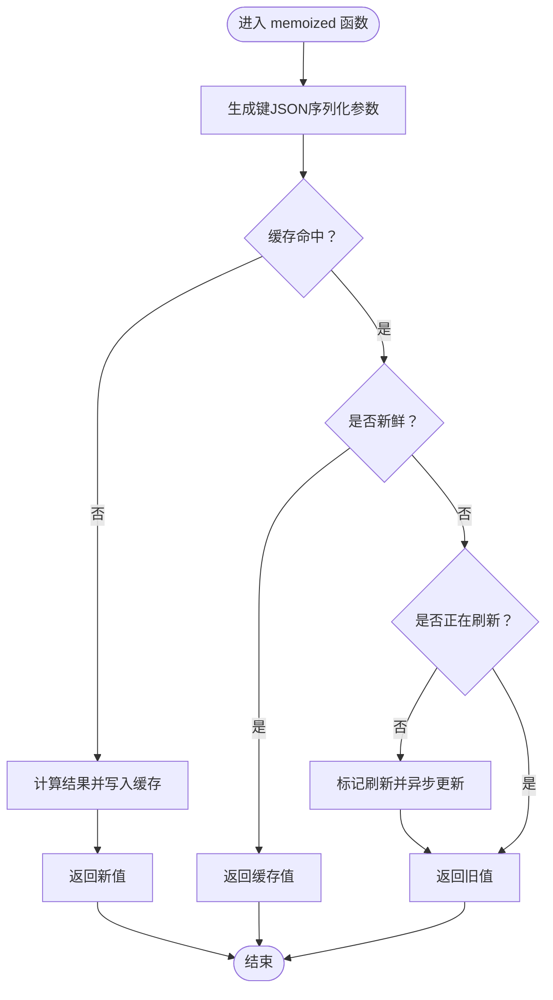
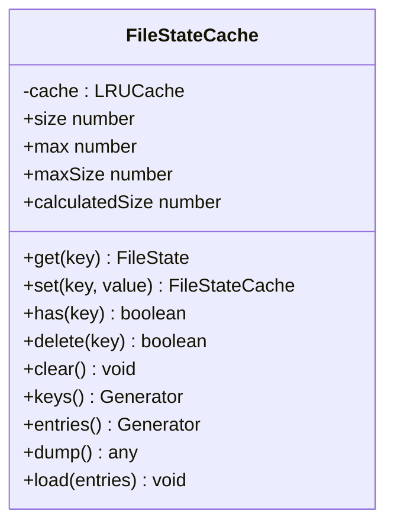
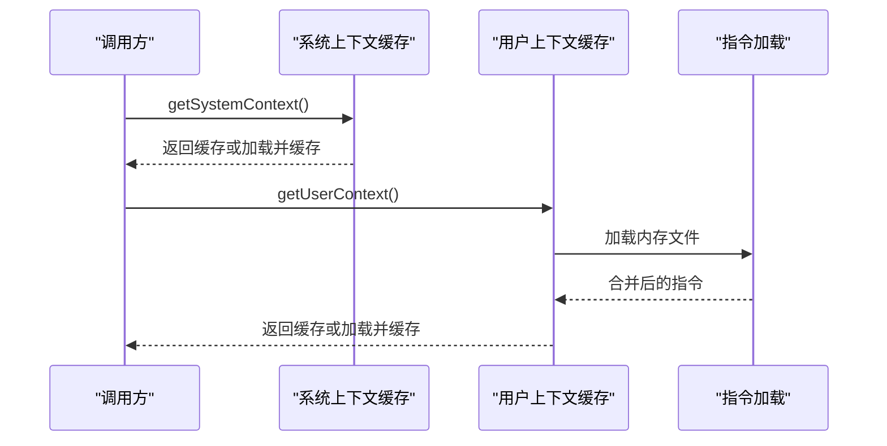
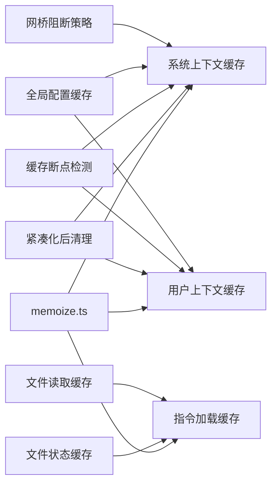

# 上下文缓存策略

<cite>
**本文引用的文件**
- [memoize.ts](file://src/utils/memoize.ts)
- [fileStateCache.ts](file://src/utils/fileStateCache.ts)
- [context.ts（系统与用户上下文）](file://src/context.ts)
- [claudemd.ts](file://src/utils/claudemd.ts)
- [postCompactCleanup.ts](file://src/services/compact/postCompactCleanup.ts)
- [promptCacheBreakDetection.ts](file://src/services/api/promptCacheBreakDetection.ts)
- [context.ts（工具层）](file://src/utils/context.ts)
- [fileReadCache.ts](file://src/utils/fileReadCache.ts)
- [config.ts](file://src/utils/config.ts)
- [bridgeMain.ts](file://src/bridge/bridgeMain.ts)
</cite>

## 目录
1. [简介](#简介)
2. [项目结构](#项目结构)
3. [核心组件](#核心组件)
4. [架构总览](#架构总览)
5. [详细组件分析](#详细组件分析)
6. [依赖关系分析](#依赖关系分析)
7. [性能考量](#性能考量)
8. [故障排查指南](#故障排查指南)
9. [结论](#结论)
10. [附录：配置与调优建议](#附录配置与调优建议)

## 简介
本文件系统性阐述 Claude Code 的上下文缓存策略，覆盖缓存键生成、失效策略、内存管理、不同类型的上下文缓存（系统上下文、用户上下文、文件状态缓存等）、性能优化（预加载、懒加载、缓存一致性）、以及配置与调优建议。目标是在性能与准确性之间取得最佳平衡，帮助开发者在复杂会话与多模型场景中稳定运行。

## 项目结构
与上下文缓存直接相关的核心模块分布如下：
- 工具层缓存：memoize 缓存、LRU 文件状态缓存、文件读取缓存
- 上下文层：系统上下文、用户上下文、指令加载与钩子
- 清理与一致性：紧凑化后清理、缓存断点检测
- 配置与网关：全局配置缓存、网桥阻断策略

**图表来源**
- [memoize.ts:40-107](file://src/utils/memoize.ts#L40-L107)
- [fileStateCache.ts:30-93](file://src/utils/fileStateCache.ts#L30-L93)
- [fileReadCache.ts:46-96](file://src/utils/fileReadCache.ts#L46-L96)
- [context.ts（系统与用户上下文）:116-189](file://src/context.ts#L116-L189)
- [claudemd.ts:1-200](file://src/utils/claudemd.ts#L1-L200)
- [postCompactCleanup.ts:31-77](file://src/services/compact/postCompactCleanup.ts#L31-L77)
- [promptCacheBreakDetection.ts:437-456](file://src/services/api/promptCacheBreakDetection.ts#L437-L456)
- [config.ts:1044-1055](file://src/utils/config.ts#L1044-L1055)
- [bridgeMain.ts:96-98](file://src/bridge/bridgeMain.ts#L96-L98)

**章节来源**
- [memoize.ts:40-107](file://src/utils/memoize.ts#L40-L107)
- [fileStateCache.ts:30-93](file://src/utils/fileStateCache.ts#L30-L93)
- [context.ts（系统与用户上下文）:116-189](file://src/context.ts#L116-L189)
- [claudemd.ts:1-200](file://src/utils/claudemd.ts#L1-L200)
- [postCompactCleanup.ts:31-77](file://src/services/compact/postCompactCleanup.ts#L31-L77)
- [promptCacheBreakDetection.ts:437-456](file://src/services/api/promptCacheBreakDetection.ts#L437-L456)
- [config.ts:1044-1055](file://src/utils/config.ts#L1044-L1055)
- [bridgeMain.ts:96-98](file://src/bridge/bridgeMain.ts#L96-L98)

## 核心组件
- TTL 写入式缓存：对同步/异步函数进行带过期时间的写入式缓存，命中返回即时值，过期则返回旧值并后台刷新，避免阻塞请求。
- LRU 缓存：用于消息处理与文件状态缓存，防止无界增长；支持 size、delete、peek 等管理方法。
- 文件状态缓存：以路径归一化为键，按字节大小计算，限制条目数与总大小，适合大文本与可编辑内容。
- 文件读取缓存：基于简单 LRU，按容量淘汰最旧条目，提升重复读取性能。
- 系统/用户上下文缓存：使用 memoize 包裹，按会话生命周期缓存，支持注入式缓存断点与清理。
- 指令加载与钩子：按优先级顺序加载内存文件，支持 include 指令与一次性钩子触发，配合紧凑化清理确保一致性。
- 紧凑化后清理：集中清理上下文缓存与追踪状态，避免子线程/子代理污染主线程状态。
- 缓存断点检测：在请求前后对比哈希与参数，定位缓存未命中原因并记录。

**章节来源**
- [memoize.ts:40-107](file://src/utils/memoize.ts#L40-L107)
- [memoize.ts:120-215](file://src/utils/memoize.ts#L120-L215)
- [memoize.ts:234-269](file://src/utils/memoize.ts#L234-L269)
- [fileStateCache.ts:30-93](file://src/utils/fileStateCache.ts#L30-L93)
- [fileReadCache.ts:46-96](file://src/utils/fileReadCache.ts#L46-L96)
- [context.ts（系统与用户上下文）:116-189](file://src/context.ts#L116-L189)
- [claudemd.ts:1-200](file://src/utils/claudemd.ts#L1-L200)
- [postCompactCleanup.ts:31-77](file://src/services/compact/postCompactCleanup.ts#L31-L77)
- [promptCacheBreakDetection.ts:437-456](file://src/services/api/promptCacheBreakDetection.ts#L437-L456)

## 架构总览
上下文缓存贯穿“请求前准备—请求—响应后处理”全流程：
- 请求前：系统/用户上下文通过 memoize 缓存；指令文件通过 claudemd 加载并可能触发一次性钩子。
- 请求中：API 层根据系统提示词分块策略与缓存控制哈希决定缓存作用域与 TTL。
- 响应后：检测缓存读取/创建令牌，判断是否发生缓存断点并记录原因。

**图表来源**
- [context.ts（系统与用户上下文）:116-189](file://src/context.ts#L116-L189)
- [claudemd.ts:1-200](file://src/utils/claudemd.ts#L1-L200)
- [promptCacheBreakDetection.ts:437-456](file://src/services/api/promptCacheBreakDetection.ts#L437-L456)

## 详细组件分析

### TTL 写入式缓存（memoizeWithTTL / memoizeWithTTLAsync）
- 设计要点
  - 写入式缓存：命中新鲜项直接返回；命中陈旧项返回旧值并异步刷新，避免阻塞。
  - 并发去重：异步版本维护 inFlight 映射，同一键并发冷启动仅执行一次。
  - 清理接口：提供 clear 方法，异步版同时清空 inFlight。
- 复杂度
  - 查找/插入：平均 O(1)，键为 JSON 序列化的参数字符串。
  - 内存：Map 存储键到值与时间戳，随键数量线性增长。
- 使用场景
  - 系统/用户上下文、指令加载、远程调用等 IO 密集型操作。

**图表来源**
- [memoize.ts:46-99](file://src/utils/memoize.ts#L46-L99)
- [memoize.ts:134-203](file://src/utils/memoize.ts#L134-L203)

**章节来源**
- [memoize.ts:40-107](file://src/utils/memoize.ts#L40-L107)
- [memoize.ts:120-215](file://src/utils/memoize.ts#L120-L215)

### LRU 缓存（memoizeWithLRU / FileStateCache）
- 设计要点
  - LRU 淘汰：按最近使用顺序淘汰，防止无界增长。
  - 文件状态缓存：路径归一化为键，按内容字节数计算大小，限制条目数与总大小。
  - 管理方法：size、delete、peek（不更新热度）、has、dump/load。
- 复杂度
  - 查找/插入/删除：平均 O(1)，LRU 结构维护常数开销。
  - 内存：受 max 与 maxSize 双约束，避免内存膨胀。
- 使用场景
  - 高频消息处理、文件状态缓存、文件读取缓存。

**图表来源**
- [fileStateCache.ts:30-93](file://src/utils/fileStateCache.ts#L30-L93)

**章节来源**
- [memoize.ts:234-269](file://src/utils/memoize.ts#L234-L269)
- [fileStateCache.ts:30-93](file://src/utils/fileStateCache.ts#L30-L93)

### 文件读取缓存（fileReadCache）
- 设计要点
  - 简单 LRU：超过最大容量时删除最旧条目。
  - 统计接口：获取当前大小与条目列表，便于调试与监控。
- 使用场景
  - 频繁读取相同文件内容的场景，减少磁盘 IO。

**章节来源**
- [fileReadCache.ts:46-96](file://src/utils/fileReadCache.ts#L46-L96)

### 系统上下文与用户上下文缓存
- 系统上下文（getSystemContext）
  - 缓存周期：按会话生命周期缓存。
  - 注入式断点：支持临时注入字符串作为缓存断点，变更时立即清理缓存。
  - Git 状态：在允许的情况下异步收集分支、状态、日志等信息。
- 用户上下文（getUserContext）
  - 缓存周期：按会话生命周期缓存。
  - 指令聚合：从多源（全局、用户、项目、本地）加载 CLAUDE.md，按优先级合并。
  - 一次性钩子：首次加载时触发“指令已加载”钩子，后续由紧凑化清理统一管理。

**图表来源**
- [context.ts（系统与用户上下文）:116-189](file://src/context.ts#L116-L189)
- [claudemd.ts:1-200](file://src/utils/claudemd.ts#L1-L200)

**章节来源**
- [context.ts（系统与用户上下文）:116-189](file://src/context.ts#L116-L189)
- [claudemd.ts:1-200](file://src/utils/claudemd.ts#L1-L200)

### 指令加载与钩子（claudemd.ts）
- 加载顺序与优先级：全局管理、用户私有、项目内、本地私有，越近越优先。
- include 指令：支持相对/绝对路径，仅在纯文本节点生效，循环引用防护。
- 钩子机制：首次加载时触发“指令已加载”，后续由紧凑化清理统一复位，避免误触发。

**章节来源**
- [claudemd.ts:1-200](file://src/utils/claudemd.ts#L1-L200)

### 紧凑化后清理（postCompactCleanup.ts）
- 目标：释放被紧凑化破坏的跟踪状态与缓存。
- 行为：重置微紧凑状态、条件性重置上下文折叠、清理用户上下文与内存文件缓存、清除分类器批准与推测检查、清理 Beta 跟踪状态、清理会话消息缓存等。
- 主线程隔离：区分主线程与子代理（agent:*）的清理范围，避免互相污染。

**章节来源**
- [postCompactCleanup.ts:31-77](file://src/services/compact/postCompactCleanup.ts#L31-L77)

### 缓存断点检测（promptCacheBreakDetection.ts）
- 请求前：记录系统提示词哈希、工具哈希、缓存控制哈希、模型、快慢模式、全局缓存策略、beta 列表、自动模式、超量使用、缓存微紧凑开关、努力值、额外请求体哈希等。
- 请求后：对比缓存读取令牌与创建令牌，确定实际断点原因，输出包含缓存作用域/TTL 变更、beta 变更、自动模式切换、超量状态、缓存微紧凑开关、努力值、额外请求体参数等。

**章节来源**
- [promptCacheBreakDetection.ts:437-456](file://src/services/api/promptCacheBreakDetection.ts#L437-L456)
- [promptCacheBreakDetection.ts:527-563](file://src/services/api/promptCacheBreakDetection.ts#L527-L563)

### 全局配置缓存（config.ts）
- 写入即缓存：写入配置后立即更新内存缓存并重置读取时间戳，避免自身写入被误判为外部变更。
- 快速路径：启动后多数读取走纯内存，其他实例变更由后台新鲜度监视器感知，不阻塞快速路径。

**章节来源**
- [config.ts:1036-1055](file://src/utils/config.ts#L1036-L1055)

### 网桥阻断策略（bridgeMain.ts）
- 多会话启用门控：采用阻断式门控检查，冷启动等待服务器获取后再写入磁盘缓存供下次使用，避免陈旧磁盘缓存导致访问受限。

**章节来源**
- [bridgeMain.ts:96-98](file://src/bridge/bridgeMain.ts#L96-L98)

## 依赖关系分析
- 上下文缓存依赖 memoize 提供的 TTL/LRU 能力。
- 指令加载依赖文件状态缓存与文件读取缓存，保障大文件与重复读取的稳定性。
- 紧凑化清理依赖上下文缓存的 clear 接口，确保一致性。
- 缓存断点检测依赖系统提示词分块策略与缓存控制哈希，定位问题根因。

**图表来源**
- [memoize.ts:40-107](file://src/utils/memoize.ts#L40-L107)
- [fileStateCache.ts:30-93](file://src/utils/fileStateCache.ts#L30-L93)
- [fileReadCache.ts:46-96](file://src/utils/fileReadCache.ts#L46-L96)
- [context.ts（系统与用户上下文）:116-189](file://src/context.ts#L116-L189)
- [claudemd.ts:1-200](file://src/utils/claudemd.ts#L1-L200)
- [postCompactCleanup.ts:31-77](file://src/services/compact/postCompactCleanup.ts#L31-L77)
- [promptCacheBreakDetection.ts:437-456](file://src/services/api/promptCacheBreakDetection.ts#L437-L456)
- [config.ts:1044-1055](file://src/utils/config.ts#L1044-L1055)
- [bridgeMain.ts:96-98](file://src/bridge/bridgeMain.ts#L96-L98)

**章节来源**
- [memoize.ts:40-107](file://src/utils/memoize.ts#L40-L107)
- [fileStateCache.ts:30-93](file://src/utils/fileStateCache.ts#L30-L93)
- [fileReadCache.ts:46-96](file://src/utils/fileReadCache.ts#L46-L96)
- [context.ts（系统与用户上下文）:116-189](file://src/context.ts#L116-L189)
- [claudemd.ts:1-200](file://src/utils/claudemd.ts#L1-L200)
- [postCompactCleanup.ts:31-77](file://src/services/compact/postCompactCleanup.ts#L31-L77)
- [promptCacheBreakDetection.ts:437-456](file://src/services/api/promptCacheBreakDetection.ts#L437-L456)
- [config.ts:1044-1055](file://src/utils/config.ts#L1044-L1055)
- [bridgeMain.ts:96-98](file://src/bridge/bridgeMain.ts#L96-L98)

## 性能考量
- 预加载策略
  - 系统/用户上下文：在会话开始阶段尽早调用，利用 memoize 的写入式缓存，避免后续请求阻塞。
  - 指令加载：在首次需要时加载并缓存，结合 include 指令与一次性钩子，减少重复扫描。
- 懒加载机制
  - 文件状态缓存与文件读取缓存按需加载，LRU 与容量限制避免内存膨胀。
  - 异步 memoize 的 inFlight 去重避免并发冷启动风暴。
- 缓存一致性
  - 注入式缓存断点：通过临时注入字符串触发缓存失效，确保指令变更立即生效。
  - 紧凑化后清理：集中清理上下文缓存与追踪状态，避免子线程/子代理污染主线程状态。
  - 缓存断点检测：通过哈希与参数对比定位未命中原因，指导调优。

[本节为通用性能讨论，无需具体文件分析]

## 故障排查指南
- 缓存未命中/命中率低
  - 检查是否频繁变更系统提示词注入或缓存控制参数，导致缓存断点。
  - 使用缓存断点检测输出定位具体原因（作用域/TTL 变更、beta 变更、自动模式切换等）。
- 内存占用过高
  - 检查文件状态缓存与文件读取缓存的 max 与 maxSize 设置，适当降低容量或字节上限。
  - 在紧凑化后确认缓存清理是否正确执行，避免残留状态导致持续占用。
- 首次加载缓慢
  - 确认指令文件数量与大小，必要时拆分 include 或减少大文件注入。
  - 启用全局配置缓存的写入即缓存策略，减少磁盘读取。

**章节来源**
- [promptCacheBreakDetection.ts:527-563](file://src/services/api/promptCacheBreakDetection.ts#L527-L563)
- [fileStateCache.ts:30-93](file://src/utils/fileStateCache.ts#L30-L93)
- [postCompactCleanup.ts:31-77](file://src/services/compact/postCompactCleanup.ts#L31-L77)
- [config.ts:1036-1055](file://src/utils/config.ts#L1036-L1055)

## 结论
Claude Code 的上下文缓存体系以 memoize 为核心，结合 TTL 写入式缓存、LRU 与容量限制、注入式断点与集中清理，实现了高可用、高性能且可诊断的上下文管理。通过系统/用户上下文缓存、指令加载与钩子、缓存断点检测与全局配置缓存，整体在复杂会话与多模型场景中保持稳定与高效。

[本节为总结，无需具体文件分析]

## 附录：配置与调优建议
- TTL 缓存生命周期
  - 默认 5 分钟，可根据 IO 成本与数据时效性调整；对高频但稳定的上下文可延长，对易变数据可缩短。
- LRU 缓存容量
  - 文件状态缓存：默认条目数与总大小适中，若出现大文本频繁读写，可适度提高 maxSize 以减少抖动。
  - 文件读取缓存：根据工作目录规模与重复读取频率设置最大容量，避免频繁淘汰。
- 缓存断点控制
  - 通过系统提示词注入实现临时断点，仅在需要时开启；生产环境建议自动化而非手动注入。
  - 关注 beta 列表、自动模式、超量使用、缓存微紧凑开关、努力值等参数变化，避免无意断点。
- 紧凑化策略
  - 定期执行紧凑化后清理，确保缓存与追踪状态一致；子代理场景注意主线程隔离。
- 全局配置缓存
  - 写入即缓存策略减少磁盘读取延迟；注意自身写入不会被误判为外部变更。

[本节为通用建议，无需具体文件分析]