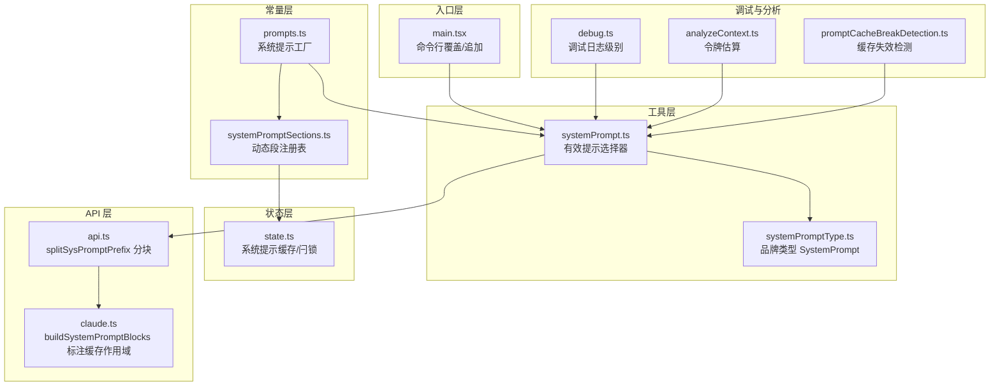
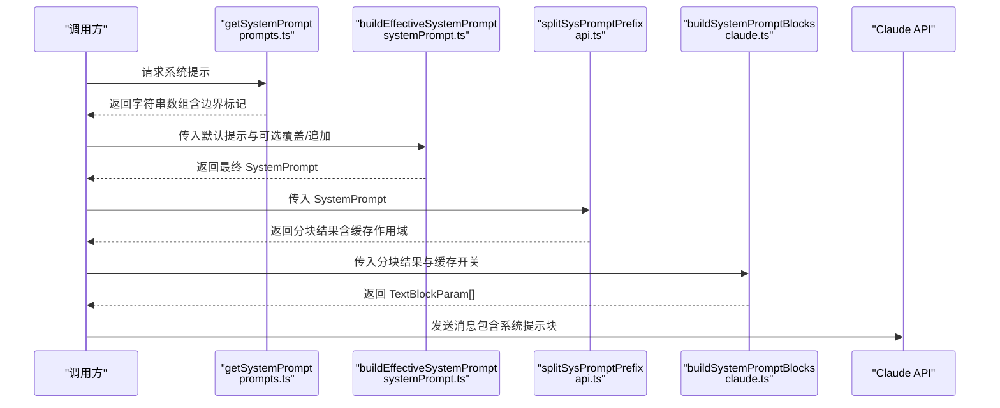
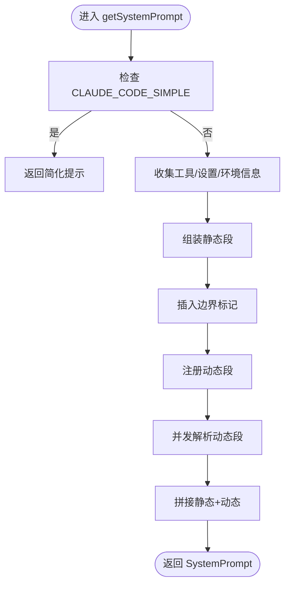
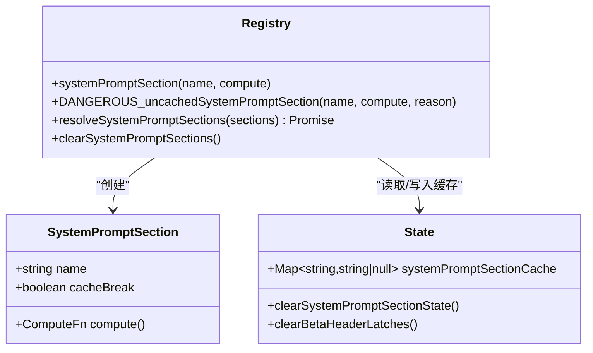
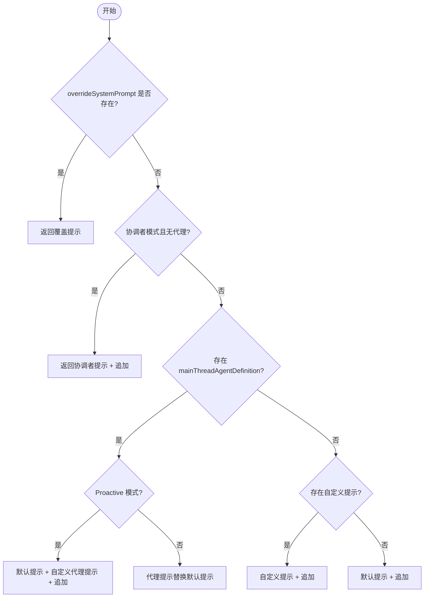
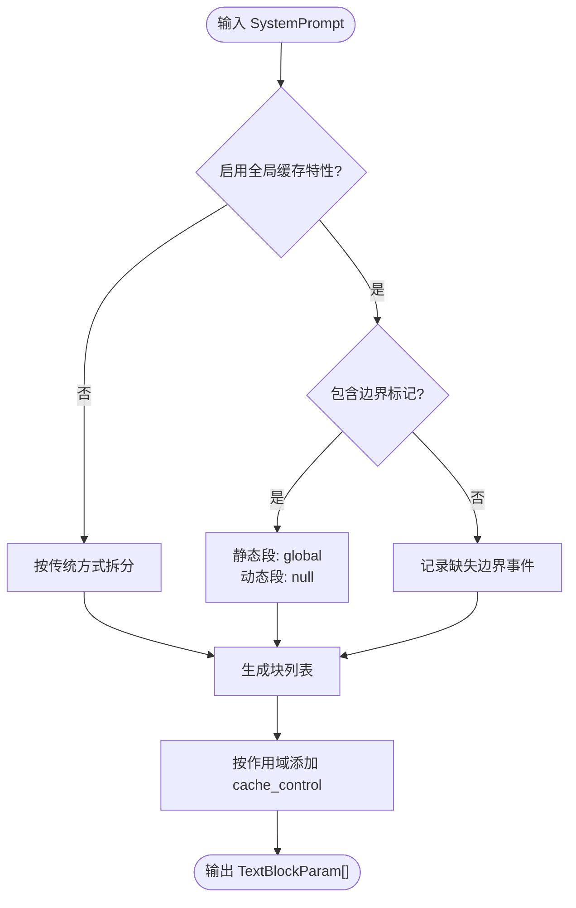
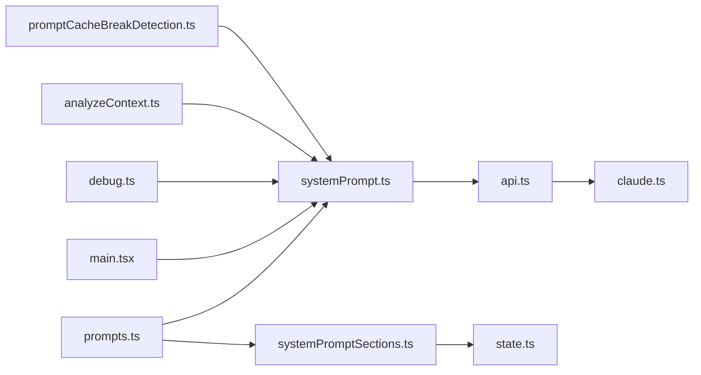

# 系统提示构建

<cite>
**本文引用的文件**
- [systemPromptSections.ts](file://src/constants/systemPromptSections.ts)
- [prompts.ts](file://src/constants/prompts.ts)
- [systemPrompt.ts](file://src/utils/systemPrompt.ts)
- [systemPromptType.ts](file://src/utils/systemPromptType.ts)
- [state.ts](file://src/bootstrap/state.ts)
- [api.ts](file://src/utils/api.ts)
- [claude.ts](file://src/services/api/claude.ts)
- [main.tsx](file://src/main.tsx)
- [debug.ts](file://src/utils/debug.ts)
- [analyzeContext.ts](file://src/utils/analyzeContext.ts)
- [promptCacheBreakDetection.ts](file://src/services/api/promptCacheBreakDetection.ts)
</cite>

## 目录
1. [简介](#简介)
2. [项目结构](#项目结构)
3. [核心组件](#核心组件)
4. [架构总览](#架构总览)
5. [详细组件分析](#详细组件分析)
6. [依赖关系分析](#依赖关系分析)
7. [性能考量](#性能考量)
8. [故障排查指南](#故障排查指南)
9. [结论](#结论)
10. [附录](#附录)

## 简介
本文件系统性阐述 Claude Code 的“系统提示构建”机制，围绕以下目标展开：
- 解释系统提示的组成结构与模板系统
- 说明动态内容注入与个性化定制
- 描述系统提示的生成流程（参数解析、内容拼接、格式化处理）
- 解析系统提示注入机制（缓存失效、调试支持、版本管理）
- 提供配置选项与自定义方法，帮助开发者按场景调整系统提示

## 项目结构
系统提示构建涉及多个层次的模块协作：
- 常量层：定义系统提示的静态段、动态段注册表与边界标记
- 工具层：负责系统提示的最终选择与拼接（优先级、追加）
- 缓存状态层：维护系统提示片段缓存与“Beta 头部”闩锁
- API 层：将系统提示分块并标注缓存作用域，以提升缓存命中率
- CLI/入口层：提供命令行覆盖与追加系统提示的能力
- 调试与分析层：提供日志、调试开关与令牌估算工具

图表来源
- [prompts.ts](file://src/constants/prompts.ts)
- [systemPromptSections.ts](file://src/constants/systemPromptSections.ts)
- [systemPrompt.ts](file://src/utils/systemPrompt.ts)
- [systemPromptType.ts](file://src/utils/systemPromptType.ts)
- [state.ts](file://src/bootstrap/state.ts)
- [api.ts](file://src/utils/api.ts)
- [claude.ts](file://src/services/api/claude.ts)
- [main.tsx](file://src/main.tsx)
- [debug.ts](file://src/utils/debug.ts)
- [analyzeContext.ts](file://src/utils/analyzeContext.ts)
- [promptCacheBreakDetection.ts](file://src/services/api/promptCacheBreakDetection.ts)

章节来源
- [prompts.ts](file://src/constants/prompts.ts)
- [systemPromptSections.ts](file://src/constants/systemPromptSections.ts)
- [systemPrompt.ts](file://src/utils/systemPrompt.ts)
- [systemPromptType.ts](file://src/utils/systemPromptType.ts)
- [state.ts](file://src/bootstrap/state.ts)
- [api.ts](file://src/utils/api.ts)
- [claude.ts](file://src/services/api/claude.ts)
- [main.tsx](file://src/main.tsx)
- [debug.ts](file://src/utils/debug.ts)
- [analyzeContext.ts](file://src/utils/analyzeContext.ts)
- [promptCacheBreakDetection.ts](file://src/services/api/promptCacheBreakDetection.ts)

## 核心组件
- 系统提示工厂（getSystemPrompt）：组装静态段与动态段，插入边界标记，形成可缓存的提示数组
- 动态段注册表（systemPromptSections）：以“缓存式/危险式”两类注册动态段，支持缓存与按轮重算
- 有效提示选择器（buildEffectiveSystemPrompt）：按优先级选择最终提示（覆盖 > 协调者 > 代理 > 自定义 > 默认）
- 分块与缓存标注（splitSysPromptPrefix/buildSystemPromptBlocks）：将提示数组拆分为多块并标注缓存作用域
- 命令行覆盖/追加（main.tsx）：支持通过参数或文件覆盖默认提示与追加额外提示
- 品牌类型（SystemPrompt）：确保仅通过显式转换传递系统提示，避免误用

章节来源
- [prompts.ts](file://src/constants/prompts.ts)
- [systemPromptSections.ts](file://src/constants/systemPromptSections.ts)
- [systemPrompt.ts](file://src/utils/systemPrompt.ts)
- [systemPromptType.ts](file://src/utils/systemPromptType.ts)
- [api.ts](file://src/utils/api.ts)
- [claude.ts](file://src/services/api/claude.ts)
- [main.tsx](file://src/main.tsx)

## 架构总览
系统提示从“工厂组装”到“API 发送”的完整链路如下：

图表来源
- [prompts.ts](file://src/constants/prompts.ts)
- [systemPrompt.ts](file://src/utils/systemPrompt.ts)
- [api.ts](file://src/utils/api.ts)
- [claude.ts](file://src/services/api/claude.ts)

## 详细组件分析

### 组件A：系统提示工厂（getSystemPrompt）
- 职责
  - 组装静态段（介绍、规则、任务指导、动作、工具使用、语气风格、输出效率）
  - 注册动态段（会话指引、记忆、模型覆盖、环境信息、语言偏好、输出风格、MCP 指令、草稿目录、函数结果清理、工具结果摘要、预算/简报等）
  - 插入边界标记（SYSTEM_PROMPT_DYNAMIC_BOUNDARY），用于后续分块与缓存控制
  - 支持快速路径（CLAUDE_CODE_SIMPLE）以减少 token 消耗
- 关键点
  - 动态段通过 systemPromptSection/DANGEROUS_uncachedSystemPromptSection 注册
  - resolveSystemPromptSections 并发解析，缓存式段从内存缓存读取
  - MCP 指令在 delta 开启时走附件路径，避免每轮重算破坏缓存
- 输出
  - 字符串数组（品牌类型 SystemPrompt）

图表来源
- [prompts.ts](file://src/constants/prompts.ts)
- [systemPromptSections.ts](file://src/constants/systemPromptSections.ts)

章节来源
- [prompts.ts](file://src/constants/prompts.ts)
- [systemPromptSections.ts](file://src/constants/systemPromptSections.ts)

### 组件B：动态段注册表（systemPromptSections）
- 职责
  - systemPromptSection：缓存式动态段，计算一次，/clear 或 /compact 后再计算
  - DANGEROUS_uncachedSystemPromptSection：每轮重新计算，会破坏提示缓存
  - resolveSystemPromptSections：并发解析，优先使用缓存值
  - clearSystemPromptSections：清空缓存并重置 Beta 头部闩锁
- 关键点
  - cacheBreak 标记决定是否使用缓存
  - 缓存存储于 bootstrap/state.ts 的 Map 中

图表来源
- [systemPromptSections.ts](file://src/constants/systemPromptSections.ts)
- [state.ts](file://src/bootstrap/state.ts)

章节来源
- [systemPromptSections.ts](file://src/constants/systemPromptSections.ts)
- [state.ts](file://src/bootstrap/state.ts)

### 组件C：有效提示选择器（buildEffectiveSystemPrompt）
- 职责
  - 五级优先级：覆盖 > 协调者 > 代理 > 自定义 > 默认
  - 在 Proactive 模式下，代理提示会追加到默认提示而非替换
  - appendSystemPrompt 总是追加到末尾（覆盖模式除外）
- 关键点
  - 支持 mainThreadAgentDefinition 的内置/外部代理提示
  - 协调者模式通过内联环境检查避免循环依赖

图表来源
- [systemPrompt.ts](file://src/utils/systemPrompt.ts)

章节来源
- [systemPrompt.ts](file://src/utils/systemPrompt.ts)

### 组件D：分块与缓存标注（splitSysPromptPrefix / buildSystemPromptBlocks）
- 职责
  - splitSysPromptPrefix：根据边界标记与特性开关，将提示数组拆分为多块，并标注缓存作用域（global/org/null）
  - buildSystemPromptBlocks：将块包装为 TextBlockParam，并按需添加 cache_control
- 关键点
  - 边界标记用于区分静态与动态段
  - 特性开关影响分块策略与缓存作用域
  - 与 API 的 Prompt Cache 机制配合，最大化缓存命中

图表来源
- [api.ts](file://src/utils/api.ts)
- [claude.ts](file://src/services/api/claude.ts)

章节来源
- [api.ts](file://src/utils/api.ts)
- [claude.ts](file://src/services/api/claude.ts)

### 组件E：命令行覆盖与追加（main.tsx）
- 职责
  - 支持 --system-prompt 与 --system-prompt-file 覆盖默认提示
  - 支持 --append-system-prompt 与 --append-system-prompt-file 追加提示
  - 文件读取错误进行严格校验与退出
- 关键点
  - 覆盖与文件互斥，避免歧义
  - 追加提示在有效提示选择器中统一处理

章节来源
- [main.tsx](file://src/main.tsx)

### 组件F：品牌类型与调试（systemPromptType / debug）
- 品牌类型 SystemPrompt：通过 asSystemPrompt 进行零开销断言，防止普通数组被误用
- 调试日志：通过 CLAUDE_CODE_DEBUG_LOG_LEVEL 控制最低日志级别，便于定位系统提示构建问题

章节来源
- [systemPromptType.ts](file://src/utils/systemPromptType.ts)
- [debug.ts](file://src/utils/debug.ts)

### 组件G：令牌估算与缓存失效检测（analyzeContext / promptCacheBreakDetection）
- 令牌估算：对系统提示各段进行独立 token 计数，辅助优化与成本控制
- 缓存失效检测：跟踪系统提示哈希、工具哈希、模型/快进模式/缓存策略等变化，识别缓存未命中原因

章节来源
- [analyzeContext.ts](file://src/utils/analyzeContext.ts)
- [promptCacheBreakDetection.ts](file://src/services/api/promptCacheBreakDetection.ts)

## 依赖关系分析
- 组件耦合
  - getSystemPrompt 依赖 systemPromptSections 与环境/设置信息
  - buildEffectiveSystemPrompt 依赖 CLI 输入与特性开关
  - 分块与缓存标注依赖特性开关与边界标记
- 外部依赖
  - API 层依赖 Anthropic 的 Prompt Cache 机制
  - 调试与分析模块提供可观测性支撑

图表来源
- [prompts.ts](file://src/constants/prompts.ts)
- [systemPromptSections.ts](file://src/constants/systemPromptSections.ts)
- [systemPrompt.ts](file://src/utils/systemPrompt.ts)
- [api.ts](file://src/utils/api.ts)
- [claude.ts](file://src/services/api/claude.ts)
- [main.tsx](file://src/main.tsx)
- [debug.ts](file://src/utils/debug.ts)
- [analyzeContext.ts](file://src/utils/analyzeContext.ts)
- [promptCacheBreakDetection.ts](file://src/services/api/promptCacheBreakDetection.ts)
- [state.ts](file://src/bootstrap/state.ts)

章节来源
- [prompts.ts](file://src/constants/prompts.ts)
- [systemPromptSections.ts](file://src/constants/systemPromptSections.ts)
- [systemPrompt.ts](file://src/utils/systemPrompt.ts)
- [api.ts](file://src/utils/api.ts)
- [claude.ts](file://src/services/api/claude.ts)
- [main.tsx](file://src/main.tsx)
- [debug.ts](file://src/utils/debug.ts)
- [analyzeContext.ts](file://src/utils/analyzeContext.ts)
- [promptCacheBreakDetection.ts](file://src/services/api/promptCacheBreakDetection.ts)
- [state.ts](file://src/bootstrap/state.ts)

## 性能考量
- 缓存策略
  - 静态段与动态段通过边界标记分离，静态段可跨组织缓存（global），动态段按组织缓存（org）或禁用缓存（null）
  - MCP 指令在 delta 开启时走附件路径，避免每轮重算破坏缓存
- 并发解析
  - resolveSystemPromptSections 并发计算动态段，缩短构建时间
- 令牌估算
  - analyzeContext 对各段进行 token 估算，辅助优化与成本控制
- 日志与可观测性
  - debug 模块提供细粒度日志级别控制，便于定位性能瓶颈

## 故障排查指南
- 症状：提示缓存命中率低
  - 排查要点：确认是否使用了 DANGEROUS_uncachedSystemPromptSection；检查 MCP 指令是否频繁变化；核对边界标记是否存在
  - 参考：promptCacheBreakDetection 会记录系统提示哈希、工具哈希、模型/快进模式/缓存策略等变化
- 症状：系统提示过大导致成本上升
  - 排查要点：使用 analyzeContext 估算各段 token；检查是否启用了不必要的动态段；评估输出风格/语言偏好等
- 症状：调试困难
  - 排查要点：设置 CLAUDE_CODE_DEBUG_LOG_LEVEL=verbose 获取更详细日志；关注系统提示构建关键节点的日志事件

章节来源
- [promptCacheBreakDetection.ts](file://src/services/api/promptCacheBreakDetection.ts)
- [analyzeContext.ts](file://src/utils/analyzeContext.ts)
- [debug.ts](file://src/utils/debug.ts)

## 结论
Claude Code 的系统提示构建通过“工厂组装 + 动态段注册 + 有效提示选择 + 分块缓存标注”的分层设计，实现了高可扩展性与高缓存命中率。开发者可通过命令行覆盖/追加、动态段注册与特性开关灵活定制系统提示，同时借助调试与分析工具保障稳定性与性能。

## 附录

### 配置选项与自定义方法
- 命令行覆盖与追加
  - --system-prompt：直接覆盖默认系统提示
  - --system-prompt-file：从文件读取覆盖提示
  - --append-system-prompt：追加提示
  - --append-system-prompt-file：从文件读取追加提示
- 动态段注册
  - systemPromptSection：缓存式动态段，适合稳定但需要按会话复用的内容
  - DANGEROUS_uncachedSystemPromptSection：每轮重算，适合会频繁变化的内容（如 MCP 指令）
- 特性开关
  - 全局缓存作用域：影响分块策略与缓存标注
  - Proactive 模式：代理提示追加到默认提示
  - CLAUDE_CODE_SIMPLE：快速路径，简化提示内容
- 调试与分析
  - CLAUDE_CODE_DEBUG_LOG_LEVEL：控制调试日志级别
  - analyzeContext：估算各段 token，辅助优化

章节来源
- [main.tsx](file://src/main.tsx)
- [systemPromptSections.ts](file://src/constants/systemPromptSections.ts)
- [systemPrompt.ts](file://src/utils/systemPrompt.ts)
- [api.ts](file://src/utils/api.ts)
- [debug.ts](file://src/utils/debug.ts)
- [analyzeContext.ts](file://src/utils/analyzeContext.ts)