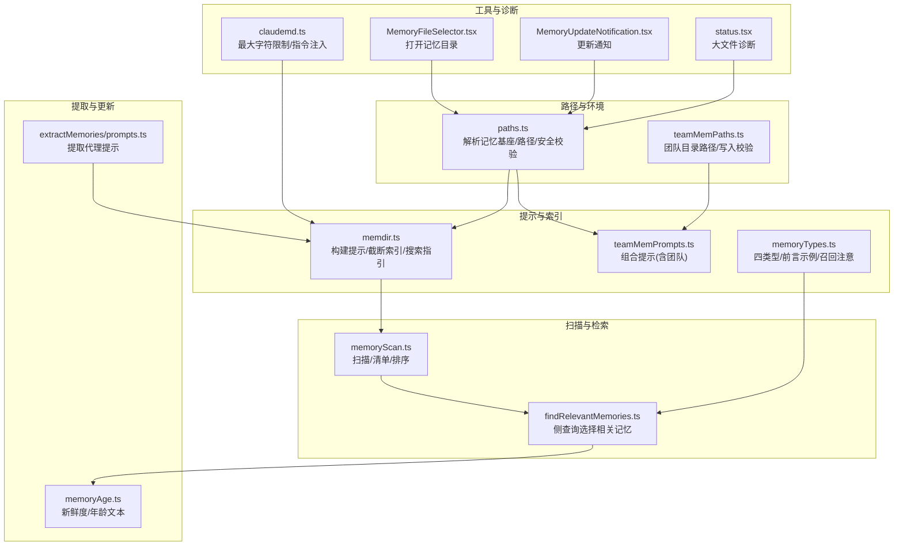
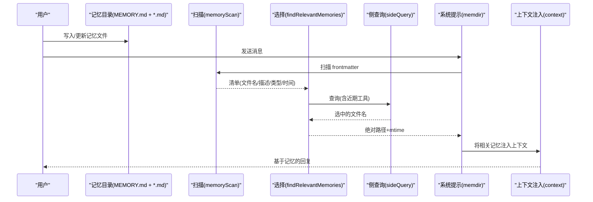
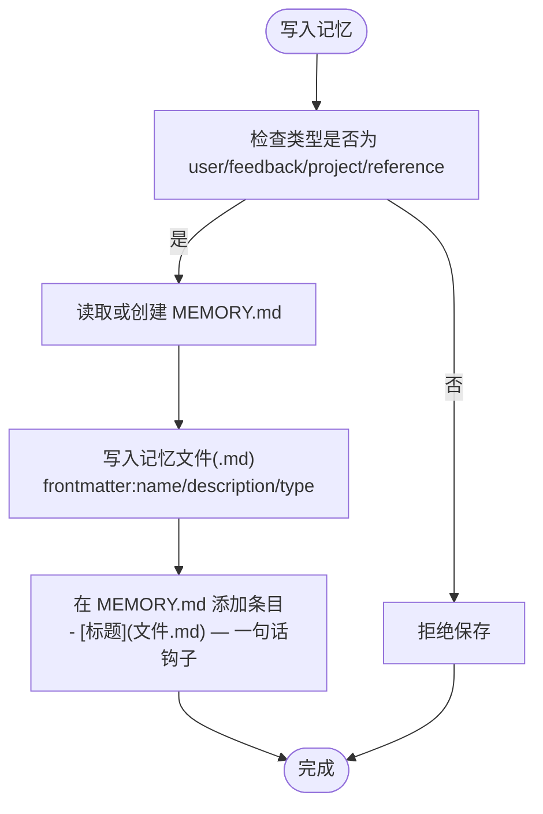
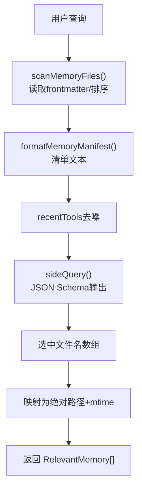
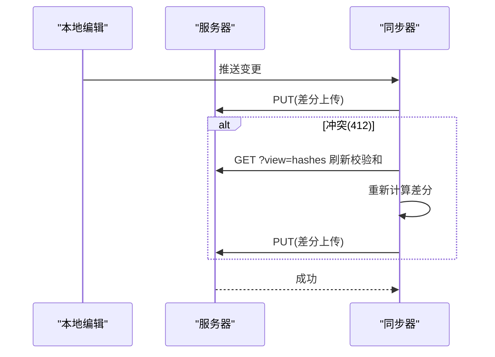
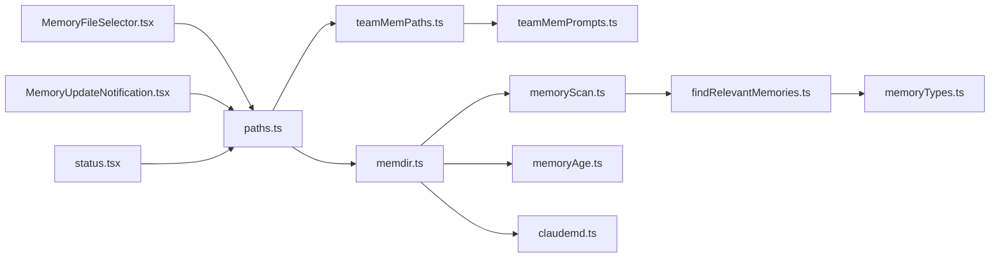

# 记忆管理系统

<cite>
**本文引用的文件**
- [src/memdir/memdir.ts](file://src/memdir/memdir.ts)
- [src/memdir/memoryTypes.ts](file://src/memdir/memoryTypes.ts)
- [src/memdir/findRelevantMemories.ts](file://src/memdir/findRelevantMemories.ts)
- [src/memdir/memoryScan.ts](file://src/memdir/memoryScan.ts)
- [src/memdir/paths.ts](file://src/memdir/paths.ts)
- [src/memdir/teamMemPaths.ts](file://src/memdir/teamMemPaths.ts)
- [src/memdir/teamMemPrompts.ts](file://src/memdir/teamMemPrompts.ts)
- [src/services/extractMemories/prompts.ts](file://src/services/extractMemories/prompts.ts)
- [docs/context/project-memory.mdx](file://docs/context/project-memory.mdx)
- [src/memdir/memoryAge.ts](file://src/memdir/memoryAge.ts)
- [src/memdir/memoryShapeTelemetry.ts](file://src/memdir/memoryShapeTelemetry.ts)
- [src/utils/claudemd.ts](file://src/utils/claudemd.ts)
- [src/utils/memory/types.ts](file://src/utils/memory/types.ts)
- [src/components/memory/MemoryFileSelector.tsx](file://src/components/memory/MemoryFileSelector.tsx)
- [src/components/memory/MemoryUpdateNotification.tsx](file://src/components/memory/MemoryUpdateNotification.tsx)
- [src/utils/status.tsx](file://src/utils/status.tsx)
</cite>

## 目录
1. [简介](#简介)
2. [项目结构](#项目结构)
3. [核心组件](#核心组件)
4. [架构总览](#架构总览)
5. [详细组件分析](#详细组件分析)
6. [依赖关系分析](#依赖关系分析)
7. [性能考量](#性能考量)
8. [故障排查指南](#故障排查指南)
9. [结论](#结论)
10. [附录](#附录)

## 简介
本文件面向开发者，系统性阐述 Claude Code 的记忆管理系统。系统采用“纯文件”架构，以 Markdown 文件与目录结构实现跨对话的长期记忆，结合轻量级的“侧查询”（Sonnet 侧）进行相关性筛选，并通过 MEMORY.md 索引与系统提示注入，将记忆高效地融入对话上下文。文档覆盖以下主题：
- 长期记忆的存储机制：文件格式、存储位置、数据结构
- 记忆检索算法：关键词匹配、语义相关性、相关性排序
- 记忆更新策略：增量更新、冲突解决、版本管理
- ClaudeMd 文件系统：文件命名规范、内容组织、自动发现
- 配置选项与使用建议

## 项目结构
记忆系统主要由以下模块构成：
- 路径与环境：确定记忆目录、入口索引、安全校验
- 提示构建：生成系统提示、索引截断、搜索指引
- 目录扫描与清单：扫描 .md 文件、提取 frontmatter、生成清单
- 相关性选择：调用侧查询，返回最相关记忆
- 类型与规范：四类型分类、frontmatter 规范、召回注意事项
- 团队记忆：团队目录隔离、路径校验、同步策略
- 提取代理：后台自动抽取对话要点，补充记忆
- 工具与 UI：文件选择器、更新通知、诊断与状态

**图表来源**
- [src/memdir/paths.ts:85-235](file://src/memdir/paths.ts#L85-L235)
- [src/memdir/teamMemPaths.ts:84-94](file://src/memdir/teamMemPaths.ts#L84-L94)
- [src/memdir/memdir.ts:272-316](file://src/memdir/memdir.ts#L272-L316)
- [src/memdir/teamMemPrompts.ts:22-99](file://src/memdir/teamMemPrompts.ts#L22-L99)
- [src/memdir/memoryTypes.ts:261-271](file://src/memdir/memoryTypes.ts#L261-L271)
- [src/memdir/memoryScan.ts:35-77](file://src/memdir/memoryScan.ts#L35-L77)
- [src/memdir/findRelevantMemories.ts:39-75](file://src/memdir/findRelevantMemories.ts#L39-L75)
- [src/memdir/memoryAge.ts:15-53](file://src/memdir/memoryAge.ts#L15-L53)
- [src/utils/claudemd.ts:89-92](file://src/utils/claudemd.ts#L89-L92)
- [src/components/memory/MemoryFileSelector.tsx:114-140](file://src/components/memory/MemoryFileSelector.tsx#L114-L140)
- [src/components/memory/MemoryUpdateNotification.tsx:21-44](file://src/components/memory/MemoryUpdateNotification.tsx#L21-L44)
- [src/utils/status.tsx:116-125](file://src/utils/status.tsx#L116-L125)

**章节来源**
- [docs/context/project-memory.mdx:9-28](file://docs/context/project-memory.mdx#L9-L28)
- [src/memdir/paths.ts:85-235](file://src/memdir/paths.ts#L85-L235)

## 核心组件
- 路径解析与安全校验：统一解析记忆基座目录、项目根、自动记忆目录、团队记忆目录；提供路径规范化、越界检测、符号链接真实路径校验，确保写入安全。
- 提示构建与索引截断：生成系统提示（含索引内容），对 MEMORY.md 实施行数与字节数双重上限截断，并追加警告；提供搜索指引（grep/bash）。
- 目录扫描与清单：递归扫描 .md 文件，读取前言区（frontmatter）提取类型、描述、修改时间，按最新优先排序并限制数量。
- 相关性选择：将清单与“近期工具”信息拼接，调用侧查询（Sonnet）返回最相关记忆文件名，再映射为绝对路径与修改时间。
- 类型与规范：定义四类型（user/feedback/project/reference），明确何时保存、如何使用、正文结构；提供 frontmatter 示例与召回注意事项。
- 团队记忆：团队目录作为自动记忆子目录，提供路径校验、键值校验、写入校验，支持同步策略（推送/拉取）。
- 提取代理：后台根据最近对话消息，自动抽取要点并更新记忆，遵循与系统提示一致的保存规则。
- 工具与诊断：文件选择器快速打开记忆目录；更新通知显示相对路径；状态面板诊断大文件影响。

**章节来源**
- [src/memdir/memdir.ts:199-316](file://src/memdir/memdir.ts#L199-L316)
- [src/memdir/memoryScan.ts:35-94](file://src/memdir/memoryScan.ts#L35-L94)
- [src/memdir/findRelevantMemories.ts:39-141](file://src/memdir/findRelevantMemories.ts#L39-L141)
- [src/memdir/memoryTypes.ts:14-106](file://src/memdir/memoryTypes.ts#L14-L106)
- [src/memdir/teamMemPaths.ts:84-284](file://src/memdir/teamMemPaths.ts#L84-L284)
- [src/services/extractMemories/prompts.ts:50-154](file://src/services/extractMemories/prompts.ts#L50-L154)
- [src/components/memory/MemoryFileSelector.tsx:114-140](file://src/components/memory/MemoryFileSelector.tsx#L114-L140)
- [src/components/memory/MemoryUpdateNotification.tsx:21-44](file://src/components/memory/MemoryUpdateNotification.tsx#L21-L44)
- [src/utils/status.tsx:116-125](file://src/utils/status.tsx#L116-L125)

## 架构总览
记忆系统采用“文件即数据库”的纯文件架构，结合系统提示注入与侧查询选择，形成“存储—检索—注入”的闭环。

**图表来源**
- [src/memdir/memoryScan.ts:35-77](file://src/memdir/memoryScan.ts#L35-L77)
- [src/memdir/findRelevantMemories.ts:39-75](file://src/memdir/findRelevantMemories.ts#L39-L75)
- [src/memdir/memdir.ts:272-316](file://src/memdir/memdir.ts#L272-L316)

## 详细组件分析

### 存储机制与文件格式
- 存储位置
  - 自动记忆：默认位于用户配置目录下的 projects/<项目根>/memory/，支持环境变量覆盖与设置项覆盖。
  - 团队记忆：作为自动记忆子目录 memory/team/，启用团队记忆功能时生效。
- 文件命名与组织
  - 入口索引：MEMORY.md，无 frontmatter，每行一个条目“- [标题](文件.md) — 一句话钩子”，不超过 150 字符。
  - 记忆文件：每个记忆单独文件，使用 frontmatter 包含 name、description、type；内容按类型建议结构组织。
- 数据结构
  - frontmatter 字段：name、description（召回关键词）、type（user/feedback/project/reference）。
  - 目录结构：支持 logs/ 年/月/日.md（KAIROS 模式）用于长期会话的日志沉淀。

**图表来源**
- [src/memdir/memdir.ts:205-234](file://src/memdir/memdir.ts#L205-L234)
- [src/memdir/memoryTypes.ts:261-271](file://src/memdir/memoryTypes.ts#L261-L271)
- [src/services/extractMemories/prompts.ts:50-94](file://src/services/extractMemories/prompts.ts#L50-L94)

**章节来源**
- [docs/context/project-memory.mdx:15-56](file://docs/context/project-memory.mdx#L15-L56)
- [src/memdir/paths.ts:203-259](file://src/memdir/paths.ts#L203-L259)
- [src/memdir/teamMemPaths.ts:84-94](file://src/memdir/teamMemPaths.ts#L84-L94)
- [src/memdir/memdir.ts:205-234](file://src/memdir/memdir.ts#L205-L234)

### 检索算法与相关性排序
- 扫描阶段
  - 递归遍历目录，过滤 .md 文件（排除 MEMORY.md），限制最大文件数。
  - 仅读取前若干行以解析 frontmatter，避免全量读取。
  - 按修改时间降序排序，截断至上限。
- 选择阶段
  - 将清单与“近期使用工具”拼接，调用侧查询（Sonnet）返回 JSON Schema 结构的选中文件名数组。
  - 通过 alreadySurfaced 过滤，避免重复召回。
- 相关性与去噪
  - description 字段作为召回关键词；当近期使用某工具时，跳过该工具的使用参考类记忆，保留警告/陷阱类记忆。

**图表来源**
- [src/memdir/memoryScan.ts:35-94](file://src/memdir/memoryScan.ts#L35-L94)
- [src/memdir/findRelevantMemories.ts:77-141](file://src/memdir/findRelevantMemories.ts#L77-L141)

**章节来源**
- [src/memdir/memoryScan.ts:35-94](file://src/memdir/memoryScan.ts#L35-L94)
- [src/memdir/findRelevantMemories.ts:39-141](file://src/memdir/findRelevantMemories.ts#L39-L141)
- [docs/context/project-memory.mdx:94-141](file://docs/context/project-memory.mdx#L94-L141)

### 更新策略与版本管理
- 增量更新
  - 提取代理：后台根据最近对话消息自动抽取要点，遵循与系统提示一致的保存规则，避免重复与冗余。
  - 手动更新：通过 Write 工具直接编辑记忆文件与索引条目。
- 冲突解决
  - 团队记忆：推送采用乐观锁，遇到 412 冲突时探测服务器哈希，重新计算差分并重试；本地优先策略，避免静默丢弃用户编辑。
  - 个人记忆：直接覆盖，不涉及并发冲突。
- 版本与新鲜度
  - 使用修改时间记录年龄，提供“几天前”等人类可读文本，提醒用户在引用旧记忆前验证当前状态。
  - 对于超过一定年龄的记忆，注入系统提醒标签，降低误用风险。

**图表来源**
- [src/services/teamMemorySync/index.ts:889-893](file://src/services/teamMemorySync/index.ts#L889-L893)

**章节来源**
- [src/services/extractMemories/prompts.ts:50-154](file://src/services/extractMemories/prompts.ts#L50-L154)
- [src/memdir/memoryAge.ts:15-53](file://src/memdir/memoryAge.ts#L15-L53)
- [src/services/teamMemorySync/index.ts:862-893](file://src/services/teamMemorySync/index.ts#L862-L893)

### ClaudeMd 文件系统与自动发现
- 文件命名规范
  - MEMORY.md：索引文件，无 frontmatter，每行一个条目。
  - 记忆文件：独立文件，frontmatter 必备字段 name/description/type。
- 内容组织
  - 语义化组织优于时间顺序；避免重复，优先更新既有记忆。
- 自动发现
  - 通过扫描与清单生成，结合侧查询选择，自动将相关记忆注入上下文。
  - 支持 KAIROS 模式：长期会话将日志写入 logs/ 年/月/日.md，夜间任务蒸馏为主题文件与索引。

**章节来源**
- [docs/context/project-memory.mdx:167-182](file://docs/context/project-memory.mdx#L167-L182)
- [src/memdir/memdir.ts:327-370](file://src/memdir/memdir.ts#L327-L370)

### 配置选项与使用建议
- 启用控制
  - 环境变量 CLAUDE_CODE_DISABLE_AUTO_MEMORY：禁用自动记忆（1/true 关闭，0/false 开启）。
  - 环境变量 CLAUDE_CODE_SIMPLE：简洁模式下关闭自动记忆。
  - 设置项 autoMemoryEnabled：支持项目级关闭。
- 路径覆盖
  - CLAUDE_COWORK_MEMORY_PATH_OVERRIDE：Cowork SDK 全路径覆盖。
  - settings.json 中 autoMemoryDirectory：支持 ~/ 展开，仅允许受信来源（policy/local/user）。
- 索引截断
  - MEMORY.md 行数上限 200，字节上限 25KB；超限时截断并追加警告。
- 使用建议
  - 仅保存无法从当前项目状态推导的信息；避免保存代码模式、git 历史、调试方案等。
  - description 字段应具体，作为召回关键词；正文建议包含 Why/How to apply。
  - 定期清理过期记忆，保持索引简洁；使用 /memory 打开目录进行维护。

**章节来源**
- [src/memdir/paths.ts:30-55](file://src/memdir/paths.ts#L30-L55)
- [src/memdir/memdir.ts:57-103](file://src/memdir/memdir.ts#L57-L103)
- [src/memdir/memdir.ts:205-234](file://src/memdir/memdir.ts#L205-L234)
- [src/memdir/memoryTypes.ts:183-195](file://src/memdir/memoryTypes.ts#L183-L195)

## 依赖关系分析

**图表来源**
- [src/memdir/paths.ts:85-235](file://src/memdir/paths.ts#L85-L235)
- [src/memdir/memdir.ts:1-50](file://src/memdir/memdir.ts#L1-L50)
- [src/memdir/teamMemPaths.ts:1-10](file://src/memdir/teamMemPaths.ts#L1-L10)
- [src/memdir/teamMemPrompts.ts:1-16](file://src/memdir/teamMemPrompts.ts#L1-L16)
- [src/memdir/memoryScan.ts:1-12](file://src/memdir/memoryScan.ts#L1-L12)
- [src/memdir/findRelevantMemories.ts:1-12](file://src/memdir/findRelevantMemories.ts#L1-L12)
- [src/memdir/memoryTypes.ts:1-12](file://src/memdir/memoryTypes.ts#L1-L12)
- [src/memdir/memoryAge.ts:1-8](file://src/memdir/memoryAge.ts#L1-L8)
- [src/utils/claudemd.ts:89-92](file://src/utils/claudemd.ts#L89-L92)
- [src/components/memory/MemoryFileSelector.tsx:114-140](file://src/components/memory/MemoryFileSelector.tsx#L114-L140)
- [src/components/memory/MemoryUpdateNotification.tsx:21-44](file://src/components/memory/MemoryUpdateNotification.tsx#L21-L44)
- [src/utils/status.tsx:116-125](file://src/utils/status.tsx#L116-L125)

**章节来源**
- [src/utils/memory/types.ts:3-10](file://src/utils/memory/types.ts#L3-L10)

## 性能考量
- I/O 优化
  - 扫描阶段仅读取前若干行 frontmatter，避免全量读取；N≤200 时减少一次 stat 循环。
  - 索引截断：行数与字节双重上限，避免超大索引影响加载性能。
- 侧查询成本
  - 使用轻量模型进行相关性选择，限制输出长度；通过 recentTools 去噪，减少无效召回。
- 大文件诊断
  - 状态面板检测超过阈值的记忆文件，提示潜在性能影响。

**章节来源**
- [src/memdir/memoryScan.ts:35-77](file://src/memdir/memoryScan.ts#L35-L77)
- [src/memdir/memdir.ts:57-103](file://src/memdir/memdir.ts#L57-L103)
- [src/utils/status.tsx:116-125](file://src/utils/status.tsx#L116-L125)

## 故障排查指南
- 记忆未被召回
  - 检查 MEMORY.md 是否存在且条目简洁；确认 description 是否具备相关关键词。
  - 若近期使用某工具，系统会跳过其使用参考类记忆，确认是否属于此类。
- 索引过大被截断
  - 查看截断警告；缩短条目长度或拆分为多个主题文件。
- 路径或权限问题
  - 确认 isAutoMemPath/isTeamMemPath 判断与写入校验；检查符号链接与越界尝试。
- 团队同步冲突
  - 推送时出现 412 冲突，系统会自动刷新校验和并重试；若仍失败，检查远端变更并合并。
- 新鲜度风险
  - 对于较旧记忆，系统会附加提醒；在引用前务必核对当前代码状态。

**章节来源**
- [src/memdir/findRelevantMemories.ts:131-141](file://src/memdir/findRelevantMemories.ts#L131-L141)
- [src/memdir/memdir.ts:57-103](file://src/memdir/memdir.ts#L57-L103)
- [src/memdir/teamMemPaths.ts:228-256](file://src/memdir/teamMemPaths.ts#L228-L256)
- [src/services/teamMemorySync/index.ts:889-893](file://src/services/teamMemorySync/index.ts#L889-L893)
- [src/memdir/memoryAge.ts:33-53](file://src/memdir/memoryAge.ts#L33-L53)

## 结论
Claude Code 的记忆系统以“纯文件 + 轻量侧查询”为核心，实现了低成本、高可控的跨对话长期记忆。通过严格的类型约束、frontmatter 规范、索引截断与新鲜度提醒，系统在保证召回质量的同时兼顾性能与安全性。团队记忆进一步扩展了协作场景下的知识共享能力。建议开发者遵循本文档的配置与使用建议，持续优化记忆质量与检索效率。

## 附录
- 相关类型枚举
  - 内部记忆类型值集合包含 User/Project/Local/Managed/AutoMem，以及可选的 TeamMem。

**章节来源**
- [src/utils/memory/types.ts:3-10](file://src/utils/memory/types.ts#L3-L10)