# 会话管理

<cite>
**本文引用的文件**
- [sessionStorage.ts](file://src/utils/sessionStorage.ts)
- [sessionStoragePortable.ts](file://src/utils/sessionStoragePortable.ts)
- [createSession.ts](file://src/bridge/createSession.ts)
- [sessionRunner.ts](file://src/bridge/sessionRunner.ts)
- [sessionHistory.ts](file://src/assistant/sessionHistory.ts)
- [sessionIngress.ts](file://src/services/api/sessionIngress.ts)
- [cleanup.ts](file://src/utils/cleanup.ts)
- [stats.ts](file://src/utils/stats.ts)
- [REPL.tsx](file://src/screens/REPL.tsx)
- [sessionMemoryUtils.ts](file://src/services/SessionMemory/sessionMemoryUtils.ts)
- [RemoteSessionManager.ts](file://src/remote/RemoteSessionManager.ts)
- [SessionsWebSocket.ts](file://src/remote/SessionsWebSocket.ts)
</cite>

## 目录
1. [简介](#简介)
2. [项目结构](#项目结构)
3. [核心组件](#核心组件)
4. [架构总览](#架构总览)
5. [详细组件分析](#详细组件分析)
6. [依赖关系分析](#依赖关系分析)
7. [性能考量](#性能考量)
8. [故障排查指南](#故障排查指南)
9. [结论](#结论)
10. [附录](#附录)

## 简介
本文件系统性梳理 Claude Code 的会话管理能力，覆盖会话生命周期（创建、初始化、消息持久化、历史维护）、状态存储（内存/文件/远程）、会话恢复（断线重连、状态同步、数据完整性）、配置项（持久化策略、清理规则、备份机制）以及使用示例与最佳实践。目标是帮助开发者在本地与远程桥接场景下，正确、稳定地管理会话。

## 项目结构
围绕会话管理的关键模块分布如下：
- 本地会话存储与读写：src/utils/sessionStorage.ts、src/utils/sessionStoragePortable.ts
- 桥接会话创建与控制：src/bridge/createSession.ts、src/bridge/sessionRunner.ts
- 历史拉取与分页：src/assistant/sessionHistory.ts
- 会话持久化入口（服务端/远程）：src/services/api/sessionIngress.ts
- 清理与统计：src/utils/cleanup.ts、src/utils/stats.ts
- 会话内存快照：src/services/SessionMemory/sessionMemoryUtils.ts
- 远程会话管理：src/remote/RemoteSessionManager.ts、src/remote/SessionsWebSocket.ts
- REPL 恢复与模式保存：src/screens/REPL.tsx

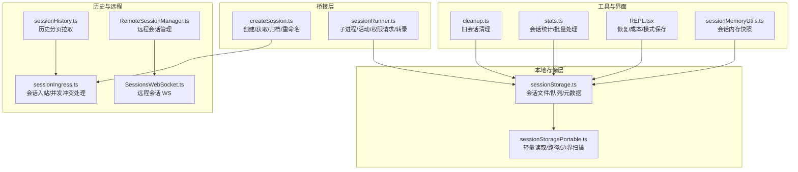

图表来源
- [sessionStorage.ts:1-800](file://src/utils/sessionStorage.ts#L1-L800)
- [sessionStoragePortable.ts:1-794](file://src/utils/sessionStoragePortable.ts#L1-L794)
- [createSession.ts:1-385](file://src/bridge/createSession.ts#L1-L385)
- [sessionRunner.ts:1-551](file://src/bridge/sessionRunner.ts#L1-L551)
- [sessionHistory.ts:1-88](file://src/assistant/sessionHistory.ts#L1-L88)
- [sessionIngress.ts](file://src/services/api/sessionIngress.ts)
- [cleanup.ts:155-159](file://src/utils/cleanup.ts#L155-L159)
- [stats.ts:137-166](file://src/utils/stats.ts#L137-L166)
- [REPL.tsx:1898-1914](file://src/screens/REPL.tsx#L1898-L1914)
- [sessionMemoryUtils.ts:85-138](file://src/services/SessionMemory/sessionMemoryUtils.ts#L85-L138)
- [RemoteSessionManager.ts](file://src/remote/RemoteSessionManager.ts)
- [SessionsWebSocket.ts](file://src/remote/SessionsWebSocket.ts)

章节来源
- [sessionStorage.ts:1-800](file://src/utils/sessionStorage.ts#L1-L800)
- [sessionStoragePortable.ts:1-794](file://src/utils/sessionStoragePortable.ts#L1-L794)
- [createSession.ts:1-385](file://src/bridge/createSession.ts#L1-L385)
- [sessionRunner.ts:1-551](file://src/bridge/sessionRunner.ts#L1-L551)
- [sessionHistory.ts:1-88](file://src/assistant/sessionHistory.ts#L1-L88)
- [sessionIngress.ts](file://src/services/api/sessionIngress.ts)
- [cleanup.ts:155-159](file://src/utils/cleanup.ts#L155-L159)
- [stats.ts:137-166](file://src/utils/stats.ts#L137-L166)
- [REPL.tsx:1898-1914](file://src/screens/REPL.tsx#L1898-L1914)
- [sessionMemoryUtils.ts:85-138](file://src/services/SessionMemory/sessionMemoryUtils.ts#L85-L138)
- [RemoteSessionManager.ts](file://src/remote/RemoteSessionManager.ts)
- [SessionsWebSocket.ts](file://src/remote/SessionsWebSocket.ts)

## 核心组件
- 会话文件与写入队列：负责将消息以 NDJSON 行写入当前会话文件，支持批量化、分块写入、队列去抖、退出时重写尾部元数据等。
- 轻量读取与路径解析：提供只读的头尾窗口读取、首个用户提示提取、项目目录发现、工作树回退查找等。
- 桥接会话创建与运行：通过 HTTP 创建/获取/归档会话；通过子进程运行会话，解析活动、权限请求、转录输出。
- 历史分页拉取：基于 OAuth 与组织上下文，按页拉取会话事件，支持“最新”和“更早”翻页。
- 会话入站与并发冲突：将消息写入服务端/远程通道，处理并发修改冲突与 UUID 不一致。
- 清理与统计：定期清理旧会话文件，按时间窗口统计会话信息。
- 内存快照：读取/设置会话内存内容，等待内存提取完成。
- 远程会话管理：远程会话生命周期与 WebSocket 管理。
- REPL 恢复：在恢复时保存/恢复模式、成本等状态。

章节来源
- [sessionStorage.ts:530-800](file://src/utils/sessionStorage.ts#L530-L800)
- [sessionStoragePortable.ts:256-286](file://src/utils/sessionStoragePortable.ts#L256-L286)
- [createSession.ts:34-180](file://src/bridge/createSession.ts#L34-L180)
- [sessionRunner.ts:248-551](file://src/bridge/sessionRunner.ts#L248-L551)
- [sessionHistory.ts:31-88](file://src/assistant/sessionHistory.ts#L31-L88)
- [sessionIngress.ts](file://src/services/api/sessionIngress.ts)
- [cleanup.ts:155-159](file://src/utils/cleanup.ts#L155-L159)
- [stats.ts:137-166](file://src/utils/stats.ts#L137-L166)
- [sessionMemoryUtils.ts:85-138](file://src/services/SessionMemory/sessionMemoryUtils.ts#L85-L138)
- [RemoteSessionManager.ts](file://src/remote/RemoteSessionManager.ts)
- [SessionsWebSocket.ts](file://src/remote/SessionsWebSocket.ts)
- [REPL.tsx:1898-1914](file://src/screens/REPL.tsx#L1898-L1914)

## 架构总览
会话管理贯穿“本地存储 + 桥接/远程通道 + 历史与恢复”的全链路。

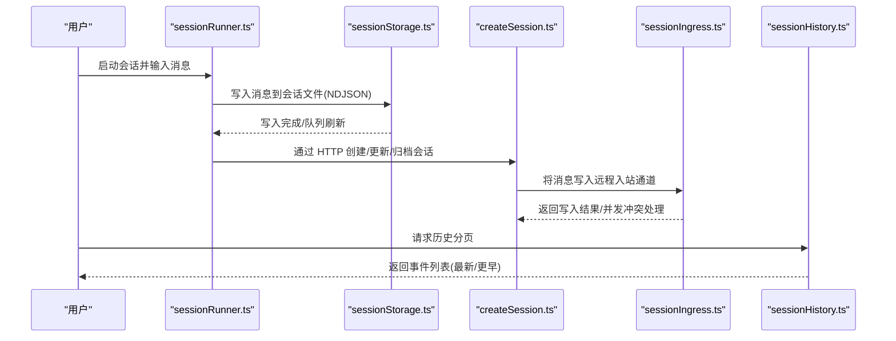

图表来源
- [sessionRunner.ts:248-551](file://src/bridge/sessionRunner.ts#L248-L551)
- [sessionStorage.ts:530-800](file://src/utils/sessionStorage.ts#L530-L800)
- [createSession.ts:34-180](file://src/bridge/createSession.ts#L34-L180)
- [sessionIngress.ts](file://src/services/api/sessionIngress.ts)
- [sessionHistory.ts:31-88](file://src/assistant/sessionHistory.ts#L31-L88)

## 详细组件分析

### 组件一：会话文件与写入队列（本地）
- 文件定位：根据当前会话 ID 与项目目录生成 .jsonl 路径，支持代理/工作树回退。
- 写入策略：采用队列+定时器+分块合并，避免频繁磁盘 IO；支持外部写入（如 SDK）导致的标题/标签变更，退出时重写尾部元数据确保可读。
- 元数据：自定义标题、标签、最后提示、模式、PR 链接等缓存，退出时追加至文件尾部窗口，便于快速加载。
- 并发与一致性：写入前检查文件存在性与权限；失败自动创建目录；写入后进行尾部元数据重写，保证 --resume 可见。

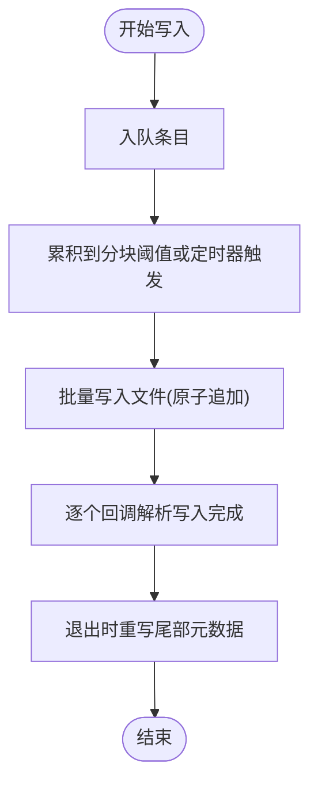

图表来源
- [sessionStorage.ts:606-691](file://src/utils/sessionStorage.ts#L606-L691)
- [sessionStorage.ts:692-800](file://src/utils/sessionStorage.ts#L692-L800)

章节来源
- [sessionStorage.ts:198-225](file://src/utils/sessionStorage.ts#L198-L225)
- [sessionStorage.ts:606-691](file://src/utils/sessionStorage.ts#L606-L691)
- [sessionStorage.ts:692-800](file://src/utils/sessionStorage.ts#L692-L800)

### 组件二：轻量读取与路径解析（便携工具）
- 头尾窗口读取：仅打开一次文件句柄，读取头部与尾部固定大小缓冲区，用于快速统计、元数据与首提示提取。
- 路径安全：对项目路径进行规范化与哈希截断，兼容长路径与跨平台限制；支持工作树回退查找。
- 边界扫描：在大文件中定位压缩边界，跳过属性快照，保留最近一次快照于末尾。

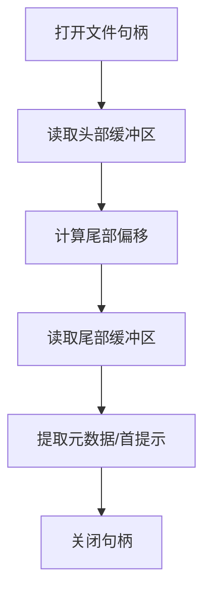

图表来源
- [sessionStoragePortable.ts:256-286](file://src/utils/sessionStoragePortable.ts#L256-L286)
- [sessionStoragePortable.ts:403-466](file://src/utils/sessionStoragePortable.ts#L403-L466)
- [sessionStoragePortable.ts:717-794](file://src/utils/sessionStoragePortable.ts#L717-L794)

章节来源
- [sessionStoragePortable.ts:256-286](file://src/utils/sessionStoragePortable.ts#L256-L286)
- [sessionStoragePortable.ts:403-466](file://src/utils/sessionStoragePortable.ts#L403-L466)
- [sessionStoragePortable.ts:717-794](file://src/utils/sessionStoragePortable.ts#L717-L794)

### 组件三：桥接会话创建与运行
- 创建：携带模型、源码上下文、分支信息等，向远端 Sessions API 发起创建请求，返回会话 ID。
- 获取/归档/重命名：提供查询、归档与标题同步接口，确保远端与本地一致。
- 子进程运行：解析 NDJSON 输出，提取活动、权限请求、首次用户消息；支持调试日志与转录文件；提供中断/强制终止与令牌刷新。

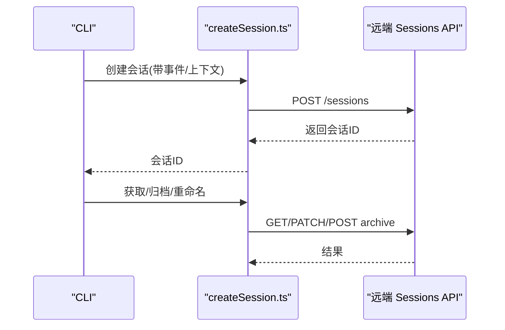

图表来源
- [createSession.ts:34-180](file://src/bridge/createSession.ts#L34-L180)
- [createSession.ts:190-244](file://src/bridge/createSession.ts#L190-L244)
- [createSession.ts:263-317](file://src/bridge/createSession.ts#L263-L317)
- [createSession.ts:327-384](file://src/bridge/createSession.ts#L327-L384)

章节来源
- [createSession.ts:34-180](file://src/bridge/createSession.ts#L34-L180)
- [createSession.ts:190-244](file://src/bridge/createSession.ts#L190-L244)
- [createSession.ts:263-317](file://src/bridge/createSession.ts#L263-L317)
- [createSession.ts:327-384](file://src/bridge/createSession.ts#L327-L384)
- [sessionRunner.ts:248-551](file://src/bridge/sessionRunner.ts#L248-L551)

### 组件四：历史分页拉取
- 认证：基于 OAuth 与组织 UUID，设置特定 Beta 头与组织头。
- 分页：支持“锚定最新”与“按 before_id”翻页，返回事件列表与游标。

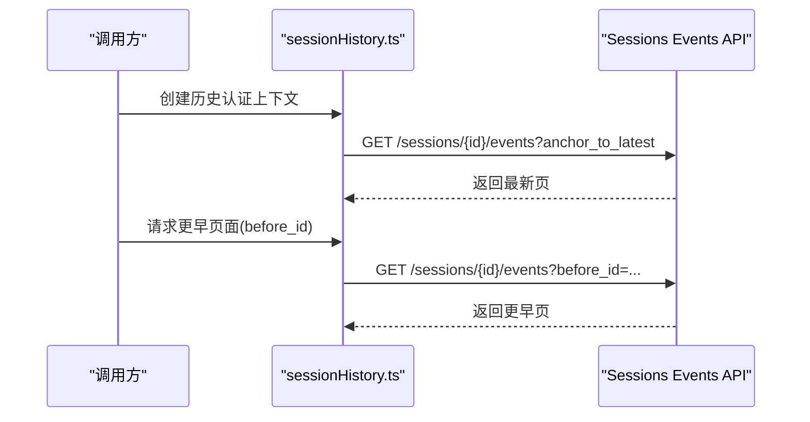

图表来源
- [sessionHistory.ts:31-88](file://src/assistant/sessionHistory.ts#L31-L88)

章节来源
- [sessionHistory.ts:31-88](file://src/assistant/sessionHistory.ts#L31-L88)

### 组件五：会话入站与并发冲突处理
- 入站写入：将消息写入远程入站通道，处理 409 冲突（UUID 不一致）时采用“采用服务器 UUID”策略并重试。
- 并发保护：在写入过程中检测并发修改，记录诊断日志并返回失败，避免数据不一致。

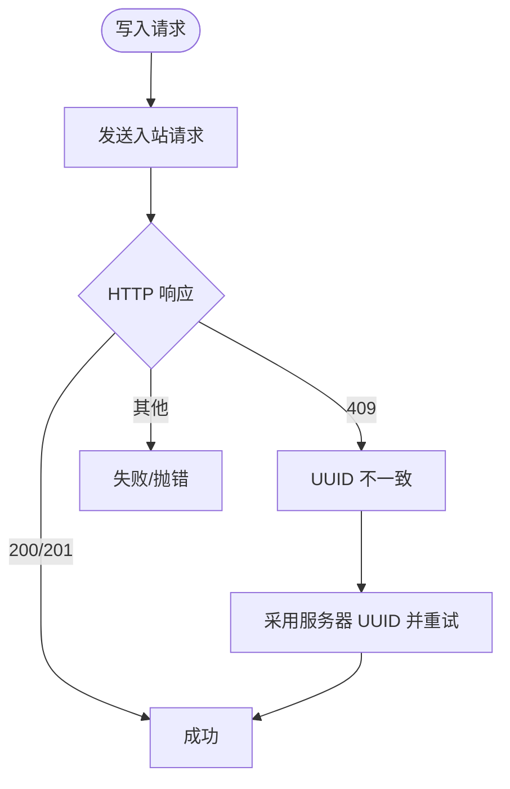

图表来源
- [sessionIngress.ts](file://src/services/api/sessionIngress.ts)
- [sessionIngress.ts:127-142](file://src/services/api/sessionIngress.ts#L127-L142)

章节来源
- [sessionIngress.ts](file://src/services/api/sessionIngress.ts)
- [sessionIngress.ts:127-142](file://src/services/api/sessionIngress.ts#L127-L142)

### 组件六：清理与统计
- 清理：按截止日期删除旧会话文件，清理 MCP 日志目录，递归删除空目录。
- 统计：分批并行读取会话文件，按修改时间与起始时间过滤，避免大文件全量扫描。

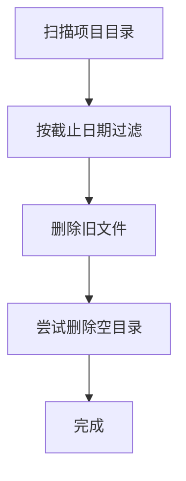

图表来源
- [cleanup.ts:155-159](file://src/utils/cleanup.ts#L155-L159)
- [stats.ts:137-166](file://src/utils/stats.ts#L137-L166)

章节来源
- [cleanup.ts:155-159](file://src/utils/cleanup.ts#L155-L159)
- [stats.ts:137-166](file://src/utils/stats.ts#L137-L166)

### 组件七：会话内存快照
- 等待提取：在内存提取进行中时等待（带超时与陈旧阈值），避免竞态。
- 读取/设置：从会话内存文件读取内容，或更新配置。

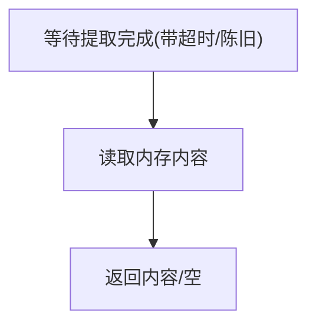

图表来源
- [sessionMemoryUtils.ts:85-138](file://src/services/SessionMemory/sessionMemoryUtils.ts#L85-L138)

章节来源
- [sessionMemoryUtils.ts:85-138](file://src/services/SessionMemory/sessionMemoryUtils.ts#L85-L138)

### 组件八：远程会话管理与恢复
- 远程会话管理：集中管理远程会话生命周期，配合 WebSocket 实时状态同步。
- 断线重连：在环境丢失/异常关闭时尝试“原位重连”或“全新会话回退”，保证会话连续性。

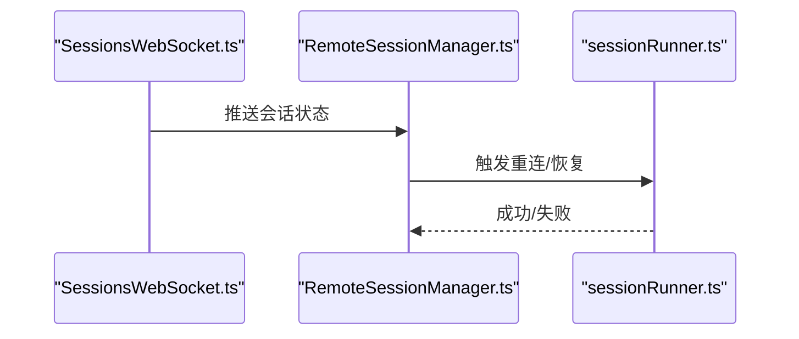

图表来源
- [RemoteSessionManager.ts](file://src/remote/RemoteSessionManager.ts)
- [SessionsWebSocket.ts](file://src/remote/SessionsWebSocket.ts)
- [sessionRunner.ts:576-615](file://src/bridge/sessionRunner.ts#L576-L615)

章节来源
- [RemoteSessionManager.ts](file://src/remote/RemoteSessionManager.ts)
- [SessionsWebSocket.ts](file://src/remote/SessionsWebSocket.ts)
- [sessionRunner.ts:576-615](file://src/bridge/sessionRunner.ts#L576-L615)

### 组件九：REPL 恢复与模式保存
- 恢复成本：在恢复时从已读数据恢复目标会话的成本状态。
- 模式保存：在特性开启时保存当前会话模式（协调者/普通），以便后续恢复。

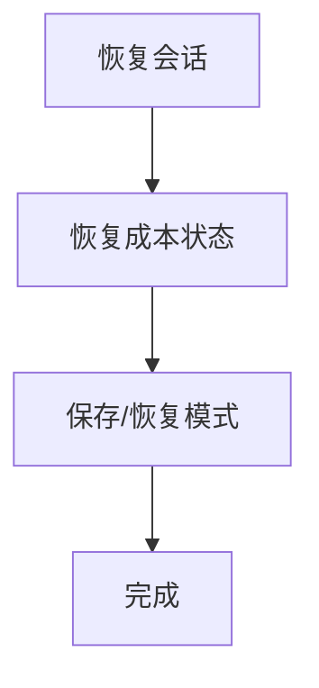

图表来源
- [REPL.tsx:1898-1914](file://src/screens/REPL.tsx#L1898-L1914)

章节来源
- [REPL.tsx:1898-1914](file://src/screens/REPL.tsx#L1898-L1914)

## 依赖关系分析
- 低耦合高内聚：本地存储与桥接/远程逻辑通过统一的消息格式（NDJSON）解耦；历史与入站分别由独立模块负责。
- 关键依赖链：
  - sessionRunner.ts 依赖 sessionStorage.ts 进行本地持久化；
  - createSession.ts 依赖 sessionIngress.ts 完成远端入站；
  - sessionHistory.ts 依赖 OAuth/组织上下文访问远端事件；
  - cleanup.ts 与 stats.ts 依赖本地文件系统扫描与统计。

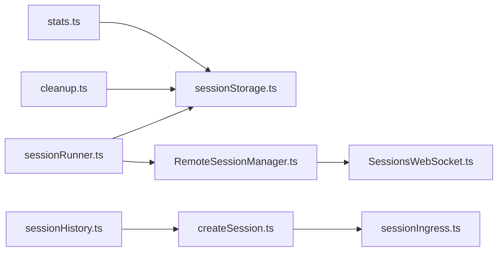

图表来源
- [sessionRunner.ts:248-551](file://src/bridge/sessionRunner.ts#L248-L551)
- [sessionStorage.ts:530-800](file://src/utils/sessionStorage.ts#L530-L800)
- [createSession.ts:34-180](file://src/bridge/createSession.ts#L34-L180)
- [sessionIngress.ts](file://src/services/api/sessionIngress.ts)
- [sessionHistory.ts:31-88](file://src/assistant/sessionHistory.ts#L31-L88)
- [cleanup.ts:155-159](file://src/utils/cleanup.ts#L155-L159)
- [stats.ts:137-166](file://src/utils/stats.ts#L137-L166)
- [RemoteSessionManager.ts](file://src/remote/RemoteSessionManager.ts)
- [SessionsWebSocket.ts](file://src/remote/SessionsWebSocket.ts)

章节来源
- [sessionRunner.ts:248-551](file://src/bridge/sessionRunner.ts#L248-L551)
- [sessionStorage.ts:530-800](file://src/utils/sessionStorage.ts#L530-L800)
- [createSession.ts:34-180](file://src/bridge/createSession.ts#L34-L180)
- [sessionIngress.ts](file://src/services/api/sessionIngress.ts)
- [sessionHistory.ts:31-88](file://src/assistant/sessionHistory.ts#L31-L88)
- [cleanup.ts:155-159](file://src/utils/cleanup.ts#L155-L159)
- [stats.ts:137-166](file://src/utils/stats.ts#L137-L166)
- [RemoteSessionManager.ts](file://src/remote/RemoteSessionManager.ts)
- [SessionsWebSocket.ts](file://src/remote/SessionsWebSocket.ts)

## 性能考量
- 批量写入与分块：写入队列按阈值合并，减少磁盘写放大；退出时重写尾部元数据，避免全文件扫描。
- 轻量读取：头尾窗口读取与边界扫描，避免大文件全量解析。
- 并行处理：清理与统计采用分批并行，提升大规模会话扫描效率。
- 远程入站：并发冲突采用“采用服务器 UUID”策略，减少重试开销。

[本节为通用指导，无需列出具体文件来源]

## 故障排查指南
- 写入失败：检查目录权限与磁盘空间；若因网络/文件系统导致写入异常，代码会自动创建目录并重试。
- 并发冲突：出现 409 时会记录诊断日志并采用服务器 UUID 重试；若持续失败，检查客户端并发写入策略。
- 历史拉取失败：确认 OAuth 令牌与组织 UUID 正确；检查网络与 API 状态码。
- 会话恢复异常：确认会话文件存在且非空；检查工作树路径与项目目录映射；必要时使用清理工具清理旧文件。
- 内存快照：在提取进行中时等待，避免竞态；若长时间无响应，检查提取任务状态。

章节来源
- [sessionStorage.ts:634-691](file://src/utils/sessionStorage.ts#L634-L691)
- [sessionIngress.ts:127-142](file://src/services/api/sessionIngress.ts#L127-L142)
- [sessionHistory.ts:31-88](file://src/assistant/sessionHistory.ts#L31-L88)
- [cleanup.ts:155-159](file://src/utils/cleanup.ts#L155-L159)
- [sessionMemoryUtils.ts:85-138](file://src/services/SessionMemory/sessionMemoryUtils.ts#L85-L138)

## 结论
Claude Code 的会话管理通过“本地文件 + 桥接/远程通道 + 历史与恢复”的组合，实现了从创建、运行、持久化到恢复的完整生命周期闭环。其设计强调：
- 本地持久化的可靠性与性能（队列/分块/尾部元数据）；
- 远程入站的并发安全（冲突检测与重试）；
- 快速恢复与兼容（轻量读取、边界扫描、工作树回退）；
- 可运维性（清理、统计、诊断日志）。

建议在生产环境中结合清理策略与并发写入规范，确保会话数据的完整性与可恢复性。

[本节为总结性内容，无需列出具体文件来源]

## 附录

### 使用示例与最佳实践
- 会话创建
  - 在桥接场景下，先准备 OAuth 与组织上下文，再调用创建接口，传入初始事件与模型信息。
  - 参考路径：[createSession.ts:34-180](file://src/bridge/createSession.ts#L34-L180)
- 会话运行与消息持久化
  - 通过子进程运行会话，消息以 NDJSON 写入本地文件；注意在退出时触发尾部元数据重写。
  - 参考路径：[sessionRunner.ts:248-551](file://src/bridge/sessionRunner.ts#L248-L551)，[sessionStorage.ts:606-691](file://src/utils/sessionStorage.ts#L606-L691)
- 历史拉取
  - 使用历史模块创建认证上下文，按需拉取最新或更早事件，注意分页参数与错误处理。
  - 参考路径：[sessionHistory.ts:31-88](file://src/assistant/sessionHistory.ts#L31-L88)
- 并发写入与冲突处理
  - 远端入站遇到 409 时采用服务器 UUID 重试；避免多客户端同时写入同一会话。
  - 参考路径：[sessionIngress.ts:127-142](file://src/services/api/sessionIngress.ts#L127-L142)
- 会话恢复
  - 使用轻量读取与边界扫描快速定位恢复点；必要时重写尾部元数据保证可见性。
  - 参考路径：[sessionStoragePortable.ts:256-286](file://src/utils/sessionStoragePortable.ts#L256-L286)，[sessionStorage.ts:692-800](file://src/utils/sessionStorage.ts#L692-L800)
- 清理与统计
  - 定期清理旧会话文件，避免磁盘占用；对大量会话采用分批并行统计。
  - 参考路径：[cleanup.ts:155-159](file://src/utils/cleanup.ts#L155-L159)，[stats.ts:137-166](file://src/utils/stats.ts#L137-L166)
- 内存快照
  - 在提取进行中时等待，避免竞态；读取后进行错误处理与日志记录。
  - 参考路径：[sessionMemoryUtils.ts:85-138](file://src/services/SessionMemory/sessionMemoryUtils.ts#L85-L138)