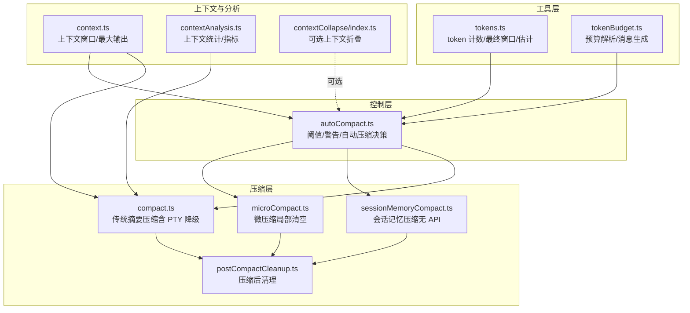
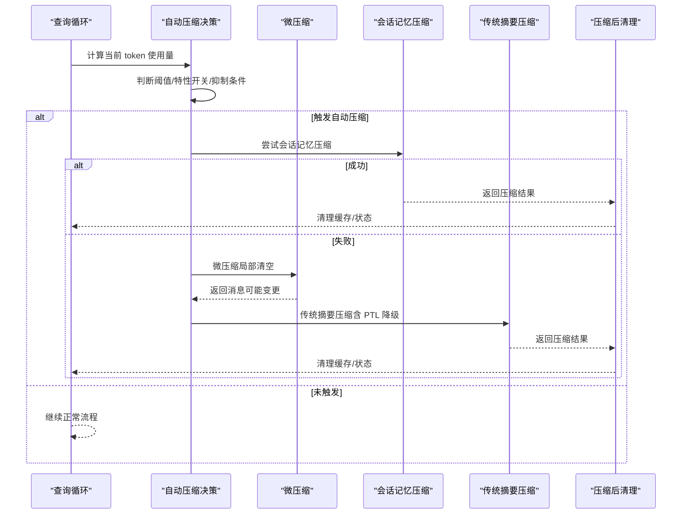
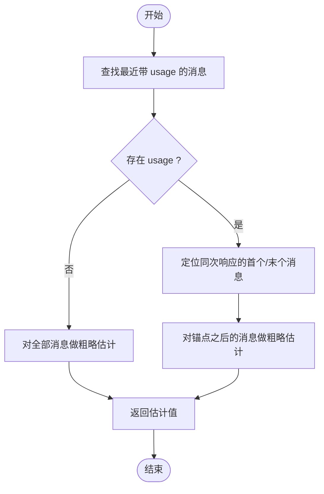
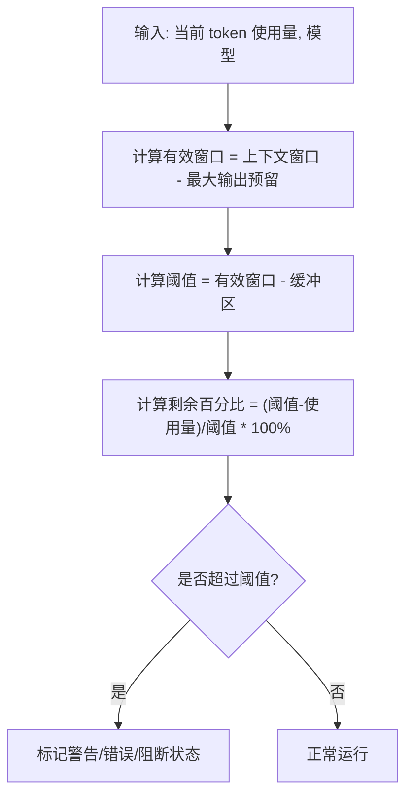
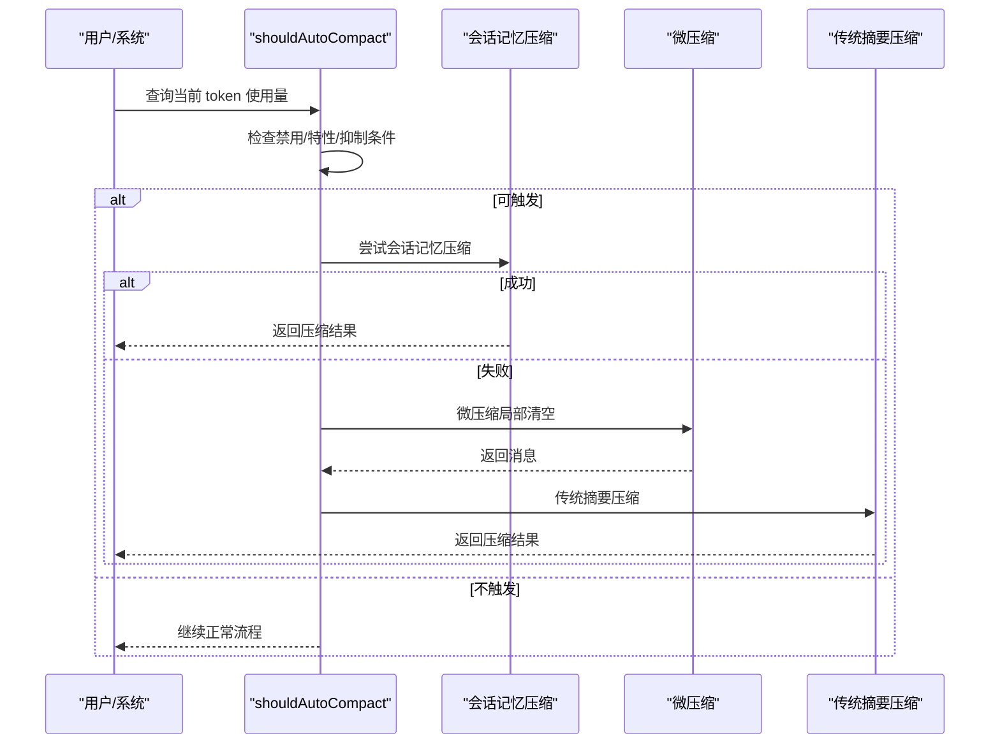
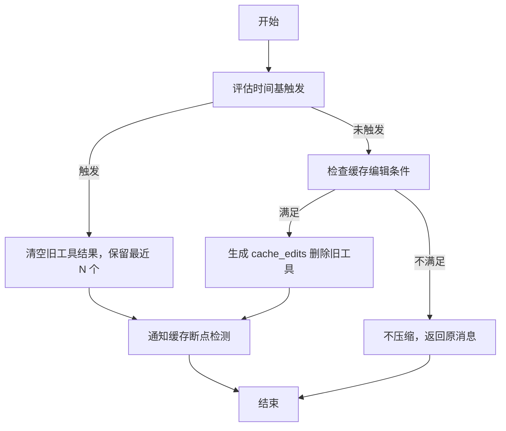
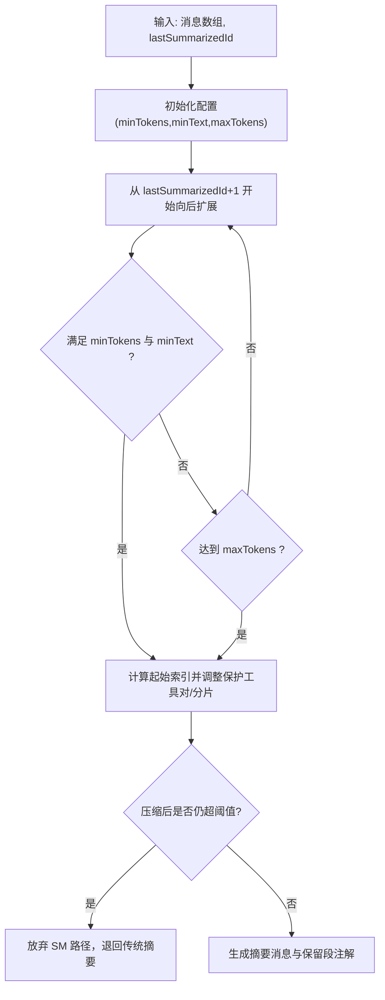
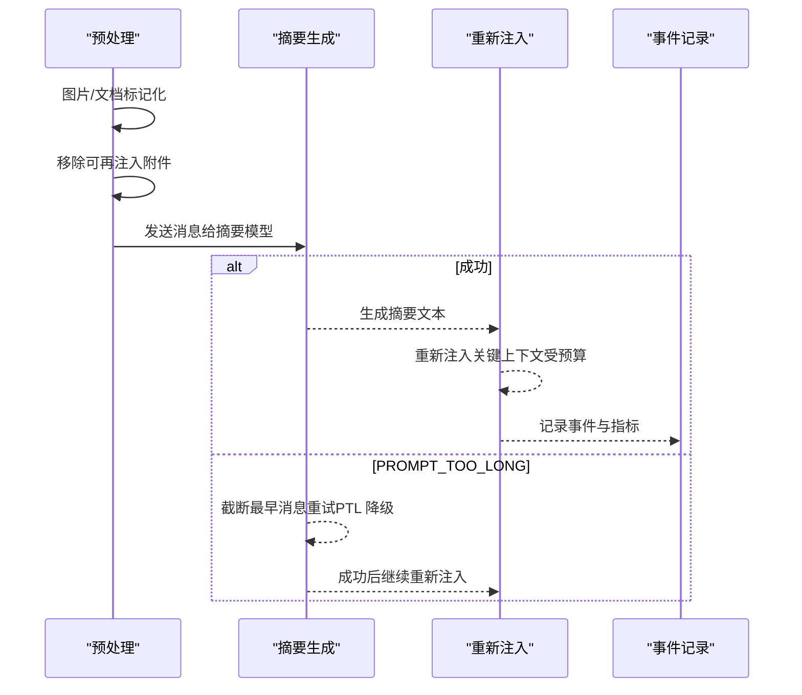
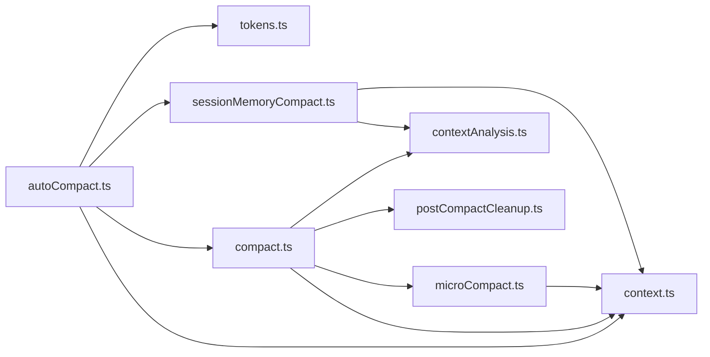

# 上下文窗口管理

<cite>
**本文引用的文件**
- [src/query/tokenBudget.ts](file://src/query/tokenBudget.ts)
- [src/utils/tokenBudget.ts](file://src/utils/tokenBudget.ts)
- [src/utils/tokens.ts](file://src/utils/tokens.ts)
- [src/services/compact/autoCompact.ts](file://src/services/compact/autoCompact.ts)
- [src/services/compact/compact.ts](file://src/services/compact/compact.ts)
- [src/services/compact/microCompact.ts](file://src/services/compact/microCompact.ts)
- [src/services/compact/sessionMemoryCompact.ts](file://src/services/compact/sessionMemoryCompact.ts)
- [src/services/compact/postCompactCleanup.ts](file://src/services/compact/postCompactCleanup.ts)
- [src/utils/context.ts](file://src/utils/context.ts)
- [src/utils/contextAnalysis.ts](file://src/utils/contextAnalysis.ts)
- [src/services/contextCollapse/index.ts](file://src/services/contextCollapse/index.ts)
- [docs/context/compaction.mdx](file://docs/context/compaction.mdx)
</cite>

## 目录
1. [简介](#简介)
2. [项目结构](#项目结构)
3. [核心组件](#核心组件)
4. [架构总览](#架构总览)
5. [详细组件分析](#详细组件分析)
6. [依赖关系分析](#依赖关系分析)
7. [性能考量](#性能考量)
8. [故障排查指南](#故障排查指南)
9. [结论](#结论)
10. [附录](#附录)

## 简介
本文件系统性阐述 Claude Code 的上下文窗口管理系统，覆盖以下主题：
- 上下文窗口的概念与限制：token 计数、窗口大小控制、预算管理
- 自动压缩机制：微压缩（MicroCompact）、会话记忆压缩（Session Memory Compact）、传统 API 摘要压缩
- token 预算跟踪与超限处理：阈值计算、警告与恢复策略
- 性能优化：缓存策略、增量更新、内存管理
- 配置项与环境变量：如何通过参数调节行为

## 项目结构
上下文窗口管理涉及多个层次：
- 工具层：token 计数与预算解析（tokens.ts、tokenBudget.ts）
- 控制层：自动压缩决策与阈值计算（autoCompact.ts）
- 压缩层：微压缩、会话记忆压缩、传统摘要压缩（microCompact.ts、sessionMemoryCompact.ts、compact.ts）
- 清理与回收：压缩后清理缓存与状态（postCompactCleanup.ts）
- 上下文与分析：模型上下文窗口、百分比统计、上下文分析（context.ts、contextAnalysis.ts）
- 可选机制：上下文折叠（contextCollapse/index.ts）

图示来源
- [src/utils/tokens.ts:230-266](file://src/utils/tokens.ts#L230-L266)
- [src/query/tokenBudget.ts:45-94](file://src/query/tokenBudget.ts#L45-L94)
- [src/services/compact/autoCompact.ts:32-91](file://src/services/compact/autoCompact.ts#L32-L91)
- [src/services/compact/microCompact.ts:253-293](file://src/services/compact/microCompact.ts#L253-L293)
- [src/services/compact/sessionMemoryCompact.ts:514-631](file://src/services/compact/sessionMemoryCompact.ts#L514-L631)
- [src/services/compact/compact.ts:389-765](file://src/services/compact/compact.ts#L389-L765)
- [src/services/compact/postCompactCleanup.ts:31-77](file://src/services/compact/postCompactCleanup.ts#L31-L77)
- [src/utils/context.ts:51-98](file://src/utils/context.ts#L51-L98)
- [src/utils/contextAnalysis.ts:27-97](file://src/utils/contextAnalysis.ts#L27-L97)
- [src/services/contextCollapse/index.ts:43-67](file://src/services/contextCollapse/index.ts#L43-L67)

章节来源
- [src/utils/tokens.ts:230-266](file://src/utils/tokens.ts#L230-L266)
- [src/services/compact/autoCompact.ts:32-91](file://src/services/compact/autoCompact.ts#L32-L91)
- [src/services/compact/compact.ts:389-765](file://src/services/compact/compact.ts#L389-L765)
- [src/services/compact/microCompact.ts:253-293](file://src/services/compact/microCompact.ts#L253-L293)
- [src/services/compact/sessionMemoryCompact.ts:514-631](file://src/services/compact/sessionMemoryCompact.ts#L514-L631)
- [src/services/compact/postCompactCleanup.ts:31-77](file://src/services/compact/postCompactCleanup.ts#L31-L77)
- [src/utils/context.ts:51-98](file://src/utils/context.ts#L51-L98)
- [src/utils/contextAnalysis.ts:27-97](file://src/utils/contextAnalysis.ts#L27-L97)
- [src/services/contextCollapse/index.ts:43-67](file://src/services/contextCollapse/index.ts#L43-L67)

## 核心组件
- token 计数与估计
  - 使用最近一次 API usage 的输入/输出/缓存 token 作为基准，并对新增消息进行粗略估计，避免累计计数导致的“双计”问题。
  - 提供最终窗口大小（考虑迭代次数）与仅输出 token 的测量方法，用于不同场景。
- 上下文窗口与预算
  - 有效上下文窗口 = 模型上下文窗口 - 最大输出 token 预留；支持环境变量覆盖与特性开关。
  - 自动压缩阈值 = 有效窗口 - 缓冲区；提供警告/错误阈值与阻断阈值。
- 自动压缩决策
  - 在查询循环中根据当前 token 使用量与阈值判断是否触发自动压缩；抑制条件包括：禁用标志、反应式模式、上下文折叠模式、会话记忆路径等。
- 三层压缩策略
  - 微压缩：局部清空旧工具输出，不调用摘要模型。
  - 会话记忆压缩：基于已提取的会话记忆生成摘要，不调用摘要模型。
  - 传统摘要压缩：调用摘要模型生成摘要，支持 PTL 紧急降级与重试。
- 压缩后清理
  - 清理微压缩状态、上下文折叠状态、用户上下文缓存、分类器审批、Beta 会话追踪、会话消息缓存等，释放内存并避免污染。

章节来源
- [src/utils/tokens.ts:48-114](file://src/utils/tokens.ts#L48-L114)
- [src/utils/context.ts:51-98](file://src/utils/context.ts#L51-L98)
- [src/services/compact/autoCompact.ts:32-145](file://src/services/compact/autoCompact.ts#L32-L145)
- [src/services/compact/microCompact.ts:253-293](file://src/services/compact/microCompact.ts#L253-L293)
- [src/services/compact/sessionMemoryCompact.ts:514-631](file://src/services/compact/sessionMemoryCompact.ts#L514-L631)
- [src/services/compact/compact.ts:389-765](file://src/services/compact/compact.ts#L389-L765)
- [src/services/compact/postCompactCleanup.ts:31-77](file://src/services/compact/postCompactCleanup.ts#L31-L77)

## 架构总览
上下文窗口管理贯穿“观测—决策—压缩—清理”的闭环：
- 观测：通过 token 计数与估计获取当前上下文占用。
- 决策：根据阈值与特性开关决定是否自动压缩。
- 压缩：按优先级选择微压缩/会话记忆压缩/传统摘要压缩。
- 清理：压缩后统一清理缓存与状态，避免泄漏。

图示来源
- [src/services/compact/autoCompact.ts:160-239](file://src/services/compact/autoCompact.ts#L160-L239)
- [src/services/compact/microCompact.ts:253-293](file://src/services/compact/microCompact.ts#L253-L293)
- [src/services/compact/sessionMemoryCompact.ts:514-631](file://src/services/compact/sessionMemoryCompact.ts#L514-L631)
- [src/services/compact/compact.ts:389-765](file://src/services/compact/compact.ts#L389-L765)
- [src/services/compact/postCompactCleanup.ts:31-77](file://src/services/compact/postCompactCleanup.ts#L31-L77)

## 详细组件分析

### 组件一：token 计数与预算
- 核心函数
  - tokenCountWithEstimation：以最近一次带 usage 的消息为锚点，向前估计新增消息的 token 数，避免累计计数误差。
  - finalContextTokensFromLastResponse：依据 usage.iterations[-1] 获取最终窗口大小，兼容服务端工具循环场景。
  - messageTokenCountFromLastAPIResponse：仅统计输出 token，用于衡量模型单次输出规模。
  - tokenCountFromLastAPIResponse：统计输入/输出/缓存 token 总和，用于 API 响应级别的上下文度量。
- 预算解析
  - parseTokenBudget/findTokenBudgetPositions：支持“+Xk/+Xm/+Xb”与“use/spend X tokens”等格式，便于在提示词中声明预算。
  - getBudgetContinuationMessage：生成继续工作的提示语句，避免模型在接近预算时过早总结。

图示来源
- [src/utils/tokens.ts:230-266](file://src/utils/tokens.ts#L230-L266)

章节来源
- [src/utils/tokens.ts:48-114](file://src/utils/tokens.ts#L48-L114)
- [src/utils/tokens.ts:230-266](file://src/utils/tokens.ts#L230-L266)
- [src/utils/tokenBudget.ts:21-74](file://src/utils/tokenBudget.ts#L21-L74)

### 组件二：上下文窗口与阈值计算
- 上下文窗口
  - getContextWindowForModel：综合环境变量、特性开关、能力检测与客户端配置，确定模型上下文窗口；支持 1M 上下文检测与禁用。
  - getEffectiveContextWindowSize：在上下文窗口基础上扣除最大输出 token 预留，得到有效窗口。
- 阈值与警告
  - calculateTokenWarningState：计算剩余百分比、是否超过警告/错误/自动压缩/阻断阈值；支持测试覆盖与阻断阈值覆盖。
  - isAutoCompactEnabled：综合环境变量与用户设置，决定是否启用自动压缩。

图示来源
- [src/utils/context.ts:51-98](file://src/utils/context.ts#L51-L98)
- [src/services/compact/autoCompact.ts:32-145](file://src/services/compact/autoCompact.ts#L32-L145)

章节来源
- [src/utils/context.ts:51-98](file://src/utils/context.ts#L51-L98)
- [src/services/compact/autoCompact.ts:32-145](file://src/services/compact/autoCompact.ts#L32-L145)

### 组件三：自动压缩决策与触发
- 触发条件
  - isAutoCompactEnabled：禁用标志、用户设置。
  - shouldAutoCompact：排除会话记忆/压缩子代理/反应式模式/上下文折叠模式；结合 tokenCountWithEstimation 与阈值判断。
- 行为与保护
  - circuit breaker：连续失败超过阈值则停止重试，避免无效 API 调用。
  - 优先级：会话记忆压缩优先；否则微压缩；最后传统摘要压缩。
  - 与上下文折叠互斥：在折叠开启时抑制自动压缩，避免竞争。

图示来源
- [src/services/compact/autoCompact.ts:160-239](file://src/services/compact/autoCompact.ts#L160-L239)
- [src/services/compact/sessionMemoryCompact.ts:514-631](file://src/services/compact/sessionMemoryCompact.ts#L514-L631)
- [src/services/compact/microCompact.ts:253-293](file://src/services/compact/microCompact.ts#L253-L293)
- [src/services/compact/compact.ts:389-765](file://src/services/compact/compact.ts#L389-L765)

章节来源
- [src/services/compact/autoCompact.ts:160-239](file://src/services/compact/autoCompact.ts#L160-L239)
- [src/services/compact/compact.ts:389-765](file://src/services/compact/compact.ts#L389-L765)

### 组件四：微压缩（MicroCompact）
- 目标：对单个工具输出过长的情况进行局部清空，不调用摘要模型。
- 触发路径
  - 时间基触发：当距离上次主循环助手消息的时间超过阈值时，清空旧工具结果，保留最近 N 个。
  - 缓存编辑触发：在支持的模型与主线程场景下，通过 cache edits 在不破坏前缀的前提下删除旧工具结果。
- 保护措施
  - 工具对完整性：确保 tool_result 与 tool_use 配对不被切分。
  - 缓存一致性：变更提示内容后通知缓存断点检测，避免误报。

图示来源
- [src/services/compact/microCompact.ts:422-531](file://src/services/compact/microCompact.ts#L422-L531)
- [src/services/compact/microCompact.ts:305-399](file://src/services/compact/microCompact.ts#L305-L399)

章节来源
- [src/services/compact/microCompact.ts:422-531](file://src/services/compact/microCompact.ts#L422-L531)
- [src/services/compact/microCompact.ts:305-399](file://src/services/compact/microCompact.ts#L305-L399)

### 组件五：会话记忆压缩（Session Memory Compact）
- 目标：基于已提取的会话记忆生成摘要，无需调用摘要模型。
- 保留窗口策略
  - 从 lastSummarizedMessageId 开始向后扩展，满足最小 token 数与最小文本块消息数，且不超过最大 token 上限。
  - 保护工具对与 thinking 分片：调整起始索引，避免切分配对。
- 阈值检查：若压缩后仍超过自动压缩阈值，则放弃该路径，退回传统摘要压缩。

图示来源
- [src/services/compact/sessionMemoryCompact.ts:324-397](file://src/services/compact/sessionMemoryCompact.ts#L324-L397)
- [src/services/compact/sessionMemoryCompact.ts:514-631](file://src/services/compact/sessionMemoryCompact.ts#L514-L631)

章节来源
- [src/services/compact/sessionMemoryCompact.ts:324-397](file://src/services/compact/sessionMemoryCompact.ts#L324-L397)
- [src/services/compact/sessionMemoryCompact.ts:514-631](file://src/services/compact/sessionMemoryCompact.ts#L514-L631)

### 组件六：传统摘要压缩（含 PTL 紧急降级）
- 预处理
  - stripImagesFromMessages：将图片/文档替换为标记，避免摘要 API 本身触发 prompt-too-long。
  - stripReinjectedAttachments：移除会被重新注入的附件，减少冗余。
- 摘要生成
  - 调用摘要模型生成对话摘要；支持多次重试与 PTL 紧急降级。
- 重新注入
  - 压缩后从摘要中重新注入关键上下文（文件片段、技能、MCP 指令等），受预算约束。
- 事件与指标
  - 记录压缩事件、输入/输出/缓存 token、是否重触发等指标，便于分析与优化。

图示来源
- [src/services/compact/compact.ts:147-202](file://src/services/compact/compact.ts#L147-L202)
- [src/services/compact/compact.ts:389-765](file://src/services/compact/compact.ts#L389-L765)

章节来源
- [src/services/compact/compact.ts:147-202](file://src/services/compact/compact.ts#L147-L202)
- [src/services/compact/compact.ts:389-765](file://src/services/compact/compact.ts#L389-L765)

### 组件七：压缩后清理与状态回收
- 清理范围
  - 微压缩状态、上下文折叠状态、用户上下文缓存、分类器审批、Beta 会话追踪、会话消息缓存等。
  - 区分主线程与子代理（agent:*）场景，避免污染主进程模块级状态。
- 目的
  - 释放内存、避免缓存污染、确保后续查询的准确性。

章节来源
- [src/services/compact/postCompactCleanup.ts:31-77](file://src/services/compact/postCompactCleanup.ts#L31-L77)

### 组件八：上下文分析与可视化
- analyzeContext：对消息进行归一化后统计各类内容的 token 分布，识别重复文件读取等浪费。
- tokenStatsToStatsigMetrics：将统计结果映射为可观测指标，辅助分析与优化。

章节来源
- [src/utils/contextAnalysis.ts:27-97](file://src/utils/contextAnalysis.ts#L27-L97)
- [src/utils/contextAnalysis.ts:195-272](file://src/utils/contextAnalysis.ts#L195-L272)

## 依赖关系分析
- 模块耦合
  - autoCompact.ts 依赖 tokens.ts（token 计数）、context.ts（上下文窗口）、compact.ts（传统摘要）、sessionMemoryCompact.ts（会话记忆压缩）。
  - compact.ts 依赖 microCompact.ts（微压缩）、context.ts（上下文窗口）、contextAnalysis.ts（统计）、postCompactCleanup.ts（清理）。
  - microCompact.ts 与 sessionMemoryCompact.ts 独立运作，分别面向局部与全局压缩场景。
- 外部依赖
  - 特性开关（feature）与环境变量（DISABLE_COMPACT/DISABLE_AUTO_COMPACT/CLAUDE_CODE_AUTO_COMPACT_WINDOW 等）影响行为。
  - 上下文折叠（contextCollapse）与反应式压缩（reactiveCompact）为可选机制，与自动压缩存在互斥与协作关系。

图示来源
- [src/services/compact/autoCompact.ts:1-352](file://src/services/compact/autoCompact.ts#L1-L352)
- [src/services/compact/compact.ts:1-800](file://src/services/compact/compact.ts#L1-L800)
- [src/services/compact/microCompact.ts:1-531](file://src/services/compact/microCompact.ts#L1-L531)
- [src/services/compact/sessionMemoryCompact.ts:1-631](file://src/services/compact/sessionMemoryCompact.ts#L1-L631)
- [src/services/compact/postCompactCleanup.ts:1-78](file://src/services/compact/postCompactCleanup.ts#L1-L78)
- [src/utils/context.ts:1-222](file://src/utils/context.ts#L1-L222)
- [src/utils/contextAnalysis.ts:1-273](file://src/utils/contextAnalysis.ts#L1-L273)

章节来源
- [src/services/compact/autoCompact.ts:1-352](file://src/services/compact/autoCompact.ts#L1-L352)
- [src/services/compact/compact.ts:1-800](file://src/services/compact/compact.ts#L1-L800)
- [src/services/compact/microCompact.ts:1-531](file://src/services/compact/microCompact.ts#L1-L531)
- [src/services/compact/sessionMemoryCompact.ts:1-631](file://src/services/compact/sessionMemoryCompact.ts#L1-L631)
- [src/services/compact/postCompactCleanup.ts:1-78](file://src/services/compact/postCompactCleanup.ts#L1-L78)
- [src/utils/context.ts:1-222](file://src/utils/context.ts#L1-L222)
- [src/utils/contextAnalysis.ts:1-273](file://src/utils/contextAnalysis.ts#L1-L273)

## 性能考量
- 缓存策略
  - 微压缩支持缓存编辑（cache edits），在不破坏前缀的前提下删除旧工具结果，显著降低写入成本。
  - 会话记忆压缩避免调用摘要模型，减少 API 调用与缓存创建开销。
- 增量更新
  - token 计数以最近一次 usage 为锚点，仅对新增消息进行估计，避免全量重算。
- 内存管理
  - 压缩后统一清理缓存与状态，防止长期运行导致的内存泄漏。
- 阈值与缓冲
  - 通过缓冲区与阻断阈值提前预警，避免频繁触发压缩；自动压缩阈值与阻断阈值可由环境变量覆盖，便于测试与调试。

## 故障排查指南
- 自动压缩未触发
  - 检查禁用标志（DISABLE_COMPACT/DISABLE_AUTO_COMPACT）、用户设置、特性开关、抑制条件（反应式模式/上下文折叠/会话记忆路径）。
  - 使用日志与调试输出确认 token 计数与阈值计算。
- PROMPT_TOO_LONG
  - 传统摘要压缩失败时，系统会尝试 PTL 紧急降级（截断最早消息）；若仍失败，建议手动触发 /compact 或调整会话内容。
- 缓存断点误报
  - 微压缩或时间基触发会改变提示内容，需通知缓存断点检测，避免误判为外部断点。
- 会话记忆压缩失败
  - 检查 lastSummarizedMessageId 是否存在于当前消息中；若不存在或模板为空，将退回传统摘要路径。

章节来源
- [src/services/compact/autoCompact.ts:160-239](file://src/services/compact/autoCompact.ts#L160-L239)
- [src/services/compact/compact.ts:245-293](file://src/services/compact/compact.ts#L245-L293)
- [src/services/compact/microCompact.ts:507-531](file://src/services/compact/microCompact.ts#L507-L531)
- [src/services/compact/sessionMemoryCompact.ts:514-631](file://src/services/compact/sessionMemoryCompact.ts#L514-L631)

## 结论
Claude Code 的上下文窗口管理通过“观测—决策—压缩—清理”的闭环，实现了对高 token 使用场景的稳健应对。自动压缩以三层策略递进：微压缩（局部清空）、会话记忆压缩（无 API）、传统摘要压缩（含 PTL 降级）。配合阈值计算、预算解析、缓存策略与清理机制，系统在保证对话连贯性的同时，有效控制上下文膨胀风险。

## 附录
- 关键配置项与环境变量
  - DISABLE_COMPACT/DISABLE_AUTO_COMPACT：禁用压缩或仅禁用自动压缩
  - CLAUDE_CODE_AUTO_COMPACT_WINDOW：覆盖有效上下文窗口
  - CLAUDE_CODE_BLOCKING_LIMIT_OVERRIDE：覆盖阻断阈值
  - ENABLE_CLAUDE_CODE_SM_COMPACT/DISABLE_CLAUDE_CODE_SM_COMPACT：启用/禁用会话记忆压缩
  - CLAUDE_CODE_MAX_CONTEXT_TOKENS：强制上下文窗口上限
  - CLAUDE_CODE_DISABLE_1M_CONTEXT：禁用 1M 上下文
  - CLAUDE_AUTOCOMPACT_PCT_OVERRIDE：测试用自动压缩百分比覆盖
- 相关文档
  - [上下文压缩 - Compaction 三层策略与边界机制](file://docs/context/compaction.mdx)

章节来源
- [docs/context/compaction.mdx:1-240](file://docs/context/compaction.mdx#L1-L240)