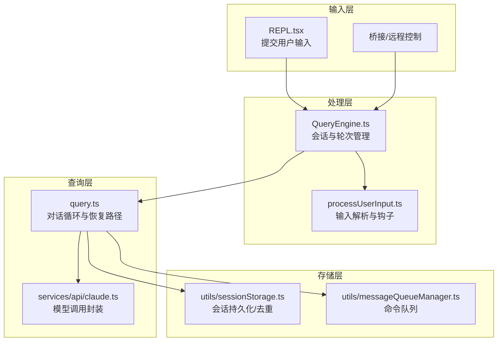
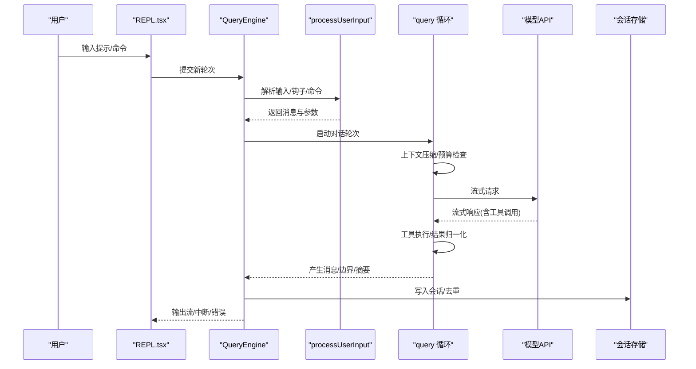
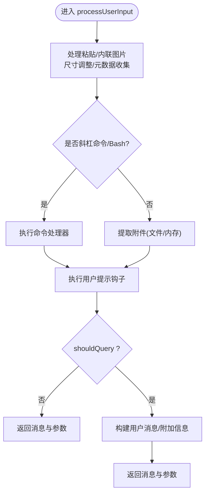
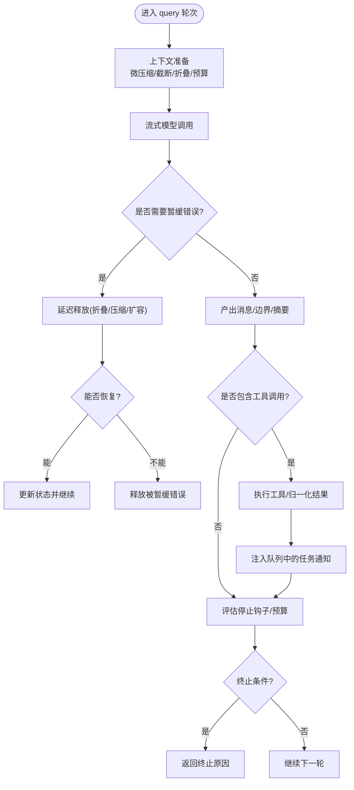
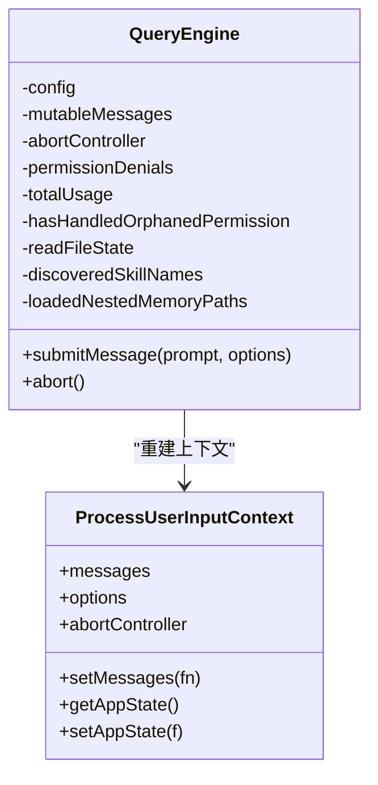
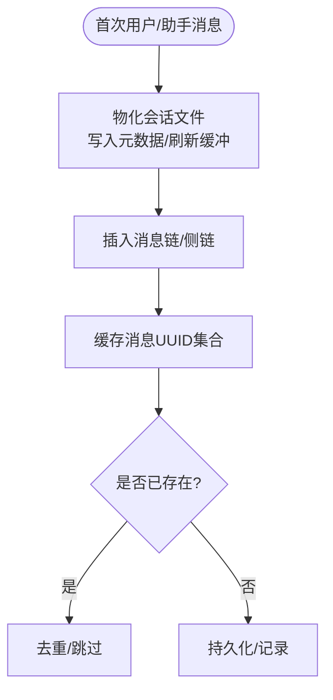
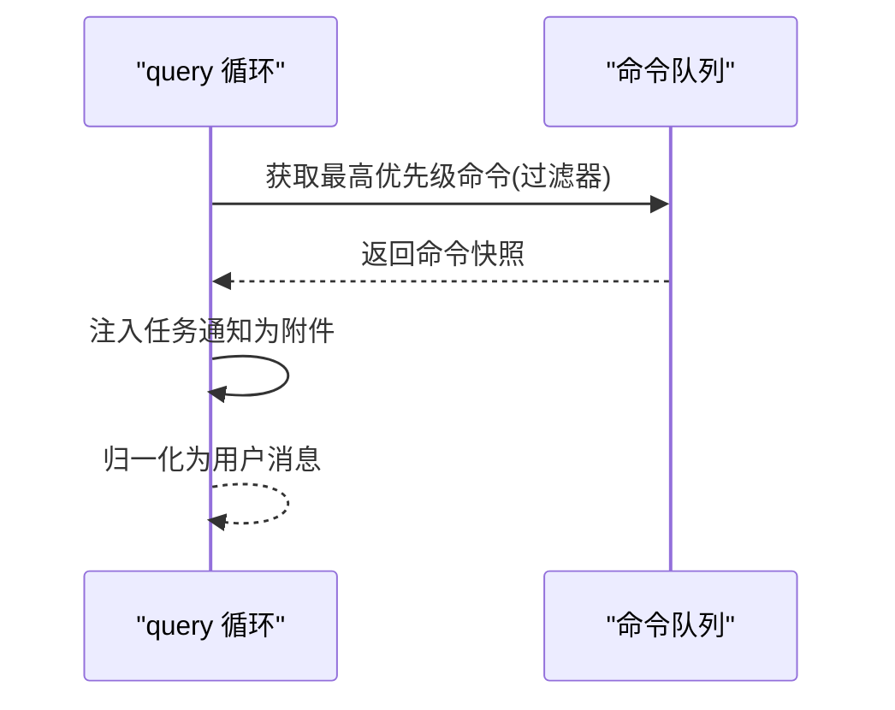
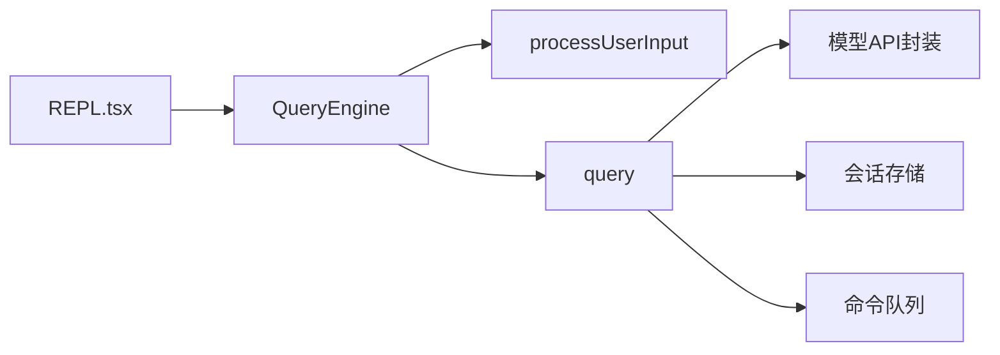

# 对话循环机制

<cite>
**本文引用的文件**
- [src/query.ts](file://src/query.ts)
- [src/utils/processUserInput/processUserInput.ts](file://src/utils/processUserInput/processUserInput.ts)
- [src/QueryEngine.ts](file://src/QueryEngine.ts)
- [src/utils/sessionStorage.ts](file://src/utils/sessionStorage.ts)
- [src/utils/messageQueueManager.ts](file://src/utils/messageQueueManager.ts)
- [src/services/api/claude.ts](file://src/services/api/claude.ts)
- [src/screens/REPL.tsx](file://src/screens/REPL.tsx)
- [docs/conversation/the-loop.mdx](file://docs/conversation/the-loop.mdx)
</cite>

## 目录
1. [引言](#引言)
2. [项目结构](#项目结构)
3. [核心组件](#核心组件)
4. [架构总览](#架构总览)
5. [详细组件分析](#详细组件分析)
6. [依赖关系分析](#依赖关系分析)
7. [性能考量](#性能考量)
8. [故障排查指南](#故障排查指南)
9. [结论](#结论)
10. [附录](#附录)

## 引言
本文件系统性阐述 Claude Code 的“对话循环”机制，覆盖从用户输入到模型交互、工具调用与输出生成的完整流程。重点解析以下关键点：
- 用户输入处理：processUserInput 的工作原理，包括输入验证、命令解析、工具匹配、权限检查、钩子执行等。
- 消息构建与查询：query 函数的核心逻辑，包括消息构建、上下文管理、流式响应处理、错误回收与恢复。
- 对话状态管理：消息队列、会话持久化、错误处理与预算控制。
- 实现示例与调试方法：通过图示与来源定位帮助开发者快速理解内部机制。

## 项目结构
对话循环涉及多个层次的模块协作：
- 输入层：REPL 界面与桥接入口负责接收用户输入，并调用 QueryEngine 提交新轮次。
- 处理层：processUserInput 负责解析用户输入、提取附件、执行钩子与命令处理。
- 查询层：query 函数驱动一次完整的对话轮次，包含上下文压缩、模型调用、工具执行、停止钩子与恢复路径。
- 存储层：会话持久化与消息去重，确保长会话稳定与可恢复。
- 队列层：统一命令队列保障任务通知与用户输入的有序处理。

**图表来源**
- [src/screens/REPL.tsx:3998-4023](file://src/screens/REPL.tsx#L3998-L4023)
- [src/QueryEngine.ts:186-200](file://src/QueryEngine.ts#L186-L200)
- [src/utils/processUserInput/processUserInput.ts:85-170](file://src/utils/processUserInput/processUserInput.ts#L85-L170)
- [src/query.ts:219-239](file://src/query.ts#L219-L239)
- [src/services/api/claude.ts:710-751](file://src/services/api/claude.ts#L710-L751)
- [src/utils/sessionStorage.ts:972-991](file://src/utils/sessionStorage.ts#L972-L991)
- [src/utils/messageQueueManager.ts:53-117](file://src/utils/messageQueueManager.ts#L53-L117)

**章节来源**
- [src/screens/REPL.tsx:3998-4023](file://src/screens/REPL.tsx#L3998-L4023)
- [src/QueryEngine.ts:186-200](file://src/QueryEngine.ts#L186-L200)
- [src/utils/processUserInput/processUserInput.ts:85-170](file://src/utils/processUserInput/processUserInput.ts#L85-L170)
- [src/query.ts:219-239](file://src/query.ts#L219-L239)
- [src/services/api/claude.ts:710-751](file://src/services/api/claude.ts#L710-L751)
- [src/utils/sessionStorage.ts:972-991](file://src/utils/sessionStorage.ts#L972-L991)
- [src/utils/messageQueueManager.ts:53-117](file://src/utils/messageQueueManager.ts#L53-L117)

## 核心组件
- QueryEngine：承载一次会话的生命周期，维护消息、权限、用量与中止控制器，协调 processUserInput 与 query。
- processUserInput：解析用户输入，处理图片、附件、斜杠命令、钩子与权限模式，产出消息数组与后续参数。
- query：对话主循环，负责上下文压缩、模型调用、工具执行、流式处理、错误回收与多条恢复路径。
- 会话存储：在首次用户/助手消息出现时物化会话文件，支持重复消息去重与侧链写入。
- 命令队列：统一管理用户输入、任务通知与孤儿权限，按优先级与作用域调度。

**章节来源**
- [src/QueryEngine.ts:186-200](file://src/QueryEngine.ts#L186-L200)
- [src/utils/processUserInput/processUserInput.ts:85-170](file://src/utils/processUserInput/processUserInput.ts#L85-L170)
- [src/query.ts:219-239](file://src/query.ts#L219-L239)
- [src/utils/sessionStorage.ts:972-991](file://src/utils/sessionStorage.ts#L972-L991)
- [src/utils/messageQueueManager.ts:53-117](file://src/utils/messageQueueManager.ts#L53-L117)

## 架构总览
对话循环以 QueryEngine 为中心，围绕 processUserInput 与 query 展开。其关键交互如下：

**图表来源**
- [src/screens/REPL.tsx:3998-4023](file://src/screens/REPL.tsx#L3998-L4023)
- [src/QueryEngine.ts:338-431](file://src/QueryEngine.ts#L338-L431)
- [src/utils/processUserInput/processUserInput.ts:85-170](file://src/utils/processUserInput/processUserInput.ts#L85-L170)
- [src/query.ts:241-280](file://src/query.ts#L241-L280)
- [src/services/api/claude.ts:710-751](file://src/services/api/claude.ts#L710-L751)
- [src/utils/sessionStorage.ts:972-991](file://src/utils/sessionStorage.ts#L972-L991)

## 详细组件分析

### processUserInput：用户输入处理与命令解析
processUserInput 的职责包括：
- 输入预处理：对图片内容进行尺寸调整与元数据收集；对粘贴图像进行并行处理与存储。
- 命令解析：识别斜杠命令与 Bash 命令，必要时桥接安全命令绕过 skipSlashCommands。
- 钩子执行：在提交前执行用户提示钩子，支持阻断、附加上下文与进度反馈。
- 附件提取：根据模式与上下文提取文件/内存附件，注入到消息中。
- 结果组装：生成用户消息、系统消息、进度消息或直接返回不触发查询的结果。

**图表来源**
- [src/utils/processUserInput/processUserInput.ts:85-170](file://src/utils/processUserInput/processUserInput.ts#L85-L170)
- [src/utils/processUserInput/processUserInput.ts:281-589](file://src/utils/processUserInput/processUserInput.ts#L281-L589)

**章节来源**
- [src/utils/processUserInput/processUserInput.ts:85-170](file://src/utils/processUserInput/processUserInput.ts#L85-L170)
- [src/utils/processUserInput/processUserInput.ts:281-589](file://src/utils/processUserInput/processUserInput.ts#L281-L589)

### query：对话轮次与恢复路径
query 是对话主循环，主要流程包括：
- 初始化与配置：构建查询配置、启动内存/技能预取、记录查询链 ID。
- 上下文准备：应用微压缩、历史截断、上下文折叠；计算任务预算剩余；应用工具结果预算。
- 模型调用：流式请求模型，按块回填工具输入；对流式回退进行墓碑清理与执行器重建。
- 流式处理：延迟/豁免特定错误（如 413、媒体过大、最大输出令牌），在恢复路径后统一释放。
- 工具执行：使用 StreamingToolExecutor 或批量执行工具，归一化用户消息作为工具结果。
- 停止钩子与预算：在无工具调用时评估停止钩子；在开启预算时按阈值决定继续或完成。
- 恢复路径：针对 413/媒体过大/最大输出令牌等错误，尝试上下文折叠排水、反应式压缩、扩大输出令牌上限等策略。
- 终止条件：完成、阻断限制、流中断、模型错误、提示过长、图片错误、停止钩子阻止等。

**图表来源**
- [src/query.ts:241-280](file://src/query.ts#L241-L280)
- [src/query.ts:652-708](file://src/query.ts#L652-L708)
- [src/query.ts:800-866](file://src/query.ts#L800-L866)
- [src/query.ts:1065-1361](file://src/query.ts#L1065-L1361)
- [docs/conversation/the-loop.mdx:68-87](file://docs/conversation/the-loop.mdx#L68-L87)

**章节来源**
- [src/query.ts:241-280](file://src/query.ts#L241-L280)
- [src/query.ts:652-708](file://src/query.ts#L652-L708)
- [src/query.ts:800-866](file://src/query.ts#L800-L866)
- [src/query.ts:1065-1361](file://src/query.ts#L1065-L1361)
- [docs/conversation/the-loop.mdx:68-87](file://docs/conversation/the-loop.mdx#L68-L87)

### QueryEngine：会话与轮次编排
QueryEngine 负责：
- 维护 mutableMessages、中止控制器、权限拒绝记录与用量统计。
- 在提交消息前后重建 processUserInput 上下文，确保命令与钩子生效。
- 处理孤儿权限提示、会话物化与重复消息去重。
- 协调 SDK/REPL 的状态回调与 SDK 状态上报。

**图表来源**
- [src/QueryEngine.ts:186-200](file://src/QueryEngine.ts#L186-L200)
- [src/QueryEngine.ts:338-431](file://src/QueryEngine.ts#L338-L431)

**章节来源**
- [src/QueryEngine.ts:186-200](file://src/QueryEngine.ts#L186-L200)
- [src/QueryEngine.ts:338-431](file://src/QueryEngine.ts#L338-L431)

### 会话持久化与消息去重
- 首条用户/助手消息触发会话文件物化，写入缓存元数据并刷新缓冲条目。
- 支持插入消息链、侧链写入与摘要消息生成；提供消息 UUID 缓存与去重判断。
- 会话消息 UUID 查询基于缓存，避免重复读取同一文件。

**图表来源**
- [src/utils/sessionStorage.ts:972-991](file://src/utils/sessionStorage.ts#L972-L991)
- [src/utils/sessionStorage.ts:3843-3868](file://src/utils/sessionStorage.ts#L3843-L3868)

**章节来源**
- [src/utils/sessionStorage.ts:972-991](file://src/utils/sessionStorage.ts#L972-L991)
- [src/utils/sessionStorage.ts:3843-3868](file://src/utils/sessionStorage.ts#L3843-L3868)

### 命令队列与任务通知
- 统一命令队列支持 now/next/later 优先级，按 FIFO 与过滤器选择。
- 在工具执行阶段注入队列中的任务通知，避免与斜杠命令混入模型文本。
- 主线程与子代理分别按 agentId 过滤，确保消息路由正确。

**图表来源**
- [src/query.ts:1573-1581](file://src/query.ts#L1573-L1581)
- [src/utils/messageQueueManager.ts:167-193](file://src/utils/messageQueueManager.ts#L167-L193)

**章节来源**
- [src/query.ts:1573-1581](file://src/query.ts#L1573-L1581)
- [src/utils/messageQueueManager.ts:167-193](file://src/utils/messageQueueManager.ts#L167-L193)

## 依赖关系分析
- QueryEngine 依赖 processUserInput 与 query，同时与会话存储、命令队列与模型 API 交互。
- query 依赖上下文压缩、工具执行器、停止钩子与预算控制，形成闭环。
- REPL 作为入口，负责创建中止控制器与调用 QueryEngine。

**图表来源**
- [src/screens/REPL.tsx:3998-4023](file://src/screens/REPL.tsx#L3998-L4023)
- [src/QueryEngine.ts:338-431](file://src/QueryEngine.ts#L338-L431)
- [src/query.ts:241-280](file://src/query.ts#L241-L280)
- [src/services/api/claude.ts:710-751](file://src/services/api/claude.ts#L710-L751)
- [src/utils/sessionStorage.ts:972-991](file://src/utils/sessionStorage.ts#L972-L991)
- [src/utils/messageQueueManager.ts:53-117](file://src/utils/messageQueueManager.ts#L53-L117)

**章节来源**
- [src/screens/REPL.tsx:3998-4023](file://src/screens/REPL.tsx#L3998-L4023)
- [src/QueryEngine.ts:338-431](file://src/QueryEngine.ts#L338-L431)
- [src/query.ts:241-280](file://src/query.ts#L241-L280)
- [src/services/api/claude.ts:710-751](file://src/services/api/claude.ts#L710-L751)
- [src/utils/sessionStorage.ts:972-991](file://src/utils/sessionStorage.ts#L972-L991)
- [src/utils/messageQueueManager.ts:53-117](file://src/utils/messageQueueManager.ts#L53-L117)

## 性能考量
- 流式工具执行：通过 StreamingToolExecutor 并行处理工具调用，减少等待时间。
- 上下文压缩：微压缩、历史截断与上下文折叠降低 token 使用，避免阻断限制。
- 预取优化：内存与技能发现预取在模型流式期间并发运行，隐藏延迟。
- 会话物化：仅在首次用户/助手消息时物化文件，避免空转写入。
- 媒体恢复：对媒体过大错误采用反应式压缩与分层恢复，避免死循环。

[本节为通用指导，无需列出具体文件来源]

## 故障排查指南
- 模型错误：当 queryModelWithoutStreaming 抛错时，会生成合成错误消息并记录日志；注意区分用户中断与模型失败。
- 中断处理：流中断或工具中断会生成中断消息与清理（如 MCP 锁释放），并根据中断类型决定是否显示中断消息。
- 提示过长：413 错误会被暂缓，优先尝试上下文折叠排水与反应式压缩；若仍失败则释放错误并返回。
- 图片错误：图片尺寸/缩放错误会生成用户友好消息并返回。
- 停止钩子：在 API 错误或钩子阻止时，避免对无效响应进行二次评估，防止死循环。

**章节来源**
- [src/services/api/claude.ts:710-751](file://src/services/api/claude.ts#L710-L751)
- [src/query.ts:958-1000](file://src/query.ts#L958-L1000)
- [src/query.ts:1014-1055](file://src/query.ts#L1014-L1055)
- [src/query.ts:1065-1186](file://src/query.ts#L1065-L1186)
- [src/query.ts:1188-1268](file://src/query.ts#L1188-L1268)

## 结论
对话循环通过 processUserInput 与 query 的协同，实现了从输入解析、上下文管理、模型交互到工具执行与恢复路径的完整闭环。QueryEngine 作为会话编排者，结合会话存储与命令队列，确保长会话的稳定性与可恢复性。开发者可通过本文档的图示与来源定位，快速理解并调试对话循环的内部机制。

[本节为总结性内容，无需列出具体文件来源]

## 附录
- 终止与继续条件参考：见 docs/conversation/the-loop.mdx 中的“7 种终止条件”与“4 种继续条件”。

**章节来源**
- [docs/conversation/the-loop.mdx:68-87](file://docs/conversation/the-loop.mdx#L68-L87)