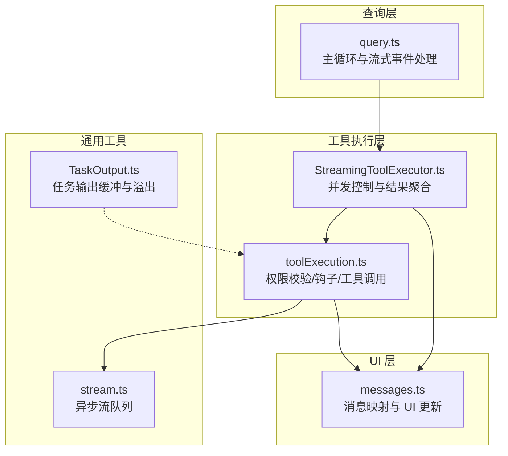
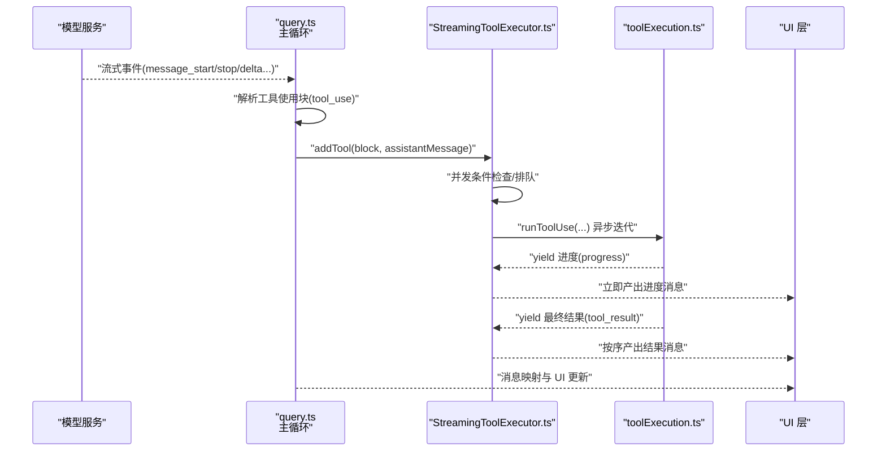
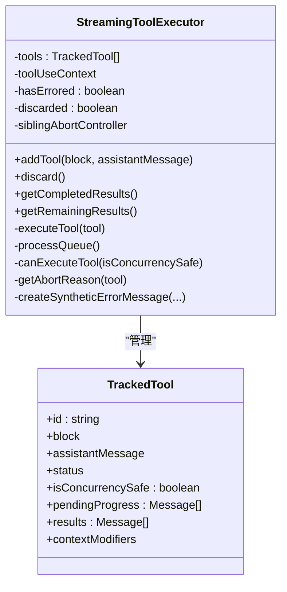
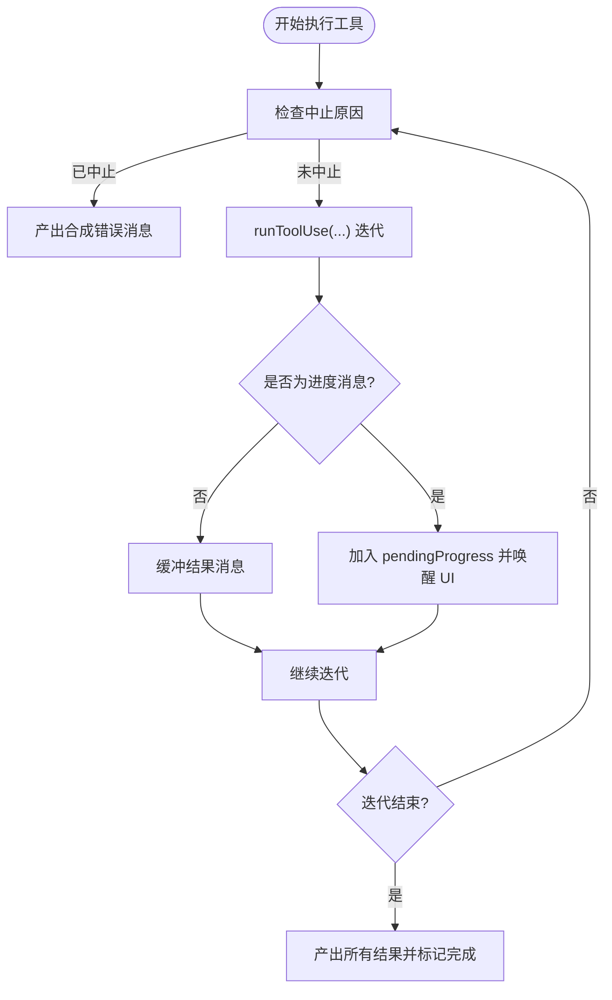
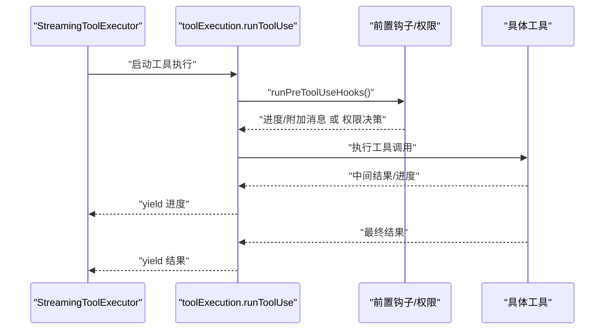
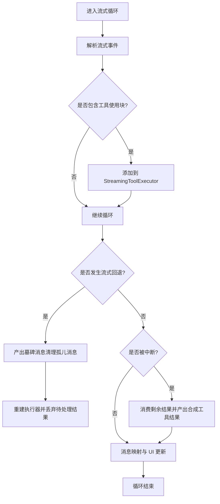
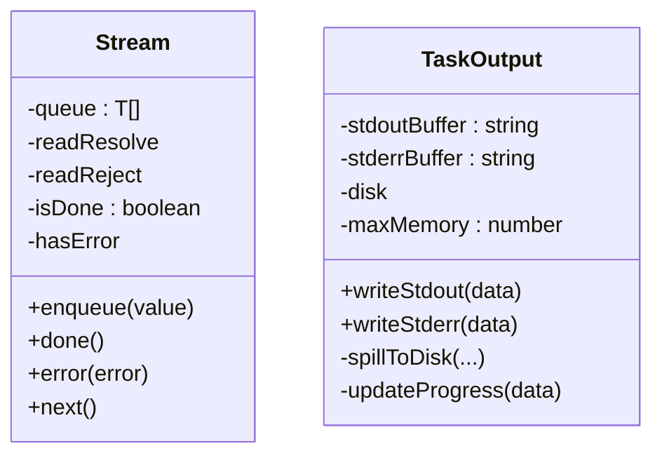
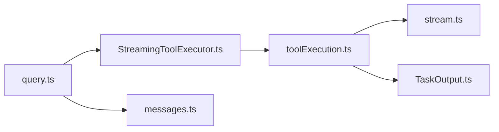

# 流式响应处理

<cite>
**本文引用的文件**
- [StreamingToolExecutor.ts](file://src/services/tools/StreamingToolExecutor.ts)
- [toolExecution.ts](file://src/services/tools/toolExecution.ts)
- [query.ts](file://src/query.ts)
- [stream.ts](file://src/utils/stream.ts)
- [messages.ts](file://src/utils/messages.ts)
- [TaskOutput.ts](file://src/utils/task/TaskOutput.ts)
- [shell-execution.mdx](file://docs/tools/shell-execution.mdx)
</cite>

## 目录
1. [简介](#简介)
2. [项目结构](#项目结构)
3. [核心组件](#核心组件)
4. [架构总览](#架构总览)
5. [详细组件分析](#详细组件分析)
6. [依赖关系分析](#依赖关系分析)
7. [性能考量](#性能考量)
8. [故障排查指南](#故障排查指南)
9. [结论](#结论)
10. [附录](#附录)

## 简介
本文件面向 Claude Code 的流式响应处理系统，系统性阐述从 API 响应到 UI 显示的完整链路：包括流式数据的接收、解析、分块处理、状态管理、并发控制、进度报告、错误恢复与中断处理；并深入解析 StreamingToolExecutor 的工作原理及其与工具执行器的协作方式，覆盖缓冲机制、背压处理与内存管理等关键技术细节。文档同时提供可操作的实现示例路径与性能优化建议，帮助开发者快速理解并高效扩展该系统。

## 项目结构
围绕流式响应处理的关键模块与文件如下：
- 查询与主循环：负责发起模型请求、接收流式事件、调度工具执行与 UI 更新
- 工具执行器：封装工具权限校验、并发安全策略、进度与结果的生成与回传
- 流式执行器：对工具调用进行排队、并发控制、顺序保证与中断传播
- 通用流工具：提供异步队列与背压支持
- UI 消息处理：将流式事件映射为 UI 可见的消息与进度

图表来源
- [query.ts:550-749](file://src/query.ts#L550-L749)
- [StreamingToolExecutor.ts:40-124](file://src/services/tools/StreamingToolExecutor.ts#L40-L124)
- [toolExecution.ts:337-490](file://src/services/tools/toolExecution.ts#L337-L490)
- [stream.ts:1-77](file://src/utils/stream.ts#L1-L77)
- [TaskOutput.ts:166-257](file://src/utils/task/TaskOutput.ts#L166-L257)
- [messages.ts:2956-3034](file://src/utils/messages.ts#L2956-L3034)

章节来源
- [query.ts:550-749](file://src/query.ts#L550-L749)
- [StreamingToolExecutor.ts:40-124](file://src/services/tools/StreamingToolExecutor.ts#L40-L124)
- [toolExecution.ts:337-490](file://src/services/tools/toolExecution.ts#L337-L490)
- [stream.ts:1-77](file://src/utils/stream.ts#L1-L77)
- [TaskOutput.ts:166-257](file://src/utils/task/TaskOutput.ts#L166-L257)
- [messages.ts:2956-3034](file://src/utils/messages.ts#L2956-L3034)

## 核心组件
- StreamingToolExecutor（流式工具执行器）
  - 负责工具的并发安全执行、顺序保证、进度与结果的缓冲与产出、中断传播与合成错误消息
  - 支持“并发安全”工具并行执行，非并发安全工具串行独占
- toolExecution（工具执行器）
  - 将工具调用包装为可流式的异步迭代器，统一产出进度与最终结果
  - 内置权限钩子、输入校验、错误分类与日志上报
- query（查询主循环）
  - 发起模型请求，消费流式事件，解析工具使用块，协调工具执行器与 UI 更新
  - 处理流式回退（fallback）场景，清理孤儿消息并重建执行器
- Stream（通用异步流）
  - 提供入队/出队、完成态与错误态的异步迭代能力，支撑工具进度与结果的背压
- TaskOutput（任务输出缓冲）
  - 面向长时间运行的工具（如 Bash），在内存与磁盘间动态切换，限制内存占用并持续产出进度

章节来源
- [StreamingToolExecutor.ts:40-124](file://src/services/tools/StreamingToolExecutor.ts#L40-L124)
- [toolExecution.ts:337-490](file://src/services/tools/toolExecution.ts#L337-L490)
- [query.ts:550-749](file://src/query.ts#L550-L749)
- [stream.ts:1-77](file://src/utils/stream.ts#L1-L77)
- [TaskOutput.ts:166-257](file://src/utils/task/TaskOutput.ts#L166-L257)

## 架构总览
下图展示了从模型流式响应到 UI 渲染的端到端流程，重点体现工具使用块的解析、并发控制、进度与结果的产出与回传。

图表来源
- [query.ts:652-749](file://src/query.ts#L652-L749)
- [StreamingToolExecutor.ts:140-405](file://src/services/tools/StreamingToolExecutor.ts#L140-L405)
- [toolExecution.ts:337-490](file://src/services/tools/toolExecution.ts#L337-L490)
- [messages.ts:2956-3034](file://src/utils/messages.ts#L2956-L3034)

章节来源
- [query.ts:652-749](file://src/query.ts#L652-L749)
- [StreamingToolExecutor.ts:140-405](file://src/services/tools/StreamingToolExecutor.ts#L140-L405)
- [toolExecution.ts:337-490](file://src/services/tools/toolExecution.ts#L337-L490)
- [messages.ts:2956-3034](file://src/utils/messages.ts#L2956-L3034)

## 详细组件分析

### StreamingToolExecutor 组件分析
StreamingToolExecutor 是流式工具执行的核心，负责：
- 并发安全策略：识别“并发安全”工具并允许与其他并发安全工具并行；非并发安全工具需独占执行
- 排队与顺序保证：严格维护工具到达顺序，确保结果按序产出
- 进度与结果缓冲：进度消息优先立即产出，结果消息在完成后按序产出
- 中断与错误传播：支持用户中断、兄弟工具错误、流式回退三种场景，生成合成错误消息
- 上下文修改：非并发安全工具可在完成后应用上下文修改器，更新执行上下文

图表来源
- [StreamingToolExecutor.ts:40-124](file://src/services/tools/StreamingToolExecutor.ts#L40-L124)
- [StreamingToolExecutor.ts:21-32](file://src/services/tools/StreamingToolExecutor.ts#L21-L32)

章节来源
- [StreamingToolExecutor.ts:40-124](file://src/services/tools/StreamingToolExecutor.ts#L40-L124)
- [StreamingToolExecutor.ts:126-151](file://src/services/tools/StreamingToolExecutor.ts#L126-L151)
- [StreamingToolExecutor.ts:265-405](file://src/services/tools/StreamingToolExecutor.ts#L265-L405)
- [StreamingToolExecutor.ts:412-490](file://src/services/tools/StreamingToolExecutor.ts#L412-L490)

#### 工具执行与进度产出流程
- 工具执行器以异步迭代器形式产出两类消息：进度与最终结果
- StreamingToolExecutor 将进度消息放入 pendingProgress 队列，立即唤醒 UI；结果消息在完成后按序产出
- 当出现兄弟工具错误或用户中断时，生成合成错误消息并终止后续执行

图表来源
- [StreamingToolExecutor.ts:332-382](file://src/services/tools/StreamingToolExecutor.ts#L332-L382)
- [StreamingToolExecutor.ts:412-440](file://src/services/tools/StreamingToolExecutor.ts#L412-L440)

章节来源
- [StreamingToolExecutor.ts:332-382](file://src/services/tools/StreamingToolExecutor.ts#L332-L382)
- [StreamingToolExecutor.ts:412-440](file://src/services/tools/StreamingToolExecutor.ts#L412-L440)

### 工具执行器（toolExecution）分析
- 输入校验与错误提示：使用 Zod 对工具输入进行类型与值校验，必要时补充“模式未发送”的提示
- 权限与钩子：前置钩子收集进度与附加信息，权限决策后决定是否允许执行
- 流式进度：通过回调将进度消息注入统一流，由上层迭代器消费
- 错误分类与日志：对不同错误进行分类与埋点，便于诊断与追踪

图表来源
- [toolExecution.ts:337-490](file://src/services/tools/toolExecution.ts#L337-L490)
- [toolExecution.ts:492-570](file://src/services/tools/toolExecution.ts#L492-L570)

章节来源
- [toolExecution.ts:337-490](file://src/services/tools/toolExecution.ts#L337-L490)
- [toolExecution.ts:492-570](file://src/services/tools/toolExecution.ts#L492-L570)

### 查询主循环（query）分析
- 流式事件解析：识别工具使用块，触发工具执行器添加工具
- 流式回退处理：当发生流式回退时，清理孤儿消息并重建执行器，防止旧 ID 的工具结果泄漏
- 中断处理：在用户中断时，消费剩余结果并生成合成工具结果，确保 UI 一致性
- UI 更新：通过消息映射函数将流式事件转换为 UI 可见的消息与进度

图表来源
- [query.ts:652-749](file://src/query.ts#L652-L749)
- [query.ts:900-956](file://src/query.ts#L900-L956)
- [query.ts:1014-1055](file://src/query.ts#L1014-L1055)
- [messages.ts:2956-3034](file://src/utils/messages.ts#L2956-L3034)

章节来源
- [query.ts:652-749](file://src/query.ts#L652-L749)
- [query.ts:900-956](file://src/query.ts#L900-L956)
- [query.ts:1014-1055](file://src/query.ts#L1014-L1055)
- [messages.ts:2956-3034](file://src/utils/messages.ts#L2956-L3034)

### 通用流工具（Stream）与任务输出缓冲（TaskOutput）
- Stream：提供单次迭代、入队/出队、完成与错误态的异步队列，用于工具进度与结果的背压
- TaskOutput：针对长时间运行的工具（如 Bash），在内存与磁盘之间动态切换，限制内存占用并持续产出最近进度

图表来源
- [stream.ts:1-77](file://src/utils/stream.ts#L1-L77)
- [TaskOutput.ts:166-257](file://src/utils/task/TaskOutput.ts#L166-L257)

章节来源
- [stream.ts:1-77](file://src/utils/stream.ts#L1-L77)
- [TaskOutput.ts:166-257](file://src/utils/task/TaskOutput.ts#L166-L257)

## 依赖关系分析
- StreamingToolExecutor 依赖工具定义、canUseTool 函数、ToolUseContext 与工具执行器
- toolExecution 依赖工具定义、canUseTool、权限钩子、工具调用与进度回调
- query 依赖 StreamingToolExecutor 与消息映射函数，负责事件解析与 UI 更新
- Stream 作为通用工具被 toolExecution 使用，TaskOutput 作为工具输出缓冲

图表来源
- [query.ts:550-749](file://src/query.ts#L550-L749)
- [StreamingToolExecutor.ts:40-124](file://src/services/tools/StreamingToolExecutor.ts#L40-L124)
- [toolExecution.ts:337-490](file://src/services/tools/toolExecution.ts#L337-L490)
- [stream.ts:1-77](file://src/utils/stream.ts#L1-L77)
- [TaskOutput.ts:166-257](file://src/utils/task/TaskOutput.ts#L166-L257)
- [messages.ts:2956-3034](file://src/utils/messages.ts#L2956-L3034)

章节来源
- [query.ts:550-749](file://src/query.ts#L550-L749)
- [StreamingToolExecutor.ts:40-124](file://src/services/tools/StreamingToolExecutor.ts#L40-L124)
- [toolExecution.ts:337-490](file://src/services/tools/toolExecution.ts#L337-L490)
- [stream.ts:1-77](file://src/utils/stream.ts#L1-L77)
- [TaskOutput.ts:166-257](file://src/utils/task/TaskOutput.ts#L166-L257)
- [messages.ts:2956-3034](file://src/utils/messages.ts#L2956-L3034)

## 性能考量
- 并发策略
  - 并发安全工具并行执行，显著提升吞吐；非并发安全工具串行，避免资源竞争
  - 兄弟工具错误会触发“兄弟中止控制器”，快速终止相关子进程，降低无效开销
- 背压与缓冲
  - 使用 Stream 实现异步队列，避免忙等待；进度消息优先产出，减少 UI 等待
  - TaskOutput 在内存不足时自动溢出至磁盘，限制峰值内存占用
- UI 更新节流
  - 工具进度存在节流与 LRU 记忆，避免高频更新导致 UI 卡顿
- 回退与中断
  - 流式回退时清理孤儿消息并重建执行器，避免重复与错配
  - 用户中断时消费剩余结果并产出合成工具结果，保证 UI 一致性

章节来源
- [StreamingToolExecutor.ts:126-151](file://src/services/tools/StreamingToolExecutor.ts#L126-L151)
- [StreamingToolExecutor.ts:354-364](file://src/services/tools/StreamingToolExecutor.ts#L354-L364)
- [stream.ts:1-77](file://src/utils/stream.ts#L1-L77)
- [TaskOutput.ts:166-257](file://src/utils/task/TaskOutput.ts#L166-L257)
- [query.ts:708-741](file://src/query.ts#L708-L741)
- [query.ts:1014-1055](file://src/query.ts#L1014-L1055)

## 故障排查指南
- 流式回退
  - 现象：流式事件被中断，随后出现墓碑消息清理历史消息
  - 处理：确认回退触发条件（如模型不可用），重建执行器并丢弃待处理结果
  - 参考路径：[query.ts:708-741](file://src/query.ts#L708-L741)，[query.ts:900-956](file://src/query.ts#L900-L956)
- 工具无可用
  - 现象：工具名不存在或别名不匹配
  - 处理：检查工具注册与别名映射，确保工具可用
  - 参考路径：[toolExecution.ts:369-411](file://src/services/tools/toolExecution.ts#L369-L411)
- 输入校验失败
  - 现象：Zod 校验错误或“模式未发送”提示
  - 处理：根据提示加载所需工具或修正参数类型
  - 参考路径：[toolExecution.ts:614-680](file://src/services/tools/toolExecution.ts#L614-L680)，[toolExecution.ts:578-597](file://src/services/tools/toolExecution.ts#L578-L597)
- 进度未显示
  - 现象：长时间运行工具无进度
  - 处理：确认 onProgress 回调是否正确触发，检查 TaskOutput 的溢出逻辑
  - 参考路径：[toolExecution.ts:509-570](file://src/services/tools/toolExecution.ts#L509-L570)，[TaskOutput.ts:207-254](file://src/utils/task/TaskOutput.ts#L207-L254)，[shell-execution.mdx:153-168](file://docs/tools/shell-execution.mdx#L153-L168)
- 中断与取消
  - 现象：用户中断导致工具结果缺失
  - 处理：消费剩余结果并产出合成工具结果，确保 UI 一致
  - 参考路径：[query.ts:1014-1055](file://src/query.ts#L1014-L1055)，[StreamingToolExecutor.ts:276-396](file://src/services/tools/StreamingToolExecutor.ts#L276-L396)

章节来源
- [query.ts:708-741](file://src/query.ts#L708-L741)
- [query.ts:900-956](file://src/query.ts#L900-L956)
- [toolExecution.ts:369-411](file://src/services/tools/toolExecution.ts#L369-L411)
- [toolExecution.ts:614-680](file://src/services/tools/toolExecution.ts#L614-L680)
- [toolExecution.ts:578-597](file://src/services/tools/toolExecution.ts#L578-L597)
- [toolExecution.ts:509-570](file://src/services/tools/toolExecution.ts#L509-L570)
- [TaskOutput.ts:207-254](file://src/utils/task/TaskOutput.ts#L207-L254)
- [shell-execution.mdx:153-168](file://docs/tools/shell-execution.mdx#L153-L168)
- [query.ts:1014-1055](file://src/query.ts#L1014-L1055)
- [StreamingToolExecutor.ts:276-396](file://src/services/tools/StreamingToolExecutor.ts#L276-L396)

## 结论
Claude Code 的流式响应处理系统通过 StreamingToolExecutor 实现了并发安全与顺序保证，结合工具执行器的统一流式接口与 query 主循环的消息映射，形成了从 API 到 UI 的完整闭环。系统在并发控制、进度产出、错误恢复与中断处理方面具备良好的工程实践，配合 Stream 与 TaskOutput 的背压与内存管理机制，能够稳定支撑长时间运行的任务与高吞吐场景。

## 附录
- 实现示例路径（仅列出路径，不展示代码内容）
  - 添加工具到执行器：[StreamingToolExecutor.ts:76-124](file://src/services/tools/StreamingToolExecutor.ts#L76-L124)
  - 执行工具并产出进度/结果：[toolExecution.ts:337-490](file://src/services/tools/toolExecution.ts#L337-L490)
  - 流式事件解析与 UI 映射：[query.ts:652-749](file://src/query.ts#L652-L749)，[messages.ts:2956-3034](file://src/utils/messages.ts#L2956-L3034)
  - 背压与异步队列：[stream.ts:1-77](file://src/utils/stream.ts#L1-L77)
  - 长时间运行工具的内存/磁盘缓冲：[TaskOutput.ts:166-257](file://src/utils/task/TaskOutput.ts#L166-L257)
  - Bash 进度流式设计参考：[shell-execution.mdx:153-168](file://docs/tools/shell-execution.mdx#L153-L168)