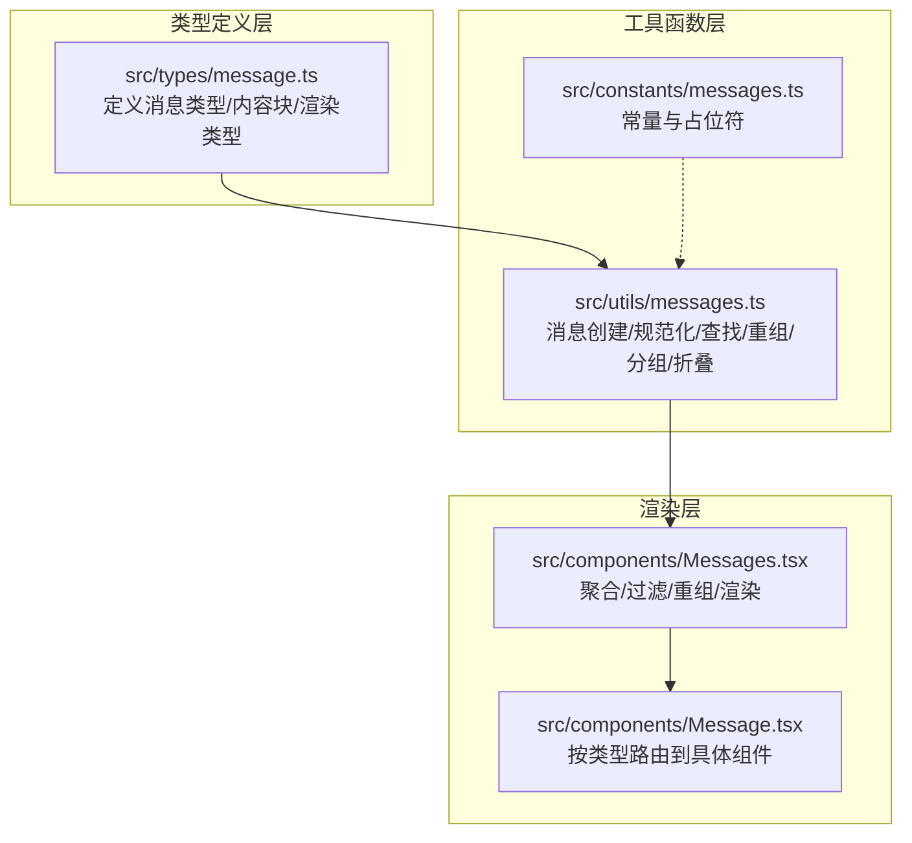
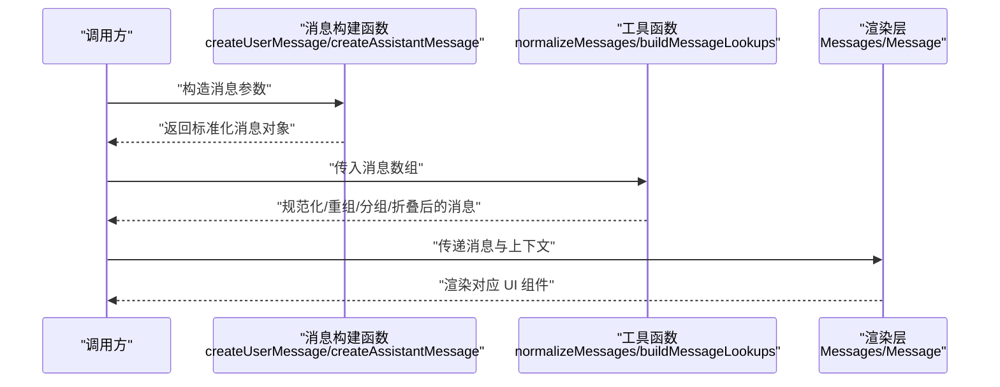
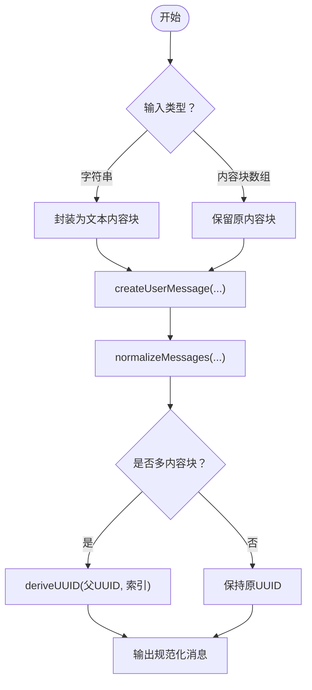
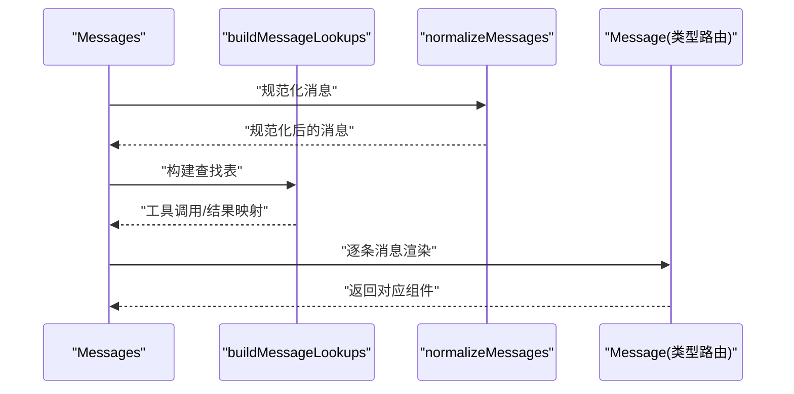
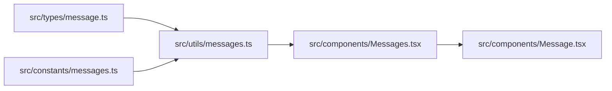

# 消息构建系统

<cite>
**本文引用的文件**
- [src/types/message.ts](file://src/types/message.ts)
- [src/utils/messages.ts](file://src/utils/messages.ts)
- [src/components/Message.tsx](file://src/components/Message.tsx)
- [src/components/Messages.tsx](file://src/components/Messages.tsx)
- [src/constants/messages.ts](file://src/constants/messages.ts)
</cite>

## 目录
1. [简介](#简介)
2. [项目结构](#项目结构)
3. [核心组件](#核心组件)
4. [架构总览](#架构总览)
5. [详细组件分析](#详细组件分析)
6. [依赖关系分析](#依赖关系分析)
7. [性能考量](#性能考量)
8. [故障排查指南](#故障排查指南)
9. [结论](#结论)
10. [附录](#附录)

## 简介
本文件面向 Claude Code 的消息构建系统，系统性阐述消息类型定义、消息构建函数、内容格式化与附件处理、元数据管理、序列化与反序列化、验证与错误处理、调试支持以及最佳实践。目标是帮助开发者快速理解并高效扩展消息子系统。

## 项目结构
消息系统由“类型定义层”“工具函数层”“渲染层”三部分组成：
- 类型定义层：统一声明消息类型、内容块类型、渲染类型集合等，确保跨模块一致。
- 工具函数层：提供消息创建、规范化、查找索引、过滤重组、分组折叠、流式合成等能力。
- 渲染层：根据消息类型与内容块选择具体 UI 组件进行渲染，并支持转录模式、思维块控制、虚拟滚动等高级特性。



图表来源
- [src/types/message.ts:1-168](file://src/types/message.ts#L1-L168)
- [src/utils/messages.ts:1-800](file://src/utils/messages.ts#L1-L800)
- [src/components/Message.tsx:1-627](file://src/components/Message.tsx#L1-L627)
- [src/components/Messages.tsx:1-834](file://src/components/Messages.tsx#L1-L834)
- [src/constants/messages.ts:1-2](file://src/constants/messages.ts#L1-L2)

章节来源
- [src/types/message.ts:1-168](file://src/types/message.ts#L1-L168)
- [src/utils/messages.ts:1-800](file://src/utils/messages.ts#L1-L800)
- [src/components/Message.tsx:1-627](file://src/components/Message.tsx#L1-L627)
- [src/components/Messages.tsx:1-834](file://src/components/Messages.tsx#L1-L834)
- [src/constants/messages.ts:1-2](file://src/constants/messages.ts#L1-L2)

## 核心组件
- 消息类型与内容块
  - 基础消息类型：用户消息、助手消息、系统消息、附件消息、进度消息、分组工具使用消息、折叠读取搜索组等。
  - 内容块类型：文本、图像、工具调用、工具结果、思考、屏蔽思考等。
  - 渲染类型集合：用于 UI 展示的消息集合，包含多种消息与内容块类型。
- 消息构建函数
  - 创建用户消息、助手消息、系统消息、进度消息、中断/取消/拒绝等合成消息。
  - 规范化多内容块消息，生成稳定且唯一的子消息键。
- 查找与重组
  - 构建消息查找表（工具调用 ID、消息 ID、工具名称等）。
  - 重排消息顺序、应用分组、折叠背景通知、读取/搜索组等。
- 过滤与展示
  - 转录模式裁剪、简报模式过滤、思维块可见性控制、虚拟滚动切片等。

章节来源
- [src/types/message.ts:19-168](file://src/types/message.ts#L19-L168)
- [src/utils/messages.ts:412-524](file://src/utils/messages.ts#L412-L524)
- [src/utils/messages.ts:732-800](file://src/utils/messages.ts#L732-L800)
- [src/utils/messages.ts:49-164](file://src/utils/messages.ts#L49-L164)

## 架构总览
消息系统采用“类型驱动 + 工具函数 + 渲染路由”的分层设计：
- 类型层统一约束消息结构与内容块类型，避免运行时歧义。
- 工具层负责业务逻辑：创建、规范化、重组、分组、折叠、查找、过滤、合成流式消息等。
- 渲染层根据消息类型与内容块类型进行组件级路由，支持转录模式、思维块隐藏、虚拟滚动等。



图表来源
- [src/utils/messages.ts:412-524](file://src/utils/messages.ts#L412-L524)
- [src/utils/messages.ts:732-800](file://src/utils/messages.ts#L732-L800)
- [src/components/Messages.tsx:475-529](file://src/components/Messages.tsx#L475-L529)
- [src/components/Message.tsx:82-354](file://src/components/Message.tsx#L82-L354)

## 详细组件分析

### 类型系统与内容块
- 消息类型
  - 用户消息：携带用户输入内容、可选元信息、工具结果、来源工具等。
  - 助手消息：携带模型输出内容（文本/工具调用/思考等）、用量统计、请求标识等。
  - 系统消息：用于系统提示、边界标记、本地命令、权限状态等。
  - 附件消息：用于传输非文本附件或特殊元数据。
  - 进度消息：用于工具执行进度上报。
  - 分组工具使用消息：将多个工具调用与结果合并展示。
  - 折叠读取搜索组：将多次读取/搜索/列表/REPL等操作合并展示。
- 内容块类型
  - 文本、图像、工具调用、工具结果、思考、屏蔽思考等。
- 渲染类型集合
  - 包含可直接渲染的消息与内容块类型，便于 UI 侧统一处理。

```mermaid
classDiagram
class Message {
+type : MessageType
+uuid : UUID
+timestamp : string
+isMeta : boolean
+message : { role; id; content; usage }
+attachment : object
}
class UserMessage {
+type : "user"
}
class AssistantMessage {
+type : "assistant"
}
class SystemMessage {
+type : "system"
}
class AttachmentMessage {
+type : "attachment"
}
class ProgressMessage {
+type : "progress"
+data : any
}
class GroupedToolUseMessage {
+type : "grouped_tool_use"
+toolName : string
+messages : AssistantMessage[]
+results : UserMessage[]
+displayMessage : AssistantMessage|UserMessage
}
class CollapsedReadSearchGroup {
+type : "collapsed_read_search"
+uuid : UUID
+searchCount : number
+readCount : number
+messages : CollapsibleMessage[]
+displayMessage : CollapsibleMessage
}
Message <|-- UserMessage
Message <|-- AssistantMessage
Message <|-- SystemMessage
Message <|-- AttachmentMessage
Message <|-- ProgressMessage
Message <|-- GroupedToolUseMessage
Message <|-- CollapsedReadSearchGroup
```

图表来源
- [src/types/message.ts:33-168](file://src/types/message.ts#L33-L168)

章节来源
- [src/types/message.ts:19-168](file://src/types/message.ts#L19-L168)

### 消息构建函数工作原理
- 用户消息创建
  - 支持字符串或内容块数组输入；为空时自动填充占位符。
  - 可设置元信息、转录仅显示、虚拟消息、摘要元数据、MCP 元数据、UUID/时间戳、图片粘贴索引、来源工具消息 UUID、权限模式、来源等。
- 助手消息创建
  - 支持字符串或内容块数组输入；字符串为空时自动填充占位符。
  - 可设置用量统计、API 错误标志、错误详情、虚拟消息等。
- 合成消息
  - 中断/取消/拒绝/无响应等合成消息，用于表达用户干预或策略拒绝。
- 规范化消息
  - 将多内容块消息拆分为独立消息，保证每条消息仅含一个内容块。
  - 使用派生 UUID 保持顺序与稳定性，避免重复键导致的渲染问题。



图表来源
- [src/utils/messages.ts:461-524](file://src/utils/messages.ts#L461-L524)
- [src/utils/messages.ts:732-800](file://src/utils/messages.ts#L732-L800)

章节来源
- [src/utils/messages.ts:412-524](file://src/utils/messages.ts#L412-L524)
- [src/utils/messages.ts:732-800](file://src/utils/messages.ts#L732-L800)

### 内容格式化与附件处理
- 内容格式化
  - 字符串输入时自动封装为文本内容块；空字符串替换为占位符。
  - 图像粘贴索引与图片内容块一一对应，确保渲染时正确标注序号。
- 附件处理
  - 附件消息用于传输非文本附件或特殊元数据（如队列命令、MCP 元数据等）。
  - 部分附件在 UI 中可能被判定为“无需渲染”，以减少噪音。
- MCP 元数据
  - 支持通过 MCP 元数据传递协议特定信息，不发送给模型但可用于 SDK 消费者。

章节来源
- [src/utils/messages.ts:526-544](file://src/utils/messages.ts#L526-L544)
- [src/utils/messages.ts:483-487](file://src/utils/messages.ts#L483-L487)
- [src/components/Message.tsx:172-190](file://src/components/Message.tsx#L172-L190)

### 元数据管理
- 消息元信息
  - 元消息、转录仅显示、虚拟消息、摘要元数据、来源工具 UUID、权限模式、来源等。
- 工具调用元信息
  - 工具调用 ID、工具名称、结果匹配、流式更新等。
- 用量与错误
  - 用量统计、API 错误、错误详情、虚拟模型标识等。

章节来源
- [src/utils/messages.ts:495-499](file://src/utils/messages.ts#L495-L499)
- [src/utils/messages.ts:356-410](file://src/utils/messages.ts#L356-L410)

### 序列化与反序列化
- 序列化
  - 消息对象天然可 JSON 序列化，内容块遵循 SDK 定义。
  - 流式合成消息通过派生 UUID 保持键稳定，避免渲染树抖动。
- 反序列化
  - 从存储或网络接收后，先进行规范化（拆分多内容块），再进行查找索引与重组。
- 兼容性
  - 通过派生短 ID 与稳定键策略，兼容历史消息与模型边界标签。

章节来源
- [src/utils/messages.ts:201-206](file://src/utils/messages.ts#L201-L206)
- [src/utils/messages.ts:726-729](file://src/utils/messages.ts#L726-L729)

### 渲染与路由
- 类型路由
  - 根据消息类型与内容块类型选择具体组件：文本、图像、工具调用、工具结果、思考、屏蔽思考、系统文本、分组工具使用、折叠读取搜索组等。
- 转录模式与思维块
  - 转录模式下可隐藏历史思考块，仅保留最新思考块；支持“展开/收起”交互。
- 虚拟滚动
  - 大会话场景下启用虚拟滚动，限制挂载节点数量，降低内存占用与 GC 压力。



图表来源
- [src/components/Messages.tsx:475-529](file://src/components/Messages.tsx#L475-L529)
- [src/components/Message.tsx:82-354](file://src/components/Message.tsx#L82-L354)

章节来源
- [src/components/Messages.tsx:475-529](file://src/components/Messages.tsx#L475-L529)
- [src/components/Message.tsx:82-354](file://src/components/Message.tsx#L82-L354)

### 验证机制与错误处理
- 非空消息校验
  - 进度、附件、系统消息视为非空；文本内容块需去除空白与占位符。
- 合成消息识别
  - 识别中断/取消/拒绝等合成消息，避免误判为正常文本。
- 错误消息
  - API 错误消息带有虚拟模型标识与错误详情，便于 UI 区分与展示。
- 调试支持
  - 提供日志记录、诊断跟踪、调试开关等能力，辅助定位渲染与逻辑问题。

章节来源
- [src/utils/messages.ts:690-721](file://src/utils/messages.ts#L690-L721)
- [src/utils/messages.ts:311-330](file://src/utils/messages.ts#L311-L330)
- [src/utils/messages.ts:436-459](file://src/utils/messages.ts#L436-L459)

## 依赖关系分析
- 类型依赖
  - 所有消息类型与内容块类型均来自统一类型定义文件，确保跨模块一致性。
- 工具函数依赖
  - 渲染层依赖工具函数进行规范化、查找、重组、分组、折叠等。
  - 常量层提供占位符与通用文案，被工具函数与渲染层共同使用。
- 组件依赖
  - 渲染层组件按类型进行细粒度拆分，降低耦合度，提升可维护性。



图表来源
- [src/types/message.ts:1-168](file://src/types/message.ts#L1-L168)
- [src/utils/messages.ts:1-800](file://src/utils/messages.ts#L1-L800)
- [src/constants/messages.ts:1-2](file://src/constants/messages.ts#L1-L2)
- [src/components/Messages.tsx:1-834](file://src/components/Messages.tsx#L1-L834)
- [src/components/Message.tsx:1-627](file://src/components/Message.tsx#L1-L627)

章节来源
- [src/types/message.ts:1-168](file://src/types/message.ts#L1-L168)
- [src/utils/messages.ts:1-800](file://src/utils/messages.ts#L1-L800)
- [src/components/Messages.tsx:1-834](file://src/components/Messages.tsx#L1-L834)
- [src/components/Message.tsx:1-627](file://src/components/Message.tsx#L1-L627)

## 性能考量
- 虚拟滚动
  - 在全屏模式或显式开启时启用虚拟滚动，避免一次性挂载大量消息节点。
- 渲染切片
  - 非虚拟路径下对消息进行安全切片，基于稳定锚点（UUID + 索引）避免计数切片带来的跳变。
- 计算分离
  - 昂贵的重组/分组/查找计算与渲染范围切片解耦，滚动仅触发切片更新。
- 缓存与去抖
  - 搜索文本缓存、查找表缓存、渲染记忆等策略降低重复计算与内存分配。

章节来源
- [src/components/Messages.tsx:299-340](file://src/components/Messages.tsx#L299-L340)
- [src/components/Messages.tsx:475-529](file://src/components/Messages.tsx#L475-L529)
- [src/components/Messages.tsx:649-676](file://src/components/Messages.tsx#L649-L676)

## 故障排查指南
- 常见问题
  - 渲染异常：检查消息是否经过规范化，确认每个内容块对应唯一键。
  - 思维块显示异常：确认转录模式与“隐藏历史思考”配置，检查最后思考块 ID 计算。
  - 工具结果未配对：检查工具调用 ID 是否正确，查看查找表中是否存在匹配项。
  - 大会话卡顿：启用虚拟滚动或调整渲染切片策略。
- 调试建议
  - 开启调试日志，关注消息规范化与查找表构建过程。
  - 使用诊断跟踪服务记录关键事件，定位性能瓶颈。

章节来源
- [src/components/Message.tsx:591-625](file://src/components/Message.tsx#L591-L625)
- [src/components/Messages.tsx:395-419](file://src/components/Messages.tsx#L395-L419)
- [src/utils/messages.ts:150-157](file://src/utils/messages.ts#L150-L157)

## 结论
消息构建系统通过清晰的类型定义、完善的工具函数与高效的渲染路由，实现了从消息创建、规范化、重组、分组折叠到最终渲染的完整链路。其设计兼顾了可扩展性与性能，在大消息场景下仍能保持良好的用户体验。建议在扩展新消息类型或内容块时，严格遵循现有类型体系与工具函数约定，确保一致性与稳定性。

## 附录
- 最佳实践
  - 新增消息类型时，同步完善类型定义与渲染路由分支。
  - 使用规范化函数确保多内容块消息的键稳定与顺序正确。
  - 对于长会话，优先启用虚拟滚动并合理设置渲染切片。
  - 利用查找表与缓存策略优化渲染性能与交互流畅度。
  - 在调试阶段开启日志与诊断跟踪，快速定位问题根因。