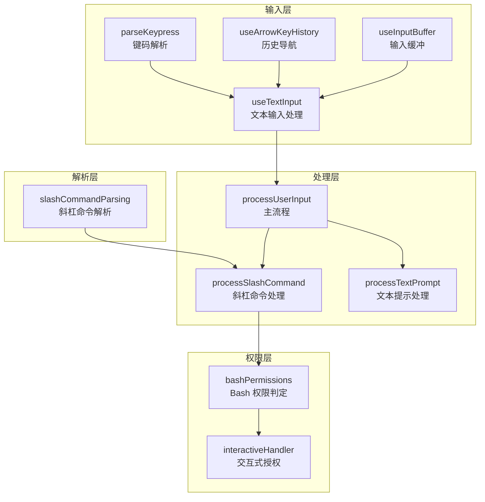
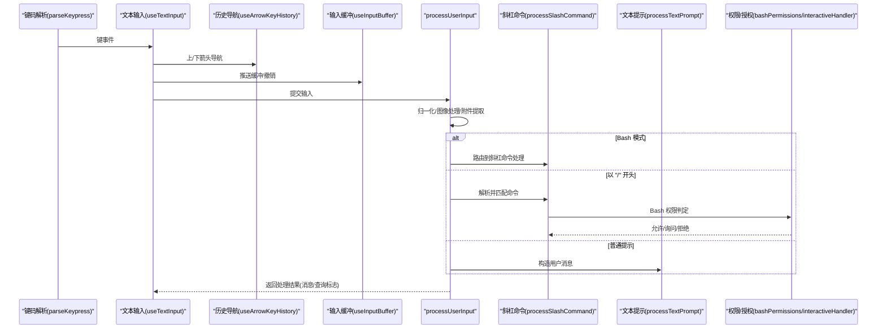
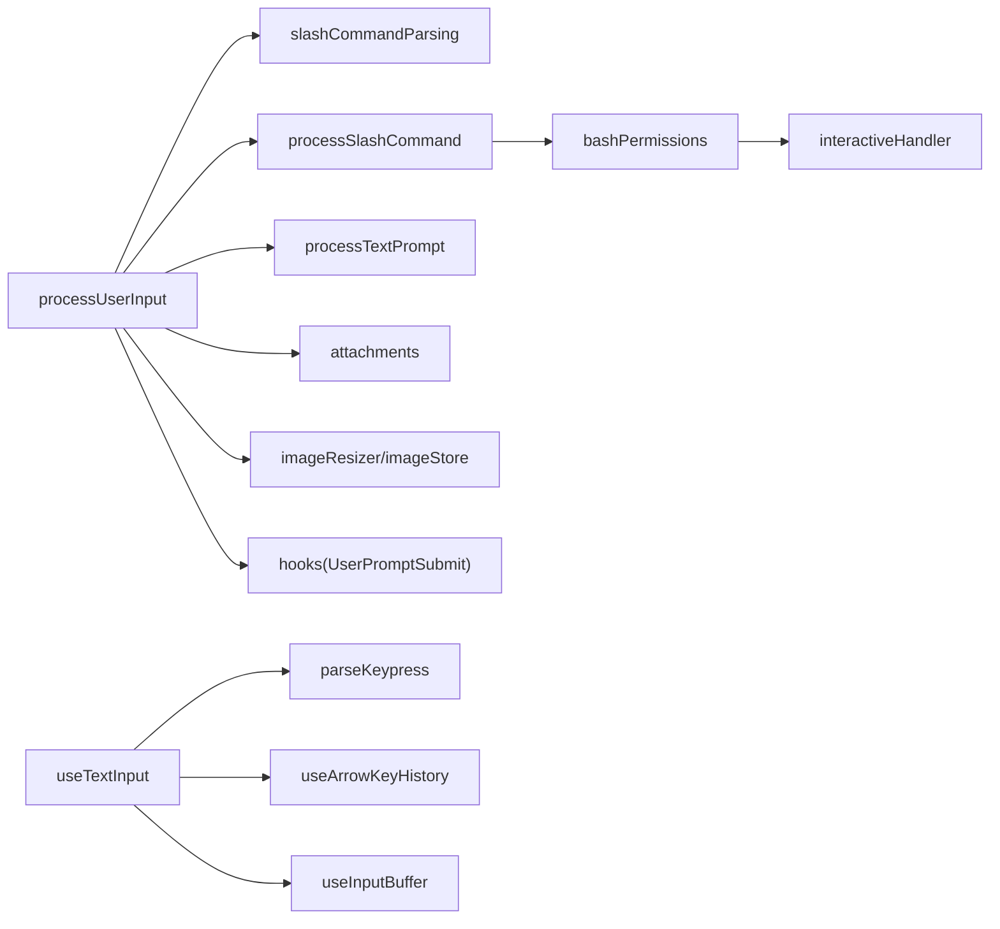
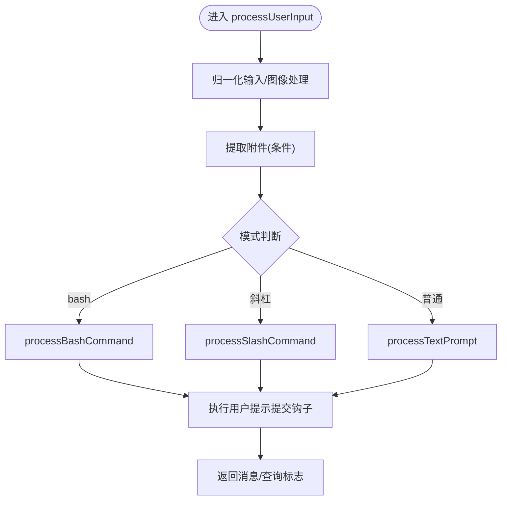

# 用户输入处理

<cite>
**本文引用的文件**
- [processUserInput.ts](file://src/utils/processUserInput/processUserInput.ts)
- [processSlashCommand.tsx](file://src/utils/processUserInput/processSlashCommand.tsx)
- [processTextPrompt.ts](file://src/utils/processUserInput/processTextPrompt.ts)
- [slashCommandParsing.ts](file://src/utils/slashCommandParsing.ts)
- [useTextInput.ts](file://src/hooks/useTextInput.ts)
- [useArrowKeyHistory.tsx](file://src/hooks/useArrowKeyHistory.tsx)
- [useInputBuffer.ts](file://src/hooks/useInputBuffer.ts)
- [bashPermissions.ts](file://src/tools/BashTool/bashPermissions.ts)
- [interactiveHandler.ts](file://src/hooks/toolPermission/handlers/interactiveHandler.ts)
- [parse-keypress.ts](file://src/ink/parse-keypress.ts)
</cite>

## 目录
1. [简介](#简介)
2. [项目结构](#项目结构)
3. [核心组件](#核心组件)
4. [架构总览](#架构总览)
5. [详细组件分析](#详细组件分析)
6. [依赖关系分析](#依赖关系分析)
7. [性能考量](#性能考量)
8. [故障排查指南](#故障排查指南)
9. [结论](#结论)
10. [附录](#附录)

## 简介
本文件面向 Claude Code 的“用户输入处理系统”，围绕 processUserInput 函数展开，系统性阐述其在不同输入类型（文本提示、斜杠命令、Bash 命令）下的处理流程与内部机制。重点覆盖以下方面：
- 输入预处理：字符串归一化、图像内容块处理、附件提取、桥接安全命令绕过策略
- 命令解析与匹配：斜杠命令解析、MCP 命令识别、未知命令回退到普通提示
- 权限检查与交互式授权：Bash 工具权限判定、交互式授权对话流程
- 输入缓冲与历史：输入缓冲区管理、历史记录检索与上下箭头导航、快捷键绑定
- 调试与可观测性：事件日志、OTel 事件、查询探针与截断输出

## 项目结构
用户输入处理涉及多层模块协作：
- 输入层：终端/键盘事件解析、文本输入钩子、历史与缓冲
- 解析层：斜杠命令解析器、模式识别（prompt/bash）
- 处理层：processUserInput 主流程、processSlashCommand、processTextPrompt、processBashCommand
- 权限层：工具权限判定、交互式授权处理器
- 附件与图像：图像尺寸调整、元数据注入、粘贴内容处理

图示来源
- [parse-keypress.ts:213-229](file://src/ink/parse-keypress.ts#L213-L229)
- [useTextInput.ts:431-501](file://src/hooks/useTextInput.ts#L431-L501)
- [useArrowKeyHistory.tsx:63-228](file://src/hooks/useArrowKeyHistory.tsx#L63-L228)
- [useInputBuffer.ts:27-132](file://src/hooks/useInputBuffer.ts#L27-L132)
- [slashCommandParsing.ts:25-60](file://src/utils/slashCommandParsing.ts#L25-L60)
- [processUserInput.ts:85-589](file://src/utils/processUserInput/processUserInput.ts#L85-L589)
- [processSlashCommand.tsx:309-524](file://src/utils/processUserInput/processSlashCommand.tsx#L309-L524)
- [processTextPrompt.ts:19-100](file://src/utils/processUserInput/processTextPrompt.ts#L19-L100)
- [bashPermissions.ts:991-1178](file://src/tools/BashTool/bashPermissions.ts#L991-L1178)
- [interactiveHandler.ts:57-68](file://src/hooks/toolPermission/handlers/interactiveHandler.ts#L57-L68)

章节来源
- [processUserInput.ts:85-589](file://src/utils/processUserInput/processUserInput.ts#L85-L589)
- [slashCommandParsing.ts:25-60](file://src/utils/slashCommandParsing.ts#L25-L60)
- [processSlashCommand.tsx:309-524](file://src/utils/processUserInput/processSlashCommand.tsx#L309-L524)
- [processTextPrompt.ts:19-100](file://src/utils/processUserInput/processTextPrompt.ts#L19-L100)
- [useTextInput.ts:73-530](file://src/hooks/useTextInput.ts#L73-L530)
- [useArrowKeyHistory.tsx:63-228](file://src/hooks/useArrowKeyHistory.tsx#L63-L228)
- [useInputBuffer.ts:27-132](file://src/hooks/useInputBuffer.ts#L27-L132)
- [bashPermissions.ts:991-1178](file://src/tools/BashTool/bashPermissions.ts#L991-L1178)
- [interactiveHandler.ts:57-68](file://src/hooks/toolPermission/handlers/interactiveHandler.ts#L57-L68)

## 核心组件
- processUserInput：统一入口，负责输入归一化、图像处理、附件提取、模式分流（Bash/斜杠/普通提示）、桥接安全命令绕过、钩子执行与结果返回。
- processSlashCommand：解析斜杠命令，匹配内置或自定义命令，执行本地 JSX/本地/提示型命令，支持 fork 子代理与进度反馈。
- processTextPrompt：将普通文本提示封装为用户消息并决定是否发起查询。
- slashCommandParsing：标准化斜杠命令解析，支持 MCP 命令标记。
- useTextInput：键盘事件映射、光标移动、历史导航、粘贴与行编辑、快捷键绑定。
- useArrowKeyHistory：历史记录分块加载、模式过滤、上下箭头导航、草稿保存与恢复。
- useInputBuffer：输入缓冲区（撤销/重做）、去抖动、游标偏移与粘贴内容持久化。
- bashPermissions：Bash 工具权限规则匹配、精确匹配/前缀匹配、只读命令、交互式授权触发。
- interactiveHandler：交互式授权对话流程，异步运行自动化检查与用户交互竞速。

章节来源
- [processUserInput.ts:85-589](file://src/utils/processUserInput/processUserInput.ts#L85-L589)
- [processSlashCommand.tsx:309-524](file://src/utils/processUserInput/processSlashCommand.tsx#L309-L524)
- [processTextPrompt.ts:19-100](file://src/utils/processUserInput/processTextPrompt.ts#L19-L100)
- [slashCommandParsing.ts:25-60](file://src/utils/slashCommandParsing.ts#L25-L60)
- [useTextInput.ts:73-530](file://src/hooks/useTextInput.ts#L73-L530)
- [useArrowKeyHistory.tsx:63-228](file://src/hooks/useArrowKeyHistory.tsx#L63-L228)
- [useInputBuffer.ts:27-132](file://src/hooks/useInputBuffer.ts#L27-L132)
- [bashPermissions.ts:991-1178](file://src/tools/BashTool/bashPermissions.ts#L991-L1178)
- [interactiveHandler.ts:57-68](file://src/hooks/toolPermission/handlers/interactiveHandler.ts#L57-L68)

## 架构总览
下图展示从键盘输入到最终消息队列的关键路径，以及权限与钩子的介入点。

图示来源
- [parse-keypress.ts:213-229](file://src/ink/parse-keypress.ts#L213-L229)
- [useTextInput.ts:247-267](file://src/hooks/useTextInput.ts#L247-L267)
- [useArrowKeyHistory.tsx:124-182](file://src/hooks/useArrowKeyHistory.tsx#L124-L182)
- [useInputBuffer.ts:36-96](file://src/hooks/useInputBuffer.ts#L36-L96)
- [processUserInput.ts:516-588](file://src/utils/processUserInput/processUserInput.ts#L516-L588)
- [processSlashCommand.tsx:309-524](file://src/utils/processUserInput/processSlashCommand.tsx#L309-L524)
- [processTextPrompt.ts:19-100](file://src/utils/processUserInput/processTextPrompt.ts#L19-L100)
- [bashPermissions.ts:991-1178](file://src/tools/BashTool/bashPermissions.ts#L991-L1178)
- [interactiveHandler.ts:57-68](file://src/hooks/toolPermission/handlers/interactiveHandler.ts#L57-L68)

## 详细组件分析

### processUserInput 主流程
- 输入归一化与图像处理：对数组输入逐块处理图像尺寸与降采样，提取最后文本块作为 inputString，并保留前置内容块用于消息构造。
- 粘贴图像处理：批量处理 pastedContents 中的图像，生成尺寸元数据与存储路径，构建 imageContentBlocks。
- 附件提取：根据模式与开关决定是否提取附件（IDE 选择、文件引用等），并限制在 prompt 模式且非斜杠命令时进行。
- 模式分流：
  - Bash 模式：直接进入 processBashCommand。
  - 以 "/" 开头：进入 processSlashCommand；若 bridgeOrigin 且命令是桥接安全，则临时放行。
  - 普通提示：进入 processTextPrompt。
- 钩子执行：在提交前执行用户提示提交钩子，支持阻止继续、附加上下文、系统级错误消息。
- 图像元数据注入：将图像尺寸/来源信息以 isMeta 用户消息形式追加到结果中。

章节来源
- [processUserInput.ts:281-589](file://src/utils/processUserInput/processUserInput.ts#L281-L589)

### 斜杠命令解析与处理
- 解析：parseSlashCommand 将 "/command [args]" 或 "/mcp:tool (MCP) args" 解析为命令名、参数与 MCP 标记。
- 匹配与回退：若命令不存在，检查是否看起来像命令名（仅字母数字与特定字符），否则回退为普通提示。
- 执行路径：
  - 本地 JSX：加载模块，渲染 UI，回调 onDone 决定消息与是否查询。
  - 本地命令：同步执行，返回文本或紧凑压缩结果。
  - 提示型命令：可选择 fork 子代理执行，支持后台并行与进度 UI。
- 统计与遥测：记录命令使用、插件信息、调用来源等事件。

章节来源
- [slashCommandParsing.ts:25-60](file://src/utils/slashCommandParsing.ts#L25-L60)
- [processSlashCommand.tsx:309-524](file://src/utils/processUserInput/processSlashCommand.tsx#L309-L524)
- [processSlashCommand.tsx:525-777](file://src/utils/processUserInput/processSlashCommand.tsx#L525-L777)

### 文本提示处理
- 将输入封装为用户消息，支持字符串与数组两种形态。
- 若存在粘贴图像，先拼接文本再追加图像块。
- 记录负向/继续关键词，发出 user_prompt OTEL 事件与分析事件。

章节来源
- [processTextPrompt.ts:19-100](file://src/utils/processUserInput/processTextPrompt.ts#L19-L100)

### Bash 命令处理与权限
- Bash 模式：当 mode 为 'bash' 时，processUserInput 直接进入 Bash 命令处理流程。
- 权限判定：bashToolCheckExactMatchPermission 对精确命令进行 deny/ask/allow 判定，支持只读命令与模式特定规则。
- 交互式授权：interactiveHandler 在用户确认前并行运行自动化检查，避免阻塞。

章节来源
- [processUserInput.ts:516-529](file://src/utils/processUserInput/processUserInput.ts#L516-L529)
- [bashPermissions.ts:991-1178](file://src/tools/BashTool/bashPermissions.ts#L991-L1178)
- [interactiveHandler.ts:57-68](file://src/hooks/toolPermission/handlers/interactiveHandler.ts#L57-L68)

### 输入预处理与命令提取
- 键码解析：parseMultipleKeypresses 将原始输入流转换为键序列，处理粘贴模式与不完整输入。
- 文本输入映射：useTextInput 将键事件映射为光标操作、换行、历史导航、粘贴与行编辑行为。
- 命令提取：斜杠命令解析器按空格拆分，识别 MCP 标记，提取 args。

章节来源
- [parse-keypress.ts:213-229](file://src/ink/parse-keypress.ts#L213-L229)
- [useTextInput.ts:318-413](file://src/hooks/useTextInput.ts#L318-L413)
- [slashCommandParsing.ts:25-60](file://src/utils/slashCommandParsing.ts#L25-L60)

### 输入缓冲区管理
- 缓冲结构：BufferEntry 包含文本、光标偏移、粘贴内容与时间戳。
- 去抖动：快速变更合并，避免频繁写入。
- 撤销/前进：基于 currentIndex 的双向导航，支持清空与状态复位。

章节来源
- [useInputBuffer.ts:27-132](file://src/hooks/useInputBuffer.ts#L27-L132)

### 历史记录处理
- 分块加载：并发请求合并为单次磁盘读取，按 HISTORY_CHUNK_SIZE 扩展缓存。
- 模式过滤：初始按下箭头时固定模式过滤，保证同模式历史连续浏览。
- 草稿保存：当前输入作为草稿暂存，上翻后可恢复。

章节来源
- [useArrowKeyHistory.tsx:20-62](file://src/hooks/useArrowKeyHistory.tsx#L20-L62)
- [useArrowKeyHistory.tsx:124-182](file://src/hooks/useArrowKeyHistory.tsx#L124-L182)
- [useArrowKeyHistory.tsx:183-207](file://src/hooks/useArrowKeyHistory.tsx#L183-L207)

### 快捷键绑定
- 文本级双击 Esc 清空输入并保存至历史。
- Ctrl+C 双击退出；Ctrl+D 空输入时退出。
- 上/下箭头：优先行内移动，不可移动时触发历史导航。
- Enter：支持反斜杠续行、Option/Shift+Enter 插入换行、Apple Terminal 特殊处理。
- Ctrl+/Meta 组合键：行首尾跳转、单词删除/移动、剪贴板操作。

章节来源
- [useTextInput.ts:108-153](file://src/hooks/useTextInput.ts#L108-L153)
- [useTextInput.ts:224-245](file://src/hooks/useTextInput.ts#L224-L245)
- [useTextInput.ts:247-267](file://src/hooks/useTextInput.ts#L247-L267)
- [useTextInput.ts:269-316](file://src/hooks/useTextInput.ts#L269-L316)
- [useTextInput.ts:367-376](file://src/hooks/useTextInput.ts#L367-L376)

## 依赖关系分析
- processUserInput 依赖：
  - 命令解析：slashCommandParsing
  - 附件与图像：attachments、imageResizer、imageStore
  - 钩子：hooks（用户提示提交钩子）
  - 模式与工具：processSlashCommand、processTextPrompt
  - 权限：bashPermissions、interactiveHandler
- useTextInput 依赖：
  - 键码解析：parseKeypress
  - 历史：useArrowKeyHistory
  - 缓冲：useInputBuffer
- 历史与缓冲：
  - 历史模块：history.js
  - 输入缓冲：useInputBuffer

图示来源
- [processUserInput.ts:56-61](file://src/utils/processUserInput/processUserInput.ts#L56-L61)
- [processSlashCommand.tsx:40-48](file://src/utils/processUserInput/processSlashCommand.tsx#L40-L48)
- [processTextPrompt.ts:11-13](file://src/utils/processUserInput/processTextPrompt.ts#L11-L13)
- [useTextInput.ts:1-25](file://src/hooks/useTextInput.ts#L1-L25)
- [useArrowKeyHistory.tsx:1-10](file://src/hooks/useArrowKeyHistory.tsx#L1-L10)
- [useInputBuffer.ts:1-3](file://src/hooks/useInputBuffer.ts#L1-L3)

章节来源
- [processUserInput.ts:56-61](file://src/utils/processUserInput/processUserInput.ts#L56-L61)
- [processSlashCommand.tsx:40-48](file://src/utils/processUserInput/processSlashCommand.tsx#L40-L48)
- [processTextPrompt.ts:11-13](file://src/utils/processUserInput/processTextPrompt.ts#L11-L13)
- [useTextInput.ts:1-25](file://src/hooks/useTextInput.ts#L1-L25)
- [useArrowKeyHistory.tsx:1-10](file://src/hooks/useArrowKeyHistory.tsx#L1-L10)
- [useInputBuffer.ts:1-3](file://src/hooks/useInputBuffer.ts#L1-L3)

## 性能考量
- 并行图像处理：粘贴图像与内容块并行处理，减少等待时间。
- 历史分块加载：并发请求合并为单次磁盘读取，降低 IO 压力。
- 去抖动输入缓冲：抑制高频输入导致的状态更新风暴。
- 查询探针：在关键阶段插入 queryCheckpoint，便于性能分析与瓶颈定位。
- 输出截断：钩子输出超过阈值自动截断，避免消息体过大。

章节来源
- [processUserInput.ts:366-388](file://src/utils/processUserInput/processUserInput.ts#L366-L388)
- [useArrowKeyHistory.tsx:20-62](file://src/hooks/useArrowKeyHistory.tsx#L20-L62)
- [useInputBuffer.ts:50-60](file://src/hooks/useInputBuffer.ts#L50-L60)
- [processUserInput.ts:149-172](file://src/utils/processUserInput/processUserInput.ts#L149-L172)
- [processUserInput.ts:274-279](file://src/utils/processUserInput/processUserInput.ts#L274-L279)

## 故障排查指南
- 斜杠命令无效：
  - 检查命令名是否仅包含允许字符，或是否为真实文件路径。
  - 查看未知命令回退逻辑与错误消息是否被正确显示。
- Bash 命令被拒绝：
  - 检查权限规则匹配（精确/前缀/只读/模式特定）。
  - 观察交互式授权对话是否弹出，确认自动化检查结果。
- 输入历史异常：
  - 确认初始模式过滤是否固定，草稿是否正确保存与恢复。
  - 检查分块加载是否命中缓存，避免重复磁盘读取。
- 输入缓冲无法撤销：
  - 确认去抖动是否导致条目未及时入栈。
  - 检查 currentIndex 是否越界或被意外清空。

章节来源
- [processSlashCommand.tsx:333-381](file://src/utils/processUserInput/processSlashCommand.tsx#L333-L381)
- [bashPermissions.ts:991-1178](file://src/tools/BashTool/bashPermissions.ts#L991-L1178)
- [useArrowKeyHistory.tsx:131-182](file://src/hooks/useArrowKeyHistory.tsx#L131-L182)
- [useInputBuffer.ts:64-96](file://src/hooks/useInputBuffer.ts#L64-L96)

## 结论
processUserInput 将多种输入形态统一为一致的消息构造与查询决策流程，通过斜杠命令解析、权限判定与钩子扩展，实现了灵活而可控的用户输入处理。配合历史导航、输入缓冲与快捷键绑定，系统在可用性与性能之间取得平衡。建议在扩展新命令或优化性能时，遵循现有模块边界与事件日志规范，确保可观测性与一致性。

## 附录
- 关键流程图（算法实现）

图示来源
- [processUserInput.ts:281-589](file://src/utils/processUserInput/processUserInput.ts#L281-L589)
- [processSlashCommand.tsx:309-524](file://src/utils/processUserInput/processSlashCommand.tsx#L309-L524)
- [processTextPrompt.ts:19-100](file://src/utils/processUserInput/processTextPrompt.ts#L19-L100)