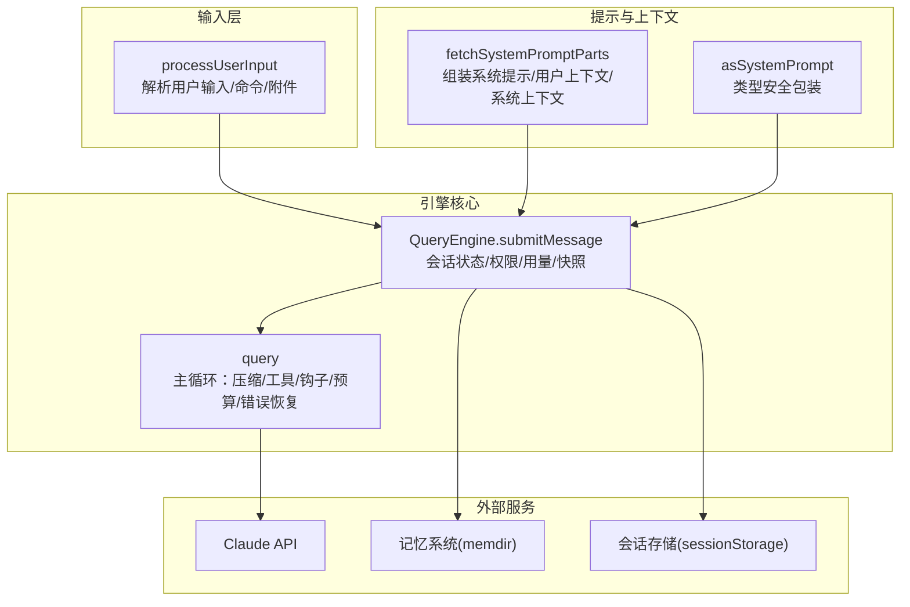
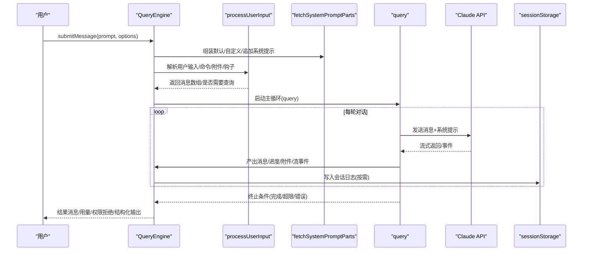
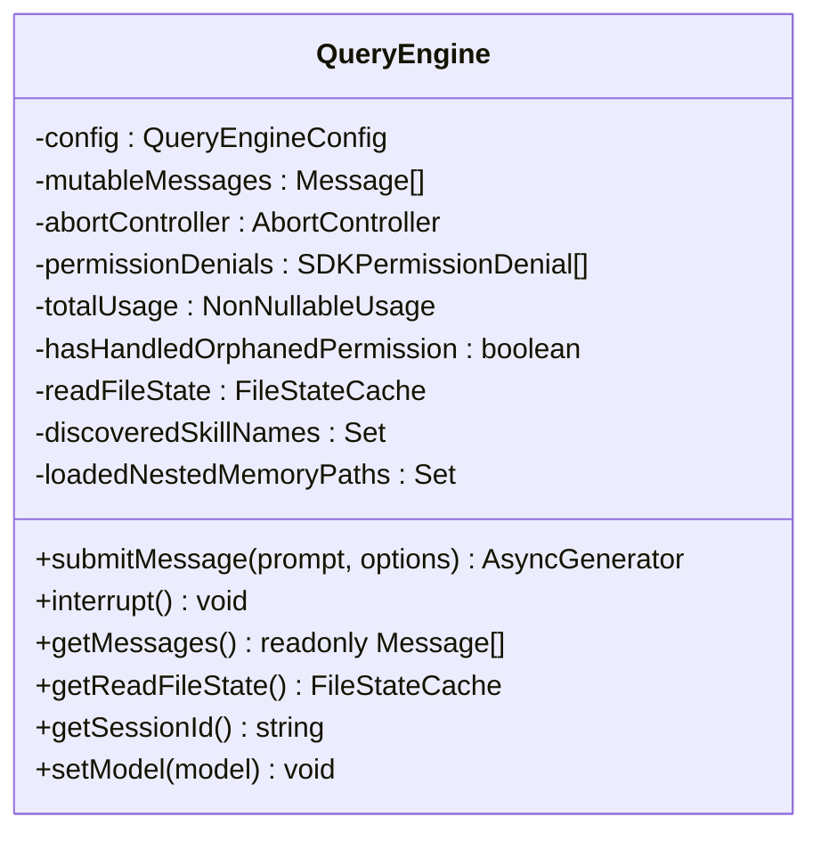
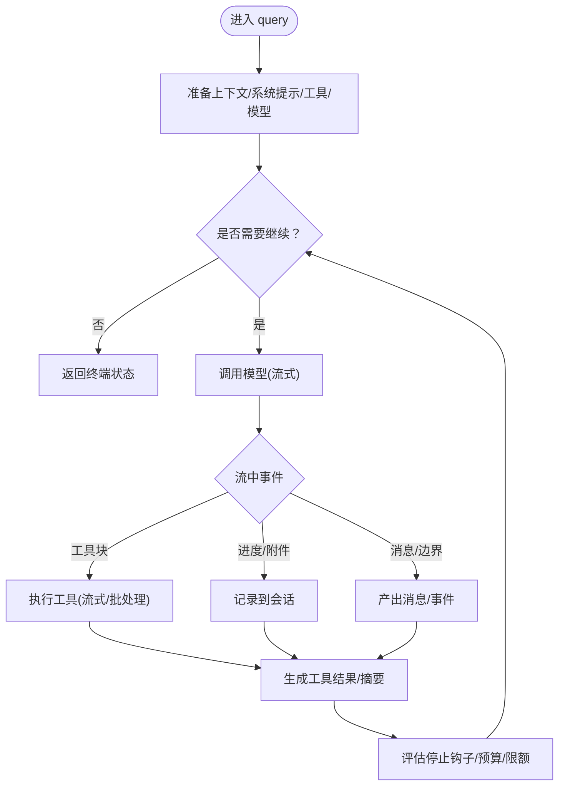
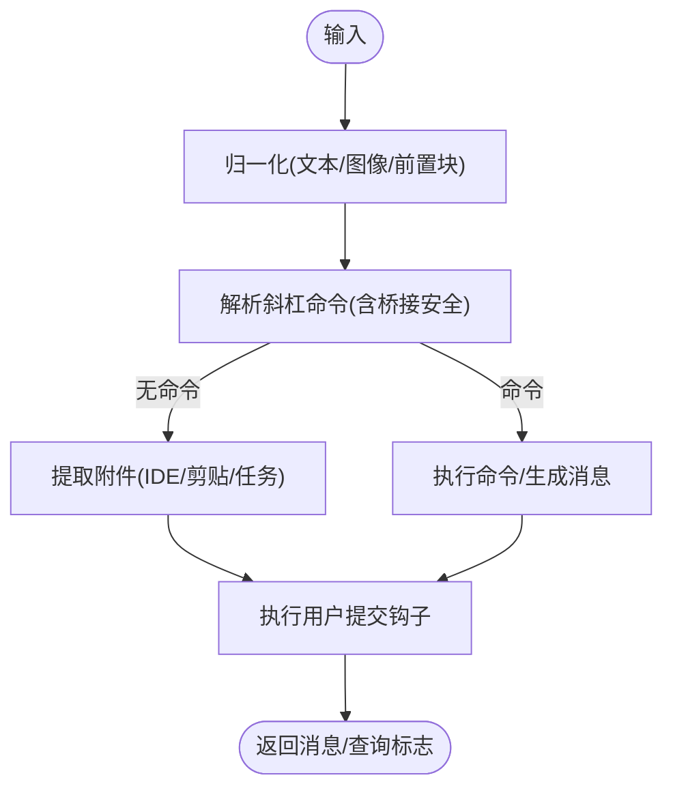
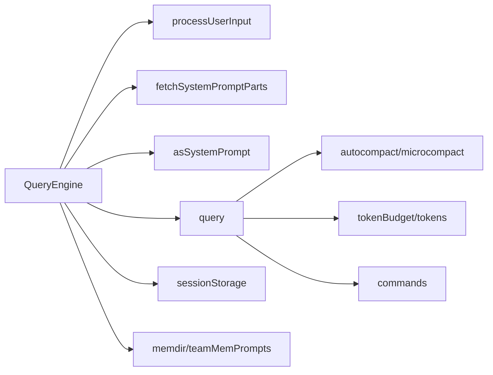

# 智能对话引擎

<cite>
**本文引用的文件**
- [QueryEngine.ts](file://src/QueryEngine.ts)
- [query.ts](file://src/query.ts)
- [processUserInput.ts](file://src/utils/processUserInput/processUserInput.ts)
- [queryContext.ts](file://src/utils/queryContext.ts)
- [systemPromptType.ts](file://src/utils/systemPromptType.ts)
- [commands.ts](file://src/commands.ts)
- [sessionStorage.ts](file://src/utils/sessionStorage.ts)
- [sessionIngress.ts](file://src/services/api/sessionIngress.ts)
- [tokenBudget.ts](file://src/query/tokenBudget.ts)
- [tokens.ts](file://src/utils/tokens.ts)
- [microCompact.ts](file://src/services/compact/microCompact.ts)
- [memdir.ts](file://src/memdir/memdir.ts)
- [teamMemPrompts.ts](file://src/memdir/teamMemPrompts.ts)
- [sessionMemoryUtils.ts](file://src/services/SessionMemory/sessionMemoryUtils.ts)
- [ask 函数:1211-1321](file://src/QueryEngine.ts#L1211-L1321)
</cite>

## 目录
1. [简介](#简介)
2. [项目结构](#项目结构)
3. [核心组件](#核心组件)
4. [架构总览](#架构总览)
5. [详细组件分析](#详细组件分析)
6. [依赖关系分析](#依赖关系分析)
7. [性能考量](#性能考量)
8. [故障排查指南](#故障排查指南)
9. [结论](#结论)
10. [附录](#附录)

## 简介
本文件面向 Claude Code 的智能对话引擎，系统性阐述 QueryEngine 的核心架构与工作原理，覆盖查询解析、上下文管理、消息路由、对话循环、会话管理、上下文窗口与记忆系统、以及性能优化与调试方法。目标是帮助开发者快速理解并高效扩展该引擎。

## 项目结构
- 引擎入口与生命周期：QueryEngine 类封装一次对话的完整生命周期，负责解析用户输入、构建系统提示、驱动 query 循环、管理会话与内存、产出结果与流式事件。
- 查询执行器：query 函数实现多轮对话的主循环，包含自动压缩（微/宏）、工具调用、停止钩子、预算控制、错误恢复与重试等。
- 输入处理：processUserInput 负责解析用户输入、识别斜杠命令、附件提取、图像处理、钩子注入等。
- 上下文与提示：queryContext 提供默认系统提示、用户上下文与系统上下文的组装；systemPromptType 提供类型安全的系统提示容器。
- 命令体系：commands.ts 统一管理内置与动态技能命令，支持远程安全命令过滤与 MCP 技能集成。
- 会话与持久化：sessionStorage 提供会话日志写入与缓存；sessionIngress 处理并发冲突与幂等写入。
- 记忆与上下文窗口：memdir 与 teamMemPrompts 提供长期记忆机制；microCompact 与 tokenBudget 控制上下文窗口与预算。
- 工具与插件：工具发现与加载在 QueryEngine 初始化阶段完成，确保非交互场景启动不阻塞网络。

图表来源
- [QueryEngine.ts:211-1181](file://src/QueryEngine.ts#L211-L1181)
- [query.ts:219-1599](file://src/query.ts#L219-L1599)
- [processUserInput.ts:85-270](file://src/utils/processUserInput/processUserInput.ts#L85-L270)
- [queryContext.ts:44-74](file://src/utils/queryContext.ts#L44-L74)
- [systemPromptType.ts:8-14](file://src/utils/systemPromptType.ts#L8-L14)
- [sessionStorage.ts:1114-3868](file://src/utils/sessionStorage.ts#L1114-L3868)
- [memdir.ts:236-255](file://src/memdir/memdir.ts#L236-L255)

章节来源
- [QueryEngine.ts:186-210](file://src/QueryEngine.ts#L186-L210)
- [query.ts:219-240](file://src/query.ts#L219-L240)

## 核心组件
- QueryEngine：单次对话的生命周期管理器，持有可变消息列表、用量统计、权限拒绝记录、文件读取缓存、会话 ID 等。对外提供 submitMessage 作为异步生成器，逐段产出 SDK 消息与结果。
- query：主循环实现，负责上下文压缩（微/宏）、模型调用、工具执行、停止钩子、预算与令牌限制、错误恢复与重试、以及最终结果收敛。
- processUserInput：解析用户输入，识别斜杠命令、附件、图像、钩子附加上下文，生成标准化消息数组。
- 上下文与提示：fetchSystemPromptParts 组装默认系统提示、用户上下文与系统上下文；asSystemPrompt 提供类型安全包装。
- 命令系统：commands.ts 提供命令注册、可用性过滤、动态技能注入、远程安全命令集合等。
- 会话与持久化：sessionStorage 负责会话日志写入、去重与缓存；sessionIngress 处理并发写入冲突。
- 记忆与上下文窗口：memdir/teamMemPrompts 提供长期记忆机制；microCompact 与 tokenBudget 控制上下文窗口与预算。

章节来源
- [QueryEngine.ts:132-175](file://src/QueryEngine.ts#L132-L175)
- [query.ts:181-199](file://src/query.ts#L181-L199)
- [processUserInput.ts:64-83](file://src/utils/processUserInput/processUserInput.ts#L64-L83)
- [queryContext.ts:44-74](file://src/utils/queryContext.ts#L44-L74)
- [commands.ts:258-346](file://src/commands.ts#L258-L346)

## 架构总览
QueryEngine 将“输入解析—系统提示构建—查询循环—消息归档—结果产出”串联为一个可中断、可观测、可恢复的异步生成器。query 主循环内嵌多层保护：自动压缩（微/宏）、工具执行、停止钩子、令牌预算、最大轮次与预算上限、错误分类与重试、以及会话快照与持久化。

图表来源
- [QueryEngine.ts:211-1181](file://src/QueryEngine.ts#L211-L1181)
- [query.ts:219-1599](file://src/query.ts#L219-L1599)
- [processUserInput.ts:85-270](file://src/utils/processUserInput/processUserInput.ts#L85-L270)
- [sessionStorage.ts:1114-3868](file://src/utils/sessionStorage.ts#L1114-L3868)

## 详细组件分析

### QueryEngine：会话生命周期与消息路由
- 会话状态：维护 mutableMessages、totalUsage、permissionDenials、readFileState、discoveredSkillNames、loadedNestedMemoryPaths 等，跨轮次保持。
- 权限与拒绝追踪：wrapCanUseTool 包装工具使用决策，收集权限拒绝信息用于 SDK 报告。
- 系统提示构建：合并默认/自定义/追加提示，注入协调者上下文与记忆机制提示（当启用自定义记忆路径）。
- 用户输入处理：调用 processUserInput，支持斜杠命令、附件、图像、钩子附加上下文；根据模式决定是否进入模型查询。
- 会话快照与持久化：在进入 query 前对用户消息进行 transcript 写入；在关键节点（紧凑边界、进度、附件）即时写入；在结果前统一刷新缓冲。
- 消息归档与路由：根据消息类型（assistant/user/progress/attachment/system/stream_event/tool_use_summary）进行规范化与路由，必要时转换为 SDK 兼容消息。
- 预算与限额：监控 USD 预算、结构化输出重试次数、最大轮次；超过阈值时产出错误结果并终止。
- 中断与查询：提供 interrupt() 触发 AbortController；提供 getMessages()/getReadFileState()/getSessionId()/setModel() 辅助调试与控制。

图表来源
- [QueryEngine.ts:186-210](file://src/QueryEngine.ts#L186-L210)
- [QueryEngine.ts:132-175](file://src/QueryEngine.ts#L132-L175)

章节来源
- [QueryEngine.ts:211-1181](file://src/QueryEngine.ts#L211-L1181)

### query：主循环与上下文管理
- 上下文压缩：按序执行 snip（历史截断）、microcompact（微压缩）、contextCollapse（上下文折叠）、autocompact（自动压缩），并在每次压缩后产出边界消息。
- 模型调用：prependUserContext + 系统提示，支持思考配置、工具选择、代理与任务预算参数。
- 工具执行：支持流式工具执行器与批处理工具执行；在流中增量产出工具结果；在中断或错误时生成合成工具结果。
- 停止钩子：在无工具调用时评估停止条件；在有工具调用时等待工具完成后评估；支持阻塞错误与钩子阻止继续。
- 预算与令牌：基于当前轮次令牌预算与输出令牌数进行续命判断；达到阈值时注入元消息并继续。
- 错误恢复：针对提示过长、媒体过大、最大输出令牌等可恢复错误进行回收；模型回退时切换模型并清理中间态。
- 终止条件：完成、被中断、达到最大轮次/预算、API 错误、钩子阻止等。

图表来源
- [query.ts:241-1599](file://src/query.ts#L241-L1599)

章节来源
- [query.ts:219-1599](file://src/query.ts#L219-L1599)

### processUserInput：输入解析与命令路由
- 输入归一化：支持字符串与内容块数组；对图像进行尺寸调整与元数据提取；保留前置内容块以便后续拼接。
- 斜杠命令：解析并执行本地命令；桥接安全命令在远程输入时特例放行；支持 Ultraplan 关键词路由。
- 附件提取：根据输入与上下文提取 IDE 选区、剪贴板图片、任务通知等附件。
- 钩子注入：执行用户提交钩子，支持阻塞错误、阻止继续、附加上下文等。
- 输出：返回消息数组、是否需要查询、允许工具、模型变更、结果文本等。

图表来源
- [processUserInput.ts:85-270](file://src/utils/processUserInput/processUserInput.ts#L85-L270)

章节来源
- [processUserInput.ts:85-606](file://src/utils/processUserInput/processUserInput.ts#L85-L606)

### 上下文与系统提示构建
- fetchSystemPromptParts：并行获取默认系统提示、用户上下文、系统上下文；当提供自定义系统提示时跳过默认构建。
- asSystemPrompt：类型安全包装，避免将普通数组误用为系统提示。
- 协作者与记忆：QueryEngine 在构建系统提示时注入协调者用户上下文与记忆机制提示（当启用自定义记忆路径）。

章节来源
- [queryContext.ts:44-74](file://src/utils/queryContext.ts#L44-L74)
- [systemPromptType.ts:8-14](file://src/utils/systemPromptType.ts#L8-L14)
- [QueryEngine.ts:295-328](file://src/QueryEngine.ts#L295-L328)

### 命令系统与技能发现
- 命令注册：commands.ts 统一注册内置命令、技能目录命令、插件命令、工作流命令、MCP 技能等。
- 可用性过滤：按认证与提供商要求过滤命令；动态技能与插件技能按需注入。
- 远程安全命令：REMOTE_SAFE_COMMANDS 与 BRIDGE_SAFE_COMMANDS 明确远程模式下的安全命令集。

章节来源
- [commands.ts:258-346](file://src/commands.ts#L258-L346)
- [commands.ts:619-686](file://src/commands.ts#L619-L686)
- [commands.ts:688-755](file://src/commands.ts#L688-L755)

### 会话管理与持久化
- 会话写入：recordTranscript 在关键节点写入会话日志；fire-and-forget 与延迟刷新结合以平衡吞吐与一致性。
- 并发冲突：sessionIngress 处理 409 冲突，采用 lastUuidMap 与服务端校验恢复状态。
- 快照与恢复：在紧凑边界与用户消息确认后写入快照，支持 --resume 从最近可恢复点恢复。

章节来源
- [sessionStorage.ts:1114-3868](file://src/utils/sessionStorage.ts#L1114-L3868)
- [sessionIngress.ts:77-142](file://src/services/api/sessionIngress.ts#L77-L142)
- [QueryEngine.ts:449-466](file://src/QueryEngine.ts#L449-L466)
- [QueryEngine.ts:691-756](file://src/QueryEngine.ts#L691-L756)

### 上下文窗口管理与记忆系统
- 上下文窗口：tokenBudget 与 tokens 工具计算轮次令牌与最终上下文窗口，配合 autocompact/microcompact 控制历史长度。
- 记忆系统：memdir/teamMemPrompts 提供长期记忆机制与使用指导；sessionMemoryUtils 提供初始化阈值、抽取时间戳、最后汇总消息 ID 等状态管理。
- 微压缩：microCompact 提供缓存编辑与边界消息，支持在流中产出精确的删除令牌边界。

章节来源
- [tokenBudget.ts:1-57](file://src/query/tokenBudget.ts#L1-L57)
- [tokens.ts:70-114](file://src/utils/tokens.ts#L70-L114)
- [memdir.ts:236-255](file://src/memdir/memdir.ts#L236-L255)
- [teamMemPrompts.ts:52-100](file://src/memdir/teamMemPrompts.ts#L52-L100)
- [sessionMemoryUtils.ts:38-83](file://src/services/SessionMemory/sessionMemoryUtils.ts#L38-L83)
- [microCompact.ts:71-118](file://src/services/compact/microCompact.ts#L71-L118)

## 依赖关系分析
- QueryEngine 依赖 processUserInput、queryContext、systemPromptType、commands、sessionStorage、memdir 等模块。
- query 依赖 autocompact/microcompact/contextCollapse、工具执行器、停止钩子、预算模块、令牌计算等。
- 命令系统通过 commands.ts 与工具/插件/工作流解耦。
- 会话存储与 API 写入通过 sessionStorage 与 sessionIngress 解耦。

图表来源
- [QueryEngine.ts:1-120](file://src/QueryEngine.ts#L1-L120)
- [query.ts:1-121](file://src/query.ts#L1-L121)
- [commands.ts:1-123](file://src/commands.ts#L1-L123)

章节来源
- [QueryEngine.ts:1-120](file://src/QueryEngine.ts#L1-L120)
- [query.ts:1-121](file://src/query.ts#L1-L121)

## 性能考量
- 批量与并发
  - 缓存与懒加载：命令与技能加载采用 memoize；插件与技能索引缓存按需刷新。
  - 并发写入：sessionIngress 使用 lastUuidMap 与服务端校验减少冲突；recordTranscript 支持 fire-and-forget 降低尾延迟。
- 上下文窗口
  - 自动压缩：snip/microcompact/autocompact 三段式压缩，优先微压缩与折叠，再考虑宏压缩。
  - 令牌预算：基于轮次令牌预算与输出令牌数进行续命判断，避免无效长轮次。
- 工具执行
  - 流式工具执行器在模型流中增量产出工具结果，减少等待时间。
- I/O 与序列化
  - 会话写入采用延迟队列与 JSON 序列化优化；紧凑边界后释放早期消息，降低内存占用。

章节来源
- [commands.ts:449-470](file://src/commands.ts#L449-L470)
- [sessionStorage.ts:1114-3868](file://src/utils/sessionStorage.ts#L1114-L3868)
- [query.ts:560-569](file://src/query.ts#L560-L569)
- [tokenBudget.ts:1-57](file://src/query/tokenBudget.ts#L1-L57)

## 故障排查指南
- 会话不可恢复
  - 现象：--resume 提示“未找到对话”。原因：进程在 API 响应前被杀，仅写入队列操作条目。
  - 处理：QueryEngine 在进入 query 前对用户消息进行 transcript 写入；若为裸模式（--bare）采用 fire-and-forget；必要时手动刷新存储。
- 并发写入冲突
  - 现象：409 冲突导致写入失败。
  - 处理：sessionIngress 通过 lastUuidMap 与服务端 X-Last-UUID 头恢复状态；若 UUID 不匹配则采用服务端实际值并重试。
- 提示过长/媒体过大
  - 现象：413 或媒体大小错误。
  - 处理：先尝试 contextCollapse 的 drain（保持粒度上下文），再尝试 reactive compact；超过阈值则注入元消息并终止。
- 最大轮次/预算超限
  - 现象：达到 maxTurns 或 maxBudgetUsd。
  - 处理：QueryEngine 产出错误结果并终止；可在调用侧设置相应阈值。
- 权限拒绝与工具失败
  - 现象：工具被拒绝或执行失败。
  - 处理：wrapCanUseTool 记录权限拒绝；工具失败时生成合成工具结果；检查 canUseTool 与工具配置。

章节来源
- [QueryEngine.ts:449-466](file://src/QueryEngine.ts#L449-L466)
- [sessionIngress.ts:77-142](file://src/services/api/sessionIngress.ts#L77-L142)
- [query.ts:1065-1186](file://src/query.ts#L1065-L1186)
- [QueryEngine.ts:996-1027](file://src/QueryEngine.ts#L996-L1027)

## 结论
QueryEngine 将“输入解析—系统提示—查询循环—消息归档—结果产出”整合为统一的异步生成器，具备完善的上下文压缩、工具执行、停止钩子、预算控制与会话持久化能力。通过模块化设计与可观测性（profiler/checkpoint），既满足头端交互体验，也支持无头/SDK 场景的稳定运行与调试。

## 附录
- 实现示例与调试方法
  - 使用 ask 包装器进行一次性查询，适合脚本与 SDK 场景。
  - 在 QueryEngine.submitMessage 中设置 includePartialMessages 以接收流事件；通过 replayUserMessages 获取用户消息回放。
  - 通过 setSDKStatus 与 getReadFileState 辅助调试与状态观察。
  - 在 headless 模式下利用 headlessProfilerCheckpoint 定位性能瓶颈。

章节来源
- [ask 函数:1211-1321](file://src/QueryEngine.ts#L1211-L1321)
- [QueryEngine.ts:1211-1321](file://src/QueryEngine.ts#L1211-L1321)