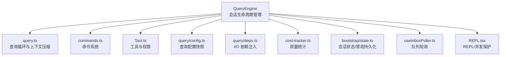
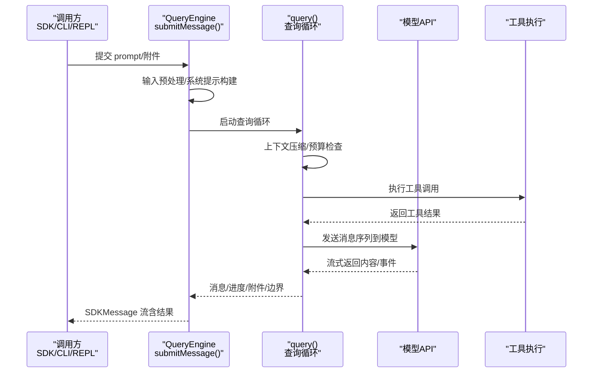
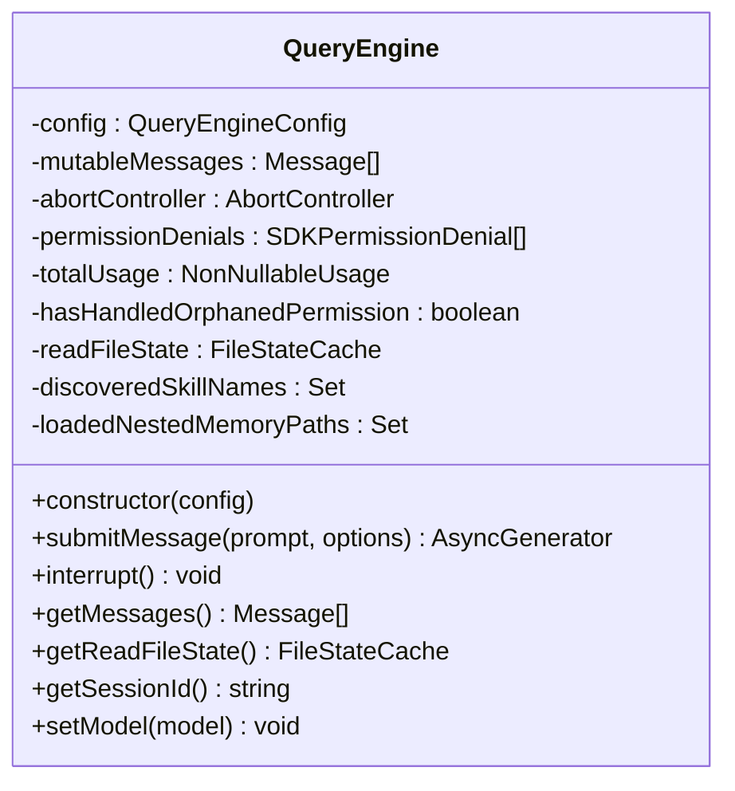
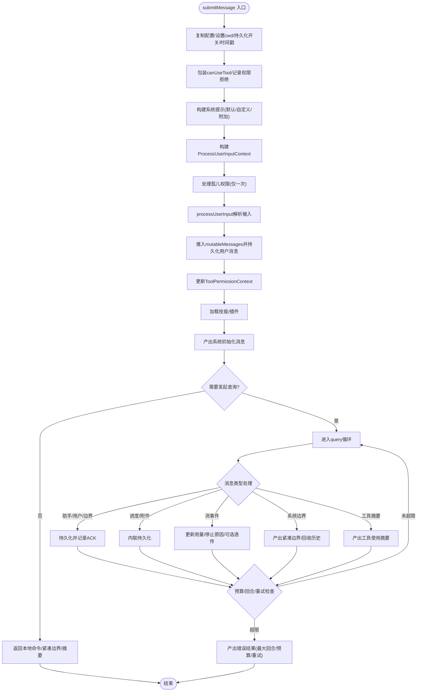
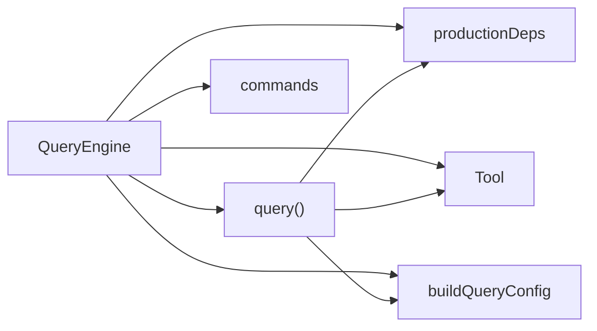

# 查询引擎核心架构

<cite>
**本文档引用的文件**
- [QueryEngine.ts](file://src/QueryEngine.ts)
- [query.ts](file://src/query.ts)
- [commands.ts](file://src/commands.ts)
- [Tool.ts](file://src/Tool.ts)
- [query/config.ts](file://src/query/config.ts)
- [query/deps.ts](file://src/query/deps.ts)
- [cost-tracker.ts](file://src/cost-tracker.ts)
- [bootstrap/state.ts](file://src/bootstrap/state.ts)
- [useInboxPoller.ts](file://src/hooks/useInboxPoller.ts)
- [REPL.tsx](file://src/screens/REPL.tsx)
</cite>

## 目录
1. [简介](#简介)
2. [项目结构](#项目结构)
3. [核心组件](#核心组件)
4. [架构总览](#架构总览)
5. [详细组件分析](#详细组件分析)
6. [依赖关系分析](#依赖关系分析)
7. [性能考量](#性能考量)
8. [故障排查指南](#故障排查指南)
9. [结论](#结论)

## 简介
本文件面向 Claude Code 的查询引擎核心架构，聚焦 QueryEngine 类的设计与实现，系统阐述其构造参数、核心属性、生命周期管理、submitMessage 工作流、配置选项（工具注册、命令系统、MCP 客户端、代理定义）、会话状态管理（消息持久化、用量统计、权限控制）等。同时提供可操作的使用示例路径与最佳实践，帮助开发者在 SDK/CLI/REPL 等多种运行时中正确集成与扩展。

## 项目结构
查询引擎位于 src 目录下，围绕 QueryEngine 类形成“会话生命周期管理 + 查询循环”的双层架构：
- QueryEngine：会话级生命周期与消息状态管理，负责一次对话的完整 turn 流程。
- query：查询循环与上下文压缩、工具执行、模型调用等核心逻辑。

图表来源
- [QueryEngine.ts:186-209](file://src/QueryEngine.ts#L186-L209)
- [query.ts:219-239](file://src/query.ts#L219-L239)
- [commands.ts:258-346](file://src/commands.ts#L258-L346)
- [Tool.ts:158-300](file://src/Tool.ts#L158-L300)
- [query/config.ts:29-46](file://src/query/config.ts#L29-L46)
- [query/deps.ts:33-40](file://src/query/deps.ts#L33-L40)
- [cost-tracker.ts:112-137](file://src/cost-tracker.ts#L112-L137)
- [bootstrap/state.ts:877-916](file://src/bootstrap/state.ts#L877-L916)
- [useInboxPoller.ts:139-873](file://src/hooks/useInboxPoller.ts#L139-L873)
- [REPL.tsx:2853-4023](file://src/screens/REPL.tsx#L2853-L4023)

章节来源
- [QueryEngine.ts:186-209](file://src/QueryEngine.ts#L186-L209)
- [query.ts:219-239](file://src/query.ts#L219-L239)

## 核心组件
- QueryEngine：会话级状态持有者，封装 submitMessage 的完整工作流，负责消息数组、权限拒绝记录、用量累计、文件缓存、会话 ID 获取、中断控制等。
- query：查询循环，负责上下文压缩（自动/微/片段）、工具执行、模型调用、错误恢复、预算检查、结果归并等。
- commands：命令系统聚合器，动态加载技能、插件、工作流命令，提供可用命令集合与安全过滤。
- Tool：工具抽象与权限上下文，统一工具描述、输入输出、权限校验、进度渲染、摘要生成等。
- 配置与依赖：query/config.ts 快照查询期门禁；query/deps.ts 注入真实 I/O 实现，便于测试替换。
- 成本追踪：cost-tracker.ts 提供用量累加与会话恢复能力。
- 会话状态：bootstrap/state.ts 提供会话 ID 与持久化开关。

章节来源
- [QueryEngine.ts:186-209](file://src/QueryEngine.ts#L186-L209)
- [query.ts:219-239](file://src/query.ts#L219-L239)
- [commands.ts:449-469](file://src/commands.ts#L449-L469)
- [Tool.ts:158-300](file://src/Tool.ts#L158-L300)
- [query/config.ts:29-46](file://src/query/config.ts#L29-L46)
- [query/deps.ts:33-40](file://src/query/deps.ts#L33-L40)
- [cost-tracker.ts:112-137](file://src/cost-tracker.ts#L112-L137)
- [bootstrap/state.ts:877-916](file://src/bootstrap/state.ts#L877-L916)

## 架构总览
QueryEngine 将“用户输入预处理、系统提示构建、消息状态管理”与“查询循环（上下文压缩、工具执行、模型调用）”解耦，通过 AsyncGenerator 向上层（SDK/CLI/REPL）流式产出消息与结果。query.ts 负责内部循环与恢复策略，二者协作实现长会话、高吞吐、可观测的查询引擎。

图表来源
- [QueryEngine.ts:211-1181](file://src/QueryEngine.ts#L211-L1181)
- [query.ts:241-849](file://src/query.ts#L241-L849)

## 详细组件分析

### QueryEngine 类设计与生命周期
- 设计原则
  - 单会话一引擎：每个 QueryEngine 对应一次对话，submitMessage 每次调用开启一个 turn，消息与状态跨 turn 持久。
  - 异步生成器：对外以 AsyncGenerator 输出 SDKMessage，支持流式消费与中断。
  - 可插拔配置：通过 QueryEngineConfig 注入工具集、命令、MCP 客户端、代理、权限回调、文件缓存等。
- 关键属性
  - mutableMessages：当前会话消息数组，贯穿整个 turn。
  - abortController：用于中断查询。
  - permissionDenials：权限拒绝记录，用于 SDK 报告。
  - totalUsage：累计用量（按消息粒度更新，最终汇总）。
  - readFileState：只读文件状态缓存副本，避免外部修改影响引擎内部一致性。
  - discoveredSkillNames/loadedNestedMemoryPaths：会话内技能发现与嵌套记忆加载去重。
- 生命周期
  - 构造：保存初始配置，克隆文件缓存，初始化用量与控制器。
  - submitMessage：单次 turn 的完整流程入口。
  - interrupt：触发 AbortController 中断。
  - getMessages/getReadFileState/getSessionId/setModel：状态查询与更新。

图表来源
- [QueryEngine.ts:186-209](file://src/QueryEngine.ts#L186-L209)
- [QueryEngine.ts:1183-1202](file://src/QueryEngine.ts#L1183-L1202)

章节来源
- [QueryEngine.ts:186-209](file://src/QueryEngine.ts#L186-L209)
- [QueryEngine.ts:1183-1202](file://src/QueryEngine.ts#L1183-L1202)

### submitMessage 工作流程详解
- 输入预处理
  - 复制并清理配置项，设置工作目录、是否启用持久化、开始时间戳。
  - 包装 canUseTool 以跟踪权限拒绝，记录 permissionDenials。
  - 解析主循环模型与思考配置（默认自适应或禁用）。
- 系统提示构建
  - 从 fetchSystemPromptParts 获取默认系统提示、用户上下文与系统上下文。
  - 合并 customSystemPrompt、内存机制提示（当设置了覆盖环境变量）与 appendSystemPrompt。
  - 注册结构化输出强制执行钩子（若存在对应工具且传入 jsonSchema）。
- 消息状态管理
  - 构建 ProcessUserInputContext，包含消息数组、文件缓存、权限上下文、主题、预算等。
  - 处理孤儿权限（仅首次），产出本地命令输出与紧凑边界消息。
  - 调用 processUserInput 解析用户输入，得到 messagesFromUserInput、shouldQuery、allowedTools、model 等。
  - 将新消息推入 mutableMessages，并持久化用户消息（非 bare 模式阻塞写入，否则异步）。
  - 更新 ToolPermissionContext 的 alwaysAllowRules，确保命令允许规则生效。
- 查询循环启动
  - 加载技能与插件（缓存只读），产出系统初始化消息（工具、MCP、模型、权限模式、命令、代理、插件、快速模式）。
  - 若 shouldQuery 为假，直接返回本地命令/紧凑边界/摘要等结果。
  - 否则进入 query 循环，逐条处理消息类型（助手、用户、进度、附件、系统边界、流事件等），并按需持久化。
- 结果归并与限额检查
  - 周期性检查最大回合数、美元预算、结构化输出重试次数等，必要时提前结束并返回错误结果。
  - 最终根据结果类型提取文本，产出最终 result 消息，包含耗时、用量、权限拒绝、快速模式状态等。

图表来源
- [QueryEngine.ts:211-1181](file://src/QueryEngine.ts#L211-L1181)

章节来源
- [QueryEngine.ts:211-1181](file://src/QueryEngine.ts#L211-L1181)

### 配置选项与扩展点
- QueryEngineConfig 关键字段
  - cwd：工作目录
  - tools：工具集合
  - commands：命令列表
  - mcpClients：MCP 服务器连接
  - agents：代理定义
  - canUseTool：权限决策回调
  - getAppState/setAppState：应用状态读写
  - initialMessages：初始消息
  - readFileCache：只读文件缓存
  - customSystemPrompt/appendSystemPrompt：自定义系统提示拼接
  - userSpecifiedModel/fallbackModel：模型选择与回退
  - thinkingConfig/maxTurns/maxBudgetUsd/taskBudget/jsonSchema/verbose/replayUserMessages/includePartialMessages/handleElicitation/setSDKStatus/orphanedPermission/snipReplay：运行时行为与可观测性
- commands 系统
  - 动态加载技能目录、插件技能、内置命令，按可用性与启用状态过滤，支持远程/桥接安全命令白名单。
- ToolUseContext 与工具生态
  - 统一工具接口、权限上下文、进度渲染、摘要生成、输入验证、活动描述等。
- 查询配置与依赖
  - buildQueryConfig 快照运行期门禁（如流式工具执行、工具使用摘要、是否为内部用户、快速模式开关）。
  - productionDeps 注入真实 I/O 实现（模型调用、自动/微压缩、UUID）。

章节来源
- [QueryEngine.ts:132-175](file://src/QueryEngine.ts#L132-L175)
- [commands.ts:449-517](file://src/commands.ts#L449-L517)
- [Tool.ts:158-300](file://src/Tool.ts#L158-L300)
- [query/config.ts:29-46](file://src/query/config.ts#L29-L46)
- [query/deps.ts:33-40](file://src/query/deps.ts#L33-L40)

### 会话状态管理机制
- 消息持久化
  - 用户消息在进入查询循环前持久化，避免进程被杀导致无法恢复。
  - 紧凑边界消息触发截断持久化，保证历史可恢复。
  - 支持 eager flush 环境变量以加速刷新。
- 使用量统计
  - 通过 accumulateUsage/updateUsage 累计消息级用量，最终在结果中返回。
  - 支持按模型维度统计与会话恢复。
- 权限控制
  - 包装 canUseTool 记录拒绝原因，用于 SDK 报告。
  - ToolPermissionContext 管理模式、额外工作目录、允许/拒绝/询问规则等。
- 并发与中断
  - REPL/队列轮询通过状态机保护，避免并发提交。
  - QueryEngine 提供 interrupt 触发 AbortController，查询循环在模型调用与工具执行处响应信号。

章节来源
- [QueryEngine.ts:449-466](file://src/QueryEngine.ts#L449-L466)
- [QueryEngine.ts:691-756](file://src/QueryEngine.ts#L691-L756)
- [QueryEngine.ts:1183-1185](file://src/QueryEngine.ts#L1183-L1185)
- [useInboxPoller.ts:139-873](file://src/hooks/useInboxPoller.ts#L139-L873)
- [cost-tracker.ts:112-137](file://src/cost-tracker.ts#L112-L137)
- [bootstrap/state.ts:877-916](file://src/bootstrap/state.ts#L877-L916)

### 实例化与使用示例（路径指引）
- 在 SDK/CLI 中一次性使用
  - 参考 ask 包装器的参数传递与 QueryEngine 实例化方式，见 [ask 函数:1211-1320](file://src/QueryEngine.ts#L1211-L1320)。
- 在 REPL/多轮对话中复用引擎
  - 通过 QueryEngine.submitMessage 连续提交消息，见 [submitMessage 主体:211-1181](file://src/QueryEngine.ts#L211-L1181)。
- 注册工具与命令
  - 工具定义与权限接口参考 [Tool 接口与上下文:158-300](file://src/Tool.ts#L158-L300)，命令聚合参考 [commands 加载:449-517](file://src/commands.ts#L449-L517)。
- 配置 MCP 客户端与代理
  - QueryEngineConfig 的 mcpClients/agents 字段用于注入外部资源与代理定义，见 [配置字段:132-175](file://src/QueryEngine.ts#L132-L175)。

章节来源
- [QueryEngine.ts:1211-1320](file://src/QueryEngine.ts#L1211-L1320)
- [QueryEngine.ts:211-1181](file://src/QueryEngine.ts#L211-L1181)
- [Tool.ts:158-300](file://src/Tool.ts#L158-L300)
- [commands.ts:449-517](file://src/commands.ts#L449-L517)

## 依赖关系分析
- 内聚与耦合
  - QueryEngine 与 query.ts 通过 AsyncGenerator 解耦，前者专注会话状态，后者专注循环与恢复。
  - commands 与 Tool 作为外部扩展点注入，保持低耦合。
- 外部依赖
  - 模型调用、压缩算法、成本追踪、会话状态等通过 deps 与配置注入，便于测试替身。
- 死代码消除
  - feature() 门禁确保按需裁剪功能模块（如 HISTORY_SNIP、COORIDINATOR_MODE 等），不影响核心类结构。

图表来源
- [QueryEngine.ts:1211-1320](file://src/QueryEngine.ts#L1211-L1320)
- [query.ts:219-239](file://src/query.ts#L219-L239)
- [query/config.ts:29-46](file://src/query/config.ts#L29-L46)
- [query/deps.ts:33-40](file://src/query/deps.ts#L33-L40)

章节来源
- [QueryEngine.ts:1211-1320](file://src/QueryEngine.ts#L1211-L1320)
- [query.ts:219-239](file://src/query.ts#L219-L239)

## 性能考量
- 持久化策略
  - 非 bare 模式下用户消息写入阻塞，确保可恢复；bare 模式异步写入降低首字节延迟。
  - 紧凑边界触发截断持久化，减少磁盘写放大。
- 压缩与预算
  - 自动/微/片段压缩按需触发，结合任务预算与令牌预算限制，避免过长历史占用内存。
- 流式工具执行与模型回退
  - 流式工具执行与模型回退路径在 query 循环中处理，减少重复计算与无效请求。
- 环境变量优化
  - CLAUDE_CODE_EAGER_FLUSH/CLAUDE_CODE_IS_COWORK 控制刷新时机，平衡可靠性与延迟。

## 故障排查指南
- 无结果或空白输出
  - 检查 isResultSuccessful 判定与错误诊断前缀，定位结果类型、最后内容类型与 stop_reason。
  - 参考 [结果判定与诊断:1107-1143](file://src/QueryEngine.ts#L1107-L1143)。
- 预算超限
  - USD 预算、回合数上限、结构化输出重试次数均会提前终止并返回错误结果。
  - 参考 [预算检查与错误返回:996-1073](file://src/QueryEngine.ts#L996-L1073)。
- 权限拒绝
  - permissionDenials 记录了被拒绝的工具调用，可用于 SDK 报告与审计。
  - 参考 [权限拒绝记录:246-274](file://src/QueryEngine.ts#L246-L274)。
- 并发冲突
  - REPL/队列轮询通过 tryStart/isActive 保护，避免同时提交多个查询。
  - 参考 [并发保护:2859-2875](file://src/screens/REPL.tsx#L2859-L2875) 与 [队列轮询:139-873](file://src/hooks/useInboxPoller.ts#L139-873)。

章节来源
- [QueryEngine.ts:1107-1143](file://src/QueryEngine.ts#L1107-L1143)
- [QueryEngine.ts:996-1073](file://src/QueryEngine.ts#L996-L1073)
- [QueryEngine.ts:246-274](file://src/QueryEngine.ts#L246-L274)
- [REPL.tsx:2859-2875](file://src/screens/REPL.tsx#L2859-L2875)
- [useInboxPoller.ts:139-873](file://src/hooks/useInboxPoller.ts#L139-L873)

## 结论
QueryEngine 将“会话生命周期管理”与“查询循环”清晰分离，借助配置快照、依赖注入与异步生成器，实现了可扩展、可观测、可恢复的查询引擎核心。通过 commands 与 Tool 的统一抽象，配合 MCP 与代理定义，QueryEngine 能在 SDK/CLI/REPL 等多场景稳定运行。建议在生产环境中合理设置预算与思考配置，利用孤儿权限处理与权限拒绝记录完善可观测性，并通过 eager flush 与压缩策略平衡延迟与资源占用。