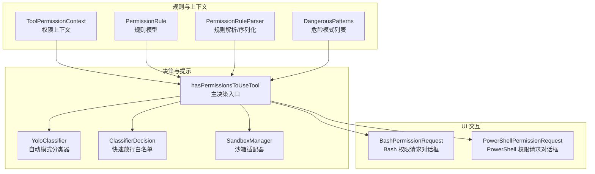
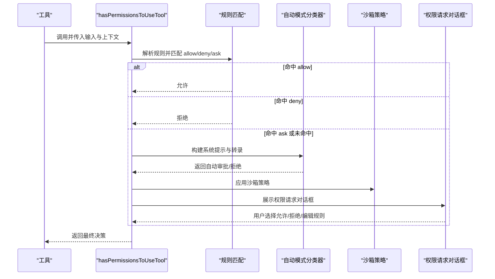
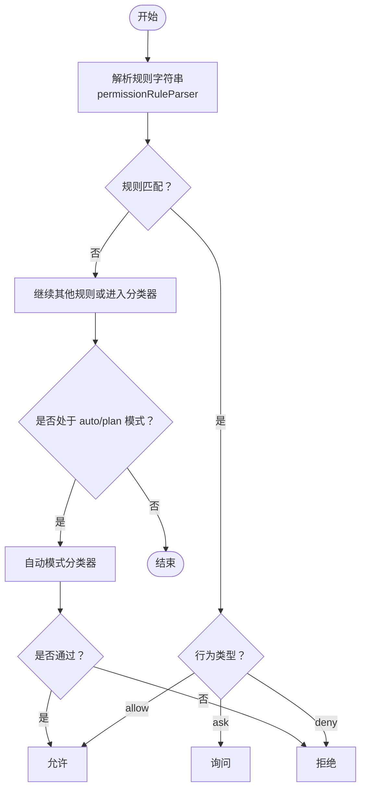
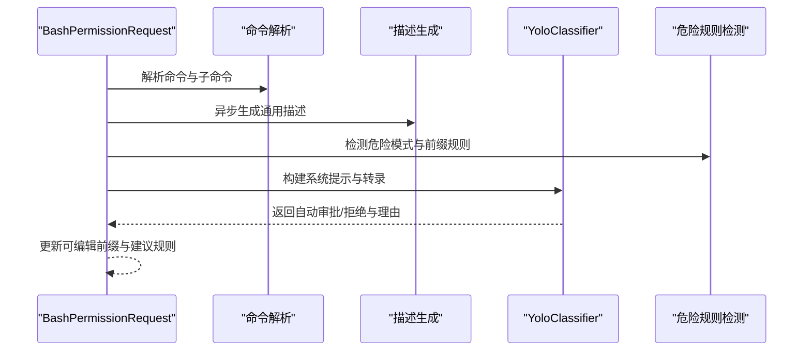
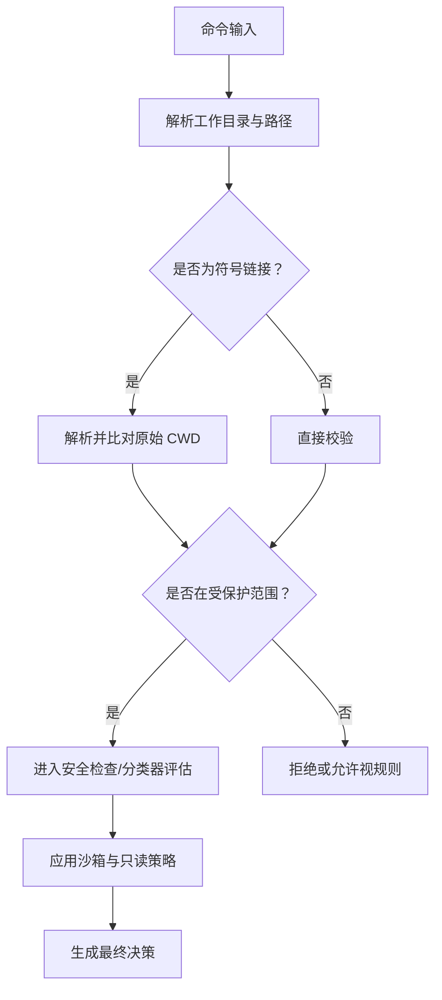
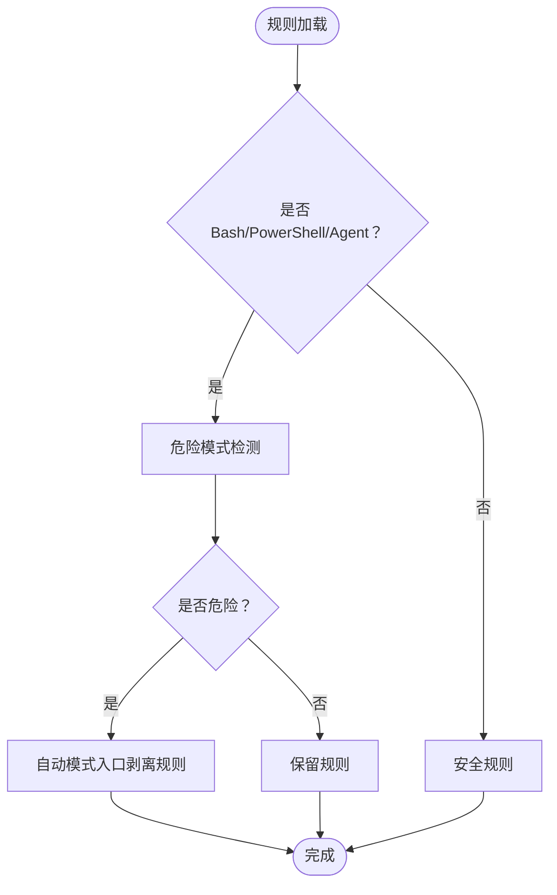
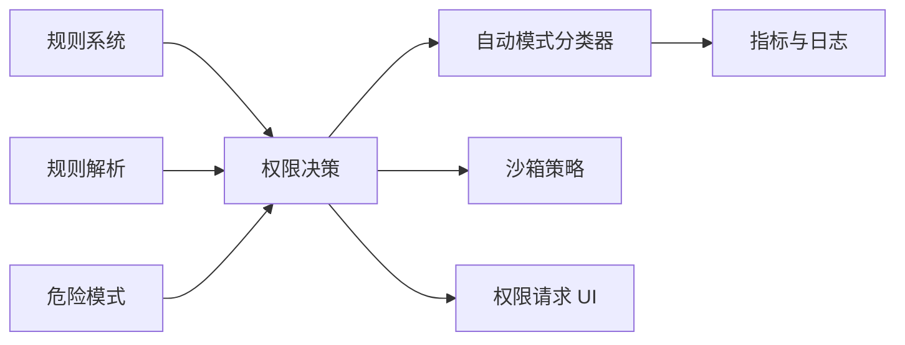

# 权限分类与验证

<cite>
**本文引用的文件**
- [permissionSetup.ts](file://src/utils/permissions/permissionSetup.ts)
- [permissions.ts](file://src/utils/permissions/permissions.ts)
- [permissionRuleParser.ts](file://src/utils/permissions/permissionRuleParser.ts)
- [dangerousPatterns.ts](file://src/utils/permissions/dangerousPatterns.ts)
- [classifierDecision.ts](file://src/utils/permissions/classifierDecision.ts)
- [yoloClassifier.ts](file://src/utils/permissions/yoloClassifier.ts)
- [permissions.ts（类型定义）](file://src/types/permissions.ts)
- [BashPermissionRequest.tsx](file://src/components/permissions/BashPermissionRequest/BashPermissionRequest.tsx)
- [PowerShellPermissionRequest.tsx](file://src/components/permissions/PowerShellPermissionRequest/PowerShellPermissionRequest.tsx)
- [commands.ts（工具函数）](file://src/components/permissions/src/utils/bash/commands.ts)
</cite>

## 目录
1. [简介](#简介)
2. [项目结构](#项目结构)
3. [核心组件](#核心组件)
4. [架构总览](#架构总览)
5. [详细组件分析](#详细组件分析)
6. [依赖关系分析](#依赖关系分析)
7. [性能考量](#性能考量)
8. [故障排查指南](#故障排查指南)
9. [结论](#结论)
10. [附录：配置与使用指南](#附录配置与使用指南)

## 简介
本文件系统性阐述 Claude Code 的权限分类与验证体系，覆盖以下主题：
- 权限分类体系：按“工具类别”“行为类型”“来源维度”进行分层管理，支持“允许/拒绝/询问”三态决策。
- 验证机制：基于规则匹配、自动模式分类器、沙箱策略与工作目录约束的多层控制。
- Bash 分类器（bashClassifier）：命令分析、危险模式识别、安全评估与自动审批流程。
- 文件系统权限验证：路径解析、工作目录白名单、访问控制与资源保护。
- 危险模式检测：跨平台解释器、脚本执行器、进程启动器等高危入口的识别与拦截。
- 配置与使用：规则定制、验证流程、错误处理与最佳实践。

## 项目结构
权限系统由“规则与上下文”“决策与提示”“UI 交互”三层构成，并通过工具侧钩子与沙箱适配器实现端到端控制。

图示来源
- [permissions.ts:473-800](file://src/utils/permissions/permissions.ts#L473-L800)
- [permissionSetup.ts:1-800](file://src/utils/permissions/permissionSetup.ts#L1-L800)
- [yoloClassifier.ts:1-800](file://src/utils/permissions/yoloClassifier.ts#L1-L800)
- [classifierDecision.ts:1-99](file://src/utils/permissions/classifierDecision.ts#L1-L99)
- [BashPermissionRequest.tsx:1-482](file://src/components/permissions/BashPermissionRequest/BashPermissionRequest.tsx#L1-L482)
- [PowerShellPermissionRequest.tsx:1-235](file://src/components/permissions/PowerShellPermissionRequest/PowerShellPermissionRequest.tsx#L1-L235)

章节来源
- [permissions.ts:1-800](file://src/utils/permissions/permissions.ts#L1-L800)
- [permissionSetup.ts:1-800](file://src/utils/permissions/permissionSetup.ts#L1-L800)
- [yoloClassifier.ts:1-800](file://src/utils/permissions/yoloClassifier.ts#L1-L800)
- [classifierDecision.ts:1-99](file://src/utils/permissions/classifierDecision.ts#L1-L99)
- [BashPermissionRequest.tsx:1-482](file://src/components/permissions/BashPermissionRequest/BashPermissionRequest.tsx#L1-L482)
- [PowerShellPermissionRequest.tsx:1-235](file://src/components/permissions/PowerShellPermissionRequest/PowerShellPermissionRequest.tsx#L1-L235)

## 核心组件
- 工具权限上下文（ToolPermissionContext）：承载当前会话的权限模式、附加工作目录、规则集合与沙箱状态等。
- 规则模型（PermissionRule）：包含来源（来源维度）、行为（allow/deny/ask）、值（工具名与可选内容）。
- 主决策函数（hasPermissionsToUseTool）：统一汇聚规则匹配、自动模式分类器、沙箱策略与工作目录检查，输出允许/询问/拒绝决策。
- 自动模式分类器（YoloClassifier）：在 auto/plan 模式下对动作进行安全评估，支持两阶段 XML 输出格式与快速放行白名单。
- 危险模式检测（DangerousPatterns）：集中维护跨平台解释器、脚本运行器、远程执行器等高危入口列表，用于规则剥离与拦截。

章节来源
- [permissions.ts（类型定义）:41-442](file://src/types/permissions.ts#L41-L442)
- [permissions.ts:473-800](file://src/utils/permissions/permissions.ts#L473-L800)
- [yoloClassifier.ts:1-800](file://src/utils/permissions/yoloClassifier.ts#L1-L800)
- [dangerousPatterns.ts:1-81](file://src/utils/permissions/dangerousPatterns.ts#L1-L81)

## 架构总览
权限验证从工具调用进入，先进行规则匹配与快速通道判断，再根据模式选择是否进入自动模式分类器，最终结合沙箱与工作目录策略生成决策结果，并驱动 UI 对话框展示与交互。

图示来源
- [permissions.ts:473-800](file://src/utils/permissions/permissions.ts#L473-L800)
- [yoloClassifier.ts:1-800](file://src/utils/permissions/yoloClassifier.ts#L1-L800)
- [BashPermissionRequest.tsx:1-482](file://src/components/permissions/BashPermissionRequest/BashPermissionRequest.tsx#L1-L482)
- [PowerShellPermissionRequest.tsx:1-235](file://src/components/permissions/PowerShellPermissionRequest/PowerShellPermissionRequest.tsx#L1-L235)

## 详细组件分析

### 权限分类与规则系统
- 分类维度
  - 工具类别：Bash、PowerShell、文件读写、搜索、任务管理、计划模式等。
  - 行为类型：allow（允许）、deny（拒绝）、ask（询问）。
  - 来源维度：用户设置、项目设置、本地设置、会话、命令行参数、策略设置等。
- 规则解析与序列化
  - 支持带括号内容的规则字符串解析与转义，保证“(”“)”等特殊字符的安全存储与还原。
  - 提供规则值的字符串化与反向解析，确保持久化与动态更新的一致性。
- 危险规则识别
  - Bash：通配符、解释器前缀（如 python:*、node:*）、脚本运行器（npx/*run）等。
  - PowerShell：iex、Start-Process、pwsh、cmd、wsl 等。
  - 代理规则：Agent(*) 等绕过子代理评估的规则。

图示来源
- [permissionRuleParser.ts:1-199](file://src/utils/permissions/permissionRuleParser.ts#L1-L199)
- [permissionSetup.ts:84-342](file://src/utils/permissions/permissionSetup.ts#L84-L342)
- [permissions.ts:473-800](file://src/utils/permissions/permissions.ts#L473-L800)

章节来源
- [permissionRuleParser.ts:1-199](file://src/utils/permissions/permissionRuleParser.ts#L1-L199)
- [permissionSetup.ts:84-342](file://src/utils/permissions/permissionSetup.ts#L84-L342)
- [permissions.ts:1-800](file://src/utils/permissions/permissions.ts#L1-L800)

### Bash 分类器（bashClassifier）工作原理
- 命令分析
  - 从工具输入提取命令与描述，针对复合命令进行子命令拆分与只读/高危判定。
  - 生成通用描述以增强分类器理解，避免误判。
- 危险模式识别
  - 基于危险模式列表（解释器、脚本运行器、远程执行器等）与前缀规则（如 python:*）进行匹配。
  - 对潜在下载执行（curl/wget/gh api 等）与路径越权（.git/.claude 等）进行重点标记。
- 安全评估与自动审批
  - 在 auto/plan 模式下，优先尝试 acceptEdits 快速放行与安全工具白名单跳过。
  - 使用两阶段 XML 分类器：快速阶段给出初判，必要时进入思考阶段获取理由。
  - 将分类器结果与转录、令牌用量、耗时等指标记录，便于审计与优化。

图示来源
- [BashPermissionRequest.tsx:1-482](file://src/components/permissions/BashPermissionRequest/BashPermissionRequest.tsx#L1-L482)
- [yoloClassifier.ts:1-800](file://src/utils/permissions/yoloClassifier.ts#L1-L800)
- [dangerousPatterns.ts:1-81](file://src/utils/permissions/dangerousPatterns.ts#L1-L81)

章节来源
- [BashPermissionRequest.tsx:1-482](file://src/components/permissions/BashPermissionRequest/BashPermissionRequest.tsx#L1-L482)
- [yoloClassifier.ts:1-800](file://src/utils/permissions/yoloClassifier.ts#L1-L800)
- [dangerousPatterns.ts:1-81](file://src/utils/permissions/dangerousPatterns.ts#L1-L81)

### 文件系统权限验证机制
- 路径验证与解析
  - 使用安全解析函数对工作目录与命令涉及的路径进行解析，识别符号链接并校验其解析目标是否位于受保护范围。
  - 结合附加工作目录（AdditionalWorkingDirectory）与来源（来源维度）进行白名单管理。
- 访问控制与资源保护
  - 仅允许在工作目录范围内进行文件读写；对敏感路径（如 .git/.claude 等）进行安全检查与分类器可审批标记。
  - 沙箱策略与只读命令白名单进一步降低破坏性风险。

图示来源
- [permissionSetup.ts:666-684](file://src/utils/permissions/permissionSetup.ts#L666-L684)
- [permissions.ts:1-800](file://src/utils/permissions/permissions.ts#L1-L800)

章节来源
- [permissionSetup.ts:666-684](file://src/utils/permissions/permissionSetup.ts#L666-L684)
- [permissions.ts:1-800](file://src/utils/permissions/permissions.ts#L1-L800)

### 危险模式检测系统
- 检测对象
  - 跨平台代码执行入口：python/node/ruby/php/lua 等解释器与包运行器（npx/npm run 等）。
  - 远程执行器：ssh、git、kubectl、aws/gcloud 等。
  - 平台特定高危：zsh/fish/eval/exec/env/xargs/sudo 等。
- 检测策略
  - 前缀匹配（如 python:*）、通配符（python*）、精确匹配（iex/Start-Process）与组合形态（python -c '*'）。
  - 在自动模式入口剥离危险规则，防止绕过分类器评估。

图示来源
- [permissionSetup.ts:84-285](file://src/utils/permissions/permissionSetup.ts#L84-L285)
- [dangerousPatterns.ts:1-81](file://src/utils/permissions/dangerousPatterns.ts#L1-L81)

章节来源
- [permissionSetup.ts:84-285](file://src/utils/permissions/permissionSetup.ts#L84-L285)
- [dangerousPatterns.ts:1-81](file://src/utils/permissions/dangerousPatterns.ts#L1-L81)

### 权限请求 UI 组件
- Bash 权限请求
  - 支持自动审批状态提示、可编辑前缀（如 “bash:ls -l:*”）、建议规则一键应用、通用描述生成与破坏性警告。
  - 集成分类器匹配规则展示与调试信息开关。
- PowerShell 权限请求
  - 提供静态前缀提取与只读命令过滤，支持编辑前缀与一键应用建议规则。
  - 显示破坏性警告与调试信息。

章节来源
- [BashPermissionRequest.tsx:1-482](file://src/components/permissions/BashPermissionRequest/BashPermissionRequest.tsx#L1-L482)
- [PowerShellPermissionRequest.tsx:1-235](file://src/components/permissions/PowerShellPermissionRequest/PowerShellPermissionRequest.tsx#L1-L235)

## 依赖关系分析
- 决策入口（hasPermissionsToUseTool）依赖规则解析、自动模式分类器、快速放行白名单与沙箱适配器。
- 自动模式分类器依赖系统提示构建、转录压缩、XML 输出格式与两阶段推理。
- UI 组件依赖工具输入解析、破坏性警告与分类器描述生成。

图示来源
- [permissions.ts:473-800](file://src/utils/permissions/permissions.ts#L473-L800)
- [yoloClassifier.ts:1-800](file://src/utils/permissions/yoloClassifier.ts#L1-L800)
- [classifierDecision.ts:1-99](file://src/utils/permissions/classifierDecision.ts#L1-L99)

章节来源
- [permissions.ts:473-800](file://src/utils/permissions/permissions.ts#L473-L800)
- [yoloClassifier.ts:1-800](file://src/utils/permissions/yoloClassifier.ts#L1-L800)
- [classifierDecision.ts:1-99](file://src/utils/permissions/classifierDecision.ts#L1-L99)

## 性能考量
- 快速放行：安全工具白名单与 acceptEdits 快速路径显著减少分类器调用次数。
- 分类器缓存：系统提示与 CLAUDE.md 前缀采用缓存控制，提升提示复用效率。
- 令牌与耗时统计：记录分类器阶段用量、时延与成本，辅助性能优化与超支预警。
- UI 渲染优化：分类器检查状态与闪烁动画独立封装，避免不必要的重渲染。

## 故障排查指南
- 分类器不可用或报错
  - 检查环境变量与特征开关，确认自动模式可用性与缓存状态。
  - 查看错误转录快照与转储路径，定位提示长度超限或模型异常。
- 规则不生效
  - 核对规则来源（用户/项目/本地设置）与行为类型（allow/deny/ask），确认规则字符串是否正确转义。
  - 检查危险规则剥离日志，确认自动模式入口是否移除了危险规则。
- 工作目录越权
  - 校验附加工作目录与符号链接解析结果，确保解析后路径仍处于受保护范围。
- 沙箱策略冲突
  - 检查沙箱启用状态与只读命令白名单，确认破坏性命令被正确拦截。

章节来源
- [yoloClassifier.ts:1-800](file://src/utils/permissions/yoloClassifier.ts#L1-L800)
- [permissionSetup.ts:505-580](file://src/utils/permissions/permissionSetup.ts#L505-L580)
- [permissions.ts:1-800](file://src/utils/permissions/permissions.ts#L1-L800)

## 结论
该权限系统通过“规则+分类器+沙箱+UI”的协同设计，在保障安全性的同时兼顾易用性与可扩展性。Bash 分类器作为自动模式的核心，结合危险模式检测与快速放行白名单，实现了对高风险命令的精准识别与高效处理。文件系统权限验证与工作目录约束进一步强化了边界控制，配合完善的配置与诊断能力，为复杂开发场景提供了稳健的权限治理方案。

## 附录：配置与使用指南

### 权限模式与来源
- 模式
  - default、dontAsk、plan、acceptEdits、bypassPermissions（受策略限制）。
  - auto（需满足门禁条件）。
- 来源
  - userSettings、projectSettings、localSettings、flagSettings、policySettings、cliArg、command、session。

章节来源
- [permissions.ts（类型定义）:16-39](file://src/types/permissions.ts#L16-L39)

### 规则定制与更新
- 规则语法
  - 工具名或“工具名(内容)”形式；内容中括号需转义。
- 常用规则
  - Bash 前缀规则：如 bash:ls -l:*。
  - 通配符规则：bash:*（谨慎使用）。
  - PowerShell 高危命令：iex/*、Start-Process/* 等。
- 更新方式
  - 通过 UI 对话框一键应用建议规则或手动编辑前缀。
  - 通过命令行参数 --allowed-tools 注入规则（注意危险规则剥离）。

章节来源
- [permissionRuleParser.ts:81-152](file://src/utils/permissions/permissionRuleParser.ts#L81-L152)
- [BashPermissionRequest.tsx:219-254](file://src/components/permissions/BashPermissionRequest/BashPermissionRequest.tsx#L219-L254)
- [PowerShellPermissionRequest.tsx:62-90](file://src/components/permissions/PowerShellPermissionRequest/PowerShellPermissionRequest.tsx#L62-L90)

### 验证流程与错误处理
- 流程
  - 规则匹配 → 自动模式分类器 → 沙箱策略 → UI 请求 → 用户选择。
- 错误处理
  - 分类器失败：记录转录与用量，必要时回退到正常提示。
  - 规则解析失败：降级为工具名匹配，避免崩溃。
  - 超长提示：返回 deterministic 错误，改用常规提示而非 fail-closed。

章节来源
- [permissions.ts:518-800](file://src/utils/permissions/permissions.ts#L518-L800)
- [yoloClassifier.ts:1-800](file://src/utils/permissions/yoloClassifier.ts#L1-L800)

### 最佳实践
- 优先使用前缀规则替代通配符，降低误放行风险。
- 在 auto 模式下尽量利用快速放行白名单与 acceptEdits，减少分类器负担。
- 定期审查危险规则与自动模式配置，结合转录快照与指标进行优化。
- 对破坏性命令开启破坏性警告，并在 UI 中明确提示。