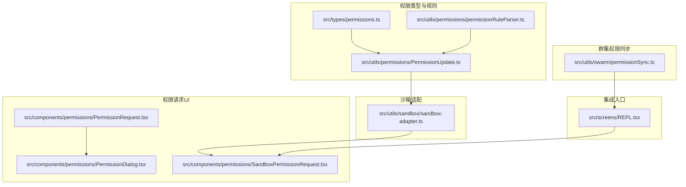
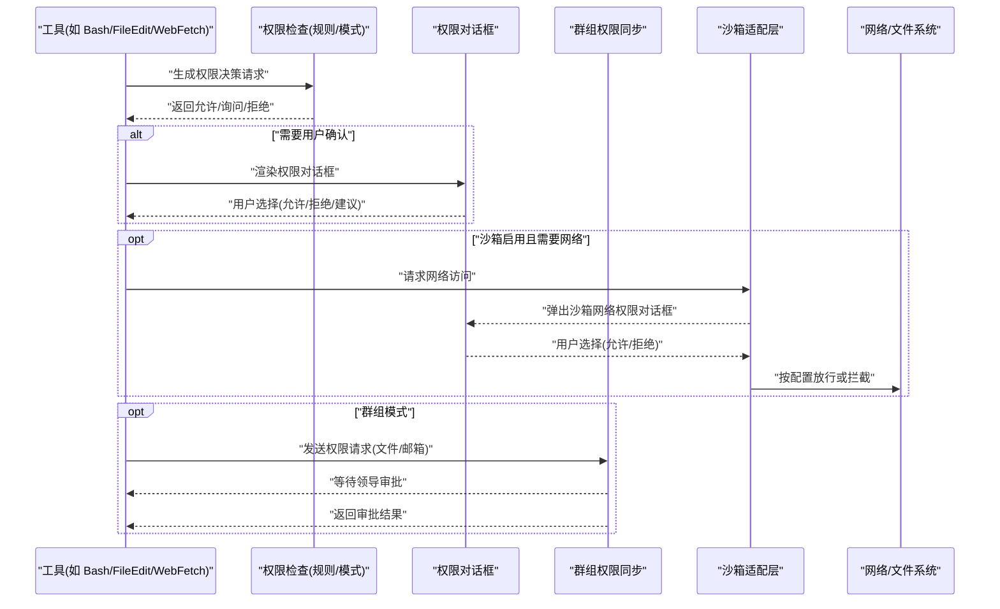
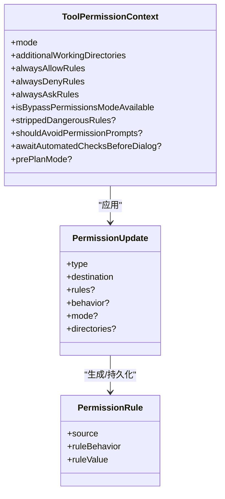
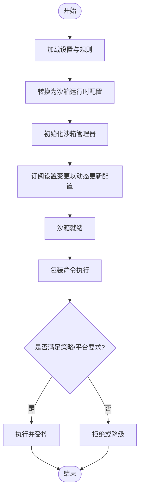
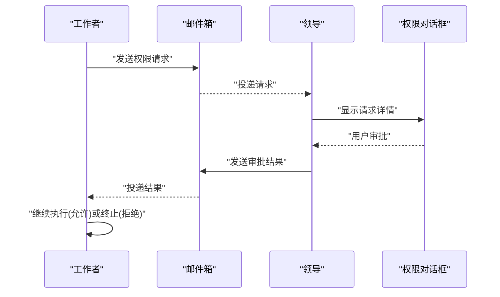
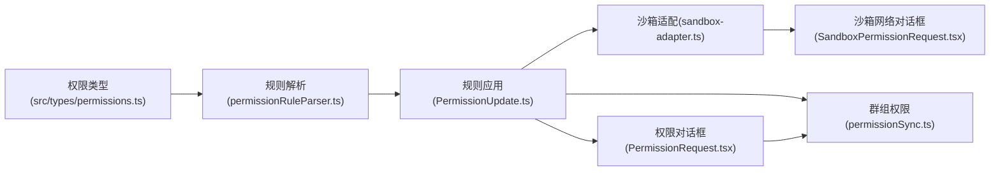

# 权限安全控制

<cite>
**本文引用的文件**
- [src/types/permissions.ts](file://src/types/permissions.ts)
- [src/utils/permissions/PermissionUpdate.ts](file://src/utils/permissions/PermissionUpdate.ts)
- [src/utils/permissions/permissionRuleParser.ts](file://src/utils/permissions/permissionRuleParser.ts)
- [src/utils/permissions/PermissionResult.ts](file://src/utils/permissions/PermissionResult.ts)
- [src/utils/sandbox/sandbox-adapter.ts](file://src/utils/sandbox/sandbox-adapter.ts)
- [src/components/permissions/PermissionRequest.tsx](file://src/components/permissions/PermissionRequest.tsx)
- [src/components/permissions/PermissionDialog.tsx](file://src/components/permissions/PermissionDialog.tsx)
- [src/components/permissions/SandboxPermissionRequest.tsx](file://src/components/permissions/SandboxPermissionRequest.tsx)
- [src/utils/swarm/permissionSync.ts](file://src/utils/swarm/permissionSync.ts)
- [src/screens/REPL.tsx](file://src/screens/REPL.tsx)
- [src/utils/suggestions/src/utils/fsOperations.ts](file://src/utils/suggestions/src/utils/fsOperations.ts)
- [src/components/permissions/SedEditPermissionRequest/src/utils/fsOperations.ts](file://src/components/permissions/SedEditPermissionRequest/src/utils/fsOperations.ts)
- [src/src/utils/fsOperations.ts](file://src/src/utils/fsOperations.ts)
</cite>

## 目录
1. [引言](#引言)
2. [项目结构](#项目结构)
3. [核心组件](#核心组件)
4. [架构总览](#架构总览)
5. [详细组件分析](#详细组件分析)
6. [依赖关系分析](#依赖关系分析)
7. [性能考量](#性能考量)
8. [故障排查指南](#故障排查指南)
9. [结论](#结论)
10. [附录](#附录)

## 引言
本文件系统性阐述 Claude Code 的权限与安全控制体系，覆盖权限模型、自动模式、绕过权限、沙箱控制、请求与审批流程、配置与审计等主题。目标是帮助开发者与运维人员理解并正确使用该系统，确保在开放工具链能力的同时维持强约束的安全边界。

## 项目结构
围绕权限与安全的关键目录与文件如下：
- 类型与规则：src/types/permissions.ts 定义权限模式、行为、规则、更新与决策类型；配合解析器与应用逻辑。
- 权限应用与持久化：src/utils/permissions/PermissionUpdate.ts 提供规则增删改与持久化；permissionRuleParser.ts 负责规则字符串与对象互转。
- 沙箱适配层：src/utils/sandbox/sandbox-adapter.ts 将设置转换为沙箱运行时配置，负责网络、文件系统、依赖检查与平台支持。
- 权限请求 UI：src/components/permissions 下的各类 PermissionRequest 组件承载不同工具的权限对话框；SandboxPermissionRequest.tsx 处理网络访问沙箱请求。
- 群体（Swarm）权限同步：src/utils/swarm/permissionSync.ts 提供跨代理的权限请求/响应与邮件箱通信。
- REPL 集成：src/screens/REPL.tsx 展示沙箱权限请求的发起与回调注册流程。

**图表来源**
- [src/types/permissions.ts:1-442](file://src/types/permissions.ts#L1-L442)
- [src/utils/permissions/permissionRuleParser.ts:1-199](file://src/utils/permissions/permissionRuleParser.ts#L1-L199)
- [src/utils/permissions/PermissionUpdate.ts:1-390](file://src/utils/permissions/PermissionUpdate.ts#L1-L390)
- [src/utils/sandbox/sandbox-adapter.ts:1-800](file://src/utils/sandbox/sandbox-adapter.ts#L1-L800)
- [src/components/permissions/PermissionRequest.tsx:1-217](file://src/components/permissions/PermissionRequest.tsx#L1-L217)
- [src/components/permissions/PermissionDialog.tsx:1-72](file://src/components/permissions/PermissionDialog.tsx#L1-L72)
- [src/components/permissions/SandboxPermissionRequest.tsx:1-163](file://src/components/permissions/SandboxPermissionRequest.tsx#L1-L163)
- [src/utils/swarm/permissionSync.ts:1-800](file://src/utils/swarm/permissionSync.ts#L1-L800)
- [src/screens/REPL.tsx:2225-2269](file://src/screens/REPL.tsx#L2225-L2269)

**章节来源**
- [src/types/permissions.ts:1-442](file://src/types/permissions.ts#L1-L442)
- [src/utils/permissions/PermissionUpdate.ts:1-390](file://src/utils/permissions/PermissionUpdate.ts#L1-L390)
- [src/utils/sandbox/sandbox-adapter.ts:1-800](file://src/utils/sandbox/sandbox-adapter.ts#L1-L800)
- [src/components/permissions/PermissionRequest.tsx:1-217](file://src/components/permissions/PermissionRequest.tsx#L1-L217)
- [src/components/permissions/SandboxPermissionRequest.tsx:1-163](file://src/components/permissions/SandboxPermissionRequest.tsx#L1-L163)
- [src/utils/swarm/permissionSync.ts:1-800](file://src/utils/swarm/permissionSync.ts#L1-L800)
- [src/screens/REPL.tsx:2225-2269](file://src/screens/REPL.tsx#L2225-L2269)

## 核心组件
- 权限模式与决策
  - 模式：默认(default)、不询问(dontAsk)、接受编辑(acceptEdits)、绕过权限(bypassPermissions)、计划(plan)、自动(auto)、冒泡(bubble)。
  - 行为：允许(allow)、拒绝(deny)、询问(ask)。
  - 决策结果：允许、询问、拒绝、透传(passthrough)，并带有原因与建议。
- 规则与更新
  - 规则来源：用户设置、项目设置、本地设置、标志位设置、策略设置、命令行参数、会话。
  - 更新操作：添加/替换/移除规则、设置模式、添加/移除工作目录。
- 沙箱配置
  - 将权限规则映射为网络域白名单/黑名单、文件系统读写路径集合，并结合平台能力与依赖状态启用/禁用沙箱。
- 请求与对话框
  - 不同工具对应专用权限对话框；网络访问通过沙箱回调触发沙箱权限请求对话框。
- 群体权限同步
  - 工作者向领导发送权限请求，领导在本地 UI 审批后回传，工作者轮询获取结果。

**章节来源**
- [src/types/permissions.ts:16-324](file://src/types/permissions.ts#L16-L324)
- [src/utils/permissions/PermissionUpdate.ts:55-187](file://src/utils/permissions/PermissionUpdate.ts#L55-L187)
- [src/utils/sandbox/sandbox-adapter.ts:172-381](file://src/utils/sandbox/sandbox-adapter.ts#L172-L381)
- [src/components/permissions/PermissionRequest.tsx:47-82](file://src/components/permissions/PermissionRequest.tsx#L47-L82)
- [src/utils/swarm/permissionSync.ts:49-106](file://src/utils/swarm/permissionSync.ts#L49-L106)

## 架构总览
下图展示从工具调用到权限决策、沙箱执行与群组协作的整体流程。

**图表来源**
- [src/utils/permissions/PermissionResult.ts:1-36](file://src/utils/permissions/PermissionResult.ts#L1-L36)
- [src/components/permissions/PermissionRequest.tsx:146-217](file://src/components/permissions/PermissionRequest.tsx#L146-L217)
- [src/components/permissions/SandboxPermissionRequest.tsx:15-163](file://src/components/permissions/SandboxPermissionRequest.tsx#L15-L163)
- [src/utils/sandbox/sandbox-adapter.ts:744-755](file://src/utils/sandbox/sandbox-adapter.ts#L744-L755)
- [src/utils/swarm/permissionSync.ts:676-722](file://src/utils/swarm/permissionSync.ts#L676-L722)

## 详细组件分析

### 权限模型与规则
- 模式与行为
  - 模式集合包含外部可暴露模式与内部运行态模式；行为分为 allow/deny/ask。
  - 决策原因类型涵盖规则命中、模式、子命令结果、钩子、异步代理、沙箱覆盖、分类器、工作目录、安全检查等。
- 规则值与解析
  - 规则值包含工具名与可选内容；解析器处理转义括号、兼容旧工具名别名。
- 规则持久化与更新
  - 支持添加/替换/移除规则、设置模式、添加/移除工作目录；仅对可持久化来源进行写入。

**图表来源**
- [src/types/permissions.ts:419-441](file://src/types/permissions.ts#L419-L441)
- [src/utils/permissions/PermissionUpdate.ts:98-187](file://src/utils/permissions/PermissionUpdate.ts#L98-L187)
- [src/utils/permissions/permissionRuleParser.ts:93-152](file://src/utils/permissions/permissionRuleParser.ts#L93-L152)

**章节来源**
- [src/types/permissions.ts:16-324](file://src/types/permissions.ts#L16-L324)
- [src/utils/permissions/permissionRuleParser.ts:1-199](file://src/utils/permissions/permissionRuleParser.ts#L1-L199)
- [src/utils/permissions/PermissionUpdate.ts:55-342](file://src/utils/permissions/PermissionUpdate.ts#L55-L342)

### 沙箱系统实现
- 配置转换
  - 将权限规则映射为网络域白名单/黑名单、文件系统读/写路径集合；处理设置文件保护、.git 裸仓库防护、工作树主仓库路径等。
- 平台与依赖
  - 检测平台支持、依赖可用性、策略限制；支持按平台启用列表；提供不可用原因提示。
- 运行时包装
  - 初始化沙箱、动态刷新配置、网络回调拦截；提供排除命令、弱化隔离选项等。

**图表来源**
- [src/utils/sandbox/sandbox-adapter.ts:172-381](file://src/utils/sandbox/sandbox-adapter.ts#L172-L381)
- [src/utils/sandbox/sandbox-adapter.ts:730-792](file://src/utils/sandbox/sandbox-adapter.ts#L730-L792)
- [src/utils/sandbox/sandbox-adapter.ts:528-592](file://src/utils/sandbox/sandbox-adapter.ts#L528-L592)

**章节来源**
- [src/utils/sandbox/sandbox-adapter.ts:1-800](file://src/utils/sandbox/sandbox-adapter.ts#L1-L800)

### 权限请求与审批流程
- 工具侧决策
  - 工具根据上下文生成权限决策；若为 ask，则渲染对应权限对话框。
- 用户交互
  - 对话框支持允许、拒绝、建议规则；可携带更新输入、反馈与内容块。
- 群组协作
  - 工作者通过邮箱消息向领导提交请求；领导审批后回传；工作者轮询获取结果。
- 沙箱网络请求
  - 当沙箱需要网络访问时，触发沙箱权限请求对话框，支持“不再询问”持久化。

**图表来源**
- [src/utils/swarm/permissionSync.ts:676-722](file://src/utils/swarm/permissionSync.ts#L676-L722)
- [src/utils/swarm/permissionSync.ts:734-783](file://src/utils/swarm/permissionSync.ts#L734-L783)
- [src/screens/REPL.tsx:2225-2269](file://src/screens/REPL.tsx#L2225-L2269)
- [src/components/permissions/SandboxPermissionRequest.tsx:15-163](file://src/components/permissions/SandboxPermissionRequest.tsx#L15-L163)

**章节来源**
- [src/components/permissions/PermissionRequest.tsx:146-217](file://src/components/permissions/PermissionRequest.tsx#L146-L217)
- [src/components/permissions/PermissionDialog.tsx:1-72](file://src/components/permissions/PermissionDialog.tsx#L1-L72)
- [src/utils/swarm/permissionSync.ts:1-800](file://src/utils/swarm/permissionSync.ts#L1-L800)
- [src/screens/REPL.tsx:2225-2269](file://src/screens/REPL.tsx#L2225-L2269)

### 权限分类与控制策略
- 文件系统权限
  - 基于规则与设置生成 allow/deny 列表；保护设置文件与 .claude/skills；处理工作树主仓库路径；对裸仓库文件进行预清理。
- Shell 执行权限
  - 结合沙箱与自动模式；支持排除命令、弱化网络隔离；提供不可用原因提示。
- 网络访问权限
  - 规则与策略共同决定允许/拒绝域；支持仅受管域模式；网络回调中强制策略。
- 敏感操作权限
  - 通过 ask 决策与分类器评估；支持 passthrough 与安全检查；拒绝原因包含分类器与工作目录等。

**章节来源**
- [src/utils/sandbox/sandbox-adapter.ts:222-381](file://src/utils/sandbox/sandbox-adapter.ts#L222-L381)
- [src/types/permissions.ts:269-324](file://src/types/permissions.ts#L269-L324)

### 权限配置指南
- 规则定义
  - 使用工具名与可选内容定义规则；内容中括号需转义；支持旧工具名别名。
- 白名单管理
  - 通过添加规则或设置模式实现；注意策略设置可能锁定某些沙箱设置。
- 策略调整
  - 受管域模式、平台启用列表、依赖检查与失败回退策略。
- 审计日志
  - 决策原因与分类器使用情况可用于审计；建议保留必要的日志以便复盘。

**章节来源**
- [src/utils/permissions/permissionRuleParser.ts:55-152](file://src/utils/permissions/permissionRuleParser.ts#L55-L152)
- [src/utils/permissions/PermissionUpdate.ts:222-342](file://src/utils/permissions/PermissionUpdate.ts#L222-L342)
- [src/utils/sandbox/sandbox-adapter.ts:647-664](file://src/utils/sandbox/sandbox-adapter.ts#L647-L664)

## 依赖关系分析
- 权限类型与规则
  - 类型定义位于 src/types/permissions.ts；解析与应用逻辑位于 PermissionUpdate.ts 与 permissionRuleParser.ts。
- 沙箱适配
  - 依赖设置系统与平台信息；将权限规则转换为沙箱运行时配置。
- 请求与对话框
  - 工具侧根据工具类型选择对应权限对话框；沙箱网络请求独立对话框。
- 群组权限同步
  - 通过邮件箱消息传递请求与响应；提供轮询接口与历史清理。

**图表来源**
- [src/types/permissions.ts:1-442](file://src/types/permissions.ts#L1-L442)
- [src/utils/permissions/permissionRuleParser.ts:1-199](file://src/utils/permissions/permissionRuleParser.ts#L1-L199)
- [src/utils/permissions/PermissionUpdate.ts:1-390](file://src/utils/permissions/PermissionUpdate.ts#L1-L390)
- [src/utils/sandbox/sandbox-adapter.ts:1-800](file://src/utils/sandbox/sandbox-adapter.ts#L1-L800)
- [src/components/permissions/PermissionRequest.tsx:1-217](file://src/components/permissions/PermissionRequest.tsx#L1-L217)
- [src/components/permissions/SandboxPermissionRequest.tsx:1-163](file://src/components/permissions/SandboxPermissionRequest.tsx#L1-L163)
- [src/utils/swarm/permissionSync.ts:1-800](file://src/utils/swarm/permissionSync.ts#L1-L800)

**章节来源**
- [src/types/permissions.ts:1-442](file://src/types/permissions.ts#L1-L442)
- [src/utils/permissions/PermissionUpdate.ts:1-390](file://src/utils/permissions/PermissionUpdate.ts#L1-L390)
- [src/utils/sandbox/sandbox-adapter.ts:1-800](file://src/utils/sandbox/sandbox-adapter.ts#L1-L800)
- [src/utils/swarm/permissionSync.ts:1-800](file://src/utils/swarm/permissionSync.ts#L1-L800)

## 性能考量
- 规则解析与持久化
  - 规则字符串与对象互转采用惰性解析与缓存策略，避免重复计算。
- 沙箱初始化
  - 依赖检查与平台检测采用记忆化；配置变更通过订阅事件动态更新，减少全量重建。
- 群组权限同步
  - 文件锁保证原子写入；轮询间隔与清理策略降低磁盘压力。

[本节为通用指导，无需特定文件来源]

## 故障排查指南
- 沙箱不可用
  - 检查平台支持与依赖缺失；查看不可用原因提示；确认策略设置是否锁定。
- 权限未生效
  - 确认规则来源优先级与持久化位置；核对工作目录添加与规则冲突。
- 群组权限未返回
  - 检查邮件箱消息投递与轮询；确认请求/响应格式与时间戳。
- 沙箱网络被拒
  - 核对受管域模式与域名规则；确认“不再询问”持久化影响。

**章节来源**
- [src/utils/sandbox/sandbox-adapter.ts:562-592](file://src/utils/sandbox/sandbox-adapter.ts#L562-L592)
- [src/utils/swarm/permissionSync.ts:320-353](file://src/utils/swarm/permissionSync.ts#L320-L353)
- [src/components/permissions/SandboxPermissionRequest.tsx:78-82](file://src/components/permissions/SandboxPermissionRequest.tsx#L78-L82)

## 结论
该权限安全控制系统以“规则+模式+沙箱”的组合实现强约束与灵活性的平衡：规则与模式提供细粒度控制，沙箱提供进程与资源隔离，群组权限同步保障多代理协作场景的一致性。通过完善的类型系统、解析与应用逻辑、UI 对话框与策略开关，系统在保障安全的同时兼顾易用性与可观测性。

## 附录
- 文件系统工具占位
  - 用于文件操作的工具函数存在类型占位，实际实现位于其他模块。

**章节来源**
- [src/utils/suggestions/src/utils/fsOperations.ts:1-2](file://src/utils/suggestions/src/utils/fsOperations.ts#L1-L2)
- [src/components/permissions/SedEditPermissionRequest/src/utils/fsOperations.ts:1-2](file://src/components/permissions/SedEditPermissionRequest/src/utils/fsOperations.ts#L1-L2)
- [src/src/utils/fsOperations.ts:1-3](file://src/src/utils/fsOperations.ts#L1-L3)