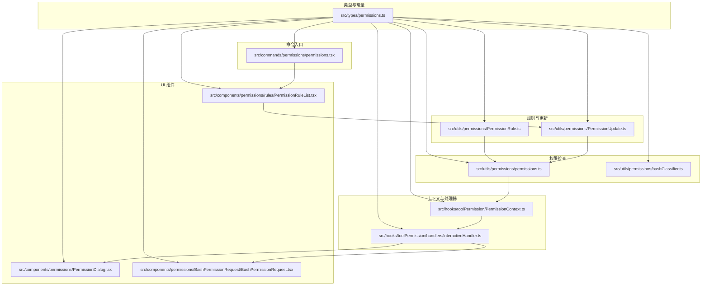
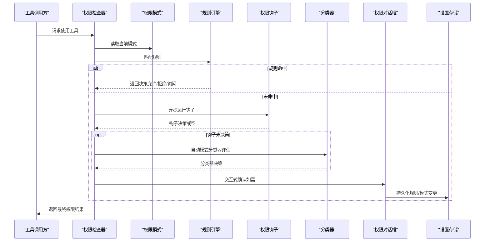
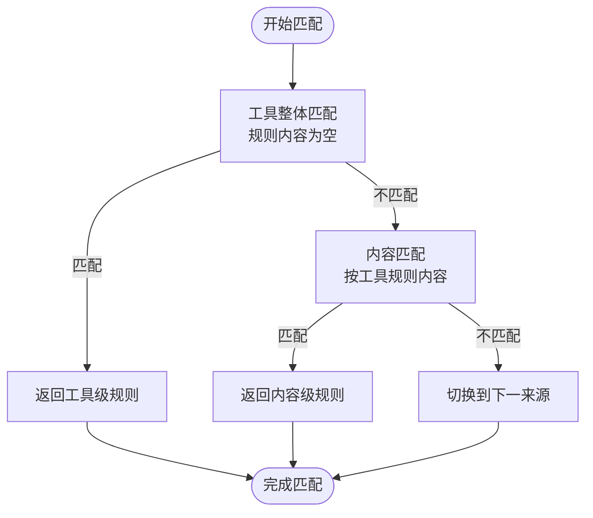
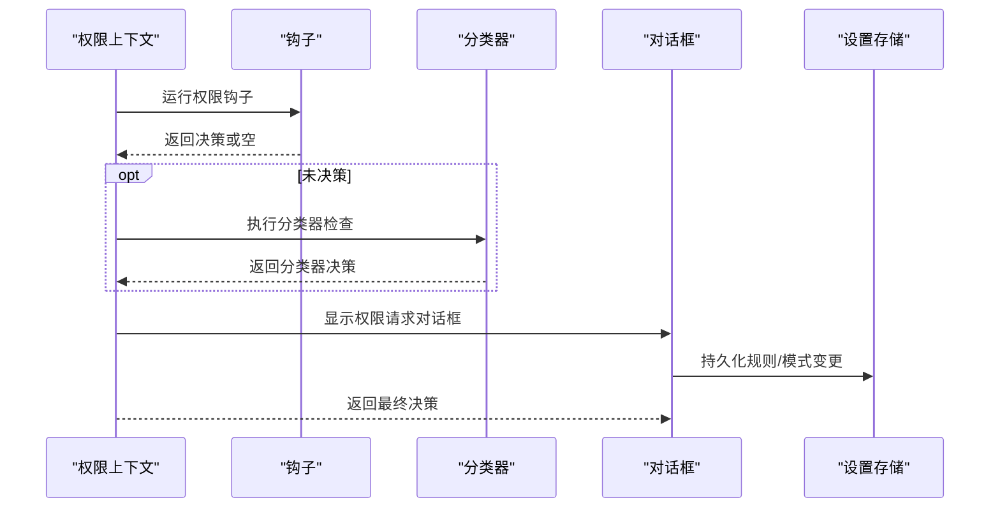
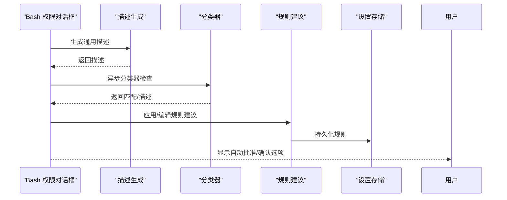
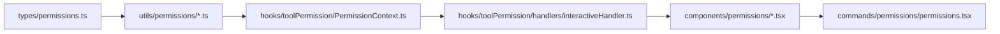
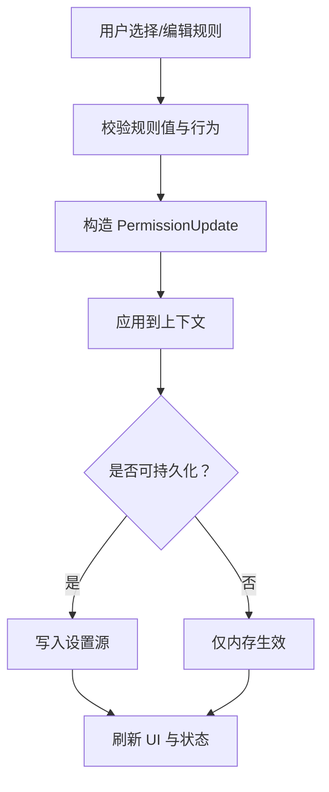

# 权限模型设计

<cite>
**本文档引用的文件**
- [src/types/permissions.ts](file://src/types/permissions.ts)
- [src/utils/permissions/permissions.ts](file://src/utils/permissions/permissions.ts)
- [src/utils/permissions/PermissionResult.ts](file://src/utils/permissions/PermissionResult.ts)
- [src/utils/permissions/PermissionRule.ts](file://src/utils/permissions/PermissionRule.ts)
- [src/utils/permissions/PermissionUpdate.ts](file://src/utils/permissions/PermissionUpdate.ts)
- [src/utils/permissions/bashClassifier.ts](file://src/utils/permissions/bashClassifier.ts)
- [src/hooks/toolPermission/PermissionContext.ts](file://src/hooks/toolPermission/PermissionContext.ts)
- [src/hooks/toolPermission/handlers/interactiveHandler.ts](file://src/hooks/toolPermission/handlers/interactiveHandler.ts)
- [src/components/permissions/BashPermissionRequest/BashPermissionRequest.tsx](file://src/components/permissions/BashPermissionRequest/BashPermissionRequest.tsx)
- [src/components/permissions/PermissionDialog.tsx](file://src/components/permissions/PermissionDialog.tsx)
- [src/components/permissions/rules/PermissionRuleList.tsx](file://src/components/permissions/rules/PermissionRuleList.tsx)
- [src/commands/permissions/permissions.tsx](file://src/commands/permissions/permissions.tsx)
</cite>

## 目录
1. [简介](#简介)
2. [项目结构](#项目结构)
3. [核心组件](#核心组件)
4. [架构总览](#架构总览)
5. [详细组件分析](#详细组件分析)
6. [依赖关系分析](#依赖关系分析)
7. [性能考量](#性能考量)
8. [故障排查指南](#故障排查指南)
9. [结论](#结论)
10. [附录](#附录)

## 简介
本文件系统性阐述 Claude Code 的权限模型设计，覆盖权限分类体系、权限级别定义、权限继承与来源、权限模式（PermissionMode）的实现与适用场景、权限规则（PermissionRule）的定义与匹配机制、权限结果（PermissionResult）的生成与处理流程，并提供配置指南与最佳实践。目标是帮助开发者与运维人员在理解代码实现的基础上，安全高效地配置与扩展权限策略。

## 项目结构
权限模型相关代码主要分布在以下模块：
- 类型与常量：统一定义权限行为、规则、模式、结果等核心类型与集合
- 规则解析与持久化：规则字符串与对象互转、规则增删改写入设置
- 权限检查与决策：工具使用前的权限判定、自动模式与分类器集成
- 上下文与处理器：权限上下文构建、交互式权限对话流程、远程桥接与通道回调
- UI 组件：权限请求对话框、Bash 权限请求、规则列表与编辑界面
- 命令入口：权限规则列表命令

**图表来源**
- [src/types/permissions.ts](file://src/types/permissions.ts)
- [src/utils/permissions/permissions.ts](file://src/utils/permissions/permissions.ts)
- [src/utils/permissions/PermissionRule.ts](file://src/utils/permissions/PermissionRule.ts)
- [src/utils/permissions/PermissionUpdate.ts](file://src/utils/permissions/PermissionUpdate.ts)
- [src/utils/permissions/bashClassifier.ts](file://src/utils/permissions/bashClassifier.ts)
- [src/hooks/toolPermission/PermissionContext.ts](file://src/hooks/toolPermission/PermissionContext.ts)
- [src/hooks/toolPermission/handlers/interactiveHandler.ts](file://src/hooks/toolPermission/handlers/interactiveHandler.ts)
- [src/components/permissions/PermissionDialog.tsx](file://src/components/permissions/PermissionDialog.tsx)
- [src/components/permissions/BashPermissionRequest/BashPermissionRequest.tsx](file://src/components/permissions/BashPermissionRequest/BashPermissionRequest.tsx)
- [src/components/permissions/rules/PermissionRuleList.tsx](file://src/components/permissions/rules/PermissionRuleList.tsx)
- [src/commands/permissions/permissions.tsx](file://src/commands/permissions/permissions.tsx)

**章节来源**
- [src/types/permissions.ts](file://src/types/permissions.ts)
- [src/utils/permissions/permissions.ts](file://src/utils/permissions/permissions.ts)
- [src/utils/permissions/PermissionRule.ts](file://src/utils/permissions/PermissionRule.ts)
- [src/utils/permissions/PermissionUpdate.ts](file://src/utils/permissions/PermissionUpdate.ts)
- [src/utils/permissions/bashClassifier.ts](file://src/utils/permissions/bashClassifier.ts)
- [src/hooks/toolPermission/PermissionContext.ts](file://src/hooks/toolPermission/PermissionContext.ts)
- [src/hooks/toolPermission/handlers/interactiveHandler.ts](file://src/hooks/toolPermission/handlers/interactiveHandler.ts)
- [src/components/permissions/PermissionDialog.tsx](file://src/components/permissions/PermissionDialog.tsx)
- [src/components/permissions/BashPermissionRequest/BashPermissionRequest.tsx](file://src/components/permissions/BashPermissionRequest/BashPermissionRequest.tsx)
- [src/components/permissions/rules/PermissionRuleList.tsx](file://src/components/permissions/rules/PermissionRuleList.tsx)
- [src/commands/permissions/permissions.tsx](file://src/commands/permissions/permissions.tsx)

## 核心组件
- 权限模式（PermissionMode）
  - 外部模式集合包含：接受编辑（acceptEdits）、绕过权限（bypassPermissions）、默认（default）、不询问（dontAsk）、计划模式（plan）
  - 内部模式集合在外部基础上，按特性开关可能包含自动模式（auto）
  - 模式用于决定权限检查的严格程度与是否允许自动审批
- 权限行为（PermissionBehavior）
  - 允许（allow）、拒绝（deny）、询问（ask）
- 权限规则（PermissionRule）
  - 规则值由工具名与可选内容组成；规则来源包括用户设置、项目设置、本地设置、策略设置、标志设置、CLI 参数、命令、会话等
  - 规则按行为分为“总是允许”、“总是拒绝”、“总是询问”
- 权限更新（PermissionUpdate）
  - 支持添加/替换/删除规则、设置模式、增删工作目录等操作，并可持久化到可编辑设置源
- 权限结果（PermissionResult）
  - 结果包含允许、拒绝、询问三类决策，以及“透传”（passthrough）等扩展形态
  - 决策原因（PermissionDecisionReason）涵盖规则、模式、子命令结果、钩子、分类器、工作目录、安全检查等

**章节来源**
- [src/types/permissions.ts](file://src/types/permissions.ts)
- [src/utils/permissions/PermissionRule.ts](file://src/utils/permissions/PermissionRule.ts)
- [src/utils/permissions/PermissionUpdate.ts](file://src/utils/permissions/PermissionUpdate.ts)
- [src/utils/permissions/PermissionResult.ts](file://src/utils/permissions/PermissionResult.ts)

## 架构总览
权限模型采用“规则驱动 + 模式控制 + 分类器辅助”的分层架构：
- 规则层：集中管理各类来源的规则，支持按工具与内容进行匹配
- 模式层：根据当前模式决定是否需要人工确认或可自动审批
- 分类器层：在自动/严格模式下对高风险动作进行快速判断
- 处理层：构建权限上下文、执行钩子、发起交互式对话、处理远程桥接与通道
- UI 层：提供权限请求对话框、Bash 权限请求、规则列表与编辑界面

**图表来源**
- [src/utils/permissions/permissions.ts](file://src/utils/permissions/permissions.ts)
- [src/hooks/toolPermission/handlers/interactiveHandler.ts](file://src/hooks/toolPermission/handlers/interactiveHandler.ts)
- [src/utils/permissions/PermissionUpdate.ts](file://src/utils/permissions/PermissionUpdate.ts)

## 详细组件分析

### 权限模式（PermissionMode）实现
- 模式集合
  - 外部模式：acceptEdits、bypassPermissions、default、dontAsk、plan
  - 内部模式：在外部基础上，按特性开关（如 TRANSCRIPT_CLASSIFIER）可能包含 auto
- 模式作用
  - dontAsk：将“询问”转换为“拒绝”，适合无头环境或严格限制
  - auto/plan：在满足条件时使用分类器自动审批，减少交互
  - acceptEdits：对安全编辑类操作走快速路径
- 适用场景
  - 开发者日常：auto 或 plan 提升效率
  - CI/无头：dontAsk 或 default
  - 安全敏感：bypassPermissions（仅在受控场景）或 strict 场景

**章节来源**
- [src/types/permissions.ts](file://src/types/permissions.ts)
- [src/utils/permissions/permissions.ts](file://src/utils/permissions/permissions.ts)

### 权限规则（PermissionRule）定义与匹配
- 规则结构
  - 规则值：包含工具名与可选内容（如 Bash 的前缀规则）
  - 规则来源：用户设置、项目设置、本地设置、策略设置、标志设置、CLI 参数、命令、会话
  - 行为：allow/deny/ask
- 匹配算法
  - 工具整体匹配：当规则内容为空时，直接匹配工具名或 MCP 服务器级规则
  - 内容匹配：按工具提供的规则内容进行匹配（如 Bash 前缀）
  - 规则聚合：从各来源收集规则，形成“总是允许/拒绝/询问”集合
- 优先级处理
  - deny > ask > allow；同一来源内后写覆盖先写（通过追加/替换操作体现）

**图表来源**
- [src/utils/permissions/permissions.ts](file://src/utils/permissions/permissions.ts)
- [src/utils/permissions/PermissionRule.ts](file://src/utils/permissions/PermissionRule.ts)

**章节来源**
- [src/utils/permissions/permissions.ts](file://src/utils/permissions/permissions.ts)
- [src/utils/permissions/PermissionRule.ts](file://src/utils/permissions/PermissionRule.ts)

### 权限结果（PermissionResult）生成与处理
- 决策类型
  - 允许（allow）：可直接执行，支持附加输入更新、反馈内容块等
  - 拒绝（deny）：明确拒绝，附带原因与消息
  - 询问（ask）：触发交互式确认，支持建议规则、阻断路径、元数据等
  - 透传（passthrough）：用于特殊场景的中间态
- 决策原因（DecisionReason）
  - 规则命中、模式影响、子命令结果、钩子、分类器、工作目录、安全检查等
- 处理流程
  - 权限上下文构建：记录工具、输入、消息、工具使用 ID、队列操作等
  - 钩子执行：异步运行权限请求钩子，可能直接给出允许/拒绝
  - 分类器评估：在自动/严格模式下进行快速判断
  - 交互式确认：弹出对话框，支持规则建议、编辑前缀、分类器描述等
  - 持久化更新：将用户选择的规则与模式变更写回设置

**图表来源**
- [src/hooks/toolPermission/PermissionContext.ts](file://src/hooks/toolPermission/PermissionContext.ts)
- [src/hooks/toolPermission/handlers/interactiveHandler.ts](file://src/hooks/toolPermission/handlers/interactiveHandler.ts)
- [src/utils/permissions/PermissionUpdate.ts](file://src/utils/permissions/PermissionUpdate.ts)

**章节来源**
- [src/hooks/toolPermission/PermissionContext.ts](file://src/hooks/toolPermission/PermissionContext.ts)
- [src/hooks/toolPermission/handlers/interactiveHandler.ts](file://src/hooks/toolPermission/handlers/interactiveHandler.ts)
- [src/utils/permissions/PermissionResult.ts](file://src/utils/permissions/PermissionResult.ts)

### Bash 权限请求与分类器集成
- Bash 权限请求对话框
  - 支持破坏性命令警告、沙箱状态提示、分类器描述生成、规则建议应用等
  - 支持用户编辑前缀规则、基于分类器描述生成新规则、一键应用子命令建议
- 分类器集成
  - 在自动模式下，对 Bash 命令进行快速分类，支持“自动批准”过渡态与 Esc 取消
  - 分类器描述与匹配规则可用于后续规则生成与持久化

**图表来源**
- [src/components/permissions/BashPermissionRequest/BashPermissionRequest.tsx](file://src/components/permissions/BashPermissionRequest/BashPermissionRequest.tsx)
- [src/utils/permissions/bashClassifier.ts](file://src/utils/permissions/bashClassifier.ts)

**章节来源**
- [src/components/permissions/BashPermissionRequest/BashPermissionRequest.tsx](file://src/components/permissions/BashPermissionRequest/BashPermissionRequest.tsx)
- [src/utils/permissions/bashClassifier.ts](file://src/utils/permissions/bashClassifier.ts)

### 权限规则列表与编辑
- 规则列表
  - 支持最近拒绝、允许、询问、拒绝四类规则的浏览与搜索
  - 支持添加/删除工作目录、查看规则来源、检测不可达规则（屏蔽/阻断）
- 编辑流程
  - 输入规则值与行为，校验后批量添加
  - 删除规则时提供二次确认
  - 将规则持久化到对应设置源

**章节来源**
- [src/components/permissions/rules/PermissionRuleList.tsx](file://src/components/permissions/rules/PermissionRuleList.tsx)
- [src/utils/permissions/PermissionUpdate.ts](file://src/utils/permissions/PermissionUpdate.ts)

## 依赖关系分析
- 类型解耦
  - 权限类型与常量集中于 types/permissions.ts，避免循环依赖
  - 实现文件仅依赖该类型文件，确保稳定契约
- 规则与设置
  - 规则解析与持久化通过 permissionRuleParser 与 settings 模块协作
  - 权限更新支持原子性地应用到上下文并持久化
- 上下文与处理器
  - PermissionContext 负责日志、持久化、取消、分类器集成等横切关注点
  - interactiveHandler 将钩子、分类器、远程桥接、通道回调整合为统一的交互式流程

**图表来源**
- [src/types/permissions.ts](file://src/types/permissions.ts)
- [src/utils/permissions/permissions.ts](file://src/utils/permissions/permissions.ts)
- [src/hooks/toolPermission/PermissionContext.ts](file://src/hooks/toolPermission/PermissionContext.ts)
- [src/hooks/toolPermission/handlers/interactiveHandler.ts](file://src/hooks/toolPermission/handlers/interactiveHandler.ts)
- [src/components/permissions/PermissionDialog.tsx](file://src/components/permissions/PermissionDialog.tsx)
- [src/components/permissions/BashPermissionRequest/BashPermissionRequest.tsx](file://src/components/permissions/BashPermissionRequest/BashPermissionRequest.tsx)
- [src/components/permissions/rules/PermissionRuleList.tsx](file://src/components/permissions/rules/PermissionRuleList.tsx)
- [src/commands/permissions/permissions.tsx](file://src/commands/permissions/permissions.tsx)

**章节来源**
- [src/types/permissions.ts](file://src/types/permissions.ts)
- [src/utils/permissions/permissions.ts](file://src/utils/permissions/permissions.ts)
- [src/hooks/toolPermission/PermissionContext.ts](file://src/hooks/toolPermission/PermissionContext.ts)
- [src/hooks/toolPermission/handlers/interactiveHandler.ts](file://src/hooks/toolPermission/handlers/interactiveHandler.ts)
- [src/components/permissions/PermissionDialog.tsx](file://src/components/permissions/PermissionDialog.tsx)
- [src/components/permissions/BashPermissionRequest/BashPermissionRequest.tsx](file://src/components/permissions/BashPermissionRequest/BashPermissionRequest.tsx)
- [src/components/permissions/rules/PermissionRuleList.tsx](file://src/components/permissions/rules/PermissionRuleList.tsx)
- [src/commands/permissions/permissions.tsx](file://src/commands/permissions/permissions.tsx)

## 性能考量
- 分类器开销控制
  - 自动模式下优先尝试 acceptEdits 快速路径与安全工具白名单，避免不必要的分类器调用
  - 分类器失败时记录错误但不中断流程，保证稳定性
- 渲染与交互
  - Bash 权限对话框中将分类器“检查中”动画独立为轻量组件，避免整树重渲染
  - 使用 useMemo 与编译器优化，减少不必要的计算与渲染
- 设置持久化
  - 批量更新与去重，避免重复写入与冗余规则

[本节为通用指导，无需特定文件引用]

## 故障排查指南
- 无头/异步代理场景
  - 若权限请求钩子返回拒绝且要求中断，将触发中止信号；检查钩子逻辑与中断条件
- 分类器异常
  - 分类器 API 错误会被记录但不会导致用户取消；若频繁出现，检查网络与配额
- 规则冲突
  - deny 优先于 ask/allow；检查是否存在更严格的 deny 规则
  - 不可达规则（屏蔽/阻断）会在规则列表中提示，按建议修复
- 持久化失败
  - 检查设置源是否可编辑；仅本地设置、用户设置、项目设置支持持久化

**章节来源**
- [src/hooks/toolPermission/PermissionContext.ts](file://src/hooks/toolPermission/PermissionContext.ts)
- [src/hooks/toolPermission/handlers/interactiveHandler.ts](file://src/hooks/toolPermission/handlers/interactiveHandler.ts)
- [src/utils/permissions/PermissionUpdate.ts](file://src/utils/permissions/PermissionUpdate.ts)
- [src/components/permissions/rules/PermissionRuleList.tsx](file://src/components/permissions/rules/PermissionRuleList.tsx)

## 结论
Claude Code 的权限模型以类型安全的规则体系为核心，结合模式控制与分类器辅助，在保证安全性的同时兼顾易用性与性能。通过清晰的来源分层、可扩展的规则语法、完善的交互与持久化机制，能够适应从开发到 CI 的多种场景需求。

[本节为总结性内容，无需特定文件引用]

## 附录

### 权限模式选择建议
- 开发者日常：auto 或 plan，提升效率
- CI/无头：dontAsk 或 default，减少交互
- 安全敏感：bypassPermissions（仅受控）、严格模式，配合 deny 规则

**章节来源**
- [src/types/permissions.ts](file://src/types/permissions.ts)
- [src/utils/permissions/permissions.ts](file://src/utils/permissions/permissions.ts)

### 规则编写最佳实践
- 使用最小权限原则：优先精确规则（含内容），避免通配符滥用
- 明确来源：将临时规则置于 session，常用规则置于 localSettings 或 userSettings
- 定期清理：利用规则列表检测不可达规则，及时移除失效规则
- 建议与复用：优先应用子命令建议，减少手写规则

**章节来源**
- [src/utils/permissions/PermissionUpdate.ts](file://src/utils/permissions/PermissionUpdate.ts)
- [src/components/permissions/rules/PermissionRuleList.tsx](file://src/components/permissions/rules/PermissionRuleList.tsx)

### 配置与持久化流程

**图表来源**
- [src/utils/permissions/PermissionUpdate.ts](file://src/utils/permissions/PermissionUpdate.ts)
- [src/hooks/toolPermission/PermissionContext.ts](file://src/hooks/toolPermission/PermissionContext.ts)