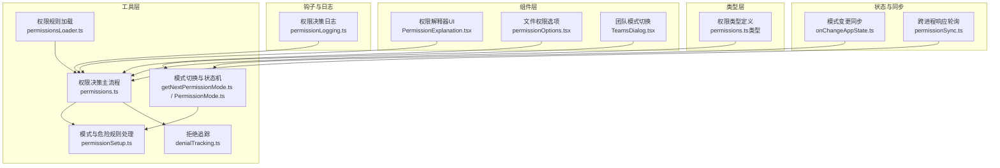
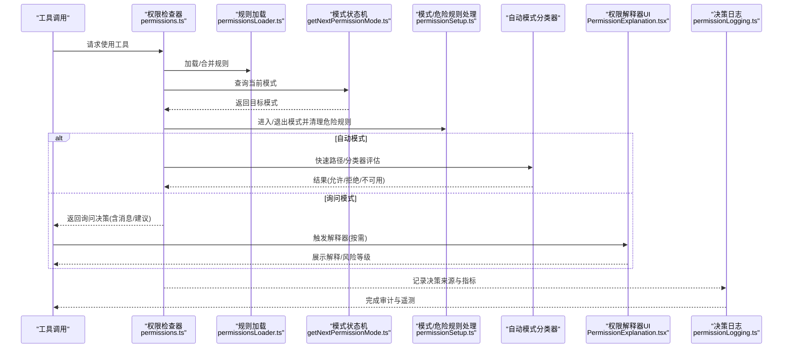
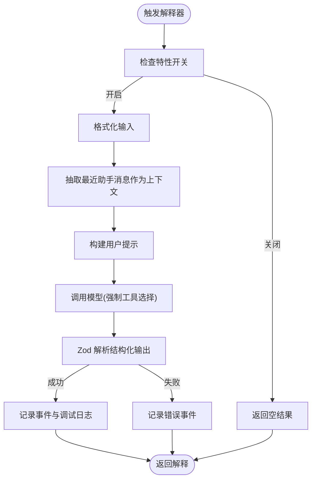
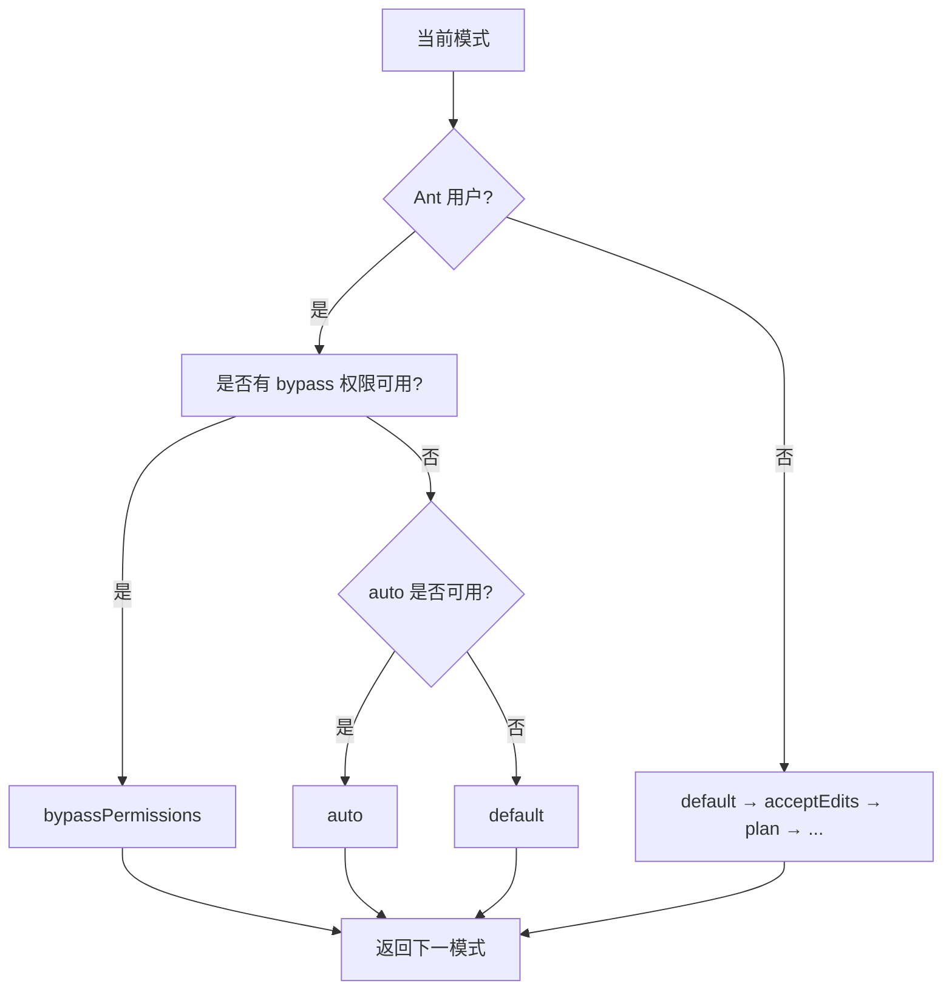
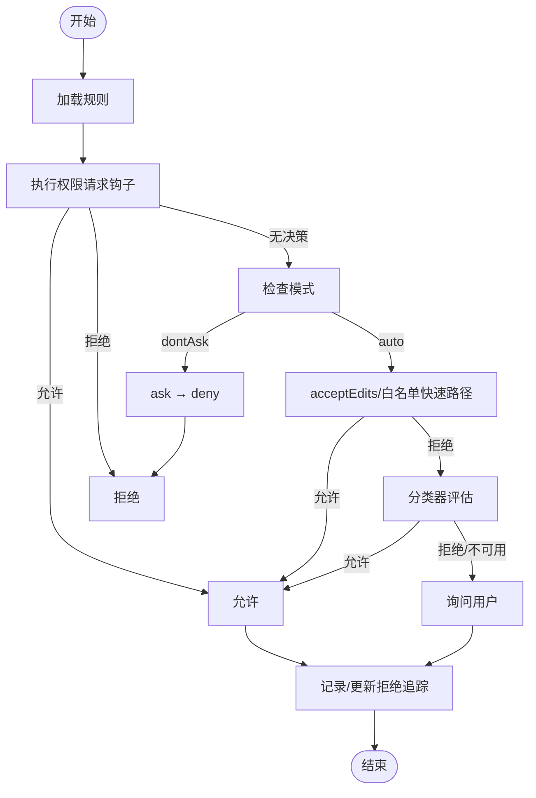
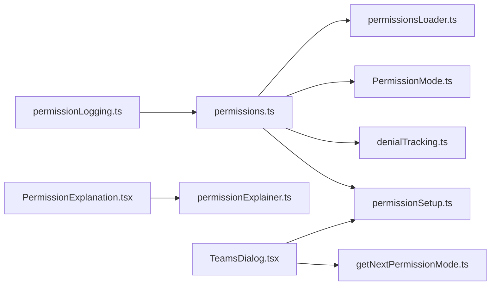

# 权限请求与审批流程

<cite>
**本文引用的文件**
- [permissionExplainer.ts](file://src/utils/permissions/permissionExplainer.ts)
- [PermissionExplanation.tsx](file://src/components/permissions/PermissionExplanation.tsx)
- [getNextPermissionMode.ts](file://src/utils/permissions/getNextPermissionMode.ts)
- [PermissionMode.ts](file://src/utils/permissions/PermissionMode.ts)
- [permissions.ts](file://src/utils/permissions/permissions.ts)
- [permissionSetup.ts](file://src/utils/permissions/permissionSetup.ts)
- [denialTracking.ts](file://src/utils/permissions/denialTracking.ts)
- [permissionOptions.tsx](file://src/components/permissions/FilePermissionDialog/permissionOptions.tsx)
- [permissionLogging.ts](file://src/hooks/toolPermission/permissionLogging.ts)
- [permissionsLoader.ts](file://src/utils/permissions/permissionsLoader.ts)
- [permissions.ts（类型定义）](file://src/types/permissions.ts)
- [onChangeAppState.ts](file://src/state/onChangeAppState.ts)
- [TeamsDialog.tsx](file://src/components/teams/TeamsDialog.tsx)
- [permissionSync.ts](file://src/utils/swarm/permissionSync.ts)
</cite>

## 目录
1. [简介](#简介)
2. [项目结构](#项目结构)
3. [核心组件](#核心组件)
4. [架构总览](#架构总览)
5. [详细组件分析](#详细组件分析)
6. [依赖关系分析](#依赖关系分析)
7. [性能考量](#性能考量)
8. [故障排查指南](#故障排查指南)
9. [结论](#结论)
10. [附录：配置与优化指南](#附录配置与优化指南)

## 简介
本文件系统性梳理 Claude Code 的权限请求与审批流程，覆盖从权限检测、请求触发、用户确认到决策执行的完整生命周期；深入解析权限解释器（permissionExplainer）的设计与实现；介绍权限拒绝追踪系统（denialTracking）的工作原理；详解“下一个权限模式”获取机制（getNextPermissionMode）及其状态管理；并提供可操作的配置与优化建议，帮助团队在安全与体验之间取得平衡。

## 项目结构
围绕权限子系统的代码主要分布在以下位置：
- 工具层：权限规则解析、决策主流程、自动模式与危险规则处理
- 组件层：权限解释器 UI、文件权限对话框选项、团队模式切换
- 类型层：权限模式、规则、决策结果等强类型定义
- 钩子与日志：统一的权限决策日志与遥测
- 状态与同步：应用状态变更时的模式同步、团队模式批量切换、跨进程响应轮询

图表来源
- [permissions.ts](file://src/utils/permissions/permissions.ts)
- [permissionSetup.ts](file://src/utils/permissions/permissionSetup.ts)
- [getNextPermissionMode.ts](file://src/utils/permissions/getNextPermissionMode.ts)
- [PermissionMode.ts](file://src/utils/permissions/PermissionMode.ts)
- [denialTracking.ts](file://src/utils/permissions/denialTracking.ts)
- [PermissionExplanation.tsx](file://src/components/permissions/PermissionExplanation.tsx)
- [permissionOptions.tsx](file://src/components/permissions/FilePermissionDialog/permissionOptions.tsx)
- [permissionLogging.ts](file://src/hooks/toolPermission/permissionLogging.ts)
- [permissionsLoader.ts](file://src/utils/permissions/permissionsLoader.ts)
- [permissions.ts（类型定义）](file://src/types/permissions.ts)
- [onChangeAppState.ts](file://src/state/onChangeAppState.ts)
- [TeamsDialog.tsx](file://src/components/teams/TeamsDialog.tsx)
- [permissionSync.ts](file://src/utils/swarm/permissionSync.ts)

章节来源
- [permissions.ts](file://src/utils/permissions/permissions.ts)
- [permissionSetup.ts](file://src/utils/permissions/permissionSetup.ts)
- [getNextPermissionMode.ts](file://src/utils/permissions/getNextPermissionMode.ts)
- [PermissionMode.ts](file://src/utils/permissions/PermissionMode.ts)
- [denialTracking.ts](file://src/utils/permissions/denialTracking.ts)
- [PermissionExplanation.tsx](file://src/components/permissions/PermissionExplanation.tsx)
- [permissionOptions.tsx](file://src/components/permissions/FilePermissionDialog/permissionOptions.tsx)
- [permissionLogging.ts](file://src/hooks/toolPermission/permissionLogging.ts)
- [permissionsLoader.ts](file://src/utils/permissions/permissionsLoader.ts)
- [permissions.ts（类型定义）](file://src/types/permissions.ts)
- [onChangeAppState.ts](file://src/state/onChangeAppState.ts)
- [TeamsDialog.tsx](file://src/components/teams/TeamsDialog.tsx)
- [permissionSync.ts](file://src/utils/swarm/permissionSync.ts)

## 核心组件
- 权限解释器（permissionExplainer）
  - 职责：基于模型对工具调用进行风险解释，生成“说明/理由/风险等级/风险描述”，供 UI 呈现与用户确认。
  - 关键点：延迟创建解释 Promise、结构化输出解析、错误与中止处理、风险等级映射与事件上报。
- 模式切换与状态机（getNextPermissionMode / PermissionMode）
  - 职责：根据当前模式与环境条件计算下一模式，并在进入/退出自动模式时清理/恢复危险规则。
  - 关键点：Shift+Tab 循环切换、Ant 用户与外部用户的差异、外部模式映射。
- 权限决策主流程（permissions）
  - 职责：综合规则、Hook、分类器、模式等多源信息，决定允许、询问或拒绝，并支持自动模式下的快速路径与分类器评估。
  - 关键点：拒绝追踪、dontAsk 模式转换、自动模式快速路径（acceptEdits 允许清单）、分类器成本与阶段指标。
- 拒绝追踪（denialTracking）
  - 职责：记录连续拒绝次数与累计拒绝次数，达到阈值后回退到提示模式，避免无限重试。
  - 关键点：阈值配置、成功即清零、持久化更新。
- 文件权限选项（permissionOptions）
  - 职责：针对文件操作生成“一次性同意/会话内同意/拒绝”等选项，包含 .claude 文件夹特殊处理与快捷键提示。
- 决策日志（permissionLogging）
  - 职责：统一记录批准/拒绝事件，区分来源（用户、Hook、分类器、配置），并产出遥测与代码编辑计数。
- 规则加载（permissionsLoader）
  - 职责：从多来源设置加载权限规则，支持策略限制仅使用托管规则、去重与容错写入。
- 类型系统（permissions.ts）
  - 职责：定义权限模式、行为、规则、决策结果、分类器结果等强类型，避免循环依赖。

章节来源
- [permissionExplainer.ts](file://src/utils/permissions/permissionExplainer.ts)
- [PermissionExplanation.tsx](file://src/components/permissions/PermissionExplanation.tsx)
- [getNextPermissionMode.ts](file://src/utils/permissions/getNextPermissionMode.ts)
- [PermissionMode.ts](file://src/utils/permissions/PermissionMode.ts)
- [permissions.ts](file://src/utils/permissions/permissions.ts)
- [denialTracking.ts](file://src/utils/permissions/denialTracking.ts)
- [permissionOptions.tsx](file://src/components/permissions/FilePermissionDialog/permissionOptions.tsx)
- [permissionLogging.ts](file://src/hooks/toolPermission/permissionLogging.ts)
- [permissionsLoader.ts](file://src/utils/permissions/permissionsLoader.ts)
- [permissions.ts（类型定义）](file://src/types/permissions.ts)

## 架构总览
下图展示权限请求从触发到决策执行的关键交互：

图表来源
- [permissions.ts](file://src/utils/permissions/permissions.ts)
- [permissionsLoader.ts](file://src/utils/permissions/permissionsLoader.ts)
- [getNextPermissionMode.ts](file://src/utils/permissions/getNextPermissionMode.ts)
- [permissionSetup.ts](file://src/utils/permissions/permissionSetup.ts)
- [PermissionExplanation.tsx](file://src/components/permissions/PermissionExplanation.tsx)
- [permissionLogging.ts](file://src/hooks/toolPermission/permissionLogging.ts)

## 详细组件分析

### 权限解释器（permissionExplainer）与 UI
- 设计目标
  - 在用户按下快捷键时惰性生成解释，避免未查看也消耗令牌。
  - 提供“说明/理由/风险等级/风险描述”的结构化输出，便于 UI 渲染与颜色标注。
- 实现要点
  - 特性开关：通过全局配置控制是否启用。
  - 输入格式化：字符串直接使用，否则序列化 JSON。
  - 对话上下文抽取：从最近的助手消息中提取“为什么运行此命令”的背景。
  - 结构化输出解析：使用 Zod 模式校验并提取字段。
  - 错误与中止：网络/解析错误与用户中止分别记录不同事件码。
  - UI 协作：React Suspense 读取 Promise，按需渲染加载与结果。
- 交互界面
  - 使用键盘绑定触发解释器显示。
  - 风险等级映射到颜色标签，便于快速识别。

图表来源
- [permissionExplainer.ts](file://src/utils/permissions/permissionExplainer.ts)
- [PermissionExplanation.tsx](file://src/components/permissions/PermissionExplanation.tsx)

章节来源
- [permissionExplainer.ts](file://src/utils/permissions/permissionExplainer.ts)
- [PermissionExplanation.tsx](file://src/components/permissions/PermissionExplanation.tsx)

### 下一个权限模式获取机制（getNextPermissionMode）
- 切换逻辑
  - default → acceptEdits（外部用户）或 auto（Ant 用户且可用）→ plan → bypassPermissions → auto（若可用）→ default。
  - 支持团队批量切换：相同模式时并行切换，不同模式时先统一回到 default 再同步切换。
- 状态管理
  - 进入/退出自动模式时，清理/恢复危险规则（如 Bash/PowerShell 的通配符与脚本解释器前缀）。
  - 模式变更通过状态同步通道通知外部元数据与 SDK 状态流。
- 用户体验优化
  - Shift+Tab 快速循环，减少操作成本。
  - 团队面板支持一键同步切换，降低沟通成本。

图表来源
- [getNextPermissionMode.ts](file://src/utils/permissions/getNextPermissionMode.ts)
- [PermissionMode.ts](file://src/utils/permissions/PermissionMode.ts)
- [permissionSetup.ts](file://src/utils/permissions/permissionSetup.ts)
- [TeamsDialog.tsx](file://src/components/teams/TeamsDialog.tsx)
- [onChangeAppState.ts](file://src/state/onChangeAppState.ts)

章节来源
- [getNextPermissionMode.ts](file://src/utils/permissions/getNextPermissionMode.ts)
- [PermissionMode.ts](file://src/utils/permissions/PermissionMode.ts)
- [permissionSetup.ts](file://src/utils/permissions/permissionSetup.ts)
- [TeamsDialog.tsx](file://src/components/teams/TeamsDialog.tsx)
- [onChangeAppState.ts](file://src/state/onChangeAppState.ts)

### 权限决策主流程（hasPermissionsToUseTool）
- 决策链路
  - 规则匹配：allow/deny/ask 规则优先级与来源合并。
  - Hook 执行：异步钩子可提前允许/拒绝，失败不崩溃。
  - dontAsk 模式：将 ask 强制转为 deny。
  - 自动模式快速路径：
    - acceptEdits 快速允许（保护目录内的安全操作）。
    - 安全工具白名单跳过分类器。
    - 分类器评估（YOLO）：失败/不可用时回退提示。
  - 拒绝追踪：连续拒绝计数与累计拒绝计数，达到阈值回退提示。
- 输出与副作用
  - 返回允许/询问/拒绝决策，携带原因与建议。
  - 成功使用后清零连续拒绝计数。
  - 会话内本地拒绝追踪用于异步子代理场景。

图表来源
- [permissions.ts](file://src/utils/permissions/permissions.ts)
- [denialTracking.ts](file://src/utils/permissions/denialTracking.ts)

章节来源
- [permissions.ts](file://src/utils/permissions/permissions.ts)
- [denialTracking.ts](file://src/utils/permissions/denialTracking.ts)

### 权限拒绝追踪系统
- 功能概述
  - 维护连续拒绝次数与累计拒绝次数，达到阈值后触发回退到提示模式。
  - 成功决策（含自动允许）会清零连续拒绝计数。
- 数据结构与接口
  - 状态对象：包含连续与累计计数。
  - 创建、记录、重置、判断回退的函数。
- 应用场景
  - 自动模式下避免无限重试导致的用户体验下降。
  - 与分类器成本与阶段指标结合，形成完整的性能与安全度量。

章节来源
- [denialTracking.ts](file://src/utils/permissions/denialTracking.ts)
- [permissions.ts](file://src/utils/permissions/permissions.ts)

### 文件权限对话框选项
- 功能概述
  - 针对文件读写/创建生成“一次性同意/会话内同意/拒绝”选项。
  - 特殊处理 .claude 文件夹（项目内与全局），提供会话级授权。
  - 支持输入模式下的反馈文本框，便于用户给出下一步指引或拒绝理由。
- 交互设计
  - 快捷键提示（Shift+Tab）与工作目录上下文结合，提升确认效率。

章节来源
- [permissionOptions.tsx](file://src/components/permissions/FilePermissionDialog/permissionOptions.tsx)

### 决策日志与遥测
- 日志维度
  - 决策来源：用户（永久/临时）、Hook、分类器、配置。
  - 工具名称、沙箱状态、等待时间（仅提示场景）。
  - 代码编辑工具的语言属性（从文件路径推断）。
- 输出渠道
  - Analytics 事件、OTel 事件、代码编辑计数器、上下文存储（供下游分析）。

章节来源
- [permissionLogging.ts](file://src/hooks/toolPermission/permissionLogging.ts)

### 规则加载与策略
- 多来源合并
  - 支持用户/项目/本地/会话/命令行参数/标志设置等来源。
  - 支持“仅允许托管规则”策略，限制可持久化的规则来源。
- 容错与去重
  - 编辑时使用宽松解析以保留现有设置。
  - 规则标准化与去重，避免重复写入。

章节来源
- [permissionsLoader.ts](file://src/utils/permissions/permissionsLoader.ts)

### 类型系统与契约
- 模式与行为
  - 外部/内部模式枚举、模式标题/符号/颜色映射。
  - 规则行为（allow/deny/ask）与来源（settings/cli/command/session）。
- 决策结果
  - 允许/询问/拒绝三态，携带原因、建议、内容块等扩展信息。
- 分类器结果
  - 结果、置信度、原因、不可用/超长提示、阶段与用量指标。

章节来源
- [permissions.ts（类型定义）](file://src/types/permissions.ts)

### 跨进程与团队同步
- 模式变更同步
  - 应用状态变更时，对外部元数据与 SDK 状态流进行通知，确保 UI 与 CLI 同步。
- 团队模式批量切换
  - 支持单成员与全体成员模式切换，批量更新避免竞态。
- 响应轮询
  - 工作者侧轮询已解决的权限请求，简化响应格式以便集成。

章节来源
- [onChangeAppState.ts](file://src/state/onChangeAppState.ts)
- [TeamsDialog.tsx](file://src/components/teams/TeamsDialog.tsx)
- [permissionSync.ts](file://src/utils/swarm/permissionSync.ts)

## 依赖关系分析
- 松耦合与高内聚
  - 权限解释器与 UI 通过 Promise 解耦，UI 仅负责呈现。
  - 模式切换与危险规则处理分离，便于在不同入口（CLI/SDK/UI）保持一致行为。
- 关键依赖链
  - permissions.ts 依赖 permissionsLoader.ts（规则）、PermissionMode.ts（模式）、denialTracking.ts（拒绝追踪）、permissionSetup.ts（模式/危险规则）。
  - PermissionExplanation.tsx 依赖 permissionExplainer.ts（解释器）与快捷键系统。
  - TeamsDialog.tsx 依赖 getNextPermissionMode.ts 与 permissionSetup.ts（模式切换）。
  - permissionLogging.ts 依赖 Analytics/OTel/计数器，贯穿整个决策链。

图表来源
- [permissions.ts](file://src/utils/permissions/permissions.ts)
- [permissionsLoader.ts](file://src/utils/permissions/permissionsLoader.ts)
- [PermissionMode.ts](file://src/utils/permissions/PermissionMode.ts)
- [denialTracking.ts](file://src/utils/permissions/denialTracking.ts)
- [permissionSetup.ts](file://src/utils/permissions/permissionSetup.ts)
- [PermissionExplanation.tsx](file://src/components/permissions/PermissionExplanation.tsx)
- [permissionExplainer.ts](file://src/utils/permissions/permissionExplainer.ts)
- [TeamsDialog.tsx](file://src/components/teams/TeamsDialog.tsx)
- [getNextPermissionMode.ts](file://src/utils/permissions/getNextPermissionMode.ts)
- [permissionLogging.ts](file://src/hooks/toolPermission/permissionLogging.ts)

章节来源
- [permissions.ts](file://src/utils/permissions/permissions.ts)
- [permissionsLoader.ts](file://src/utils/permissions/permissionsLoader.ts)
- [PermissionMode.ts](file://src/utils/permissions/PermissionMode.ts)
- [denialTracking.ts](file://src/utils/permissions/denialTracking.ts)
- [permissionSetup.ts](file://src/utils/permissions/permissionSetup.ts)
- [PermissionExplanation.tsx](file://src/components/permissions/PermissionExplanation.tsx)
- [permissionExplainer.ts](file://src/utils/permissions/permissionExplainer.ts)
- [TeamsDialog.tsx](file://src/components/teams/TeamsDialog.tsx)
- [getNextPermissionMode.ts](file://src/utils/permissions/getNextPermissionMode.ts)
- [permissionLogging.ts](file://src/hooks/toolPermission/permissionLogging.ts)

## 性能考量
- 惰性解释：仅在用户触发时创建解释 Promise，避免不必要的模型调用。
- 快速路径：acceptEdits 允许清单与安全工具白名单显著减少分类器调用。
- 分类器成本与阶段指标：记录输入/输出/缓存读写令牌、阶段时延与请求 ID，便于后续优化与成本归因。
- 拒绝追踪：防止无限重试导致的资源浪费与体验劣化。

## 故障排查指南
- 权限解释器不可用
  - 检查特性开关与中止信号；查看错误事件码（解析/网络/未知）。
- 自动模式无法进入
  - 检查门禁状态与电路中断；确认危险规则已被清理。
- 决策日志缺失
  - 确认事件是否被过滤（例如配置允许/拒绝）；检查 OTel 与 Analytics 通道。
- 拒绝追踪异常
  - 核对连续/累计计数是否正确清零；确认成功使用后是否持久化。

章节来源
- [permissionExplainer.ts](file://src/utils/permissions/permissionExplainer.ts)
- [permissionSetup.ts](file://src/utils/permissions/permissionSetup.ts)
- [permissionLogging.ts](file://src/hooks/toolPermission/permissionLogging.ts)
- [denialTracking.ts](file://src/utils/permissions/denialTracking.ts)

## 结论
该权限体系通过“规则+模式+分类器+日志”的组合，在保证安全的前提下最大化用户体验。权限解释器提供即时透明的决策依据，拒绝追踪与快速路径有效平衡了安全与性能，而模式切换与团队同步则提升了协作效率。建议在生产环境中结合日志与分类器指标持续优化阈值与快速路径策略。

## 附录：配置与优化指南
- 流程定制
  - 使用规则来源（用户/项目/本地/会话/命令行）组合策略，必要时启用“仅允许托管规则”。
  - 通过 allow/deny/ask 规则微调工具访问范围，利用前缀语法与通配符精确控制。
- 用户体验改进
  - 启用权限解释器并提供快捷键提示，降低用户认知负担。
  - 在文件权限对话框中合理使用“会话内同意”，减少频繁弹窗。
  - 使用 Shift+Tab 快速切换模式，团队面板支持批量同步。
- 性能监控
  - 关注分类器调用次数与成本，优先将安全工具加入白名单。
  - 基于拒绝追踪阈值调整自动模式策略，避免无限重试。
  - 通过决策日志与 OTel 指标定位瓶颈（等待时间、令牌用量、阶段时延）。