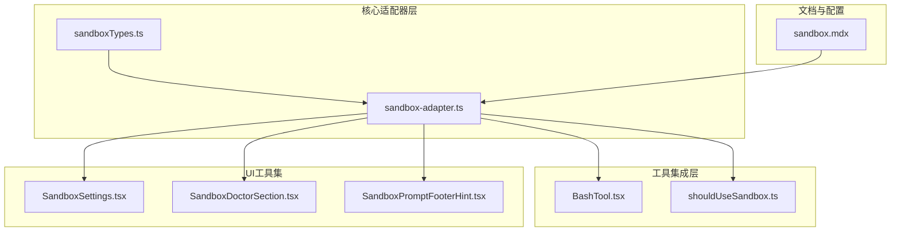
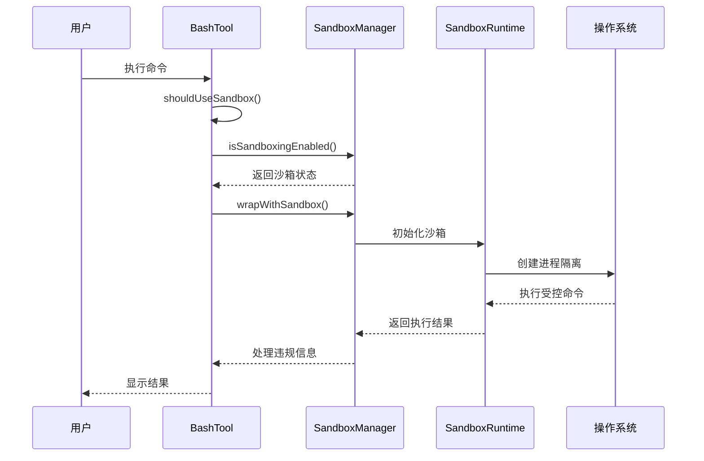
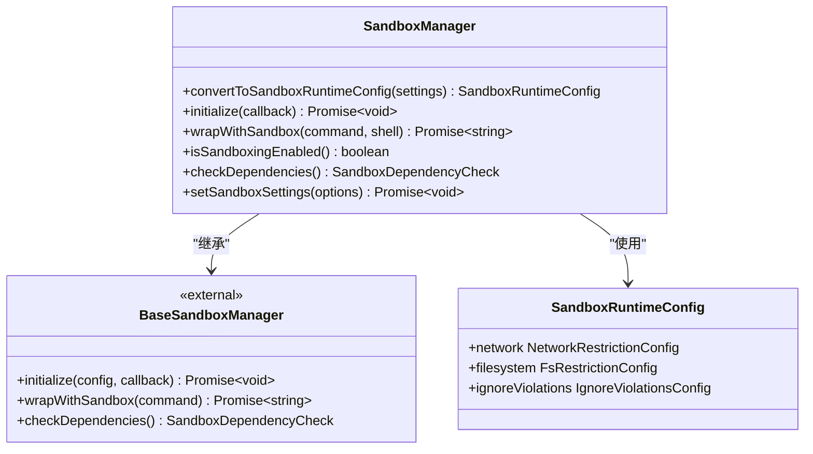
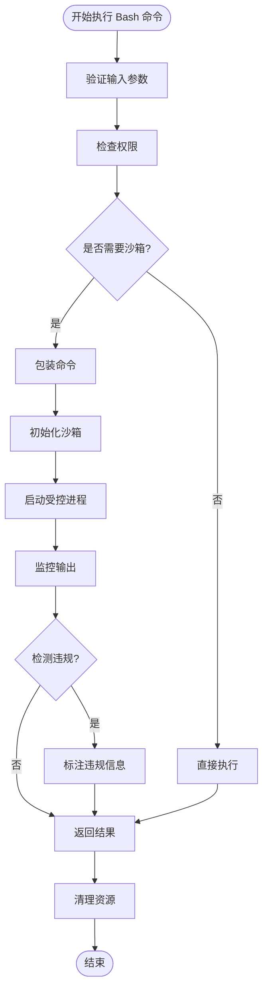
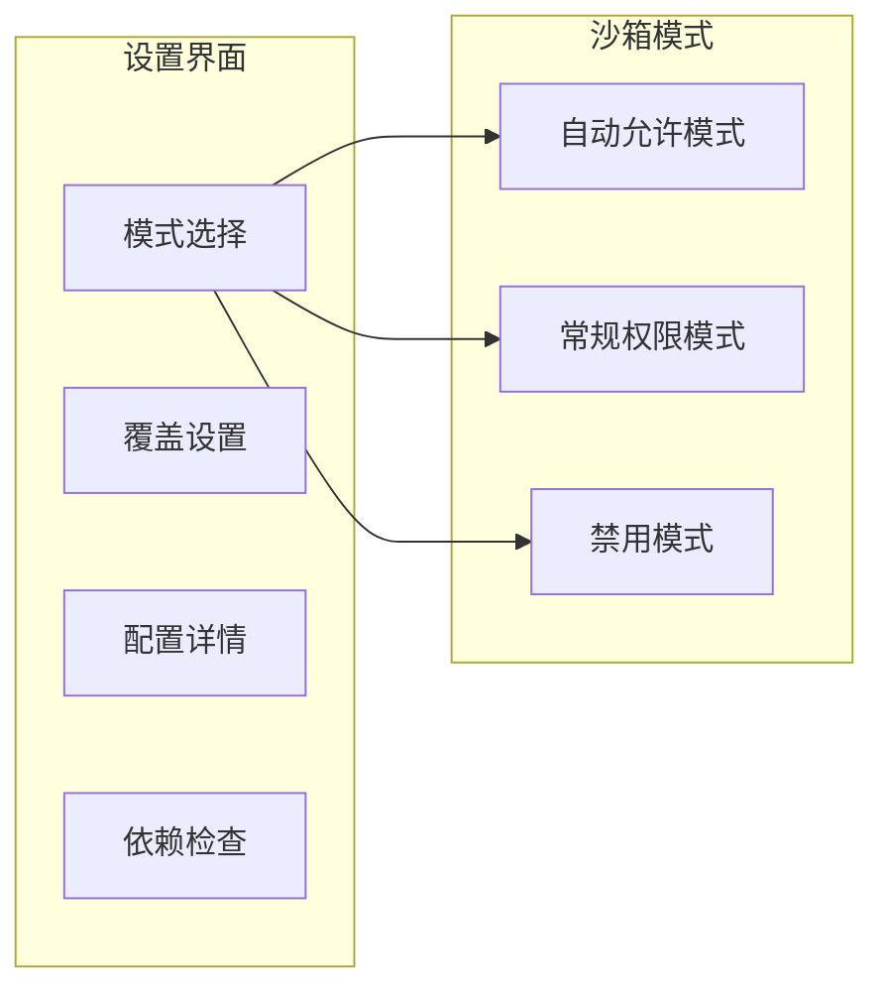
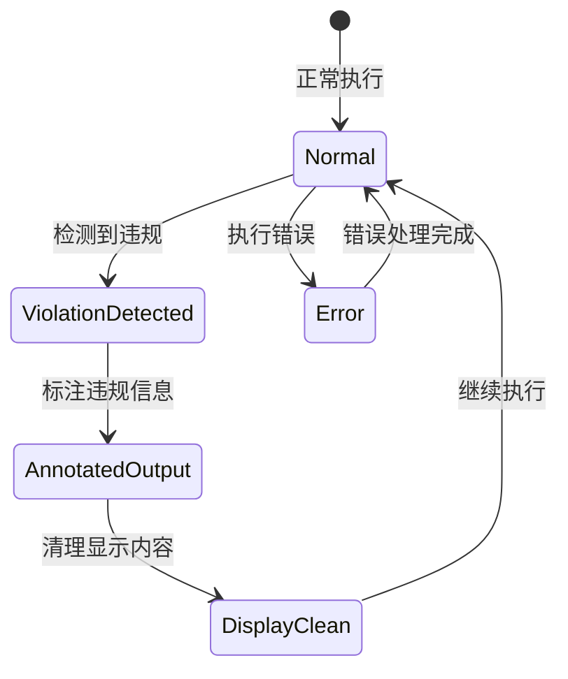
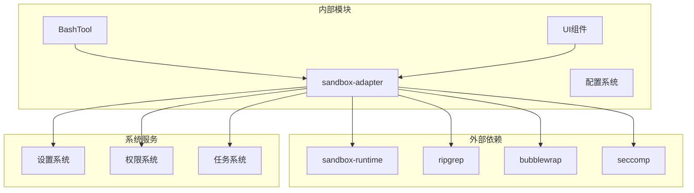

# 沙箱系统实现

<cite>
**本文档引用的文件**
- [sandbox-adapter.ts](file://src/utils/sandbox/sandbox-adapter.ts)
- [sandboxTypes.ts](file://src/entrypoints/sandboxTypes.ts)
- [BashTool.tsx](file://src/tools/BashTool/BashTool.tsx)
- [shouldUseSandbox.ts](file://src/tools/BashTool/shouldUseSandbox.ts)
- [sandbox-ui-utils.ts](file://src/utils/sandbox/sandbox-ui-utils.ts)
- [SandboxSettings.tsx](file://src/components/sandbox/SandboxSettings.tsx)
- [SandboxDoctorSection.tsx](file://src/components/sandbox/SandboxDoctorSection.tsx)
- [SandboxPromptFooterHint.tsx](file://src/components/PromptInput/SandboxPromptFooterHint.tsx)
- [REPL.tsx](file://src/screens/REPL.tsx)
- [sandbox.mdx](file://docs/safety/sandbox.mdx)
</cite>

## 目录
1. [简介](#简介)
2. [项目结构](#项目结构)
3. [核心组件](#核心组件)
4. [架构概览](#架构概览)
5. [详细组件分析](#详细组件分析)
6. [依赖关系分析](#依赖关系分析)
7. [性能考虑](#性能考虑)
8. [故障排除指南](#故障排除指南)
9. [结论](#结论)

## 简介

Claude Code 的沙箱系统是一个多层次的安全防护机制，旨在为代码编辑器提供强大的进程隔离和资源限制能力。该系统通过将权限控制与操作系统级沙箱相结合，构建了纵深防御的安全体系。

沙箱系统的核心设计理念是"权限之外的第二道防线"。权限系统负责决定"这条命令能否执行"，而沙箱则负责决定"执行时能做什么"。即使命令通过了权限审批，沙箱仍然可以限制其行为范围，确保即使AI生成了恶意命令也无法突破安全边界。

## 项目结构

沙箱系统主要分布在以下几个关键模块中：

**图表来源**
- [sandbox-adapter.ts:1-986](file://src/utils/sandbox/sandbox-adapter.ts#L1-L986)
- [BashTool.tsx:1-1144](file://src/tools/BashTool/BashTool.tsx#L1-L1144)
- [SandboxSettings.tsx:1-296](file://src/components/sandbox/SandboxSettings.tsx#L1-L296)

**章节来源**
- [sandbox-adapter.ts:1-986](file://src/utils/sandbox/sandbox-adapter.ts#L1-L986)
- [sandboxTypes.ts:1-157](file://src/entrypoints/sandboxTypes.ts#L1-L157)

## 核心组件

### 沙箱适配器（SandboxManager）

沙箱适配器是整个系统的核心，它封装了 `@anthropic-ai/sandbox-runtime` 包，并提供了 Claude CLI 特定的集成功能。主要职责包括：

- **配置转换**：将用户设置转换为沙箱运行时配置
- **平台适配**：根据操作系统选择合适的沙箱实现
- **依赖管理**：检查和验证沙箱依赖项
- **生命周期管理**：初始化、更新和清理沙箱配置

### Bash 工具集成

Bash 工具通过沙箱适配器实现了完整的沙箱化执行流程，包括：

- **智能决策**：根据多种因素判断是否需要沙箱
- **权限检查**：结合权限系统和沙箱策略
- **输出处理**：处理沙箱违规信息和错误输出

### UI 工具集

提供完整的用户界面集成，包括：

- **设置界面**：允许用户配置沙箱模式和选项
- **状态监控**：实时显示沙箱状态和违规信息
- **诊断工具**：帮助用户排查沙箱问题

**章节来源**
- [sandbox-adapter.ts:172-381](file://src/utils/sandbox/sandbox-adapter.ts#L172-L381)
- [BashTool.tsx:624-825](file://src/tools/BashTool/BashTool.tsx#L624-L825)

## 架构概览

沙箱系统的整体架构采用分层设计，确保了高度的模块化和可维护性：

**图表来源**
- [shouldUseSandbox.ts:130-153](file://src/tools/BashTool/shouldUseSandbox.ts#L130-L153)
- [sandbox-adapter.ts:704-725](file://src/utils/sandbox/sandbox-adapter.ts#L704-L725)

### 平台实现差异

系统针对不同操作系统提供了专门的实现：

| 平台 | 沙箱引擎 | 关键特性 | 依赖要求 |
|------|----------|----------|----------|
| macOS | sandbox-exec (Seatbelt) | 完整的文件系统和网络隔离 | 系统原生支持 |
| Linux | bubblewrap + seccomp | 命名空间隔离 + 系统调用过滤 | bubblewrap, socat, seccomp |
| WSL | bubblewrap | 仅支持 WSL2 | bubblewrap, socat |

**章节来源**
- [sandbox.mdx:100-141](file://docs/safety/sandbox.mdx#L100-L141)

## 详细组件分析

### 沙箱适配器实现

沙箱适配器通过装饰器模式包装了底层的沙箱运行时，提供了丰富的扩展功能：

**图表来源**
- [sandbox-adapter.ts:17-22](file://src/utils/sandbox/sandbox-adapter.ts#L17-L22)
- [sandbox-adapter.ts:172-381](file://src/utils/sandbox/sandbox-adapter.ts#L172-L381)

#### 配置转换机制

适配器的核心功能之一是将用户配置转换为沙箱运行时所需的格式。这个过程涉及多个层面的配置合并：

1. **网络配置**：从 WebFetch 规则中提取域名信息
2. **文件系统配置**：从 Edit 和 Read 规则中提取路径信息  
3. **安全加固**：自动添加安全相关的路径和规则

**章节来源**
- [sandbox-adapter.ts:172-381](file://src/utils/sandbox/sandbox-adapter.ts#L172-L381)

### Bash 工具沙箱化流程

Bash 工具实现了完整的沙箱化执行流程，确保所有命令都在受控环境中执行：

**图表来源**
- [shouldUseSandbox.ts:130-153](file://src/tools/BashTool/shouldUseSandbox.ts#L130-L153)
- [BashTool.tsx:624-725](file://src/tools/BashTool/BashTool.tsx#L624-L725)

#### 智能沙箱决策

沙箱决策算法考虑了多个因素：

1. **全局开关**：检查沙箱是否已启用
2. **显式跳过**：支持 `dangerouslyDisableSandbox` 参数
3. **排除列表**：用户配置的命令排除规则
4. **默认行为**：其他情况下强制沙箱化

**章节来源**
- [shouldUseSandbox.ts:130-153](file://src/tools/BashTool/shouldUseSandbox.ts#L130-L153)

### UI 工具集实现

沙箱系统的 UI 工具集提供了完整的用户交互体验：

#### 设置界面

SandboxSettings 组件提供了直观的沙箱配置界面：

**图表来源**
- [SandboxSettings.tsx:222-296](file://src/components/sandbox/SandboxSettings.tsx#L222-L296)

#### 状态监控

SandboxPromptFooterHint 提供了实时的状态监控功能：

- **违规计数**：显示最近的沙箱违规次数
- **时间窗口**：5秒内的违规统计
- **自动清除**：违规信息自动清理

**章节来源**
- [SandboxPromptFooterHint.tsx:1-35](file://src/components/PromptInput/SandboxPromptFooterHint.tsx#L1-L35)

### 沙箱违规处理机制

系统实现了完整的违规检测和处理机制：

**图表来源**
- [sandbox-ui-utils.ts:1-13](file://src/utils/sandbox/sandbox-ui-utils.ts#L1-L13)

#### 违规信息处理

系统通过以下步骤处理沙箱违规信息：

1. **捕获违规**：运行时检测到违规行为
2. **标注输出**：在输出中注入 `<sandbox_violations>` 标签
3. **清理显示**：UI 层移除标签用于用户显示
4. **持久化存储**：违规事件保存到 `SandboxViolationStore`

**章节来源**
- [sandbox-ui-utils.ts:1-13](file://src/utils/sandbox/sandbox-ui-utils.ts#L1-L13)

## 依赖关系分析

沙箱系统的依赖关系体现了清晰的分层架构：

**图表来源**
- [sandbox-adapter.ts:18-22](file://src/utils/sandbox/sandbox-adapter.ts#L18-L22)
- [BashTool.tsx:33-43](file://src/tools/BashTool/BashTool.tsx#L33-L43)

### 关键依赖关系

1. **沙箱运行时**：依赖 `@anthropic-ai/sandbox-runtime` 提供核心功能
2. **文件系统工具**：使用 ripgrep 进行文件搜索和处理
3. **平台特定工具**：Linux 使用 bubblewrap 和 seccomp
4. **配置系统**：深度集成设置系统进行动态配置更新

**章节来源**
- [sandbox-adapter.ts:451-457](file://src/utils/sandbox/sandbox-adapter.ts#L451-L457)

## 性能考虑

沙箱系统在安全性的同时也充分考虑了性能影响：

### 启动开销优化

- **延迟初始化**：沙箱在首次需要时才初始化
- **缓存机制**：依赖检查结果和平台支持状态被缓存
- **异步加载**：避免阻塞主线程

### 运行时性能

- **最小化包装开销**：沙箱包装尽量减少额外的进程开销
- **智能决策**：避免对不需要沙箱的命令进行包装
- **资源复用**：重用已建立的沙箱环境

### 内存管理

- **及时清理**：命令执行完成后立即清理临时文件
- **内存回收**：定期清理缓存和监听器
- **资源监控**：监控沙箱进程的内存使用

## 故障排除指南

### 常见问题及解决方案

#### 沙箱不可用

**症状**：沙箱提示被禁用但用户期望启用

**原因分析**：
1. 平台不支持沙箱功能
2. 缺少必要的依赖项
3. 配置设置冲突

**解决步骤**：
1. 检查平台支持：`/sandbox` 命令查看支持的平台
2. 安装依赖：根据平台安装相应的沙箱工具
3. 验证配置：检查 `settings.json` 中的沙箱配置

#### 进程隔离失败

**症状**：命令看起来在沙箱中执行但没有受到限制

**排查步骤**：
1. 检查沙箱状态：`/sandbox` 查看沙箱状态
2. 查看违规日志：检查是否有沙箱违规信息
3. 验证权限：确认权限系统正常工作

#### 性能问题

**症状**：命令执行明显变慢

**优化建议**：
1. 减少沙箱复杂度：简化网络和文件系统规则
2. 使用自动允许模式：对于可信命令启用自动允许
3. 优化配置：移除不必要的路径和域名规则

**章节来源**
- [REPL.tsx:2316-2345](file://src/screens/REPL.tsx#L2316-L2345)
- [SandboxDoctorSection.tsx:1-45](file://src/components/sandbox/SandboxDoctorSection.tsx#L1-L45)

### 调试工具

系统提供了多种调试工具帮助诊断问题：

- **沙箱医生**：自动检测和报告沙箱问题
- **状态监控**：实时显示沙箱状态和违规信息
- **详细日志**：提供详细的沙箱执行日志

## 结论

Claude Code 的沙箱系统通过精心设计的架构和实现，成功地在保证安全性的同时提供了良好的用户体验。系统的主要优势包括：

1. **多层安全防护**：权限系统和沙箱系统的双重保护
2. **平台无关性**：统一的接口支持多种操作系统
3. **智能决策**：基于多种因素的沙箱决策算法
4. **完善的 UI 集成**：提供直观的配置和监控界面
5. **可扩展性**：模块化的架构便于功能扩展

该系统为代码编辑器提供了一个强大而灵活的安全框架，既满足了企业级的安全需求，又保持了开发者的使用便利性。通过持续的优化和改进，沙箱系统将继续为 Claude Code 提供可靠的安全保障。