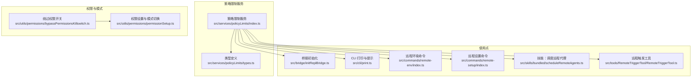
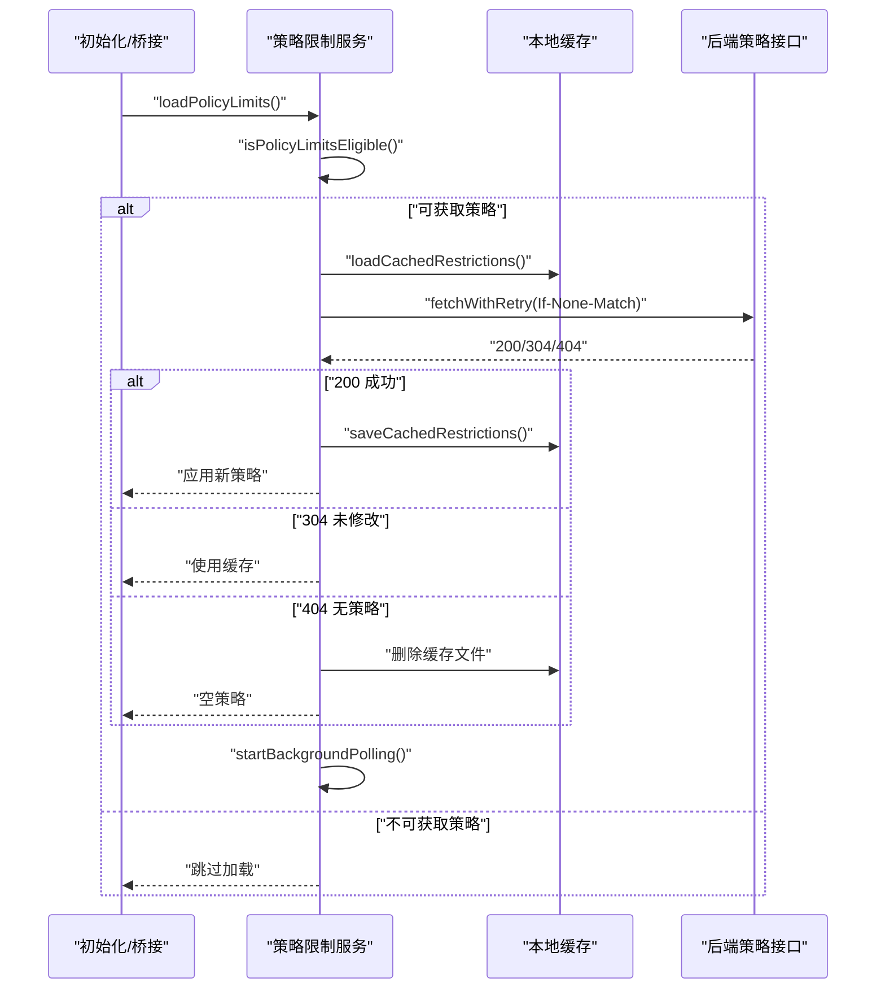
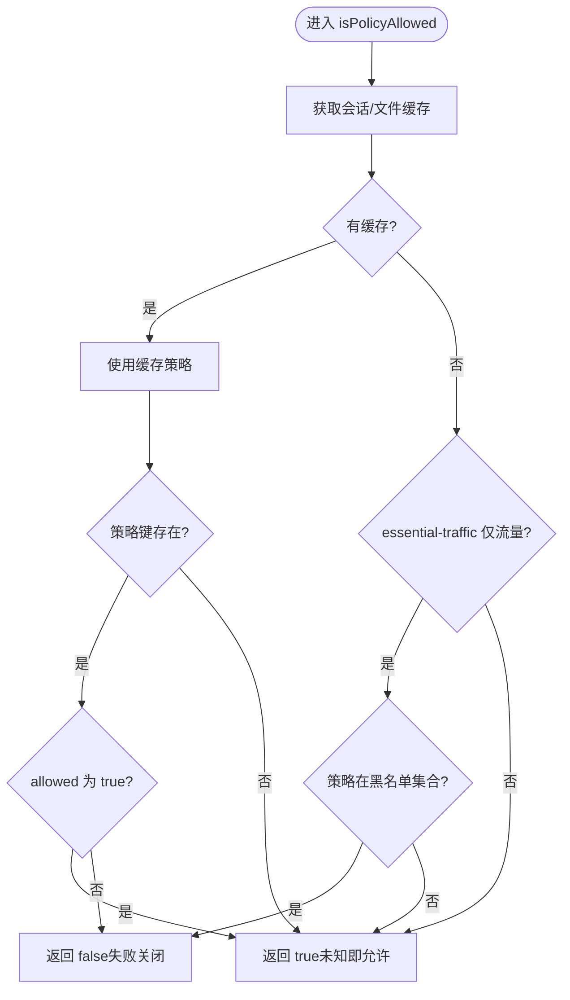
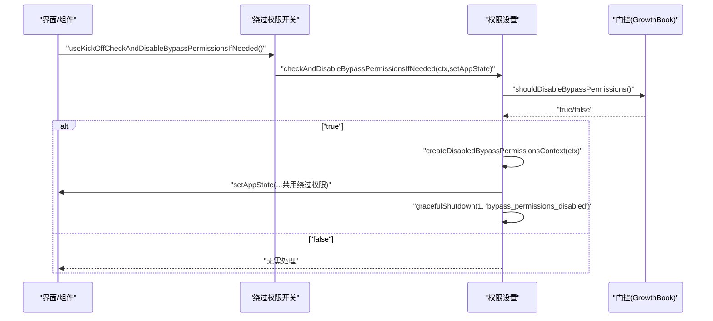
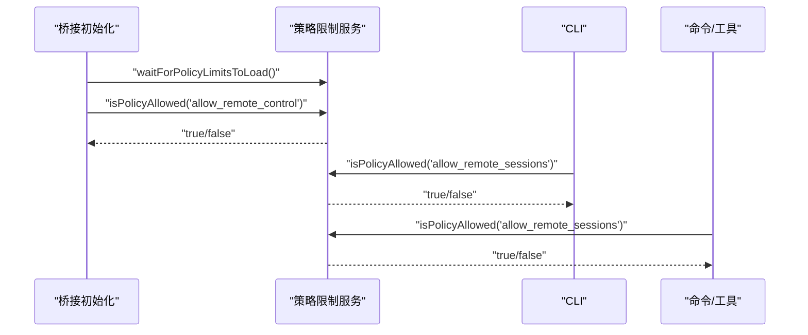
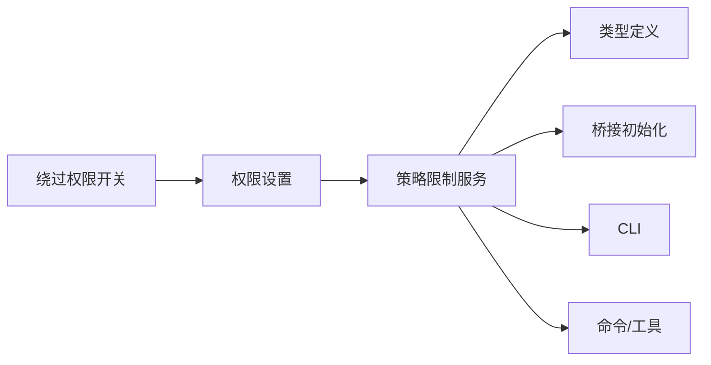

# 策略限制系统

<cite>
**本文档引用的文件**
- [index.ts](file://src/services/policyLimits/index.ts)
- [types.ts](file://src/services/policyLimits/types.ts)
- [bypassPermissionsKillswitch.ts](file://src/utils/permissions/bypassPermissionsKillswitch.ts)
- [permissionSetup.ts](file://src/utils/permissions/permissionSetup.ts)
- [initReplBridge.ts](file://src/bridge/initReplBridge.ts)
- [print.ts](file://src/cli/print.ts)
- [remote-env/index.ts](file://src/commands/remote-env/index.ts)
- [remote-setup/index.ts](file://src/commands/remote-setup/index.ts)
- [scheduleRemoteAgents.ts](file://src/skills/bundled/scheduleRemoteAgents.ts)
- [RemoteTriggerTool.ts](file://src/tools/RemoteTriggerTool/RemoteTriggerTool.ts)
- [privacyLevel.ts](file://src/utils/privacyLevel.ts)
</cite>

## 目录
1. [简介](#简介)
2. [项目结构](#项目结构)
3. [核心组件](#核心组件)
4. [架构总览](#架构总览)
5. [详细组件分析](#详细组件分析)
6. [依赖关系分析](#依赖关系分析)
7. [性能考量](#性能考量)
8. [故障排查指南](#故障排查指南)
9. [结论](#结论)
10. [附录](#附录)

## 简介
本文件系统性阐述 Claude Code 的策略限制系统，围绕以下目标展开：
- 解释策略限制系统的设计理念与实现原理：包括限制规则定义、执行机制、监控与告警思路。
- 深入解析策略限制服务的架构设计：规则引擎、执行引擎、监控组件等技术实现。
- 说明策略限制类型定义与数据结构：限制条件、阈值设置、触发机制等技术细节。
- 解释绕过权限开关（bypassPermissionsKillswitch）的实现与使用：开关机制、权限绕过、安全控制等要点。
- 提供策略限制的配置与管理指南：规则编写、阈值设置、监控配置、应急处理等方面的实用建议。

策略限制系统通过“组织级策略”对功能进行细粒度管控，采用“失败开放（fail open）”原则确保在网络异常或缓存缺失时不影响用户体验；同时支持基于 ETag 的 HTTP 缓存与后台轮询，以在保证可用性的前提下尽量保持策略的实时性。

## 项目结构
策略限制系统主要由以下模块构成：
- 策略限制服务：负责从后端拉取策略、本地缓存、会话内复用、失败开放与后台轮询。
- 类型定义：约束策略响应格式与抓取结果结构。
- 绕过权限开关：在运行期根据门控（GrowthBook）动态禁用“绕过权限模式”，并触发优雅关停。
- 权限设置与模式切换：提供模式初始化、自动模式门控检查、危险规则检测与清理等能力。
- 使用点：桥接层、CLI、命令与工具中对策略进行判定，决定功能是否可用。

图表来源
- [index.ts:1-664](file://src/services/policyLimits/index.ts#L1-L664)
- [types.ts:1-28](file://src/services/policyLimits/types.ts#L1-L28)
- [bypassPermissionsKillswitch.ts:1-156](file://src/utils/permissions/bypassPermissionsKillswitch.ts#L1-L156)
- [permissionSetup.ts:1-1533](file://src/utils/permissions/permissionSetup.ts#L1-L1533)
- [initReplBridge.ts:1-200](file://src/bridge/initReplBridge.ts#L1-L200)
- [print.ts:1-5000](file://src/cli/print.ts#L1-L5000)
- [remote-env/index.ts:1-50](file://src/commands/remote-env/index.ts#L1-L50)
- [remote-setup/index.ts:1-30](file://src/commands/remote-setup/index.ts#L1-L30)
- [scheduleRemoteAgents.ts:1-350](file://src/skills/bundled/scheduleRemoteAgents.ts#L1-L350)
- [RemoteTriggerTool.ts:1-80](file://src/tools/RemoteTriggerTool/RemoteTriggerTool.ts#L1-L80)

章节来源
- [index.ts:1-664](file://src/services/policyLimits/index.ts#L1-L664)
- [types.ts:1-28](file://src/services/policyLimits/types.ts#L1-L28)

## 核心组件
- 策略限制服务（Policy Limits Service）
  - 负责获取组织级策略限制、本地缓存、会话内复用、失败开放与后台轮询。
  - 支持 API 认证（API Key 或 OAuth）、ETag 缓存、重试与超时控制。
  - 提供 isPolicyAllowed(policy) 判定接口，遵循“未知即允许”的失败开放策略。
- 类型定义（PolicyLimitsResponseSchema）
  - 约束后端返回格式：仅包含被“阻止”的策略键值对；未出现的键视为允许。
  - 定义抓取结果结构，包含成功标志、策略内容、ETag 与错误信息。
- 绕过权限开关（bypassPermissionsKillswitch）
  - 基于门控（GrowthBook）动态禁用“绕过权限模式”，并在需要时触发优雅关停。
  - 提供一次性检查与重置逻辑，确保在登录切换组织后重新评估门控状态。
- 权限设置与模式切换（permissionSetup）
  - 提供模式初始化、自动模式门控检查、危险规则检测与清理、模式切换等能力。
  - 对“绕过权限模式”与“自动模式”提供同步与异步的可用性判断与禁用处理。
- 使用点（多处集成）
  - 桥接初始化、CLI 提示、远程环境/设置命令、技能与工具中均调用 isPolicyAllowed 进行功能可用性判定。

章节来源
- [index.ts:1-664](file://src/services/policyLimits/index.ts#L1-L664)
- [types.ts:1-28](file://src/services/policyLimits/types.ts#L1-L28)
- [bypassPermissionsKillswitch.ts:1-156](file://src/utils/permissions/bypassPermissionsKillswitch.ts#L1-L156)
- [permissionSetup.ts:1-1533](file://src/utils/permissions/permissionSetup.ts#L1-L1533)

## 架构总览
策略限制系统采用“服务-类型-开关-权限-使用点”的分层架构：
- 服务层：负责策略拉取、缓存、判定与轮询。
- 类型层：统一约束策略响应与抓取结果。
- 开关层：在运行期根据门控动态调整权限模式可用性。
- 权限层：提供模式初始化、危险规则检测与清理、模式切换等。
- 使用点：各模块在关键路径上对策略进行判定，决定功能是否启用。

图表来源
- [index.ts:556-590](file://src/services/policyLimits/index.ts#L556-L590)
- [index.ts:432-495](file://src/services/policyLimits/index.ts#L432-L495)
- [index.ts:613-630](file://src/services/policyLimits/index.ts#L613-L630)

## 详细组件分析

### 策略限制服务（Policy Limits Service）
- 设计理念
  - 失败开放：网络异常或缓存缺失时，默认允许策略未覆盖的功能，避免阻断用户。
  - 渐进式更新：通过 ETag 与 304 协商缓存减少带宽与延迟；后台轮询确保策略变更及时生效。
  - 会话内复用：同一会话内优先使用内存缓存，降低 I/O 开销。
- 关键流程
  - 初始化：initializePolicyLimitsLoadingPromise() 创建加载完成承诺，防止死锁。
  - 加载：loadPolicyLimits() 触发一次拉取并启动后台轮询。
  - 刷新：refreshPolicyLimits() 在认证状态变化时清除缓存并重新拉取。
  - 清理：clearPolicyLimitsCache() 停止轮询并删除会话与持久化缓存。
  - 判定：isPolicyAllowed(policy) 返回布尔值，未知键默认允许。
- 数据结构
  - 策略响应：restrictions 为键到对象的映射，对象包含 allowed 字段。
  - 抓取结果：success、restrictions（null 表示 304）、etag、error、skipRetry。
- 异常处理
  - 认证失败：skipRetry 标记为 true，避免无意义重试。
  - 超时/网络错误：记录日志并按“失败开放”策略回退到缓存或空策略。
  - Essential Traffic 仅流量模式：特定策略在缓存不可用时默认拒绝，防止误放行。

图表来源
- [index.ts:510-526](file://src/services/policyLimits/index.ts#L510-L526)
- [index.ts:502-526](file://src/services/policyLimits/index.ts#L502-L526)

章节来源
- [index.ts:1-664](file://src/services/policyLimits/index.ts#L1-L664)
- [types.ts:1-28](file://src/services/policyLimits/types.ts#L1-L28)

### 类型定义（PolicyLimitsResponseSchema）
- 约束
  - restrictions 为字符串到对象的映射，对象必须包含 allowed 字段（布尔值）。
  - 未包含某键表示该策略未被限制（允许）。
- 结果类型
  - PolicyLimitsFetchResult：包含 success、restrictions、etag、error、skipRetry。

章节来源
- [types.ts:1-28](file://src/services/policyLimits/types.ts#L1-L28)

### 绕过权限开关（bypassPermissionsKillswitch）
- 功能概述
  - 在运行期根据门控（GrowthBook）动态禁用“绕过权限模式”，并触发优雅关停。
  - 提供一次性检查与重置逻辑，确保在登录切换组织后重新评估门控状态。
- 关键函数
  - checkAndDisableBypassPermissionsIfNeeded：在首次查询前检查并禁用。
  - resetBypassPermissionsCheck：登录后重置检查标记。
  - useKickOffCheckAndDisableBypassPermissionsIfNeeded：React Hook 驱动的启动检查。
  - checkAndDisableAutoModeIfNeeded / resetAutoModeGateCheck / useKickOffCheckAndDisableAutoModeIfNeeded：自动模式相关检查与通知。
- 与权限设置的协作
  - shouldDisableBypassPermissions：异步门控检查。
  - createDisabledBypassPermissionsContext：生成禁用后的上下文。
  - checkAndDisableBypassPermissions：触发优雅关停。

图表来源
- [bypassPermissionsKillswitch.ts:19-47](file://src/utils/permissions/bypassPermissionsKillswitch.ts#L19-L47)
- [permissionSetup.ts:1265-1431](file://src/utils/permissions/permissionSetup.ts#L1265-L1431)

章节来源
- [bypassPermissionsKillswitch.ts:1-156](file://src/utils/permissions/bypassPermissionsKillswitch.ts#L1-L156)
- [permissionSetup.ts:1262-1431](file://src/utils/permissions/permissionSetup.ts#L1262-L1431)

### 权限设置与模式切换（permissionSetup）
- 模式初始化
  - initialPermissionModeFromCLI：综合门控、设置与 CLI 参数，确定最终模式，并在禁用时给出通知。
  - initializeToolPermissionContext：加载磁盘规则、校验目录、构建权限上下文，识别危险与过于宽泛的规则。
- 自动模式门控
  - verifyAutoModeGateAccess：异步检查自动模式可用性，返回转换函数与通知；必要时踢出自动模式。
  - isAutoModeGateEnabled / getAutoModeEnabledState：同步/异步门控查询。
- 危险规则检测
  - findDangerousClassifierPermissions / findOverlyBroadBashPermissions / findOverlyBroadPowerShellPermissions：检测可能绕过分类器或等效 YOLO 模式的规则。
  - stripDangerousPermissionsForAutoMode / restoreDangerousPermissions：在自动模式前后清理与恢复危险规则。
- 绕过权限模式
  - isBypassPermissionsModeDisabled / createDisabledBypassPermissionsContext：同步/异步禁用绕过权限模式并生成新上下文。

章节来源
- [permissionSetup.ts:689-811](file://src/utils/permissions/permissionSetup.ts#L689-L811)
- [permissionSetup.ts:872-1033](file://src/utils/permissions/permissionSetup.ts#L872-L1033)
- [permissionSetup.ts:1078-1260](file://src/utils/permissions/permissionSetup.ts#L1078-L1260)
- [permissionSetup.ts:1262-1431](file://src/utils/permissions/permissionSetup.ts#L1262-L1431)

### 使用点集成（桥接、CLI、命令与工具）
- 桥接初始化
  - 在桥接初始化阶段等待策略加载完成，并根据策略判定远程控制功能是否可用。
- CLI
  - 在打印与提示中使用 isPolicyAllowed 判定功能可用性，避免在受限环境下显示不可用选项。
- 命令与工具
  - 远程环境/设置命令、技能与工具在执行前检查策略，决定是否允许相应操作。

图表来源
- [initReplBridge.ts:1-200](file://src/bridge/initReplBridge.ts#L1-L200)
- [print.ts:1-5000](file://src/cli/print.ts#L1-L5000)
- [remote-env/index.ts:1-20](file://src/commands/remote-env/index.ts#L1-L20)
- [remote-setup/index.ts:1-20](file://src/commands/remote-setup/index.ts#L1-L20)
- [scheduleRemoteAgents.ts:1-350](file://src/skills/bundled/scheduleRemoteAgents.ts#L1-L350)
- [RemoteTriggerTool.ts:1-80](file://src/tools/RemoteTriggerTool/RemoteTriggerTool.ts#L1-L80)

章节来源
- [initReplBridge.ts:1-200](file://src/bridge/initReplBridge.ts#L1-L200)
- [print.ts:1-5000](file://src/cli/print.ts#L1-L5000)
- [remote-env/index.ts:1-20](file://src/commands/remote-env/index.ts#L1-L20)
- [remote-setup/index.ts:1-20](file://src/commands/remote-setup/index.ts#L1-L20)
- [scheduleRemoteAgents.ts:1-350](file://src/skills/bundled/scheduleRemoteAgents.ts#L1-L350)
- [RemoteTriggerTool.ts:1-80](file://src/tools/RemoteTriggerTool/RemoteTriggerTool.ts#L1-L80)

## 依赖关系分析
- 低耦合高内聚
  - 策略限制服务独立于业务功能，仅暴露 isPolicyAllowed 与加载/刷新/清理接口，便于在多处集成。
  - 类型定义与服务分离，确保数据契约清晰且易于演进。
- 门控与权限设置的协作
  - 绕过权限开关与权限设置紧密配合，前者负责运行期禁用，后者负责模式初始化与规则清理。
- 使用点分布
  - 桥接、CLI、命令与工具广泛调用策略判定，形成“集中式策略 + 分布式使用”的架构。

图表来源
- [index.ts:1-664](file://src/services/policyLimits/index.ts#L1-L664)
- [types.ts:1-28](file://src/services/policyLimits/types.ts#L1-L28)
- [bypassPermissionsKillswitch.ts:1-156](file://src/utils/permissions/bypassPermissionsKillswitch.ts#L1-L156)
- [permissionSetup.ts:1-1533](file://src/utils/permissions/permissionSetup.ts#L1-L1533)

章节来源
- [index.ts:1-664](file://src/services/policyLimits/index.ts#L1-L664)
- [types.ts:1-28](file://src/services/policyLimits/types.ts#L1-L28)
- [bypassPermissionsKillswitch.ts:1-156](file://src/utils/permissions/bypassPermissionsKillswitch.ts#L1-L156)
- [permissionSetup.ts:1-1533](file://src/utils/permissions/permissionSetup.ts#L1-L1533)

## 性能考量
- 失败开放与缓存
  - 通过 ETag 与 304 协商缓存减少网络请求；后台轮询每小时一次，兼顾实时性与性能。
- I/O 优化
  - 本地缓存文件采用严格权限写入；会话内缓存优先，减少磁盘 I/O。
- 并发与阻塞
  - 初始化加载承诺带有超时保护，避免因网络问题导致的死锁。
- 网络抑制
  - 在“essential-traffic 仅流量”模式下，非必要网络请求会被抑制，策略限制服务同样遵循此规则。

章节来源
- [index.ts:55-70](file://src/services/policyLimits/index.ts#L55-L70)
- [index.ts:407-426](file://src/services/policyLimits/index.ts#L407-L426)
- [privacyLevel.ts:1-50](file://src/utils/privacyLevel.ts#L1-L50)

## 故障排查指南
- 现象：策略未生效或功能不可用
  - 检查 isPolicyAllowed 的返回值与缓存状态；确认是否处于 essential-traffic 仅流量模式。
  - 查看加载承诺是否超时或加载失败，必要时手动刷新策略。
- 现象：绕过权限模式被禁用
  - 检查门控（GrowthBook）状态与设置项；确认是否在登录后重置了检查标记。
  - 若被禁用，系统会触发优雅关停并提示原因。
- 现象：自动模式不可用
  - 检查自动模式门控状态、模型支持情况与电路断路器；必要时查看通知与日志。
- 建议
  - 在开发与测试环境中，可通过迁移脚本或设置项临时调整策略与门控，但需谨慎评估风险。

章节来源
- [index.ts:509-526](file://src/services/policyLimits/index.ts#L509-L526)
- [bypassPermissionsKillswitch.ts:19-47](file://src/utils/permissions/bypassPermissionsKillswitch.ts#L19-L47)
- [permissionSetup.ts:1078-1260](file://src/utils/permissions/permissionSetup.ts#L1078-L1260)

## 结论
策略限制系统通过“失败开放、ETag 缓存、后台轮询、门控禁用”的组合，实现了在保障安全的前提下对功能进行精细化控制。其分层设计使得策略服务与业务解耦，绕过权限开关与权限设置协同工作，确保在紧急情况下能够快速禁用高风险模式并优雅关停。对于使用者而言，遵循本文提供的配置与管理建议，可在提升安全性的同时维持良好的用户体验。

## 附录
- 配置与管理建议
  - 规则编写：仅包含被阻止的策略键值对；未包含的键视为允许，遵循“最小限制”原则。
  - 阈值设置：通过门控（GrowthBook）与设置项控制策略生效范围与时机。
  - 监控配置：结合日志与通知，关注策略加载失败、缓存命中率与门控变化。
  - 应急处理：在发生安全事件时，优先通过门控禁用高风险模式并触发优雅关停，随后进行策略修复与回滚。