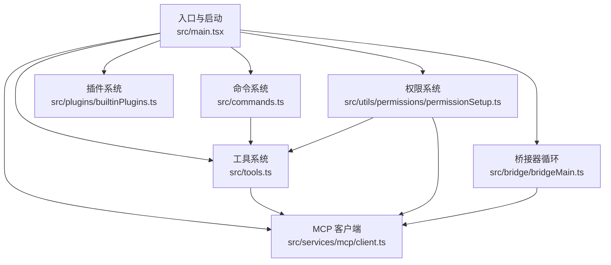
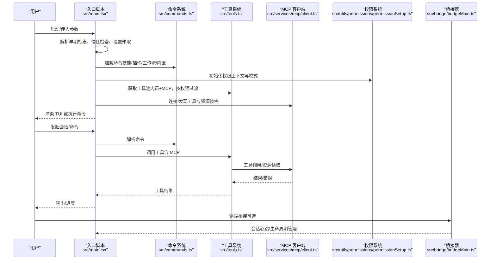
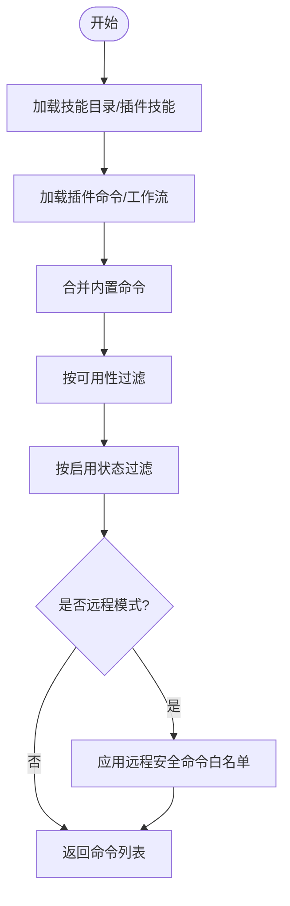
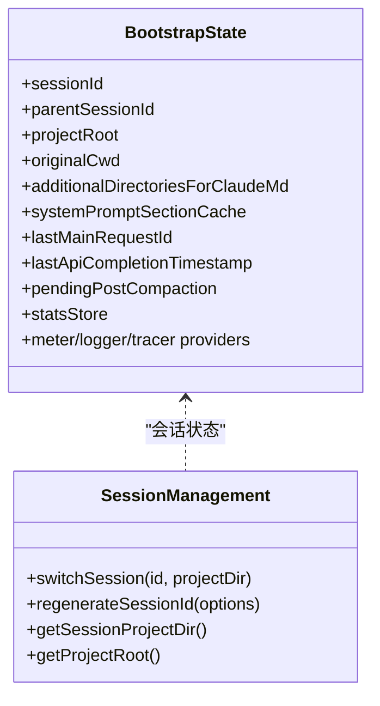
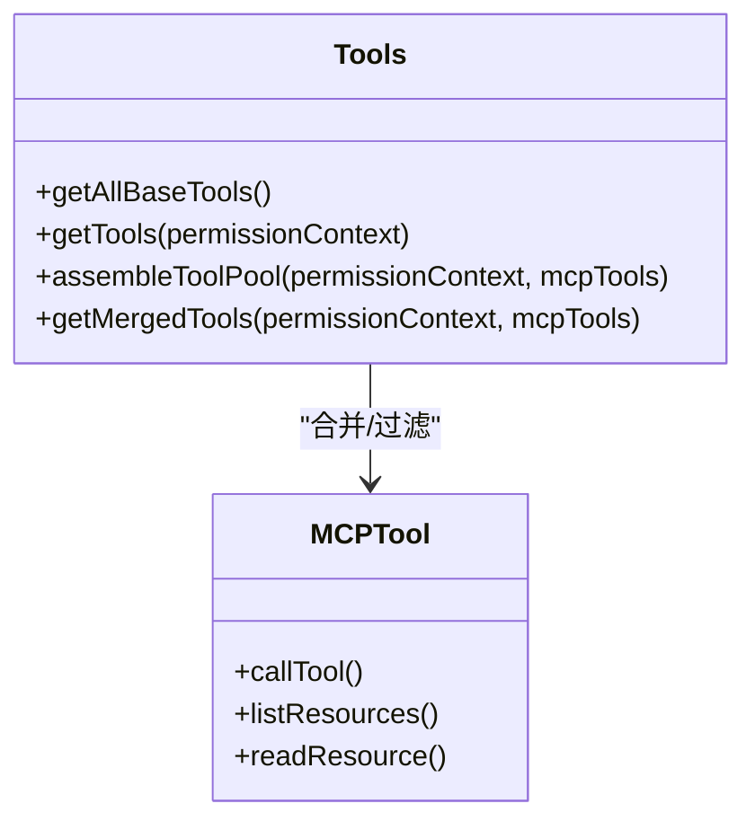
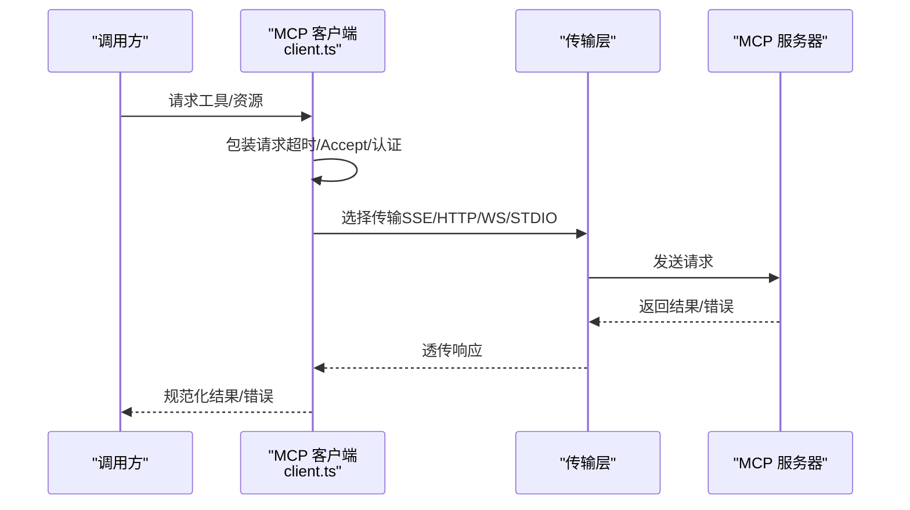
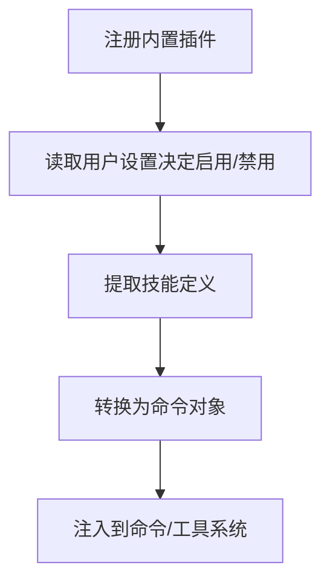
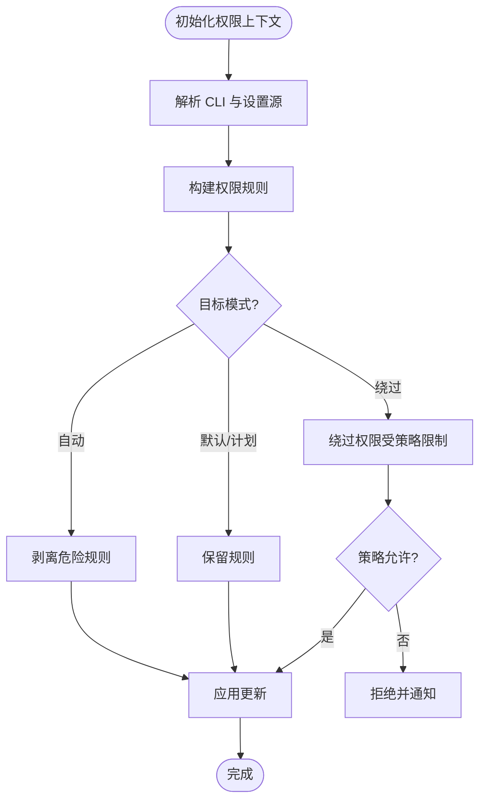
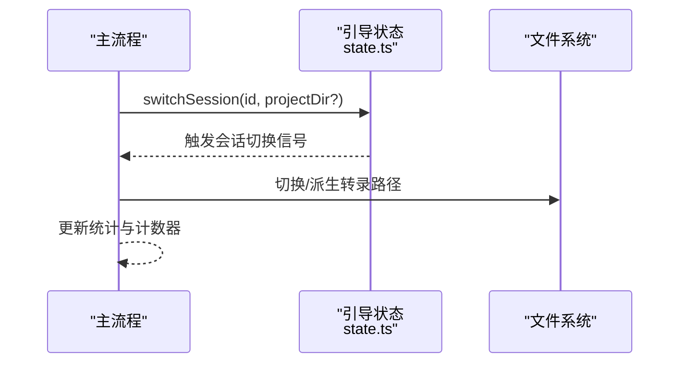
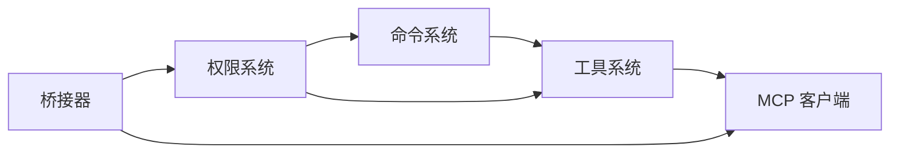

# 核心功能特性

<cite>
**本文引用的文件**
- [src/main.tsx](file://src/main.tsx)
- [src/bootstrap/state.ts](file://src/bootstrap/state.ts)
- [src/commands.ts](file://src/commands.ts)
- [src/tools.ts](file://src/tools.ts)
- [src/bridge/bridgeMain.ts](file://src/bridge/bridgeMain.ts)
- [src/services/mcp/client.ts](file://src/services/mcp/client.ts)
- [src/plugins/builtinPlugins.ts](file://src/plugins/builtinPlugins.ts)
- [src/utils/permissions/permissionSetup.ts](file://src/utils/permissions/permissionSetup.ts)
</cite>

## 目录
1. [简介](#简介)
2. [项目结构](#项目结构)
3. [核心组件](#核心组件)
4. [架构总览](#架构总览)
5. [详细组件分析](#详细组件分析)
6. [依赖关系分析](#依赖关系分析)
7. [性能考量](#性能考量)
8. [故障排查指南](#故障排查指南)
9. [结论](#结论)
10. [附录](#附录)

## 简介
本文件面向 Claude Code 的核心功能特性，系统性阐述以下能力：
- 命令行工具系统：命令发现、过滤、动态加载与远程模式适配
- 智能对话引擎：基于模型的自然语言到代码/任务的推理与执行
- 工具集成系统：文件操作、代码搜索、Shell 执行、浏览器与 IDE 集成等
- MCP 协议支持：与外部服务的标准化连接、认证与工具/资源发现
- 插件系统：内置插件注册与启用、技能与钩子扩展
- 权限安全控制：多模式权限策略、危险规则检测与自动模式防护
- 会话管理：会话标识、状态持久化与恢复、跨进程一致性

## 项目结构
Claude Code 采用“按功能域分层 + 按职责聚合”的组织方式：
- 入口与启动：入口脚本负责早期参数解析、信任建立、设置预取与延迟初始化
- 命令系统：集中注册与动态加载命令（含技能、插件、工作流）
- 工具系统：内置工具集合与 MCP 工具合并，统一权限过滤
- MCP 客户端：统一的协议客户端、传输层抽象、认证与缓存
- 权限系统：权限上下文构建、危险规则识别与模式切换
- 桥接与远端：桥接器循环、心跳、会话生命周期与环境管理
- 插件系统：内置插件注册与启用、技能钩子与 MCP 服务器

图表来源
- [src/main.tsx](file://src/main.tsx)
- [src/commands.ts](file://src/commands.ts)
- [src/tools.ts](file://src/tools.ts)
- [src/services/mcp/client.ts](file://src/services/mcp/client.ts)
- [src/utils/permissions/permissionSetup.ts](file://src/utils/permissions/permissionSetup.ts)
- [src/bridge/bridgeMain.ts](file://src/bridge/bridgeMain.ts)
- [src/plugins/builtinPlugins.ts](file://src/plugins/builtinPlugins.ts)

章节来源
- [src/main.tsx](file://src/main.tsx)
- [src/commands.ts](file://src/commands.ts)
- [src/tools.ts](file://src/tools.ts)
- [src/services/mcp/client.ts](file://src/services/mcp/client.ts)
- [src/utils/permissions/permissionSetup.ts](file://src/utils/permissions/permissionSetup.ts)
- [src/bridge/bridgeMain.ts](file://src/bridge/bridgeMain.ts)
- [src/plugins/builtinPlugins.ts](file://src/plugins/builtinPlugins.ts)

## 核心组件
- 命令行工具系统
  - 统一命令注册与动态加载，支持技能目录、插件、工作流与内置命令
  - 远程模式与桥接安全命令白名单，避免本地上下文依赖
- 智能对话引擎
  - 基于主循环模型与系统提示，结合工具池与上下文压缩，实现自然语言到可执行动作的映射
- 工具集成系统
  - 内置工具集（Bash、文件读写、搜索、Web 搜索/抓取、任务管理、计划模式等）与 MCP 工具合并
  - REPL 模式下对原语工具的隐藏与保护
- MCP 协议支持
  - SSE/HTTP/WebSocket/STDIO 传输抽象，统一认证与请求包装，资源与工具发现，输出存储与截断
- 插件系统
  - 内置插件注册与启用，提供技能、钩子与 MCP 服务器
- 权限安全控制
  - 多模式权限（默认/计划/自动/绕过），危险规则检测（Bash/PowerShell/Agent），自动模式下剥离危险规则
- 会话管理
  - 会话 ID 生成与切换、项目根路径稳定、转录路径派生、持久化与恢复

章节来源
- [src/commands.ts](file://src/commands.ts)
- [src/tools.ts](file://src/tools.ts)
- [src/services/mcp/client.ts](file://src/services/mcp/client.ts)
- [src/plugins/builtinPlugins.ts](file://src/plugins/builtinPlugins.ts)
- [src/utils/permissions/permissionSetup.ts](file://src/utils/permissions/permissionSetup.ts)
- [src/bootstrap/state.ts](file://src/bootstrap/state.ts)

## 架构总览
整体运行时由入口脚本驱动，完成早期初始化后进入交互或头模式；命令系统与工具系统在权限上下文中协作，MCP 客户端负责外部服务集成；桥接器负责远端会话生命周期管理。

图表来源
- [src/main.tsx](file://src/main.tsx)
- [src/commands.ts](file://src/commands.ts)
- [src/tools.ts](file://src/tools.ts)
- [src/services/mcp/client.ts](file://src/services/mcp/client.ts)
- [src/utils/permissions/permissionSetup.ts](file://src/utils/permissions/permissionSetup.ts)
- [src/bridge/bridgeMain.ts](file://src/bridge/bridgeMain.ts)

## 详细组件分析

### 命令行工具系统
- 动态命令加载
  - 技能目录、插件技能、内置命令与工作流命令统一加载与去重
  - 可根据可用性与启用状态过滤命令
- 远程模式安全
  - 仅暴露远程安全命令，避免本地上下文依赖
  - 桥接安全命令白名单，限制从移动端/网页端触发的命令类型
- 命令描述与来源标注
  - 对用户界面显示的描述进行来源标注，便于溯源

图表来源
- [src/commands.ts](file://src/commands.ts)

章节来源
- [src/commands.ts](file://src/commands.ts)

### 智能对话引擎
- 主循环与模型选择
  - 支持主循环模型覆盖与初始模型设定，结合令牌预算与上下文压缩
- 上下文与系统提示
  - 系统提示分段缓存、日期变化检测、提示 ID 关联事件
- 会话状态
  - 会话 ID、父会话 ID、项目根路径、转录路径派生、统计指标与计数器

图表来源
- [src/bootstrap/state.ts](file://src/bootstrap/state.ts)

章节来源
- [src/bootstrap/state.ts](file://src/bootstrap/state.ts)

### 工具集成系统
- 工具集合
  - 内置工具：Bash、文件读写/编辑、搜索、Web 搜索/抓取、任务管理、计划/工作树模式、LSP、浏览器工具等
  - MCP 工具：资源列举与读取、认证工具
  - 条件工具：Ant 专属、计划模式、工作流、代理/团队工具等
- 工具池组装
  - 权限上下文过滤内置工具，MCP 工具按规则过滤，合并并保持名称排序稳定性以利于缓存
- REPL 模式
  - 隐藏原语工具，仅允许 REPL 内部 VM 访问

图表来源
- [src/tools.ts](file://src/tools.ts)
- [src/services/mcp/client.ts](file://src/services/mcp/client.ts)

章节来源
- [src/tools.ts](file://src/tools.ts)

### MCP 协议支持
- 连接与传输
  - SSE/HTTP/WebSocket/STDIO 传输抽象，统一超时包装与 Accept 头保证
  - 会话入口 JWT 与代理/证书配置
- 认证与缓存
  - OAuth 令牌刷新与 401 处理，需要认证的服务器缓存标记
- 工具与资源
  - 工具调用结果截断与二进制内容持久化，资源读取与大小估算
- IDE 与计算机使用
  - IDE 专用传输与工具白名单，计算机使用包装（可选）

图表来源
- [src/services/mcp/client.ts](file://src/services/mcp/client.ts)

章节来源
- [src/services/mcp/client.ts](file://src/services/mcp/client.ts)

### 插件系统
- 内置插件
  - 注册、启用/禁用、技能/钩子/MCP 服务器聚合
  - 用户设置驱动启用状态，平台可用性检查
- 与命令/工具系统的集成
  - 内置插件技能作为命令参与技能工具列表

图表来源
- [src/plugins/builtinPlugins.ts](file://src/plugins/builtinPlugins.ts)

章节来源
- [src/plugins/builtinPlugins.ts](file://src/plugins/builtinPlugins.ts)

### 权限安全控制
- 权限模式
  - 默认/计划/自动/绕过权限模式，支持远程环境限制
- 危险规则检测
  - Bash/PowerShell/Agent 的危险规则识别与剥离，自动模式下强制清理
- CLI 与设置源
  - 支持从 CLI 与多源设置解析基础工具与权限规则

图表来源
- [src/utils/permissions/permissionSetup.ts](file://src/utils/permissions/permissionSetup.ts)

章节来源
- [src/utils/permissions/permissionSetup.ts](file://src/utils/permissions/permissionSetup.ts)

### 会话管理
- 会话标识与切换
  - 会话 ID 生成与切换，父会话 ID 记录，项目目录派生
- 状态与统计
  - 交互时间、令牌用量、工具耗时、成本统计、上下文压缩标记
- 跨进程一致性
  - 会话切换信号，确保外部监听器同步

图表来源
- [src/bootstrap/state.ts](file://src/bootstrap/state.ts)

章节来源
- [src/bootstrap/state.ts](file://src/bootstrap/state.ts)

## 依赖关系分析
- 命令系统依赖工具系统与权限系统，以确保命令可用性与安全性
- 工具系统依赖 MCP 客户端以整合外部工具与资源
- 权限系统贯穿命令与工具，提供统一的规则过滤与模式切换
- 桥接器依赖 MCP 客户端与权限系统，保障远端会话的安全与连通

图表来源
- [src/commands.ts](file://src/commands.ts)
- [src/tools.ts](file://src/tools.ts)
- [src/services/mcp/client.ts](file://src/services/mcp/client.ts)
- [src/utils/permissions/permissionSetup.ts](file://src/utils/permissions/permissionSetup.ts)
- [src/bridge/bridgeMain.ts](file://src/bridge/bridgeMain.ts)

章节来源
- [src/commands.ts](file://src/commands.ts)
- [src/tools.ts](file://src/tools.ts)
- [src/services/mcp/client.ts](file://src/services/mcp/client.ts)
- [src/utils/permissions/permissionSetup.ts](file://src/utils/permissions/permissionSetup.ts)
- [src/bridge/bridgeMain.ts](file://src/bridge/bridgeMain.ts)

## 性能考量
- 延迟初始化与预取
  - 入口脚本对系统上下文、提示、模型能力等进行延迟预取，减少首次渲染阻塞
- 缓存与去重
  - 命令与工具加载使用记忆化缓存，MCP 工具按名称排序合并避免重复
- 传输优化
  - 请求超时包装、Accept 头规范化、代理与 TLS 配置减少失败重试
- 会话统计
  - 令牌用量、工具耗时与 API 耗时统计，便于性能分析与优化

## 故障排查指南
- 命令不可见或不可用
  - 检查命令可用性与启用状态，确认远程模式下的安全命令白名单
- 工具调用失败
  - 查看 MCP 工具调用错误与元数据，确认输出截断与二进制内容持久化
- 权限被拒绝
  - 检查危险规则剥离日志，确认自动模式下的规则清理
- 会话异常
  - 检查会话切换信号与转录路径派生，核对项目根路径与会话 ID

章节来源
- [src/commands.ts](file://src/commands.ts)
- [src/services/mcp/client.ts](file://src/services/mcp/client.ts)
- [src/utils/permissions/permissionSetup.ts](file://src/utils/permissions/permissionSetup.ts)
- [src/bootstrap/state.ts](file://src/bootstrap/state.ts)

## 结论
Claude Code 的核心能力围绕“命令系统—工具系统—MCP—权限—会话”形成闭环：命令系统提供入口与能力发现，工具系统承载执行能力并与 MCP 扩展生态融合，权限系统贯穿始终确保安全可控，会话管理保障状态一致与可恢复。该设计既满足本地开发场景，又为远端桥接与企业策略提供了坚实基础。

## 附录
- 使用示例与最佳实践
  - 命令系统：优先使用技能与工作流命令，避免直接调用底层工具
  - 工具系统：在 REPL 模式下仅通过 VM 访问原语工具，减少误用风险
  - MCP：合理配置认证与传输，利用缓存与批量连接提升性能
  - 权限：在自动模式下避免使用危险规则，必要时通过设置源显式声明
  - 会话：使用会话切换与项目根路径稳定策略，确保跨进程一致性