# Ink 组件架构

<cite>
**本文档引用的文件**
- [ink.tsx](file://src/ink/ink.tsx)
- [renderer.ts](file://src/ink/renderer.ts)
- [root.ts](file://src/ink/root.ts)
- [reconciler.ts](file://src/ink/reconciler.ts)
- [dom.ts](file://src/ink/dom.ts)
- [App.tsx](file://src/ink/components/App.tsx)
- [Box.tsx](file://src/ink/components/Box.tsx)
- [Text.tsx](file://src/ink/components/Text.tsx)
- [Link.tsx](file://src/ink/components/Link.tsx)
- [engine.ts](file://src/ink/layout/engine.ts)
- [yoga.ts](file://src/ink/layout/yoga.ts)
- [render-node-to-output.ts](file://src/ink/render-node-to-output.ts)
- [screen.ts](file://src/ink/screen.ts)
- [dispatcher.ts](file://src/ink/events/dispatcher.ts)
- [use-app.ts](file://src/ink/hooks/use-app.ts)
</cite>

## 目录
1. [简介](#简介)
2. [项目结构](#项目结构)
3. [核心组件](#核心组件)
4. [架构总览](#架构总览)
5. [详细组件分析](#详细组件分析)
6. [依赖关系分析](#依赖关系分析)
7. [性能考量](#性能考量)
8. [故障排除指南](#故障排除指南)
9. [结论](#结论)

## 简介
Ink 是一个专为终端环境设计的 React 渲染框架，它通过自定义的 React 协调器、Yoga 布局引擎、高效的屏幕缓冲与增量差异算法，实现了高性能、低开销的终端 UI 渲染。其核心目标是在命令行界面中提供接近现代 Web 应用的组件化开发体验，同时保持对终端特性（如 ANSI 转义、鼠标事件、焦点管理）的原生支持。

## 项目结构
Ink 的代码组织围绕“组件层 + 虚拟 DOM + 布局引擎 + 渲染管线”的分层架构展开：
- 组件层：提供 Box、Text、Link 等终端友好的 UI 组件，并通过上下文暴露输入、焦点、尺寸等能力。
- 虚拟 DOM：自定义 DOM 节点类型与属性，支持 Yoga 测量函数、事件处理器、滚动状态等。
- 布局引擎：基于 Yoga 的 Flex 布局，提供测量、计算布局、样式应用等能力。
- 渲染管线：从 React 树到 DOM 节点，再到输出缓冲区，最终通过增量差异写入终端。

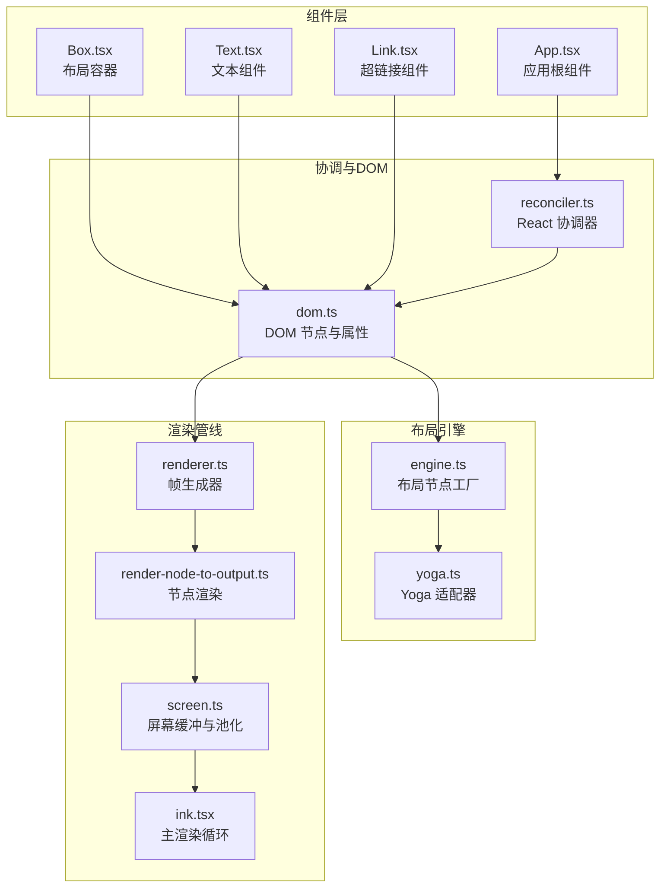

**图表来源**
- [App.tsx:1-658](file://src/ink/components/App.tsx#L1-L658)
- [reconciler.ts:1-513](file://src/ink/reconciler.ts#L1-L513)
- [dom.ts:1-485](file://src/ink/dom.ts#L1-L485)
- [engine.ts:1-7](file://src/ink/layout/engine.ts#L1-L7)
- [yoga.ts:1-309](file://src/ink/layout/yoga.ts#L1-L309)
- [renderer.ts:1-179](file://src/ink/renderer.ts#L1-L179)
- [render-node-to-output.ts:1-800](file://src/ink/render-node-to-output.ts#L1-L800)
- [screen.ts:1-800](file://src/ink/screen.ts#L1-L800)
- [ink.tsx:1-800](file://src/ink/ink.tsx#L1-L800)

**章节来源**
- [ink.tsx:1-800](file://src/ink/ink.tsx#L1-L800)
- [renderer.ts:1-179](file://src/ink/renderer.ts#L1-L179)
- [root.ts:1-185](file://src/ink/root.ts#L1-L185)
- [reconciler.ts:1-513](file://src/ink/reconciler.ts#L1-L513)
- [dom.ts:1-485](file://src/ink/dom.ts#L1-L485)

## 核心组件
- Ink 主类：负责渲染循环、帧生成、差异优化、终端写入、事件派发与生命周期管理。
- 渲染器：根据 DOM 树与 Yoga 计算结果生成帧，支持剪裁、溢出、滚动提示等。
- 协调器：定制 React 协调器，桥接 React 生命周期与 Ink 的 DOM 节点、事件系统。
- DOM 层：定义 Ink 特有的节点类型、属性、事件处理器、滚动状态与脏标记。
- 布局引擎：Yoga 适配器，提供 Flex 布局、测量函数、样式应用与布局计算。
- 屏幕缓冲：字符池、超链接池、样式池、打包单元格数组，支持增量差异与内存复用。
- 组件库：Box、Text、Link 等，提供终端友好的布局与文本渲染能力。

**章节来源**
- [ink.tsx:76-277](file://src/ink/ink.tsx#L76-L277)
- [renderer.ts:31-179](file://src/ink/renderer.ts#L31-L179)
- [reconciler.ts:224-513](file://src/ink/reconciler.ts#L224-L513)
- [dom.ts:110-132](file://src/ink/dom.ts#L110-L132)
- [yoga.ts:54-309](file://src/ink/layout/yoga.ts#L54-L309)
- [screen.ts:21-260](file://src/ink/screen.ts#L21-L260)

## 架构总览
Ink 的渲染流程从 React 树开始，经过协调器生成 DOM 节点，再由渲染器驱动布局计算与节点渲染，最终通过增量差异算法将变更写入终端。事件系统贯穿输入解析、事件派发与 DOM 交互，支持键盘、鼠标、焦点等终端特性。

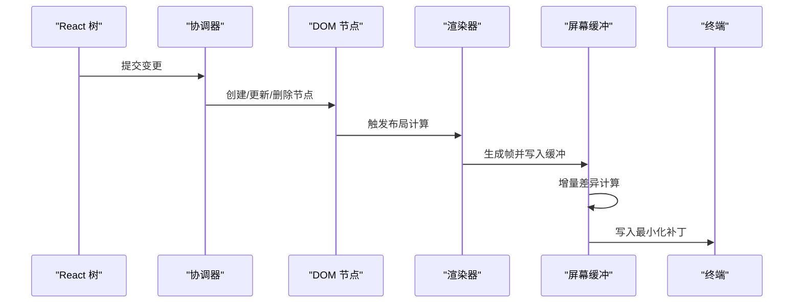

**图表来源**
- [reconciler.ts:247-315](file://src/ink/reconciler.ts#L247-L315)
- [renderer.ts:38-179](file://src/ink/renderer.ts#L38-L179)
- [render-node-to-output.ts:387-800](file://src/ink/render-node-to-output.ts#L387-L800)
- [screen.ts:451-544](file://src/ink/screen.ts#L451-L544)
- [ink.tsx:418-787](file://src/ink/ink.tsx#L418-L787)

## 详细组件分析

### Ink 主类与渲染循环
- 渲染循环：使用节流调度与微任务确保在布局阶段后进行渲染，避免光标声明滞后；支持暂停/恢复、全屏/备用屏幕切换、帧事件回调。
- 帧生成：渲染器根据当前 DOM 树与 Yoga 布局生成帧，包含光标位置、视口大小、滚动提示等信息。
- 差异优化：通过日志更新引擎计算最小化补丁，结合光标锚定、全屏损伤回退、池化重置等策略提升性能。
- 终端写入：在备用屏幕模式下进行物理光标锚定与停车，保证相对移动一致性；在主屏幕模式下进行光标恢复与移动。

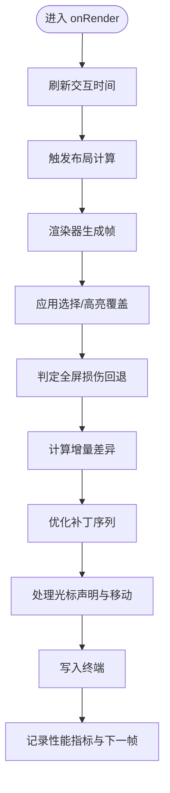

**图表来源**
- [ink.tsx:418-787](file://src/ink/ink.tsx#L418-L787)

**章节来源**
- [ink.tsx:180-277](file://src/ink/ink.tsx#L180-L277)
- [ink.tsx:418-787](file://src/ink/ink.tsx#L418-L787)

### 渲染器与帧生成
- 帧生成：根据根节点的 Yoga 尺寸创建屏幕缓冲，复用输出对象以缓存字符令牌；支持备用屏幕高度约束与溢出裁剪。
- 损伤区域：通过节点缓存与脏标记确定需要重绘的区域；当绝对定位移除或前一帧被污染时启用全屏损伤回退。
- 滚动提示：在垂直滚动容器中计算滚动提示，使日志更新引擎可使用硬件滚动指令加速。

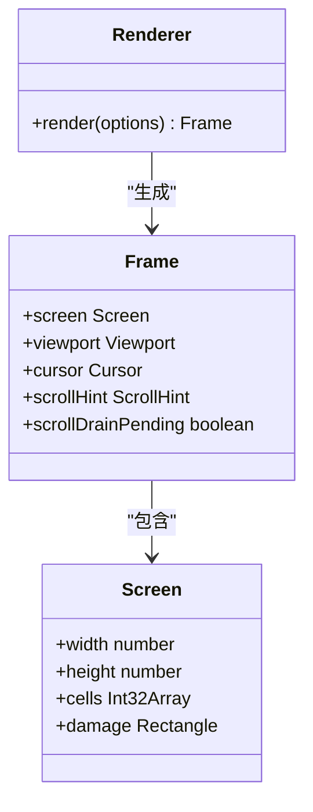

**图表来源**
- [renderer.ts:15-29](file://src/ink/renderer.ts#L15-L29)
- [renderer.ts:31-179](file://src/ink/renderer.ts#L31-L179)
- [screen.ts:366-415](file://src/ink/screen.ts#L366-L415)

**章节来源**
- [renderer.ts:31-179](file://src/ink/renderer.ts#L31-L179)
- [screen.ts:451-544](file://src/ink/screen.ts#L451-L544)

### 协调器与 DOM 层
- 自定义宿主配置：实现 React 19 的宿主配置接口，支持隐藏/显示实例、属性更新、事件优先级、焦点管理等。
- DOM 节点：定义 Ink 特有节点类型（ink-box、ink-text、ink-link 等），支持样式、文本样式、事件处理器、滚动状态与脏标记。
- Yoga 集成：为文本节点设置测量函数，支持换行、制表符扩展、宽度缓存等；为容器节点应用 Flex 样式。

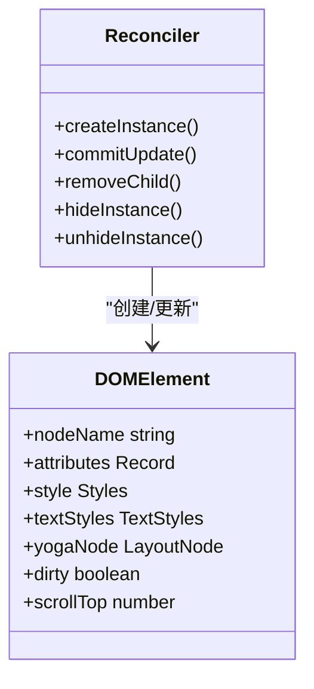

**图表来源**
- [reconciler.ts:224-513](file://src/ink/reconciler.ts#L224-L513)
- [dom.ts:31-91](file://src/ink/dom.ts#L31-L91)

**章节来源**
- [reconciler.ts:114-143](file://src/ink/reconciler.ts#L114-L143)
- [dom.ts:110-132](file://src/ink/dom.ts#L110-L132)

### 布局引擎与 Yoga 适配
- 布局节点：通过工厂创建 Yoga 节点，支持插入/移除子节点、计算布局、设置样式、测量函数等。
- 样式映射：将 Ink 样式属性映射到 Yoga 布局常量（方向、对齐、溢出、间距等）。
- 文本测量：为文本节点提供测量函数，考虑换行、制表符、预设宽度与自然宽度之间的权衡。

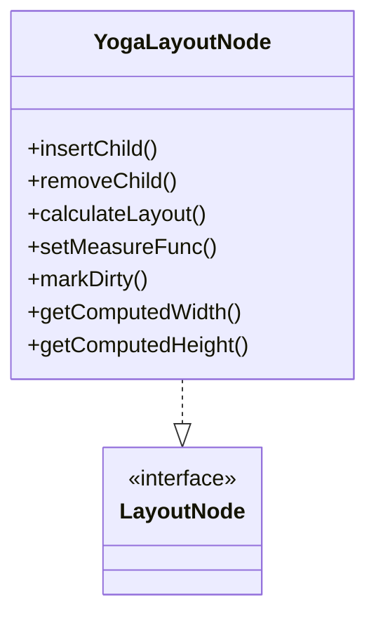

**图表来源**
- [yoga.ts:54-297](file://src/ink/layout/yoga.ts#L54-L297)
- [engine.ts:4-6](file://src/ink/layout/engine.ts#L4-L6)

**章节来源**
- [yoga.ts:54-309](file://src/ink/layout/yoga.ts#L54-L309)
- [dom.ts:332-374](file://src/ink/dom.ts#L332-L374)

### 屏幕缓冲与池化
- 字符池：按字符内插索引，支持 ASCII 快速路径与 Map 查找，避免字符串分配。
- 超链接池：按 URL 内插索引，支持无链接默认值。
- 样式池：按 ANSI 代码序列内插索引，支持可见性标志位、样式过渡缓存、反色/高亮/选中背景等。
- 打包单元格：每单元格占用两个 Int32，存储字符索引、样式索引、超链接索引与宽度，支持批量填充与增量比较。

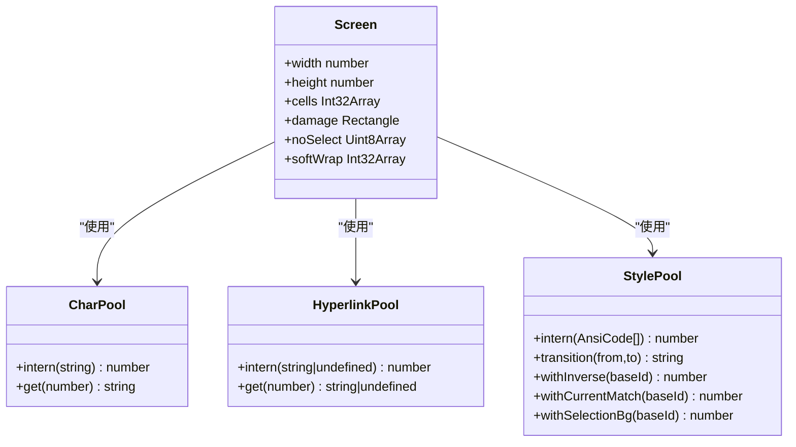

**图表来源**
- [screen.ts:21-260](file://src/ink/screen.ts#L21-L260)
- [screen.ts:366-415](file://src/ink/screen.ts#L366-L415)

**章节来源**
- [screen.ts:21-260](file://src/ink/screen.ts#L21-L260)
- [screen.ts:366-415](file://src/ink/screen.ts#L366-L415)

### 事件系统与输入处理
- 事件派发：Dispatcher 支持捕获/冒泡阶段、离散/连续优先级、传播控制与目标节点设置。
- 输入解析：App 组件解析键盘、鼠标、焦点等输入，支持粘贴模式、长间隔恢复、扩展键报告等。
- 事件映射：将终端事件映射到 React 风格的事件属性（onClick、onKeyDown 等），通过协调器注入事件处理器。

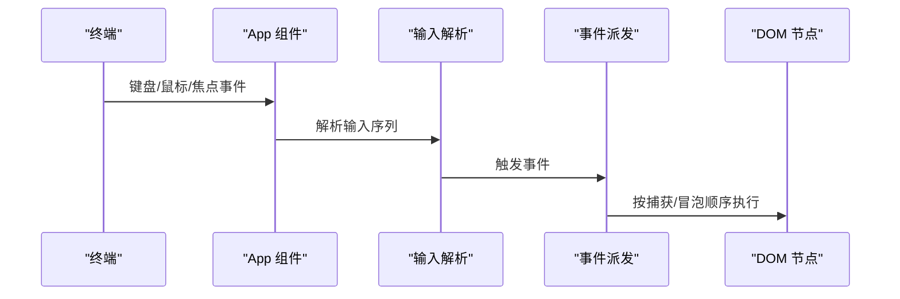

**图表来源**
- [App.tsx:332-368](file://src/ink/components/App.tsx#L332-L368)
- [dispatcher.ts:161-233](file://src/ink/events/dispatcher.ts#L161-L233)

**章节来源**
- [dispatcher.ts:161-233](file://src/ink/events/dispatcher.ts#L161-L233)
- [App.tsx:332-368](file://src/ink/components/App.tsx#L332-L368)

### 组件系统设计
- 组件复用：Box 提供 Flex 布局与溢出控制，Text 支持多种文本样式与换行策略，Link 条件性支持超链接。
- 组合模式：通过 Box 嵌套实现复杂布局；通过 Text 多段样式与超链接实现富文本。
- 高阶组件：通过上下文（AppContext、StdinContext、TerminalFocusContext 等）向子组件提供能力。

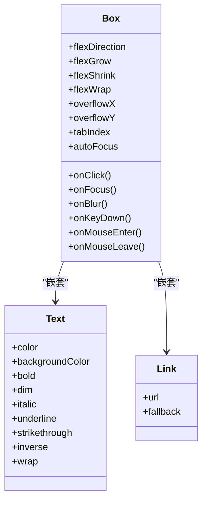

**图表来源**
- [Box.tsx:10-45](file://src/ink/components/Box.tsx#L10-L45)
- [Text.tsx:5-59](file://src/ink/components/Text.tsx#L5-L59)
- [Link.tsx:6-10](file://src/ink/components/Link.tsx#L6-L10)

**章节来源**
- [Box.tsx:50-213](file://src/ink/components/Box.tsx#L50-L213)
- [Text.tsx:114-254](file://src/ink/components/Text.tsx#L114-L254)
- [Link.tsx:11-42](file://src/ink/components/Link.tsx#L11-L42)

### 概念总览
以下为概念性工作流图，展示从 React 组件到终端输出的整体过程，不直接对应具体源码文件。

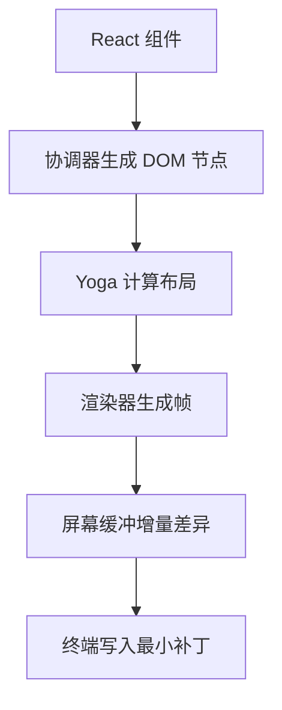

[此图为概念性流程，无需图表来源]

[本节不直接分析具体文件，故无章节来源]

## 依赖关系分析
- 组件层依赖于 DOM 层与布局引擎；DOM 层依赖于 Yoga；渲染器依赖于 DOM 与屏幕缓冲；主类依赖于渲染器与事件系统。
- 协调器与 DOM 层紧密耦合，确保 React 生命周期与 Ink 的 DOM 节点、事件系统无缝衔接。
- 屏幕缓冲通过池化减少内存分配，渲染器与差异算法共同保证性能。

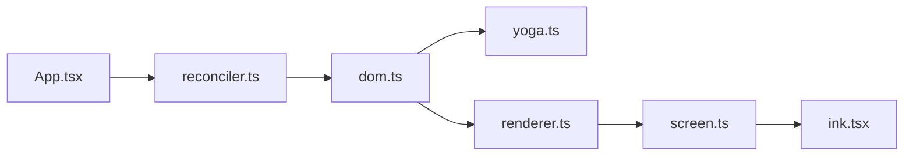

**图表来源**
- [reconciler.ts:224-513](file://src/ink/reconciler.ts#L224-L513)
- [dom.ts:1-485](file://src/ink/dom.ts#L1-L485)
- [yoga.ts:1-309](file://src/ink/layout/yoga.ts#L1-L309)
- [renderer.ts:1-179](file://src/ink/renderer.ts#L1-L179)
- [screen.ts:1-800](file://src/ink/screen.ts#L1-L800)
- [ink.tsx:1-800](file://src/ink/ink.tsx#L1-L800)

**章节来源**
- [reconciler.ts:224-513](file://src/ink/reconciler.ts#L224-L513)
- [dom.ts:1-485](file://src/ink/dom.ts#L1-L485)
- [renderer.ts:1-179](file://src/ink/renderer.ts#L1-L179)
- [screen.ts:1-800](file://src/ink/screen.ts#L1-L800)

## 性能考量
- 布局性能：Yoga 计算耗时记录与慢查询检测，避免频繁布局抖动；文本测量缓存与宽度限制减少重排成本。
- 渲染性能：微任务延迟渲染确保布局阶段完成后再渲染，避免光标滞后；脏标记与节点缓存减少重绘范围。
- 差异性能：增量差异算法与全屏损伤回退策略结合，最大化利用前一帧内容；池化重置与内存复用降低 GC 压力。
- 输入性能：批处理输入解析与事件派发，避免“最大更新深度”错误；长间隔恢复机制减少终端状态丢失风险。

[本节提供通用指导，无需章节来源]

## 故障排除指南
- 光标异常：检查备用屏幕锚定与光标声明是否正确；确认帧间差异未清除覆盖层导致的残留内容。
- 滚动卡顿：检查滚动提示与自适应/比例滚动策略；关注 pendingScrollDelta 是否正确清零。
- 文本截断：确认文本换行策略与最大宽度计算；检查软换行标记与选择复制逻辑。
- 事件无响应：验证事件处理器注册与优先级设置；检查输入解析状态机与粘贴模式超时。

**章节来源**
- [ink.tsx:552-650](file://src/ink/ink.tsx#L552-L650)
- [render-node-to-output.ts:106-177](file://src/ink/render-node-to-output.ts#L106-L177)
- [App.tsx:282-331](file://src/ink/components/App.tsx#L282-L331)

## 结论
Ink 通过自定义 React 协调器、Yoga 布局引擎与高效屏幕缓冲，构建了面向终端的高性能渲染体系。其组件化设计与事件系统使得在命令行环境中开发复杂的交互式界面成为可能。通过池化、增量差异与滚动优化等策略，Ink 在保证功能完整性的同时，兼顾了性能与内存效率。开发者可基于此架构快速构建终端应用，享受接近现代 Web 的开发体验。