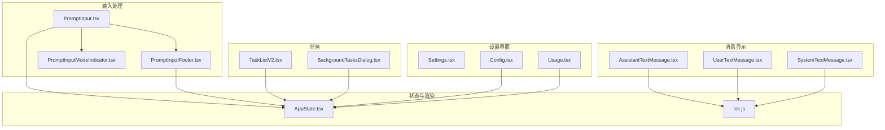
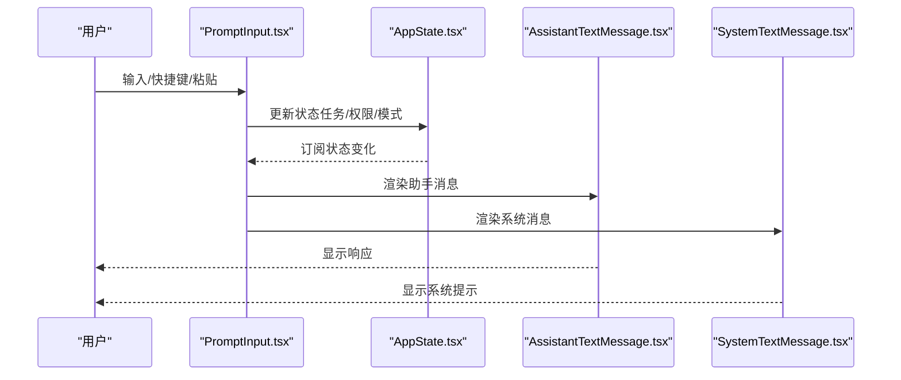
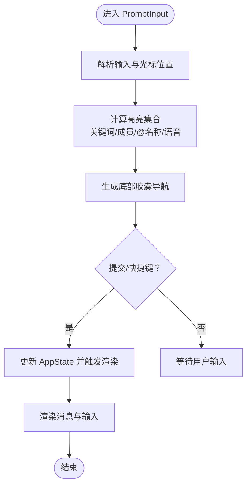
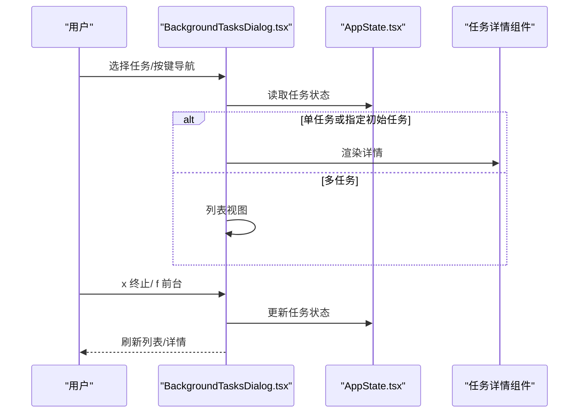
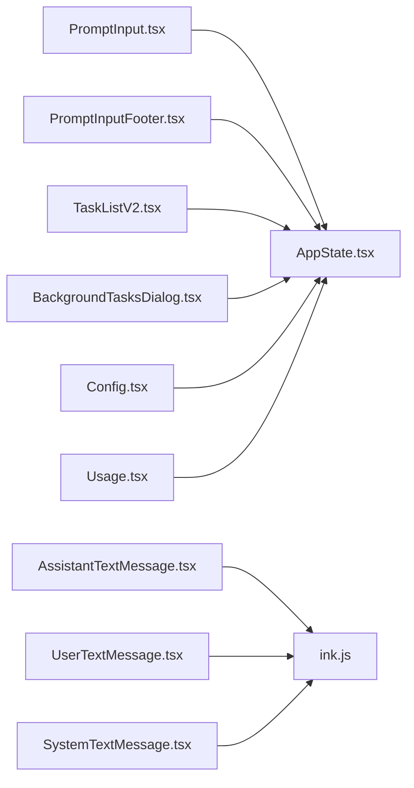

# 主要界面组件

<cite>
**本文档引用的文件**
- [AssistantTextMessage.tsx](file://src/components/messages/AssistantTextMessage.tsx)
- [UserTextMessage.tsx](file://src/components/messages/UserTextMessage.tsx)
- [SystemTextMessage.tsx](file://src/components/messages/SystemTextMessage.tsx)
- [PromptInput.tsx](file://src/components/PromptInput/PromptInput.tsx)
- [PromptInputFooter.tsx](file://src/components/PromptInput/PromptInputFooter.tsx)
- [PromptInputModeIndicator.tsx](file://src/components/PromptInput/PromptInputModeIndicator.tsx)
- [Settings.tsx](file://src/components/Settings/Settings.tsx)
- [Config.tsx](file://src/components/Settings/Config.tsx)
- [Usage.tsx](file://src/components/Settings/Usage.tsx)
- [TaskListV2.tsx](file://src/components/TaskListV2.tsx)
- [BackgroundTasksDialog.tsx](file://src/components/tasks/BackgroundTasksDialog.tsx)
</cite>

## 目录
1. [简介](#简介)
2. [项目结构](#项目结构)
3. [核心组件](#核心组件)
4. [架构总览](#架构总览)
5. [详细组件分析](#详细组件分析)
6. [依赖分析](#依赖分析)
7. [性能考虑](#性能考虑)
8. [故障排除指南](#故障排除指南)
9. [结论](#结论)

## 简介
本文件聚焦于主要界面组件，涵盖消息显示组件（AssistantTextMessage、UserTextMessage、SystemTextMessage 等）、输入处理组件（PromptInput、PromptInputFooter、PromptInputModeIndicator 等）、设置界面组件（Settings、Config、Usage 等）以及任务列表组件（TaskListV2、BackgroundTasksDialog 等）。文档从属性接口、事件处理、状态管理、样式定制等方面进行系统化说明，并解释组件间的交互关系与数据流，包括父子组件通信、兄弟组件协作、全局状态共享等机制。最后提供最佳实践与常见问题解决方案。

## 项目结构
主要界面组件分布在以下目录：
- 消息显示：src/components/messages/*.tsx
- 输入处理：src/components/PromptInput/*.tsx
- 设置界面：src/components/Settings/*.tsx
- 任务相关：src/components/tasks/*.tsx
- 全局状态：src/state/AppState.tsx
- 终端渲染：src/ink.js（Box、Text、useTerminalSize 等）

**图表来源**
- [PromptInput.tsx](file://src/components/PromptInput/PromptInput.tsx)
- [PromptInputFooter.tsx](file://src/components/PromptInput/PromptInputFooter.tsx)
- [PromptInputModeIndicator.tsx](file://src/components/PromptInput/PromptInputModeIndicator.tsx)
- [AssistantTextMessage.tsx](file://src/components/messages/AssistantTextMessage.tsx)
- [UserTextMessage.tsx](file://src/components/messages/UserTextMessage.tsx)
- [SystemTextMessage.tsx](file://src/components/messages/SystemTextMessage.tsx)
- [TaskListV2.tsx](file://src/components/TaskListV2.tsx)
- [BackgroundTasksDialog.tsx](file://src/components/tasks/BackgroundTasksDialog.tsx)
- [Settings.tsx](file://src/components/Settings/Settings.tsx)
- [Config.tsx](file://src/components/Settings/Config.tsx)
- [Usage.tsx](file://src/components/Settings/Usage.tsx)

**章节来源**
- [PromptInput.tsx](file://src/components/PromptInput/PromptInput.tsx)
- [PromptInputFooter.tsx](file://src/components/PromptInput/PromptInputFooter.tsx)
- [PromptInputModeIndicator.tsx](file://src/components/PromptInput/PromptInputModeIndicator.tsx)
- [AssistantTextMessage.tsx](file://src/components/messages/AssistantTextMessage.tsx)
- [UserTextMessage.tsx](file://src/components/messages/UserTextMessage.tsx)
- [SystemTextMessage.tsx](file://src/components/messages/SystemTextMessage.tsx)
- [TaskListV2.tsx](file://src/components/TaskListV2.tsx)
- [BackgroundTasksDialog.tsx](file://src/components/tasks/BackgroundTasksDialog.tsx)
- [Settings.tsx](file://src/components/Settings/Settings.tsx)
- [Config.tsx](file://src/components/Settings/Config.tsx)
- [Usage.tsx](file://src/components/Settings/Usage.tsx)

## 核心组件
- 消息显示组件
  - AssistantTextMessage：渲染助手文本消息，包含错误提示、速率限制、上下文限制升级提示、用户中断等分支处理。
  - UserTextMessage：根据消息标签与内容类型路由到不同子组件（计划、命令、Bash 输出、内存输入、团队消息等）。
  - SystemTextMessage：渲染系统消息，支持转轮时长、内存保存、权限重试、桥接状态、停止钩子汇总等。
- 输入处理组件
  - PromptInput：主输入区域，负责历史搜索、高亮、快捷键、粘贴图像/文本、多模态建议、底部栏导航、自动模式等。
  - PromptInputFooter：底部栏，包含通知、帮助菜单、快捷键提示、桥接状态指示器、团队/任务/远程等胶囊。
  - PromptInputModeIndicator：根据模式与同伴颜色渲染提示符（❯ 或 !），在同伴视角下使用同伴主题色。
- 设置界面组件
  - Settings：标签页容器，包含 Status、Config、Usage、Gates 等。
  - Config：配置面板，支持布尔/枚举/受控枚举设置项，搜索与回退、主题/模型/语言/输出风格等子菜单。
  - Usage：用量与配额展示，包含会话/周度/SONNET 限额、额外用量、重试与快捷键提示。
- 任务列表组件
  - TaskListV2：终端内任务列表，按状态优先级截断显示，支持最近完成任务保活、同伴活动摘要、拥有者颜色与阻塞关系。
  - BackgroundTasksDialog：后台任务对话框，支持分组（同伴/Shell/Monitor/远程/本地代理/工作流/梦境）、详情视图、批量/单个终止、前台切换等。

**章节来源**
- [AssistantTextMessage.tsx](file://src/components/messages/AssistantTextMessage.tsx)
- [UserTextMessage.tsx](file://src/components/messages/UserTextMessage.tsx)
- [SystemTextMessage.tsx](file://src/components/messages/SystemTextMessage.tsx)
- [PromptInput.tsx](file://src/components/PromptInput/PromptInput.tsx)
- [PromptInputFooter.tsx](file://src/components/PromptInput/PromptInputFooter.tsx)
- [PromptInputModeIndicator.tsx](file://src/components/PromptInput/PromptInputModeIndicator.tsx)
- [Settings.tsx](file://src/components/Settings/Settings.tsx)
- [Config.tsx](file://src/components/Settings/Config.tsx)
- [Usage.tsx](file://src/components/Settings/Usage.tsx)
- [TaskListV2.tsx](file://src/components/TaskListV2.tsx)
- [BackgroundTasksDialog.tsx](file://src/components/tasks/BackgroundTasksDialog.tsx)

## 架构总览
组件间通过全局状态（AppState）与终端渲染（ink.js）协同工作，形成“输入—状态—渲染”的闭环。输入组件负责收集用户意图与上下文，状态组件统一管理任务、权限、模型、提示词建议等，渲染组件将状态映射为终端 UI。

**图表来源**
- [PromptInput.tsx](file://src/components/PromptInput/PromptInput.tsx)
- [AppState.tsx](file://src/state/AppState.tsx)
- [AssistantTextMessage.tsx](file://src/components/messages/AssistantTextMessage.tsx)
- [SystemTextMessage.tsx](file://src/components/messages/SystemTextMessage.tsx)

## 详细组件分析

### 消息显示组件

#### AssistantTextMessage
- 属性接口
  - param: 文本块参数（含 text 字段）
  - addMargin: 是否添加上边距
  - shouldShowDot: 是否显示前缀点
  - verbose: 是否详细输出
  - width?: 宽度约束
  - onOpenRateLimitOptions?: 速率限制选项回调
- 事件与行为
  - 特殊文本分支：无响应请求、上下文超限、余额不足、API 错误、组织禁用、令牌撤销、超时、开关关闭、用户中断等。
  - Markdown 渲染与“展开查看更多”提示。
  - 选中态背景色与消息动作上下文。
- 状态与样式
  - 使用主题色与状态（加载中 dim）控制视觉反馈。
- 复杂度与性能
  - 内部使用记忆化缓存减少重复渲染；对长错误文本进行截断与可展开提示。

**章节来源**
- [AssistantTextMessage.tsx](file://src/components/messages/AssistantTextMessage.tsx)

#### UserTextMessage
- 属性接口
  - addMargin: 上边距
  - param: 文本块参数
  - verbose: 详细输出
  - planContent?: 计划内容（存在时走计划消息路径）
  - isTranscriptMode?: 是否为转录模式
  - timestamp?: 时间戳
- 路由逻辑
  - 基于标签与特征检测（如 Bash 输出、本地命令、GitHub Webhook、MCP 资源更新、团队消息等）选择对应子组件。
  - 支持中断消息（用户/工具使用）的统一处理。
- 性能与可用性
  - 对多种消息类型采用条件渲染，避免不必要的解析与渲染。

**章节来源**
- [UserTextMessage.tsx](file://src/components/messages/UserTextMessage.tsx)

#### SystemTextMessage
- 属性接口
  - message: 系统消息对象（含 subtype、content、level 等）
  - addMargin: 上边距
  - verbose: 详细输出
  - isTranscriptMode?: 转录模式
- 功能特性
  - 转轮时长（含动词随机、预算使用、仍在运行的后台任务摘要）
  - 内存保存（文件列表点击打开）
  - 权限重试、桥接状态、定时任务触发、停止钩子汇总（含耗时统计与错误）
  - 一般信息级别在非详细模式下隐藏。
- 可访问性与交互
  - 文件路径点击打开，悬停显示下划线；支持键盘快捷键提示。

**章节来源**
- [SystemTextMessage.tsx](file://src/components/messages/SystemTextMessage.tsx)

### 输入处理组件

#### PromptInput
- 属性接口（节选）
  - debug、ideSelection、toolPermissionContext、apiKeyStatus、commands、agents、isLoading、verbose、messages、onAutoUpdaterResult、autoUpdaterResult、input、onInputChange、mode、onModeChange、stashedPrompt、setStashedPrompt、submitCount、onShowMessageSelector、onMessageActionsEnter、mcpClients、pastedContents、setPastedContents、vimMode、setVimMode、showBashesDialog、setShowBashesDialog、onExit、getToolUseContext、onSubmit、onAgentSubmit、isSearchingHistory、setIsSearchingHistory、onDismissSideQuestion、isSideQuestionVisible、helpOpen、setHelpOpen、hasSuppressedDialogs、isLocalJSXCommandActive、insertTextRef、voiceInterimRange
- 关键能力
  - 历史搜索与匹配、粘贴图像/文本、光标位置与图像芯片边界对齐、多关键词高亮（BTW、命令、令牌预算、Slack 频道、@成员、彩虹思考/计划/评审关键字）、语音临时范围弱化。
  - 底部栏胶囊导航（任务/远程/Tmux/团队/桥接/伙伴），支持焦点同步与键盘导航。
  - 自动模式优化、快速模式、思维模式、努力等级、提示词建议与推测。
- 状态与副作用
  - 订阅 AppState（任务、权限、模型、简报模式、桥接状态等）；外部输入变更时自动将光标移动至末尾；插入文本时支持在光标处拼接并调整光标偏移。

**图表来源**
- [PromptInput.tsx](file://src/components/PromptInput/PromptInput.tsx)

**章节来源**
- [PromptInput.tsx](file://src/components/PromptInput/PromptInput.tsx)

#### PromptInputFooter
- 属性接口
  - apiKeyStatus、debug、exitMessage、vimMode、mode、autoUpdaterResult、isAutoUpdating、verbose、onAutoUpdaterResult、onChangeIsUpdating、suggestions、selectedSuggestion、maxColumnWidth、toolPermissionContext、helpOpen、suppressHint、isLoading、tasksSelected、teamsSelected、bridgeSelected、tmuxSelected、teammateFooterIndex、ideSelection、mcpClients、isPasting、isInputWrapped、messages、isSearching、historyQuery、setHistoryQuery、historyFailedMatch、onOpenTasksDialog
- 功能
  - 在窄屏或帮助打开时切换布局；根据设置决定是否显示状态行；在全屏时将建议覆盖到顶层布局。
  - 桥接状态指示器仅在显式连接或重连时显示。
- 交互
  - 与 PromptInput 共享焦点状态，确保导航一致性。

**章节来源**
- [PromptInputFooter.tsx](file://src/components/PromptInput/PromptInputFooter.tsx)

#### PromptInputModeIndicator
- 属性接口
  - mode: 输入模式（prompt/bash）
  - isLoading: 加载状态
  - viewingAgentName?: 正在查看的同伴名称
  - viewingAgentColor?: 正在查看的同伴颜色
- 行为
  - 根据同伴颜色覆盖默认提示符颜色；在同伴视角下使用同伴主题色；加载态 dim 化。

**章节来源**
- [PromptInputModeIndicator.tsx](file://src/components/PromptInput/PromptInputModeIndicator.tsx)

### 设置界面组件

#### Settings
- 属性接口
  - onClose、context、defaultTab
- 结构
  - 标签页容器，包含 Status、Config、Usage、Gates；支持 ESC 退出与键盘绑定；内容高度自适应。
- 交互
  - Tabs 组件控制选中标签与高度；Config 子组件可声明自身 ESC 拥有者以避免与外层冲突。

**章节来源**
- [Settings.tsx](file://src/components/Settings/Settings.tsx)

#### Config
- 属性接口
  - onClose、context、setTabsHidden、onIsSearchModeChange、contentHeight
- 功能
  - 全局配置与用户设置项（布尔/枚举/受控枚举），支持搜索、回退、增量变更记录、主题/模型/语言/输出风格子菜单。
  - 快速模式、提示词建议、推测、文件快照、通知渠道、默认视图、编辑器模式、PR 状态栏等。
- 状态与持久化
  - 读取/写入全局配置与 per-source 设置；变更即时反映到 AppState 与 UI。

**章节来源**
- [Config.tsx](file://src/components/Settings/Config.tsx)

#### Usage
- 属性接口
  - 无（内部管理）
- 功能
  - 加载并展示用量数据（当前会话、本周总量、SONNET 限额、额外用量、信用额度）；失败时提供重试快捷键与取消。
- 交互
  - 支持快捷键 settings:retry 重新加载；在窄屏下简化显示。

**章节来源**
- [Usage.tsx](file://src/components/Settings/Usage.tsx)

### 任务列表组件

#### TaskListV2
- 属性接口
  - tasks: 任务数组
  - isStandalone?: 是否独立渲染（带总计统计）
- 行为
  - 根据终端尺寸动态截断显示；最近完成任务保留 30 秒；按状态优先级排序（最近完成、进行中、待定、较旧完成）。
  - 同伴模式下为拥有者分配主题色，显示最近活动摘要与活跃状态；计算未解决任务集以判断阻塞。
  - 支持独立模式输出总览统计。
- 性能
  - 使用计时器在最近完成任务到期时触发重渲染；对字符串宽度与截断进行缓存。

**章节来源**
- [TaskListV2.tsx](file://src/components/TaskListV2.tsx)

#### BackgroundTasksDialog
- 属性接口
  - onDone、toolUseContext、initialDetailTaskId
- 功能
  - 列表视图：按运行/挂起/开始时间排序，分组显示同伴/Shell/Monitor/远程/本地代理/工作流/梦境；支持键盘导航与快捷键（x=终止、f=前台、方向键返回）。
  - 详情视图：针对不同任务类型提供专用详情对话框（如 Shell、远程会话、同伴、工作流、MCP 监控、梦境）。
  - 批量/单个终止、跳过/重试工作流代理、停止 Ultraplan 远程会话。
- 状态与导航
  - 通过 AppState 获取任务与前台任务 ID；在单任务或指定初始任务时自动跳过列表直接进入详情。

**图表来源**
- [BackgroundTasksDialog.tsx](file://src/components/tasks/BackgroundTasksDialog.tsx)
- [AppState.tsx](file://src/state/AppState.tsx)

**章节来源**
- [BackgroundTasksDialog.tsx](file://src/components/tasks/BackgroundTasksDialog.tsx)

## 依赖分析
- 组件耦合
  - PromptInput 与 AppState 强耦合，订阅多项状态（任务、权限、模型、简报模式、桥接状态等），并通过回调与外部交互。
  - 消息组件依赖 ink.js 的 Box/Text/主题系统，部分组件依赖全局配置与状态。
  - 设置组件通过 Config/Usage 与 AppState/全局配置交互，同时维护 per-source 设置快照用于 ESC 回退。
- 外部依赖
  - ink.js 提供终端渲染能力；useTerminalSize/useTheme 等 Hook 提供尺寸与主题感知。
  - AppState 提供全局状态存储与订阅；teammate 视图辅助函数用于同伴视角切换。
- 循环依赖
  - 组件间通过状态订阅避免直接循环引用；对话框与列表通过 onDone 回调解耦。

**图表来源**
- [PromptInput.tsx](file://src/components/PromptInput/PromptInput.tsx)
- [PromptInputFooter.tsx](file://src/components/PromptInput/PromptInputFooter.tsx)
- [AssistantTextMessage.tsx](file://src/components/messages/AssistantTextMessage.tsx)
- [UserTextMessage.tsx](file://src/components/messages/UserTextMessage.tsx)
- [SystemTextMessage.tsx](file://src/components/messages/SystemTextMessage.tsx)
- [TaskListV2.tsx](file://src/components/TaskListV2.tsx)
- [BackgroundTasksDialog.tsx](file://src/components/tasks/BackgroundTasksDialog.tsx)
- [Config.tsx](file://src/components/Settings/Config.tsx)
- [Usage.tsx](file://src/components/Settings/Usage.tsx)
- [AppState.tsx](file://src/state/AppState.tsx)
- [ink.js](file://src/ink.js)

**章节来源**
- [PromptInput.tsx](file://src/components/PromptInput/PromptInput.tsx)
- [PromptInputFooter.tsx](file://src/components/PromptInput/PromptInputFooter.tsx)
- [AssistantTextMessage.tsx](file://src/components/messages/AssistantTextMessage.tsx)
- [UserTextMessage.tsx](file://src/components/messages/UserTextMessage.tsx)
- [SystemTextMessage.tsx](file://src/components/messages/SystemTextMessage.tsx)
- [TaskListV2.tsx](file://src/components/TaskListV2.tsx)
- [BackgroundTasksDialog.tsx](file://src/components/tasks/BackgroundTasksDialog.tsx)
- [Config.tsx](file://src/components/Settings/Config.tsx)
- [Usage.tsx](file://src/components/Settings/Usage.tsx)
- [AppState.tsx](file://src/state/AppState.tsx)

## 性能考虑
- 渲染优化
  - 大量组件使用记忆化缓存（如 AssistantTextMessage、SystemTextMessage、PromptInputModeIndicator、TaskListV2 的字符串宽度与截断结果），减少重复计算。
  - PromptInput 对高亮集合进行合并与优先级排序，避免多次遍历。
- 状态订阅
  - 通过 AppState 订阅最小必要字段，避免无关状态导致的重渲染。
- 截断与定时
  - TaskListV2 使用定时器在最近完成任务到期时触发重渲染，避免无效刷新。
- 终端适配
  - 通过 useTerminalSize 动态计算列宽与可见行数，避免布局抖动。

[本节为通用指导，无需特定文件引用]

## 故障排除指南
- 输入无法粘贴或粘贴后光标异常
  - 现象：粘贴图像/文本后光标未正确移动或插入空格。
  - 排查：确认 insertTextRef 的 insert/setInputWithCursor 是否被正确调用；检查光标偏移与末尾空格策略。
  - 参考
    - [PromptInput.tsx](file://src/components/PromptInput/PromptInput.tsx)
- 底部胶囊不可见或导航无效
  - 现象：任务/远程/Tmux/团队/桥接胶囊不显示或键盘无法选择。
  - 排查：确认相关状态（任务运行数、桥接连接/显式/重连、团队上下文）与 footerItems 顺序；检查 footerSelection 与 rawFooterSelection 的同步。
  - 参考
    - [PromptInput.tsx](file://src/components/PromptInput/PromptInput.tsx)
    - [PromptInputFooter.tsx](file://src/components/PromptInput/PromptInputFooter.tsx)
- 任务列表不显示或截断异常
  - 现象：任务过多未截断或截断后不更新。
  - 排查：检查 rows/columns 与 maxDisplay 计算；确认最近完成任务计时器是否正确设置与清理。
  - 参考
    - [TaskListV2.tsx](file://src/components/TaskListV2.tsx)
- 设置项修改未生效
  - 现象：切换主题/模型/语言后未立即生效。
  - 排查：确认 Config 中是否同时更新了全局配置与 AppState；检查 per-source 设置写入与快照回退逻辑。
  - 参考
    - [Config.tsx](file://src/components/Settings/Config.tsx)
- 用量数据加载失败
  - 现象：/usage 报错或空白。
  - 排查：使用 settings:retry 重试；检查网络与认证状态；确认订阅类型与限额接口返回。
  - 参考
    - [Usage.tsx](file://src/components/Settings/Usage.tsx)

**章节来源**
- [PromptInput.tsx](file://src/components/PromptInput/PromptInput.tsx)
- [PromptInputFooter.tsx](file://src/components/PromptInput/PromptInputFooter.tsx)
- [TaskListV2.tsx](file://src/components/TaskListV2.tsx)
- [Config.tsx](file://src/components/Settings/Config.tsx)
- [Usage.tsx](file://src/components/Settings/Usage.tsx)

## 结论
本文档系统梳理了主要界面组件的功能、属性、事件、状态与样式定制，并通过架构图与流程图展示了组件间的交互与数据流。通过合理利用 AppState 订阅、记忆化缓存与终端渲染能力，这些组件实现了高效、可扩展且易维护的终端交互体验。建议在扩展新功能时遵循现有模式：最小化状态订阅、保持组件职责单一、通过回调与状态解耦、充分利用快捷键与可访问性提示。