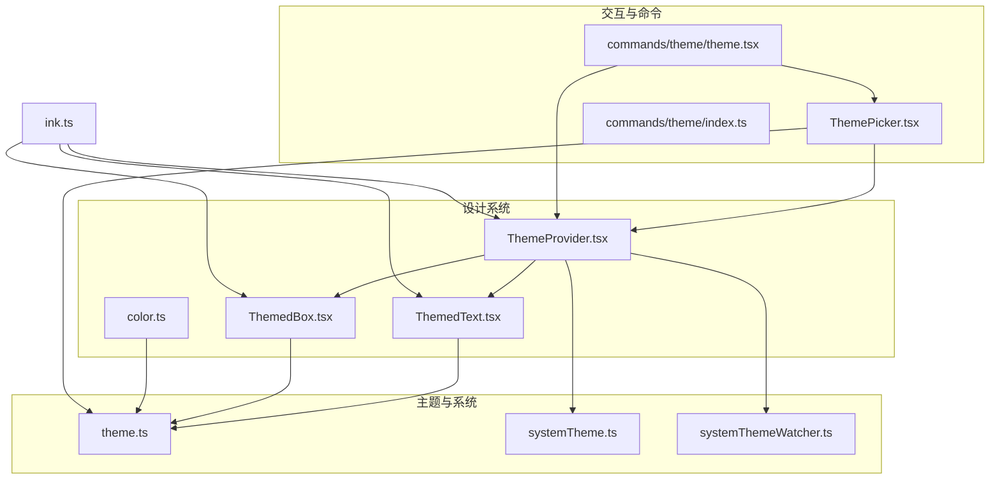
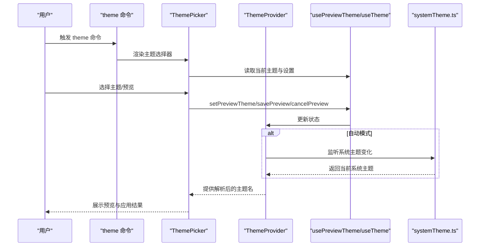
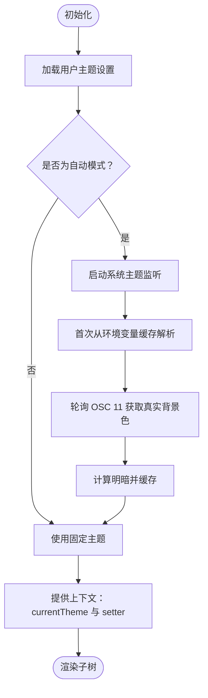
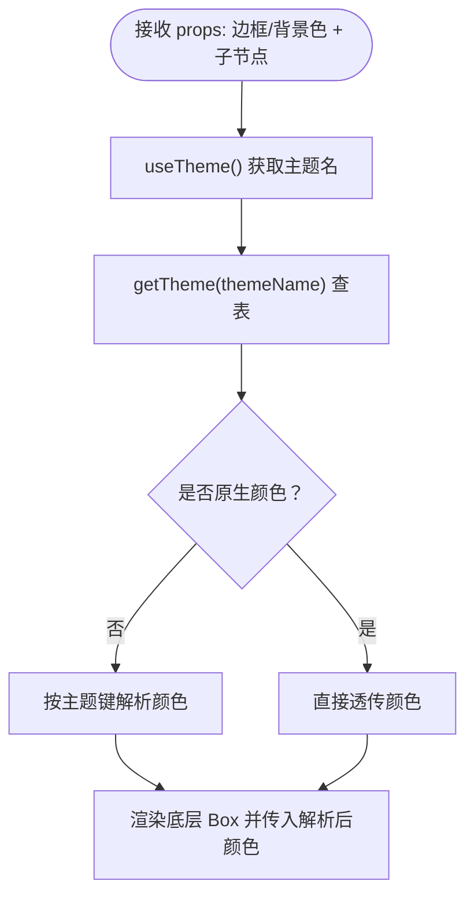
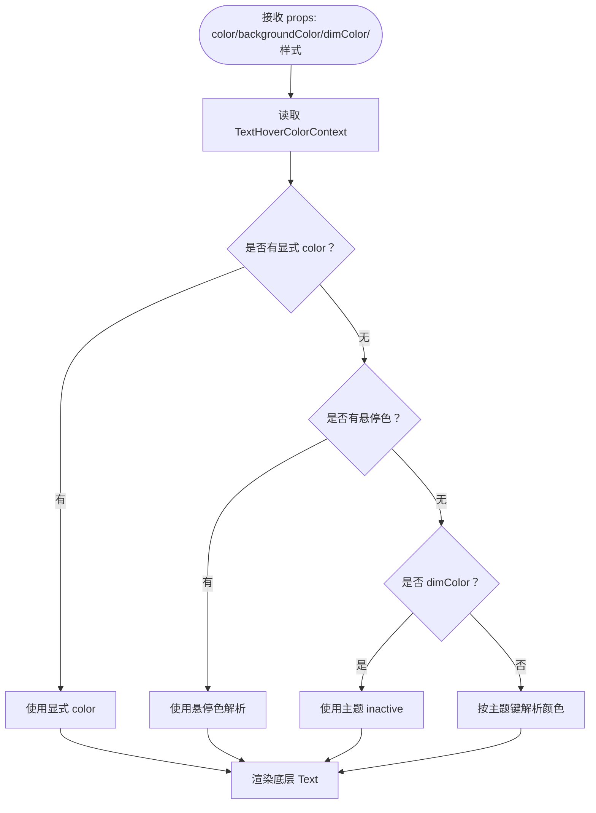
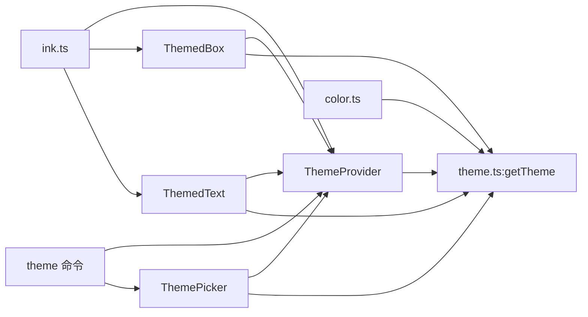

# 主题系统与定制

<cite>
**本文引用的文件**
- [src/components/design-system/ThemeProvider.tsx](file://src/components/design-system/ThemeProvider.tsx)
- [src/components/design-system/ThemedBox.tsx](file://src/components/design-system/ThemedBox.tsx)
- [src/components/design-system/ThemedText.tsx](file://src/components/design-system/ThemedText.tsx)
- [src/components/design-system/color.ts](file://src/components/design-system/color.ts)
- [src/utils/theme.ts](file://src/utils/theme.ts)
- [src/utils/systemTheme.ts](file://src/utils/systemTheme.ts)
- [src/utils/systemThemeWatcher.ts](file://src/utils/systemThemeWatcher.ts)
- [src/components/ThemePicker.tsx](file://src/components/ThemePicker.tsx)
- [src/commands/theme/theme.tsx](file://src/commands/theme/theme.tsx)
- [src/commands/theme/index.ts](file://src/commands/theme/index.ts)
- [src/ink.ts](file://src/ink.ts)
- [src/ink/components/Box.tsx](file://src/ink/components/Box.tsx)
- [src/ink/components/Text.tsx](file://src/ink/components/Text.tsx)
</cite>

## 目录
1. [简介](#简介)
2. [项目结构](#项目结构)
3. [核心组件](#核心组件)
4. [架构总览](#架构总览)
5. [详细组件分析](#详细组件分析)
6. [依赖关系分析](#依赖关系分析)
7. [性能考量](#性能考量)
8. [故障排查指南](#故障排查指南)
9. [结论](#结论)
10. [附录：主题定制最佳实践与示例](#附录主题定制最佳实践与示例)

## 简介
本文件系统化阐述 Claude Code 的主题系统与定制能力，涵盖颜色方案管理、字体与布局、响应式设计、主题切换机制、颜色变量系统与样式继承规则，并提供自定义主题的完整开发流程与最佳实践。读者将理解设计系统组件（ThemeProvider、ThemedBox、ThemedText、color.ts 等）的实现原理与使用方式，掌握如何在终端环境中构建一致、可访问且高性能的主题体验。

## 项目结构
主题系统围绕“设计系统组件 + 主题配置 + 切换与预览 + 命令入口”展开，核心文件分布如下：
- 设计系统组件：ThemeProvider、ThemedBox、ThemedText、color 工具
- 主题配置与解析：theme.ts（主题常量）、systemTheme.ts（系统主题检测）
- 主题选择器与命令：ThemePicker、theme 命令入口
- 入口导出：ink.ts 汇总导出设计系统组件与上下文

**图表来源**
- [src/components/design-system/ThemeProvider.tsx:43-116](file://src/components/design-system/ThemeProvider.tsx#L43-L116)
- [src/components/design-system/ThemedBox.tsx:1-156](file://src/components/design-system/ThemedBox.tsx#L1-L156)
- [src/components/design-system/ThemedText.tsx:1-124](file://src/components/design-system/ThemedText.tsx#L1-L124)
- [src/components/design-system/color.ts:1-31](file://src/components/design-system/color.ts#L1-L31)
- [src/utils/theme.ts:1-640](file://src/utils/theme.ts#L1-L640)
- [src/utils/systemTheme.ts:1-120](file://src/utils/systemTheme.ts#L1-L120)
- [src/utils/systemThemeWatcher.ts:1-4](file://src/utils/systemThemeWatcher.ts#L1-L4)
- [src/components/ThemePicker.tsx:1-333](file://src/components/ThemePicker.tsx#L1-L333)
- [src/commands/theme/theme.tsx:1-57](file://src/commands/theme/theme.tsx#L1-L57)
- [src/commands/theme/index.ts:1-11](file://src/commands/theme/index.ts#L1-L11)
- [src/ink.ts:33-43](file://src/ink.ts#L33-L43)

**章节来源**
- [src/ink.ts:33-43](file://src/ink.ts#L33-L43)
- [src/components/design-system/ThemeProvider.tsx:43-116](file://src/components/design-system/ThemeProvider.tsx#L43-L116)
- [src/components/design-system/ThemedBox.tsx:1-156](file://src/components/design-system/ThemedBox.tsx#L1-L156)
- [src/components/design-system/ThemedText.tsx:1-124](file://src/components/design-system/ThemedText.tsx#L1-L124)
- [src/components/design-system/color.ts:1-31](file://src/components/design-system/color.ts#L1-L31)
- [src/utils/theme.ts:1-640](file://src/utils/theme.ts#L1-L640)
- [src/utils/systemTheme.ts:1-120](file://src/utils/systemTheme.ts#L1-L120)
- [src/utils/systemThemeWatcher.ts:1-4](file://src/utils/systemThemeWatcher.ts#L1-L4)
- [src/components/ThemePicker.tsx:1-333](file://src/components/ThemePicker.tsx#L1-L333)
- [src/commands/theme/theme.tsx:1-57](file://src/commands/theme/theme.tsx#L1-L57)
- [src/commands/theme/index.ts:1-11](file://src/commands/theme/index.ts#L1-L11)

## 核心组件
- ThemeProvider：提供主题上下文，支持用户偏好、预览、保存与自动模式（跟随系统）。
- ThemedBox：主题感知的容器组件，自动将主题键解析为具体颜色并传递给底层 Box。
- ThemedText：主题感知的文本组件，支持显式颜色、背景色、悬停色、强调态与文本样式。
- color 工具：主题感知的颜色函数，支持主题键与原生颜色值（rgb/十六进制/ansi）。
- theme.ts：内置多套主题（深浅、色弱友好、仅 ANSI），统一颜色变量与语义色。
- systemTheme.ts：基于终端背景色检测系统主题，支持缓存与实时更新。
- ThemePicker：主题选择器 UI，支持语法高亮开关与预览保存。
- 命令入口：theme 命令提供交互式主题切换。

**章节来源**
- [src/components/design-system/ThemeProvider.tsx:43-116](file://src/components/design-system/ThemeProvider.tsx#L43-L116)
- [src/components/design-system/ThemedBox.tsx:52-155](file://src/components/design-system/ThemedBox.tsx#L52-L155)
- [src/components/design-system/ThemedText.tsx:76-123](file://src/components/design-system/ThemedText.tsx#L76-L123)
- [src/components/design-system/color.ts:9-30](file://src/components/design-system/color.ts#L9-L30)
- [src/utils/theme.ts:91-109](file://src/utils/theme.ts#L91-L109)
- [src/utils/systemTheme.ts:24-47](file://src/utils/systemTheme.ts#L24-L47)
- [src/components/ThemePicker.tsx:113-139](file://src/components/ThemePicker.tsx#L113-L139)

## 架构总览
主题系统采用“上下文 + 组件 + 配置”的分层架构：
- 上下文层：ThemeProvider 提供当前主题名与设置变更接口；useTheme/useThemeSetting/usePreviewTheme 提供钩子。
- 组件层：ThemedBox/ThemedText 将主题键解析为具体颜色，再渲染到 Ink 底层组件。
- 配置层：theme.ts 定义主题变量与多套主题；systemTheme.ts 负责系统主题检测与缓存。
- 交互层：ThemePicker 提供可视化选择与预览；命令入口 theme.tsx 提供 CLI 交互。

**图表来源**
- [src/commands/theme/theme.tsx:13-53](file://src/commands/theme/theme.tsx#L13-L53)
- [src/components/ThemePicker.tsx:68-72](file://src/components/ThemePicker.tsx#L68-L72)
- [src/components/design-system/ThemeProvider.tsx:43-116](file://src/components/design-system/ThemeProvider.tsx#L43-L116)
- [src/utils/systemTheme.ts:24-47](file://src/utils/systemTheme.ts#L24-L47)

## 详细组件分析

### ThemeProvider：主题上下文与切换机制
- 职责
  - 管理用户主题设置（含“自动”模式）
  - 支持主题预览（打开选择器时生效）
  - 实时监听系统主题变化（自动模式）
  - 保存主题设置到全局配置
- 关键点
  - 默认主题为“暗色”，便于无 Provider 场景（测试/工具）
  - “自动”模式通过系统主题检测与轮询更新当前主题
  - 预览状态优先于持久设置，关闭选择器或取消预览会回滚

**图表来源**
- [src/components/design-system/ThemeProvider.tsx:43-116](file://src/components/design-system/ThemeProvider.tsx#L43-L116)
- [src/utils/systemTheme.ts:24-47](file://src/utils/systemTheme.ts#L24-L47)
- [src/utils/systemThemeWatcher.ts:1-4](file://src/utils/systemThemeWatcher.ts#L1-L4)

**章节来源**
- [src/components/design-system/ThemeProvider.tsx:43-116](file://src/components/design-system/ThemeProvider.tsx#L43-L116)
- [src/utils/systemTheme.ts:24-47](file://src/utils/systemTheme.ts#L24-L47)

### ThemedBox：主题感知的容器组件
- 职责
  - 接收主题键或原生颜色作为边框/背景色
  - 在渲染前将主题键解析为具体颜色
  - 将解析后的颜色传入底层 Box
- 解析规则
  - 若为原生颜色（以 rgb(/#/ansi256(/ansi: 开头），直接透传
  - 否则按主题键查表获取颜色
- 性能
  - 使用内部缓存避免重复解析与重渲染

**图表来源**
- [src/components/design-system/ThemedBox.tsx:42-50](file://src/components/design-system/ThemedBox.tsx#L42-L50)
- [src/utils/theme.ts:598-613](file://src/utils/theme.ts#L598-L613)

**章节来源**
- [src/components/design-system/ThemedBox.tsx:52-155](file://src/components/design-system/ThemedBox.tsx#L52-L155)
- [src/utils/theme.ts:598-613](file://src/utils/theme.ts#L598-L613)

### ThemedText：主题感知的文本组件
- 职责
  - 支持显式颜色、背景色、悬停色、强调态（dimColor）、文本样式（粗体/斜体/下划线/删除线/反色）与换行策略
  - 解析优先级：显式 color > 悬停色 > 强调态（inactive） > 主题键
- 悬停色上下文
  - TextHoverColorContext 可为子树提供默认悬停色，跨 Box 边界生效
- 解析规则
  - 与 ThemedBox 类似，原生颜色透传，主题键查表

**图表来源**
- [src/components/design-system/ThemedText.tsx:66-74](file://src/components/design-system/ThemedText.tsx#L66-L74)
- [src/utils/theme.ts:598-613](file://src/utils/theme.ts#L598-L613)

**章节来源**
- [src/components/design-system/ThemedText.tsx:76-123](file://src/components/design-system/ThemedText.tsx#L76-L123)

### color 工具：主题感知的颜色函数
- 功能
  - 接收主题键或原生颜色，返回一个对文本加色的函数
  - 对原生颜色直接委托渲染器着色，对主题键先查表再着色
- 适用场景
  - 与 ThemedText/ThemedBox 协同，或用于需要直接对字符串加色的场景

**章节来源**
- [src/components/design-system/color.ts:9-30](file://src/components/design-system/color.ts#L9-L30)

### 主题选择器 ThemePicker：交互与预览
- 功能
  - 提供多种主题选项（含“自动”、“色弱友好”、“仅 ANSI”）
  - 支持语法高亮开关与预览保存
  - 键盘快捷键提示与退出处理
- 与 Provider 的协作
  - 通过 usePreviewTheme 设置/保存/取消预览
  - 通过 useThemeSetting 读取当前持久设置

**章节来源**
- [src/components/ThemePicker.tsx:113-139](file://src/components/ThemePicker.tsx#L113-L139)
- [src/components/ThemePicker.tsx:68-72](file://src/components/ThemePicker.tsx#L68-L72)

### 命令入口 theme：CLI 主题切换
- 功能
  - 以本地 JSX 命令形式提供交互式主题选择
  - 选择后通过 setTheme 写入 Provider 并回调完成信息

**章节来源**
- [src/commands/theme/index.ts:3-8](file://src/commands/theme/index.ts#L3-L8)
- [src/commands/theme/theme.tsx:13-53](file://src/commands/theme/theme.tsx#L13-L53)

## 依赖关系分析
- 组件依赖
  - ThemedBox/ThemedText 依赖 ThemeProvider 的 useTheme 与 theme.ts 的 getTheme
  - color 工具依赖 theme.ts 的 getTheme
  - ThemePicker 依赖 ThemeProvider 与系统主题能力
- 外部集成
  - ink.ts 汇总导出设计系统组件，确保全局可用
  - 底层 Ink 组件 Box/Text 提供布局与文本渲染能力

**图表来源**
- [src/components/design-system/ThemeProvider.tsx:43-116](file://src/components/design-system/ThemeProvider.tsx#L43-L116)
- [src/components/design-system/ThemedBox.tsx:1-10](file://src/components/design-system/ThemedBox.tsx#L1-L10)
- [src/components/design-system/ThemedText.tsx:1-7](file://src/components/design-system/ThemedText.tsx#L1-L7)
- [src/components/design-system/color.ts:1-3](file://src/components/design-system/color.ts#L1-L3)
- [src/utils/theme.ts:598-613](file://src/utils/theme.ts#L598-L613)
- [src/components/ThemePicker.tsx:1-14](file://src/components/ThemePicker.tsx#L1-L14)
- [src/commands/theme/theme.tsx:1-7](file://src/commands/theme/theme.tsx#L1-L7)
- [src/ink.ts:33-43](file://src/ink.ts#L33-L43)

**章节来源**
- [src/ink.ts:33-43](file://src/ink.ts#L33-L43)
- [src/components/design-system/ThemedBox.tsx:1-10](file://src/components/design-system/ThemedBox.tsx#L1-L10)
- [src/components/design-system/ThemedText.tsx:1-7](file://src/components/design-system/ThemedText.tsx#L1-L7)
- [src/components/design-system/color.ts:1-3](file://src/components/design-system/color.ts#L1-L3)
- [src/utils/theme.ts:598-613](file://src/utils/theme.ts#L598-L613)
- [src/components/ThemePicker.tsx:1-14](file://src/components/ThemePicker.tsx#L1-L14)
- [src/commands/theme/theme.tsx:1-7](file://src/commands/theme/theme.tsx#L1-L7)

## 性能考量
- 主题解析缓存
  - getTheme 返回主题对象，避免重复构造
  - ThemedBox/ThemedText 内部缓存解析结果，减少不必要的重渲染
- 系统主题监听
  - 仅在“自动”模式启用监听，减少不必要开销
  - 首次解析来自环境变量缓存，避免等待轮询
- 颜色函数
  - color 工具返回闭包，避免每次渲染都进行类型判断与查找
- 文本换行策略
  - Ink Text 对不同 wrap 模式做了样式记忆化，降低重复计算

[本节为通用性能建议，无需特定文件引用]

## 故障排查指南
- 问题：自动模式未生效
  - 检查系统主题监听是否启用（AUTO_THEME 特性）
  - 确认终端支持 OSC 11 查询且环境变量 COLORFGBG 正确
- 问题：颜色显示异常
  - 确认传入颜色格式：rgb()/十六进制/ansi256()/ansi: 原生颜色可直接透传
  - 检查主题键是否存在或拼写错误
- 问题：预览无法保存
  - 确认 ThemePicker 中 savePreview 是否被调用
  - 检查 onThemeSave 回调是否正确写入配置
- 问题：语法高亮不可用
  - 检查环境变量与模块加载条件
  - 使用快捷键切换语法高亮状态

**章节来源**
- [src/utils/systemTheme.ts:24-47](file://src/utils/systemTheme.ts#L24-L47)
- [src/utils/systemThemeWatcher.ts:1-4](file://src/utils/systemThemeWatcher.ts#L1-L4)
- [src/components/ThemePicker.tsx:78-99](file://src/components/ThemePicker.tsx#L78-L99)

## 结论
Claude Code 的主题系统以 ThemeProvider 为核心，结合 ThemedBox/ThemedText 与 color 工具，实现了在终端环境中的主题键到颜色值的高效解析与渲染。通过内置多套主题与系统主题检测，系统既保证了可访问性与一致性，又提供了灵活的定制空间。配合 ThemePicker 与命令入口，用户可以直观地切换与预览主题，满足不同终端与个人偏好的需求。

[本节为总结性内容，无需特定文件引用]

## 附录：主题定制最佳实践与示例

### 颜色变量系统与语义化
- 使用语义化键名（如 success/error/warning/inactive/subtle）提升一致性
- 为不同模式（暗/亮/色弱/仅 ANSI）分别维护颜色，确保对比度与可读性
- 为闪烁效果提供 shimmer 变体，保持动画的一致性

**章节来源**
- [src/utils/theme.ts:4-89](file://src/utils/theme.ts#L4-L89)

### 样式继承与覆盖规则
- ThemedText 的显式 color 优先级最高；其次为悬停色上下文；最后为强调态（dimColor）
- ThemedBox/ThemedText 支持原生颜色透传，适合局部微调
- Ink Text 的样式属性（粗体/斜体/下划线等）与主题颜色叠加时需注意互斥（如 bold 与 dim）

**章节来源**
- [src/components/design-system/ThemedText.tsx:9-11](file://src/components/design-system/ThemedText.tsx#L9-L11)
- [src/ink/components/Text.tsx:49-59](file://src/ink/components/Text.tsx#L49-L59)

### 响应式与布局适配
- 使用 ThemedBox 的 flex/gap/padding/margin 等属性构建响应式布局
- 在窄终端宽度下，合理使用 Text 的 wrap/truncate 策略
- 通过 ThemePicker 的语法高亮开关平衡可读性与性能

**章节来源**
- [src/ink/components/Box.tsx:10-45](file://src/ink/components/Box.tsx#L10-L45)
- [src/ink/components/Text.tsx:37-109](file://src/ink/components/Text.tsx#L37-L109)
- [src/components/ThemePicker.tsx:78-99](file://src/components/ThemePicker.tsx#L78-L99)

### 自定义主题开发流程
- 定义新主题键：在 theme.ts 中扩展 Theme 类型与主题对象
- 提供主题名称与设置项：更新 THEME_NAMES 与 THEME_SETTINGS
- 在 ThemePicker 中注册新选项：添加到 themeOptions
- 验证对比度与可访问性：确保在暗/亮/色弱/仅 ANSI 下均可用
- 性能验证：确认解析与渲染路径无多余重计算

**章节来源**
- [src/utils/theme.ts:91-109](file://src/utils/theme.ts#L91-L109)
- [src/utils/theme.ts:598-613](file://src/utils/theme.ts#L598-L613)
- [src/components/ThemePicker.tsx:113-139](file://src/components/ThemePicker.tsx#L113-L139)

### 最佳实践清单
- 可访问性
  - 保证文本与背景的对比度符合 WCAG 建议
  - 为色弱用户提供专用主题（light-daltonized/dark-daltonized）
- 跨平台一致性
  - 仅 ANSI 主题用于兼容旧终端；RGB 主题用于现代终端
  - 通过系统主题检测实现“自动”模式
- 性能优化
  - 复用主题对象与颜色解析缓存
  - 控制语法高亮模块加载与渲染范围

[本节为通用最佳实践，无需特定文件引用]