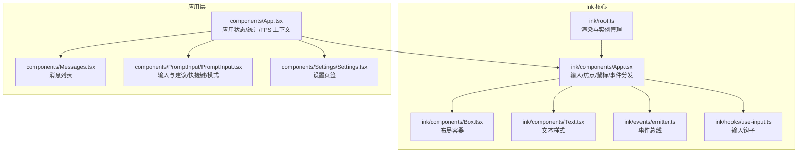
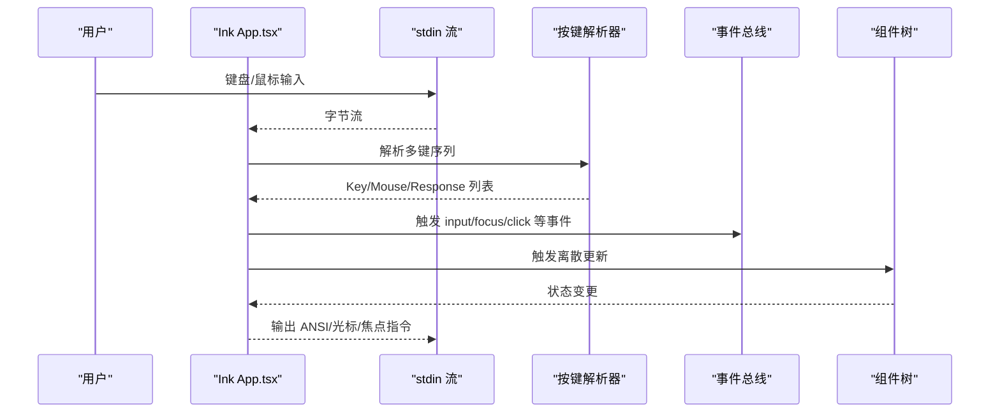
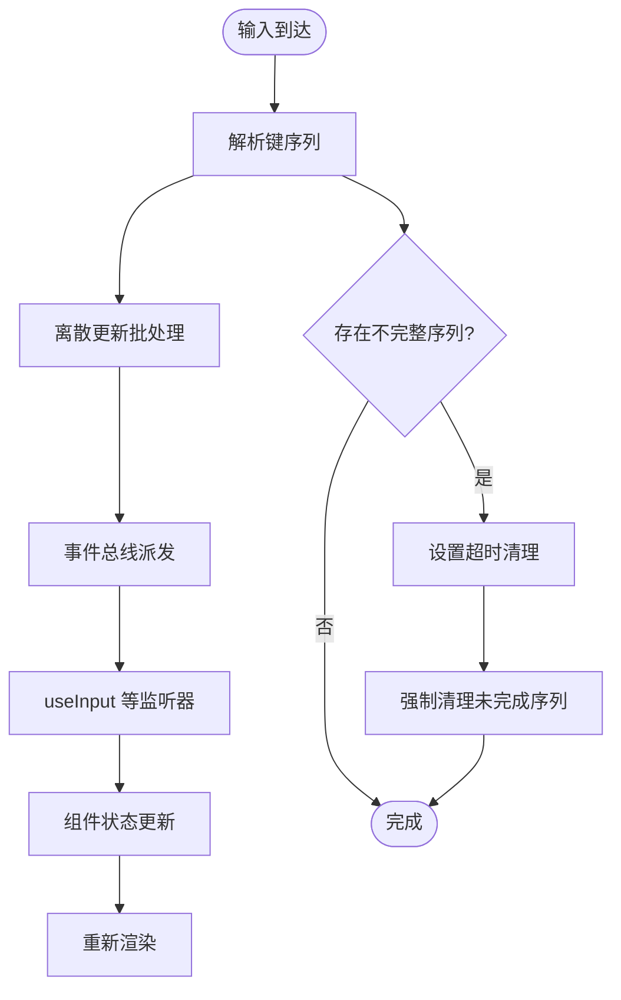
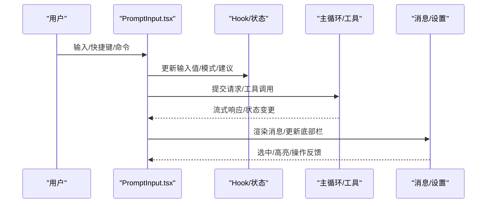
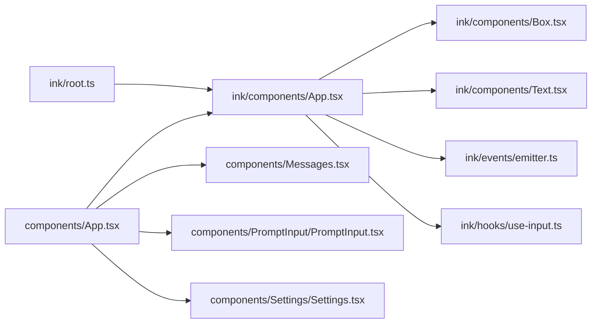

# 用户界面组件

<cite>
**本文引用的文件**
- [src/ink.ts](file://src/ink.ts)
- [src/ink/root.ts](file://src/ink/root.ts)
- [src/ink/components/App.tsx](file://src/ink/components/App.tsx)
- [src/ink/components/Box.tsx](file://src/ink/components/Box.tsx)
- [src/ink/components/Text.tsx](file://src/ink/components/Text.tsx)
- [src/ink/events/emitter.ts](file://src/ink/events/emitter.ts)
- [src/ink/hooks/use-input.ts](file://src/ink/hooks/use-input.ts)
- [src/components/App.tsx](file://src/components/App.tsx)
- [src/components/PromptInput/PromptInput.tsx](file://src/components/PromptInput/PromptInput.tsx)
- [src/components/Messages.tsx](file://src/components/Messages.tsx)
- [src/components/Settings/Settings.tsx](file://src/components/Settings/Settings.tsx)
</cite>

## 目录
1. [简介](#简介)
2. [项目结构](#项目结构)
3. [核心组件](#核心组件)
4. [架构总览](#架构总览)
5. [详细组件分析](#详细组件分析)
6. [依赖关系分析](#依赖关系分析)
7. [性能考量](#性能考量)
8. [故障排查指南](#故障排查指南)
9. [结论](#结论)
10. [附录](#附录)

## 简介
本文件面向 Claude Code 的用户界面组件系统，聚焦于 Ink 组件体系与应用层组件的协作方式。内容涵盖组件树结构、布局系统、事件处理、状态管理、主题与样式定制、组件间通信机制以及开发规范与实践建议。目标是帮助开发者快速理解并高效扩展终端内交互式界面。

## 项目结构
- Ink 核心位于 src/ink，提供终端渲染、输入解析、焦点管理、事件总线、上下文与 Hook 等基础设施。
- 应用层组件位于 src/components，包含消息显示、输入处理、设置界面、工具面板等业务组件。
- 入口与根容器：顶层 App 提供状态与上下文注入；Ink App 负责输入、焦点、鼠标事件与渲染生命周期。

图表来源
- [src/ink/root.ts:1-185](file://src/ink/root.ts#L1-L185)
- [src/ink/components/App.tsx:1-658](file://src/ink/components/App.tsx#L1-L658)
- [src/ink/components/Box.tsx:1-213](file://src/ink/components/Box.tsx#L1-L213)
- [src/ink/components/Text.tsx:1-254](file://src/ink/components/Text.tsx#L1-L254)
- [src/ink/events/emitter.ts:1-40](file://src/ink/events/emitter.ts#L1-L40)
- [src/ink/hooks/use-input.ts:1-93](file://src/ink/hooks/use-input.ts#L1-L93)
- [src/components/App.tsx:1-56](file://src/components/App.tsx#L1-L56)
- [src/components/Messages.tsx](file://src/components/Messages.tsx)
- [src/components/PromptInput/PromptInput.tsx:1-800](file://src/components/PromptInput/PromptInput.tsx#L1-L800)
- [src/components/Settings/Settings.tsx:1-137](file://src/components/Settings/Settings.tsx#L1-L137)

章节来源
- [src/ink/root.ts:1-185](file://src/ink/root.ts#L1-L185)
- [src/ink/components/App.tsx:1-658](file://src/ink/components/App.tsx#L1-L658)
- [src/components/App.tsx:1-56](file://src/components/App.tsx#L1-L56)

## 核心组件
- 渲染入口与根容器
  - ink.ts 暴露统一的 render/createRoot，并包裹 ThemeProvider，确保主题色与样式生效。
  - root.ts 提供同步渲染与异步根实例管理，支持复用同一 stdout 实例、帧回调与清理。
- 输入与事件
  - App.tsx（Ink）负责键盘/鼠标解析、焦点切换、悬停/点击分发、超时恢复与终端模式重置。
  - use-input.ts 提供输入监听 Hook，自动启用 raw 模式并在卸载时关闭。
  - emitter.ts 提供事件总线，尊重 stopImmediatePropagation。
- 布局与文本
  - Box.tsx 提供 Flex 布局、溢出控制、焦点与鼠标事件。
  - Text.tsx 支持颜色、背景、粗细/弱化、斜体、下划线、删除线、反显与多种换行/截断策略。

章节来源
- [src/ink.ts:1-86](file://src/ink.ts#L1-L86)
- [src/ink/root.ts:1-185](file://src/ink/root.ts#L1-L185)
- [src/ink/components/App.tsx:1-658](file://src/ink/components/App.tsx#L1-L658)
- [src/ink/hooks/use-input.ts:1-93](file://src/ink/hooks/use-input.ts#L1-L93)
- [src/ink/events/emitter.ts:1-40](file://src/ink/events/emitter.ts#L1-L40)
- [src/ink/components/Box.tsx:1-213](file://src/ink/components/Box.tsx#L1-L213)
- [src/ink/components/Text.tsx:1-254](file://src/ink/components/Text.tsx#L1-L254)

## 架构总览
Ink 将“输入解析—事件分发—DOM 树—渲染输出”解耦为独立模块；应用层通过顶层 App 注入状态与上下文，再由 Ink App 将输入转化为事件流，驱动组件树更新。

图表来源
- [src/ink/components/App.tsx:308-512](file://src/ink/components/App.tsx#L308-L512)
- [src/ink/events/emitter.ts:15-38](file://src/ink/events/emitter.ts#L15-L38)

## 详细组件分析

### 组件树与布局系统
- 组件树
  - 顶层 App.tsx（应用层）提供 AppState/Stats/FPS 上下文，作为所有业务组件的根容器。
  - Ink App.tsx（Ink 层）提供 stdin/stdout 上下文、焦点、尺寸、时钟、游标声明等，承载输入/事件/渲染生命周期。
- 布局系统
  - Box.tsx 提供 Flex 行列、伸缩、间距、溢出控制，支持 tabIndex 自动聚焦与点击/悬停事件。
  - Text.tsx 提供颜色、背景、粗细/弱化、斜体、下划线、删除线、反显与多种换行/截断策略。
- 响应式与尺寸
  - TerminalSizeContext 在 Ink App 中提供行列信息，组件可通过 hooks 获取当前终端尺寸。

章节来源
- [src/components/App.tsx:1-56](file://src/components/App.tsx#L1-L56)
- [src/ink/components/App.tsx:154-180](file://src/ink/components/App.tsx#L154-L180)
- [src/ink/components/Box.tsx:1-213](file://src/ink/components/Box.tsx#L1-L213)
- [src/ink/components/Text.tsx:1-254](file://src/ink/components/Text.tsx#L1-L254)

### 事件处理与输入系统
- 输入监听
  - use-input.ts 在挂载时启用 raw 模式，卸载时关闭；监听内部事件总线，过滤 Ctrl+C（若允许退出）后调用回调。
- 事件总线
  - emitter.ts 扩展 Node EventEmitter，对自定义 Event 类型尊重 stopImmediatePropagation。
- Ink App 的输入处理
  - 解析多键序列，批量触发离散更新，避免“最大更新深度”错误；支持粘贴超时与不完整转义序列清理。
  - 处理鼠标点击/拖拽/悬停、双击/三击选择、超链接打开、终端焦点事件、暂停/恢复信号等。

图表来源
- [src/ink/hooks/use-input.ts:42-93](file://src/ink/hooks/use-input.ts#L42-L93)
- [src/ink/events/emitter.ts:15-38](file://src/ink/events/emitter.ts#L15-L38)
- [src/ink/components/App.tsx:308-331](file://src/ink/components/App.tsx#L308-L331)
- [src/ink/components/App.tsx:442-512](file://src/ink/components/App.tsx#L442-L512)

章节来源
- [src/ink/hooks/use-input.ts:1-93](file://src/ink/hooks/use-input.ts#L1-L93)
- [src/ink/events/emitter.ts:1-40](file://src/ink/events/emitter.ts#L1-L40)
- [src/ink/components/App.tsx:308-512](file://src/ink/components/App.tsx#L308-L512)

### 状态管理与上下文
- 应用层状态
  - components/App.tsx 将 AppState/Stats/FPS 提供给子树，便于各组件读取与更新。
- Ink 层状态
  - Ink App 维护 raw 模式计数、终端查询器、多键点击计数、悬停位置、超时定时器等，保证输入稳定性与体验一致性。
- 事件与上下文
  - StdinContext/TerminalFocusContext/TerminalSizeContext/ClockProvider/CursorDeclarationContext 等在 Ink App 中集中提供。

章节来源
- [src/components/App.tsx:1-56](file://src/components/App.tsx#L1-L56)
- [src/ink/components/App.tsx:154-180](file://src/ink/components/App.tsx#L154-L180)
- [src/ink/components/App.tsx:101-110](file://src/ink/components/App.tsx#L101-L110)

### 主要界面组件

#### 消息显示组件（Messages）
- 功能定位
  - 展示对话历史、消息行、时间戳、选择器、虚拟滚动等。
- 关键点
  - 与输入组件协同，支持消息选择、操作菜单、工具使用反馈等。
  - 与主题系统配合，按消息类型/来源应用颜色与样式。

章节来源
- [src/components/Messages.tsx](file://src/components/Messages.tsx)

#### 输入处理组件（PromptInput）
- 功能定位
  - 交互式输入栏，支持命令建议、快捷键、模式切换、图片/引用插入、语音转写、历史搜索、权限模式、代理任务视图等。
- 关键点
  - 集成 useInput/useKeybinding/useArrowKeyHistory/usePromptSuggestion 等能力。
  - 与 AppState 同步：如 fast mode、thinking、effort、队列命令等。
  - 与通知系统联动：提示 ultrathink/ultraplan/ultrareview 等功能激活状态。

图表来源
- [src/components/PromptInput/PromptInput.tsx:194-800](file://src/components/PromptInput/PromptInput.tsx#L194-L800)

章节来源
- [src/components/PromptInput/PromptInput.tsx:1-800](file://src/components/PromptInput/PromptInput.tsx#L1-L800)

#### 设置界面组件（Settings）
- 功能定位
  - 提供 Status/Config/Usage/Gates 等标签页，支持诊断信息、配置检索与高度可定制的交互。
- 关键点
  - 使用 Tabs/Pane 设计系统组件，结合 Suspense 加载 Config 内容。
  - 通过 keybinding 控制 Esc 行为，支持 Modal/终端尺寸适配。

章节来源
- [src/components/Settings/Settings.tsx:1-137](file://src/components/Settings/Settings.tsx#L1-L137)

### 组件间通信机制
- 父子组件通信
  - 顶层 App 注入 AppState/Stats/FPS，子组件通过 hooks 访问与更新。
  - Ink App 通过 StdinContext/TerminalFocusContext 等向下传递能力。
- 兄弟组件通信
  - 通过 AppState 共享状态（如 footerSelection、viewingAgentTaskId 等），兄弟组件可读取并联动。
- 全局状态共享
  - AppStateStore 作为全局状态源，组件通过 useAppState/useSetAppState 订阅/修改。
- 事件总线
  - 内部 EventEmitter 用于跨组件解耦派发，支持 stopImmediatePropagation 控制传播。

章节来源
- [src/components/App.tsx:1-56](file://src/components/App.tsx#L1-L56)
- [src/ink/components/App.tsx:154-180](file://src/ink/components/App.tsx#L154-L180)
- [src/ink/events/emitter.ts:15-38](file://src/ink/events/emitter.ts#L15-L38)
- [src/components/PromptInput/PromptInput.tsx:481-506](file://src/components/PromptInput/PromptInput.tsx#L481-L506)

### 主题系统与样式定制
- 主题提供
  - ink.ts 默认包裹 ThemeProvider，使 ThemedBox/ThemedText 生效。
- 样式能力
  - Box/Text 提供颜色、背景、粗细/弱化、斜体、下划线、删除线、反显、换行/截断等。
- 响应式与布局
  - Flex 方向/伸缩/间距/溢出控制；根据终端尺寸动态适配。

章节来源
- [src/ink.ts:12-16](file://src/ink.ts#L12-L16)
- [src/ink/components/Box.tsx:10-45](file://src/ink/components/Box.tsx#L10-L45)
- [src/ink/components/Text.tsx:5-59](file://src/ink/components/Text.tsx#L5-L59)

### 组件开发指南
- 创建规范
  - 使用 Box/Text 构建布局与文本，遵循 Ink 的样式属性与换行策略。
  - 对需要输入的组件，优先使用 use-input 或基于 StdinContext 的能力。
- 样式定义
  - 优先使用设计系统组件与主题色；避免硬编码颜色。
- 交互设计
  - 正确处理 tabIndex/autofocus；在鼠标事件场景下仅在全屏模式启用。
- 可访问性
  - 注意无障碍模式下的光标可见性；避免阻塞输入流。
- 性能
  - 使用离散更新批处理；避免在高频输入路径上做昂贵计算。
  - 合理使用 memo/缓存与 Suspense。

章节来源
- [src/ink/components/Box.tsx:1-213](file://src/ink/components/Box.tsx#L1-L213)
- [src/ink/components/Text.tsx:1-254](file://src/ink/components/Text.tsx#L1-L254)
- [src/ink/hooks/use-input.ts:42-93](file://src/ink/hooks/use-input.ts#L42-L93)
- [src/ink/components/App.tsx:181-205](file://src/ink/components/App.tsx#L181-L205)

## 依赖关系分析

图表来源
- [src/ink/root.ts:1-185](file://src/ink/root.ts#L1-L185)
- [src/ink/components/App.tsx:1-658](file://src/ink/components/App.tsx#L1-L658)
- [src/ink/components/Box.tsx:1-213](file://src/ink/components/Box.tsx#L1-L213)
- [src/ink/components/Text.tsx:1-254](file://src/ink/components/Text.tsx#L1-L254)
- [src/ink/events/emitter.ts:1-40](file://src/ink/events/emitter.ts#L1-L40)
- [src/ink/hooks/use-input.ts:1-93](file://src/ink/hooks/use-input.ts#L1-L93)
- [src/components/App.tsx:1-56](file://src/components/App.tsx#L1-L56)
- [src/components/Messages.tsx](file://src/components/Messages.tsx)
- [src/components/PromptInput/PromptInput.tsx:1-800](file://src/components/PromptInput/PromptInput.tsx#L1-L800)
- [src/components/Settings/Settings.tsx:1-137](file://src/components/Settings/Settings.tsx#L1-L137)

章节来源
- [src/ink/root.ts:1-185](file://src/ink/root.ts#L1-L185)
- [src/ink/components/App.tsx:1-658](file://src/ink/components/App.tsx#L1-L658)
- [src/components/App.tsx:1-56](file://src/components/App.tsx#L1-L56)

## 性能考量
- 输入批处理
  - 批量处理多键输入，减少更新次数，避免“最大更新深度”错误。
- 渲染优化
  - 合理使用 memo 化样式与高亮计算；避免在渲染路径中进行昂贵操作。
- 终端模式
  - 仅在必要时启用 raw 模式，避免不必要的终端模式切换。
- 滚动与虚拟化
  - 大消息列表采用虚拟滚动或分页策略，降低重绘成本。

## 故障排查指南
- 输入无响应
  - 检查 stdin 是否为 TTY；确认 raw 模式已正确开启/关闭。
  - 查看是否存在多个 useInput 监听导致 stopImmediatePropagation 顺序异常。
- 鼠标点击无效
  - 确认处于全屏模式且启用了鼠标跟踪；检查 onClickAt/onHoverAt 的实现。
- 终端恢复问题
  - 长时间无输入后终端模式丢失，需触发 onStdinResume 以重置模式。
- 事件总线泄漏
  - 确保在组件卸载时移除事件监听；避免重复注册。

章节来源
- [src/ink/components/App.tsx:150-205](file://src/ink/components/App.tsx#L150-L205)
- [src/ink/hooks/use-input.ts:50-60](file://src/ink/hooks/use-input.ts#L50-L60)
- [src/ink/events/emitter.ts:15-38](file://src/ink/events/emitter.ts#L15-L38)

## 结论
Ink 组件系统通过清晰的输入/事件/渲染分层，为终端内复杂交互提供了稳定基础；应用层组件围绕 AppState 与上下文构建，形成高内聚、低耦合的界面生态。遵循本文的架构与开发规范，可在保证性能与可维护性的前提下，快速扩展新的界面组件与交互能力。

## 附录
- 使用示例与自定义方法
  - 自定义输入监听：使用 use-input，在 isActive=false 时禁用监听；在卸载时自动关闭 raw 模式。
  - 自定义事件：通过内部 EventEmitter 发布/订阅，注意 stopImmediatePropagation 的使用。
  - 自定义布局：使用 Box/Text 组合，合理设置 flex/gap/overflow，确保在不同终端尺寸下可读性。
  - 自定义主题：通过 ThemeProvider 注入主题，使用设计系统组件保持一致风格。

章节来源
- [src/ink/hooks/use-input.ts:42-93](file://src/ink/hooks/use-input.ts#L42-L93)
- [src/ink/events/emitter.ts:15-38](file://src/ink/events/emitter.ts#L15-L38)
- [src/ink/components/Box.tsx:10-45](file://src/ink/components/Box.tsx#L10-L45)
- [src/ink/components/Text.tsx:5-59](file://src/ink/components/Text.tsx#L5-L59)
- [src/ink.ts:12-16](file://src/ink.ts#L12-L16)