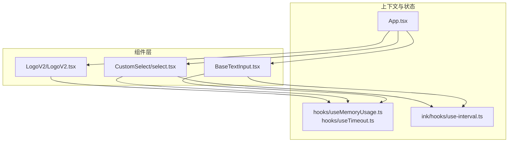
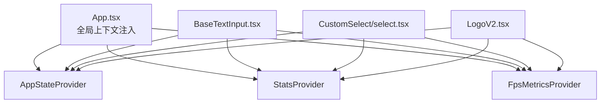
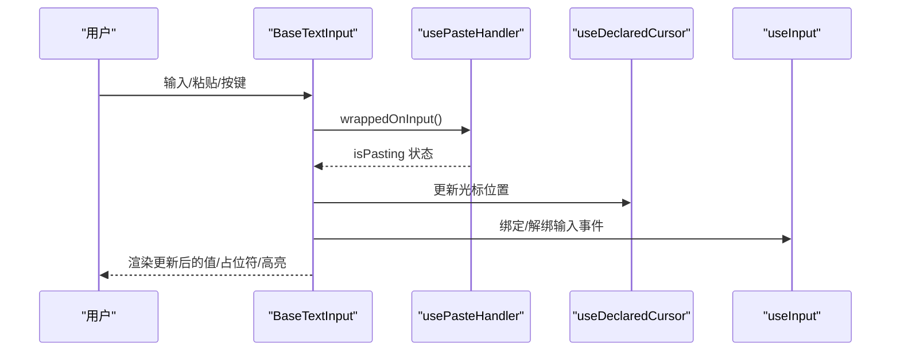
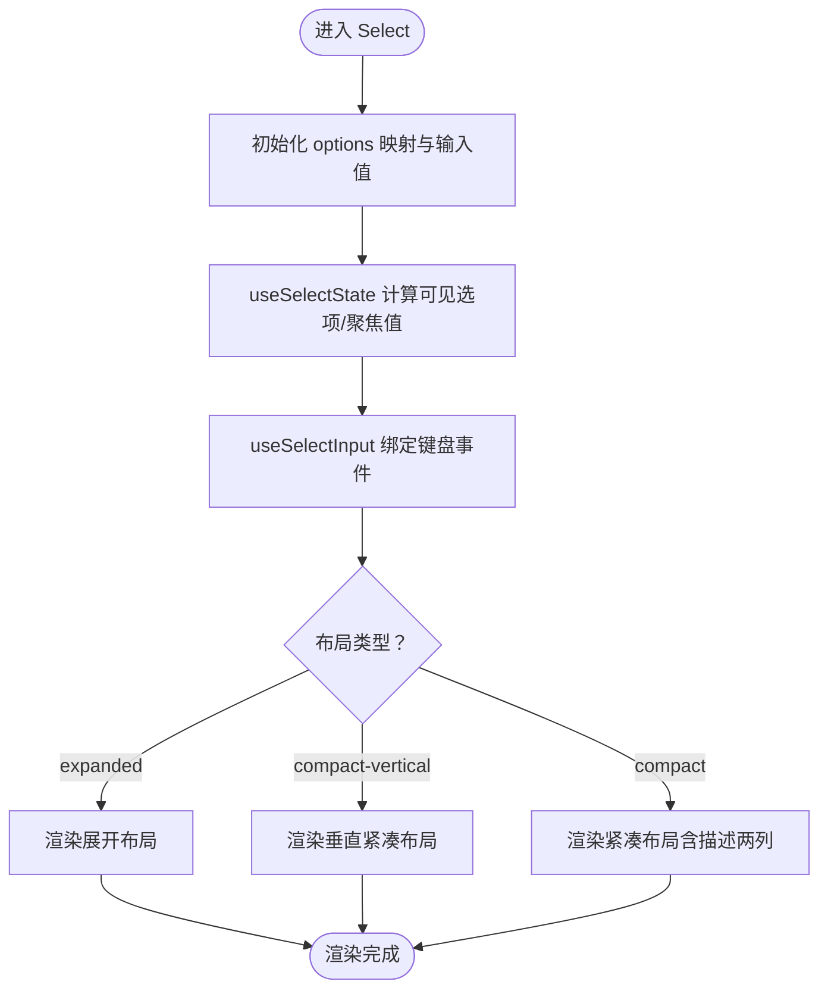
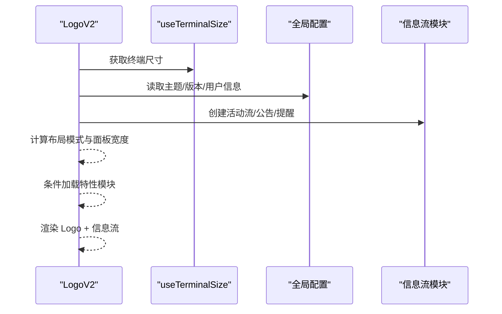
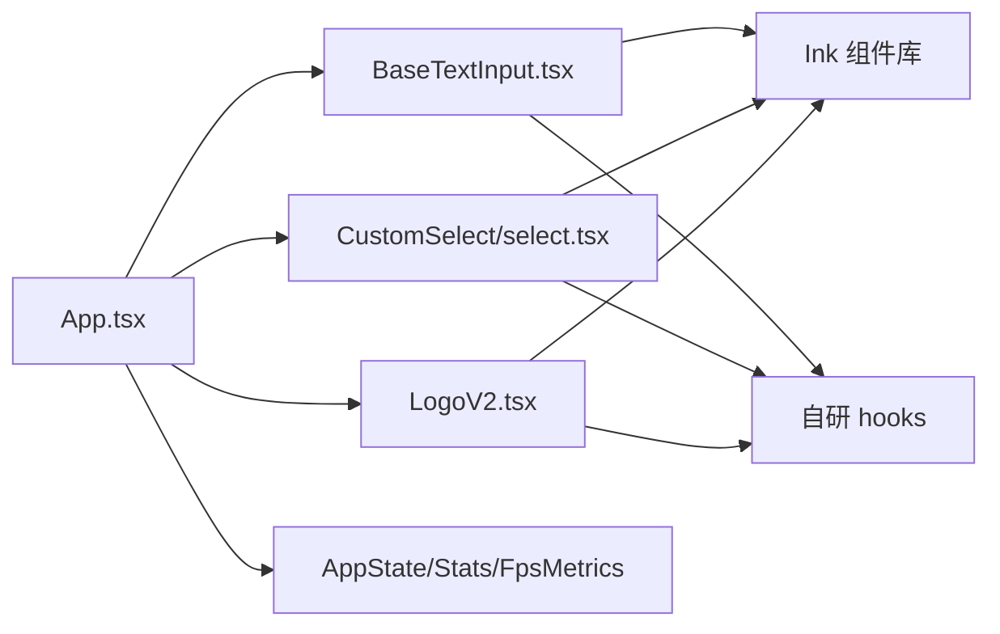

# 组件开发指南

<cite>
**本文引用的文件**
- [README.md](file://README.md)
- [package.json](file://package.json)
- [biome.json](file://biome.json)
- [src/components/BaseTextInput.tsx](file://src/components/BaseTextInput.tsx)
- [src/components/CustomSelect/select.tsx](file://src/components/CustomSelect/select.tsx)
- [src/components/LogoV2/LogoV2.tsx](file://src/components/LogoV2/LogoV2.tsx)
- [src/components/App.tsx](file://src/components/App.tsx)
- [src/hooks/useMemoryUsage.ts](file://src/hooks/useMemoryUsage.ts)
- [src/hooks/useTimeout.ts](file://src/hooks/useTimeout.ts)
- [src/ink/hooks/use-interval.ts](file://src/ink/hooks/use-interval.ts)
- [src/commands/plugin/plugin.tsx](file://src/commands/plugin/plugin.tsx)
- [src/services/MagicDocs/prompts.ts](file://src/services/MagicDocs/prompts.ts)
- [src/skills/bundled/simplify.ts](file://src/skills/bundled/simplify.ts)
</cite>

## 目录
1. [简介](#简介)
2. [项目结构](#项目结构)
3. [核心组件](#核心组件)
4. [架构总览](#架构总览)
5. [详细组件分析](#详细组件分析)
6. [依赖关系分析](#依赖关系分析)
7. [性能考虑](#性能考虑)
8. [故障排查指南](#故障排查指南)
9. [结论](#结论)
10. [附录](#附录)

## 简介
本指南面向在终端交互式 AI 编码助手项目中进行组件开发的工程师，提供从需求到实现、从接口设计到测试验证、再到性能优化与最佳实践的全流程规范。项目采用 React 与 Ink 终端渲染框架，结合自研 hooks 与上下文体系，形成统一的组件开发范式。

## 项目结构
- 组件位于 src/components 下，按功能域拆分（如 CustomSelect、LogoV2、PromptInput、messages 等），便于维护与复用。
- 设计系统与通用 UI 原子组件集中在 design-system 与 ui 子目录，确保一致的样式与行为。
- hooks 位于 src/hooks 与 src/components/hooks，提供跨组件的状态与副作用抽象。
- 顶层容器组件 App.tsx 提供全局上下文（状态、FPS 指标、统计）注入，保证组件树的一致性与可观测性。

图表来源
- [src/components/App.tsx:19-55](file://src/components/App.tsx#L19-L55)
- [src/components/BaseTextInput.tsx:1-136](file://src/components/BaseTextInput.tsx#L1-L136)
- [src/components/CustomSelect/select.tsx:1-690](file://src/components/CustomSelect/select.tsx#L1-L690)
- [src/components/LogoV2/LogoV2.tsx:1-543](file://src/components/LogoV2/LogoV2.tsx#L1-L543)
- [src/hooks/useMemoryUsage.ts:1-39](file://src/hooks/useMemoryUsage.ts#L1-L39)
- [src/hooks/useTimeout.ts:1-14](file://src/hooks/useTimeout.ts#L1-L14)
- [src/ink/hooks/use-interval.ts:1-50](file://src/ink/hooks/use-interval.ts#L1-L50)

章节来源
- [README.md:326-353](file://README.md#L326-L353)
- [package.json:30-33](file://package.json#L30-L33)

## 核心组件
- App.tsx：顶层容器，负责注入 AppStateProvider、StatsProvider、FpsMetricsProvider，确保组件树具备全局状态、统计数据与帧率指标。
- BaseTextInput.tsx：终端文本输入基座组件，封装光标、粘贴处理、占位符渲染、高亮与参数提示等能力，适配 Ink 渲染。
- CustomSelect/select.tsx：多布局可选菜单组件，支持紧凑/展开/垂直三列布局、描述内联、输入型选项、图片粘贴、编辑器联动等。
- LogoV2.tsx：品牌展示与信息面板，根据终端宽度动态布局，支持活动流、公告、沙箱状态提示等模块化内容区。

章节来源
- [src/components/App.tsx:19-55](file://src/components/App.tsx#L19-L55)
- [src/components/BaseTextInput.tsx:19-136](file://src/components/BaseTextInput.tsx#L19-L136)
- [src/components/CustomSelect/select.tsx:70-191](file://src/components/CustomSelect/select.tsx#L70-L191)
- [src/components/LogoV2/LogoV2.tsx:47-527](file://src/components/LogoV2/LogoV2.tsx#L47-L527)

## 架构总览
组件开发遵循“容器-展示”分离与“上下文驱动”的架构原则：
- 容器层：App.tsx 注入全局上下文；各业务页面或复合组件作为容器协调数据与交互。
- 展示层：BaseTextInput、Select、LogoV2 等为纯展示组件，职责单一、可复用性强。
- 上下文与 hooks：AppState、Stats、FpsMetrics 通过 Provider 注入；useMemoryUsage、useTimeout、use-interval 等 hooks 提供跨组件的通用能力。

图表来源
- [src/components/App.tsx:19-55](file://src/components/App.tsx#L19-L55)
- [src/components/BaseTextInput.tsx:1-136](file://src/components/BaseTextInput.tsx#L1-L136)
- [src/components/CustomSelect/select.tsx:1-690](file://src/components/CustomSelect/select.tsx#L1-L690)
- [src/components/LogoV2/LogoV2.tsx:1-543](file://src/components/LogoV2/LogoV2.tsx#L1-L543)

## 详细组件分析

### BaseTextInput 组件分析
- 设计要点
  - 输入状态与渲染解耦：通过 inputState 控制值、光标位置与视口偏移，避免重复渲染。
  - 终端光标管理：使用 useDeclaredCursor 精确定位光标，提升可访问性与体验。
  - 粘贴与回车处理：usePasteHandler 统一处理粘贴与回车键，避免粘贴后多余回车触发。
  - 占位符与高亮：renderPlaceholder 与高亮过滤，确保在不同视口范围内的正确显示。
  - 参数提示：针对斜杠命令场景，动态显示参数提示，提升输入效率。
- 生命周期与副作用
  - useInput 绑定输入事件，isActive 由 focus 决定。
  - useEffect 监听粘贴状态变化，必要时回调通知父组件。
- 性能优化
  - 使用 React 编译器 runtime 的局部缓存与早期返回，减少无效渲染。
  - 视口高亮过滤与延迟计算，降低长文本场景下的开销。

图表来源
- [src/components/BaseTextInput.tsx:53-90](file://src/components/BaseTextInput.tsx#L53-L90)

章节来源
- [src/components/BaseTextInput.tsx:19-136](file://src/components/BaseTextInput.tsx#L19-L136)

### CustomSelect 组件分析
- 设计要点
  - 多布局支持：compact、expanded、compact-vertical 三种布局，满足不同信息密度需求。
  - 描述内联与两列布局：当存在描述时，采用两列布局并计算最大标签宽度，保证对齐。
  - 输入型选项：支持内联输入、初始值、空提交策略、编辑器联动与图片粘贴。
  - 可访问性：通过 useDeclaredCursor 将焦点锚定在指针指示器，利于屏幕阅读器与放大镜跟踪。
- 状态管理
  - useSelectState 管理聚焦值、可见选项、滚动范围等；useSelectInput 处理键盘导航与提交。
  - 输入型选项的值通过 Map 管理，支持异步更新与游标重置。
- 性能优化
  - 早期返回与局部缓存，避免不必要的节点重建。
  - 文本宽度计算仅在必要时进行，减少布局抖动。

图表来源
- [src/components/CustomSelect/select.tsx:192-623](file://src/components/CustomSelect/select.tsx#L192-L623)

章节来源
- [src/components/CustomSelect/select.tsx:70-191](file://src/components/CustomSelect/select.tsx#L70-L191)

### LogoV2 组件分析
- 设计要点
  - 响应式布局：根据终端宽度选择紧凑/横向/纵向布局，动态计算左右面板宽度。
  - 条件渲染：基于 Feature Flags 与环境变量按需加载模块（如 ChannelsNotice），实现 Tree-shaking。
  - 多信息流：活动流、公告、信用额度提醒、紧急提示等模块化内容区组合展示。
- 性能优化
  - Memo 缓存与条件 useEffect，避免频繁更新。
  - 仅在需要时渲染扩展面板，减少首屏开销。

图表来源
- [src/components/LogoV2/LogoV2.tsx:47-527](file://src/components/LogoV2/LogoV2.tsx#L47-L527)

章节来源
- [src/components/LogoV2/LogoV2.tsx:47-527](file://src/components/LogoV2/LogoV2.tsx#L47-L527)

### 组件接口设计原则
- Props 定义
  - 明确必填与可选字段，提供默认值与只读标记，避免双向绑定引发的反馈环。
  - 事件回调命名清晰（如 onChange/onCancel/onFocus），参数语义明确。
- 事件处理
  - 使用 useInput/useSelectInput 等封装，集中处理键盘与输入事件，保持组件内聚。
- 状态管理
  - 将复杂状态下沉至 hooks（如 useSelectState、useMemoryUsage），组件仅负责渲染与调度。
- 生命周期钩子
  - 通过 useEffect 管理订阅与清理，避免内存泄漏；对高频更新使用共享时钟（use-interval）。

章节来源
- [src/components/CustomSelect/select.tsx:70-191](file://src/components/CustomSelect/select.tsx#L70-L191)
- [src/components/BaseTextInput.tsx:88-90](file://src/components/BaseTextInput.tsx#L88-L90)
- [src/ink/hooks/use-interval.ts:13-50](file://src/ink/hooks/use-interval.ts#L13-L50)

## 依赖关系分析
- 组件依赖
  - BaseTextInput/Select/LogoV2 均依赖 Ink 组件（Box、Text、Ansi）与自研 hooks（useDeclaredCursor、usePasteHandler、useTerminalSize）。
  - App.tsx 作为顶层容器，向上提供 AppState/Stats/FpsMetrics 三大上下文。
- 外部依赖
  - 项目使用 Biome 进行格式化与静态检查，TypeScript 严格模式，Knip 检测未使用项。
  - Monorepo 工作区包含内部 NAPI 包与 @ant 内部包 stub，便于统一管理与类型声明。

图表来源
- [src/components/App.tsx:19-55](file://src/components/App.tsx#L19-L55)
- [src/components/BaseTextInput.tsx:1-136](file://src/components/BaseTextInput.tsx#L1-L136)
- [src/components/CustomSelect/select.tsx:1-690](file://src/components/CustomSelect/select.tsx#L1-L690)
- [src/components/LogoV2/LogoV2.tsx:1-543](file://src/components/LogoV2/LogoV2.tsx#L1-L543)

章节来源
- [package.json:30-33](file://package.json#L30-L33)
- [biome.json:1-115](file://biome.json#L1-L115)

## 性能考虑
- 渲染优化
  - 使用 React 编译器 runtime 的局部缓存与早期返回，减少无效渲染（参考 BaseTextInput/Select）。
  - 文本宽度与高亮过滤在视口范围内进行，避免全量计算。
- 内存管理
  - useMemoryUsage 每 10 秒轮询一次，仅在高/危状态时更新，避免频繁重渲染。
  - 对高频定时器使用共享时钟（use-interval），减少唤醒次数。
- 事件处理
  - 事件绑定与解绑在 useEffect 中完成，避免重复订阅。
  - 粘贴与回车处理通过 usePasteHandler 统一，减少重复逻辑。

章节来源
- [src/hooks/useMemoryUsage.ts:18-39](file://src/hooks/useMemoryUsage.ts#L18-L39)
- [src/ink/hooks/use-interval.ts:13-50](file://src/ink/hooks/use-interval.ts#L13-L50)
- [src/components/BaseTextInput.tsx:67-75](file://src/components/BaseTextInput.tsx#L67-L75)

## 故障排查指南
- 输入异常
  - 若粘贴后出现多余回车，检查 usePasteHandler 的回车键处理逻辑与 wrappedOnInput 的调用顺序。
- 光标定位错误
  - 确认 useDeclaredCursor 的 line/column/active 参数与当前焦点状态一致。
- 选择菜单卡顿
  - 检查 useSelectState 的可见选项计算与 use-interval 的共享时钟是否生效。
- 高内存占用
  - 使用 useMemoryUsage 观察状态变化，确认是否存在未释放的订阅或重复渲染。

章节来源
- [src/components/BaseTextInput.tsx:53-90](file://src/components/BaseTextInput.tsx#L53-L90)
- [src/components/CustomSelect/select.tsx:301-348](file://src/components/CustomSelect/select.tsx#L301-L348)
- [src/hooks/useMemoryUsage.ts:18-39](file://src/hooks/useMemoryUsage.ts#L18-L39)

## 结论
本指南总结了组件开发的规范与最佳实践：以 App.tsx 为容器、以 hooks 为状态与副作用抽象、以 Ink 为渲染基础，围绕 Props、事件、状态与生命周期进行设计。通过 BaseTextInput、CustomSelect、LogoV2 等组件的实现模式，可快速构建高性能、可维护、可扩展的终端交互组件。

## 附录

### 组件开发流程（从需求到测试）
- 需求分析：明确交互目标、输入输出、边界条件与可访问性要求。
- 设计讨论：确定组件职责、Props 设计、事件回调与状态边界；评估是否需要新 hooks 或上下文。
- 代码实现：遵循命名约定与文件组织结构，优先实现最小可用版本。
- 测试验证：编写单元测试与集成测试，覆盖关键路径与边界条件；必要时进行可视化回归测试。
- 性能评估：关注渲染次数、内存占用与事件响应；优化高频路径与不必要重渲染。
- 文档与评审：补充组件文档与变更说明，进行代码评审与性能评审。

### 代码风格与规范
- 格式化与静态检查：使用 Biome，遵循项目配置（缩进、行宽、分号策略等）。
- 命名约定：组件文件采用 PascalCase，导出函数与类型使用清晰语义；hooks 以 use 前缀命名。
- 文件组织：组件按功能域划分，公共工具与类型集中管理，避免循环依赖。

章节来源
- [biome.json:11-114](file://biome.json#L11-L114)
- [src/services/MagicDocs/prompts.ts:23-39](file://src/services/MagicDocs/prompts.ts#L23-L39)
- [src/skills/bundled/simplify.ts:24-38](file://src/skills/bundled/simplify.ts#L24-L38)

### 示例与参考
- 插件设置命令：通过 JSX 命令入口返回设置组件，体现命令与组件的衔接方式。
- 组件示例：BaseTextInput、CustomSelect、LogoV2 的实现细节可作为新组件的参考模板。

章节来源
- [src/commands/plugin/plugin.tsx:1-6](file://src/commands/plugin/plugin.tsx#L1-L6)
- [src/components/BaseTextInput.tsx:19-136](file://src/components/BaseTextInput.tsx#L19-L136)
- [src/components/CustomSelect/select.tsx:70-191](file://src/components/CustomSelect/select.tsx#L70-L191)
- [src/components/LogoV2/LogoV2.tsx:47-527](file://src/components/LogoV2/LogoV2.tsx#L47-L527)