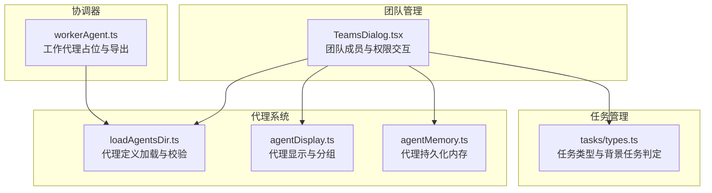
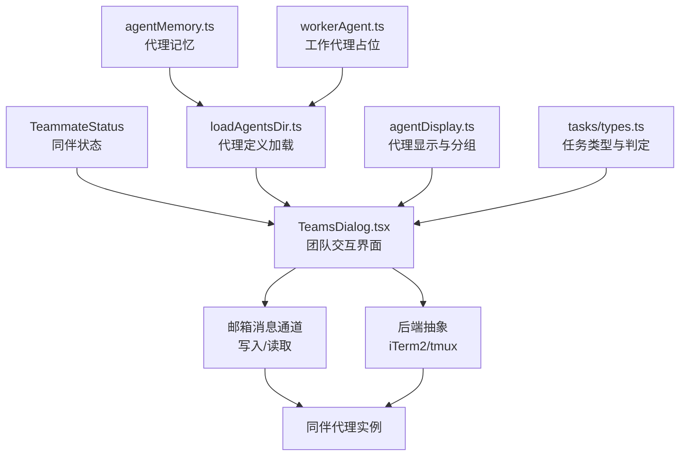
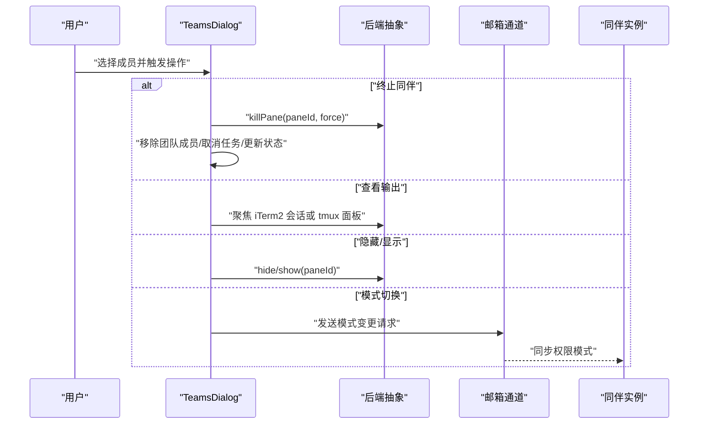
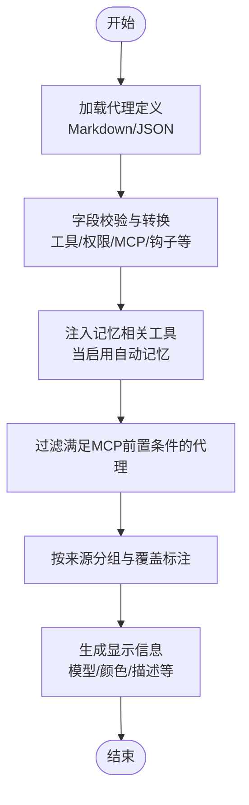
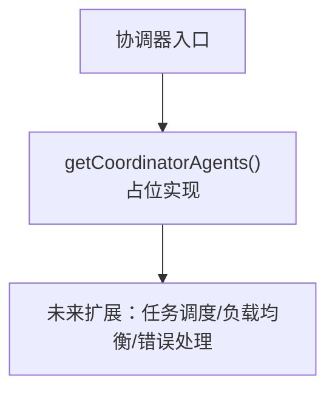
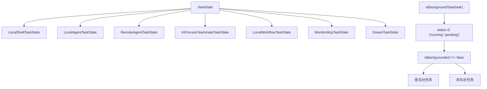
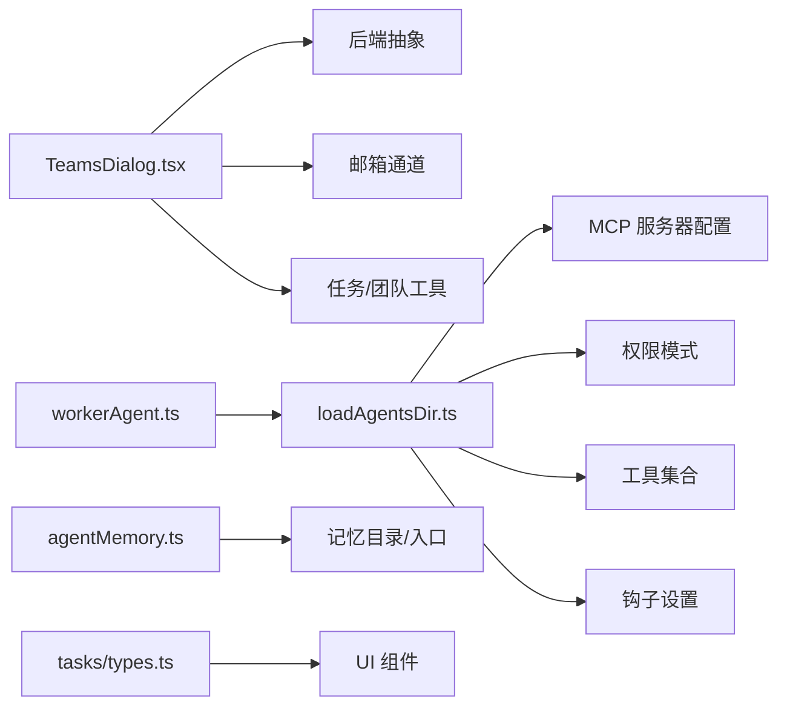

# 协作工具系统

<cite>
**本文引用的文件**
- [src/coordinator/workerAgent.ts](file://src/coordinator/workerAgent.ts)
- [src/tasks/types.ts](file://src/tasks/types.ts)
- [src/components/teams/TeamsDialog.tsx](file://src/components/teams/TeamsDialog.tsx)
- [src/tools/AgentTool/loadAgentsDir.ts](file://src/tools/AgentTool/loadAgentsDir.ts)
- [src/tools/AgentTool/agentDisplay.ts](file://src/tools/AgentTool/agentDisplay.ts)
- [src/tools/AgentTool/agentMemory.ts](file://src/tools/AgentTool/agentMemory.ts)
</cite>

## 目录
1. [简介](#简介)
2. [项目结构](#项目结构)
3. [核心组件](#核心组件)
4. [架构总览](#架构总览)
5. [详细组件分析](#详细组件分析)
6. [依赖关系分析](#依赖关系分析)
7. [性能考量](#性能考量)
8. [故障排查指南](#故障排查指南)
9. [结论](#结论)
10. [附录](#附录)

## 简介
本文件面向协作工具系统，围绕团队管理（Teams）、代理系统（AgentTool）、协调器（Coordinator）与任务管理进行深入解析。内容涵盖：
- 团队成员管理、角色权限分配、协作规则设置
- 代理创建、任务分配、状态监控、结果汇总
- 协调器的任务调度与负载均衡、错误处理机制
- 任务创建、进度跟踪、状态更新、完成确认
- 集成方式（API、配置、扩展）
- 使用指南（配置步骤、操作流程、最佳实践）
- 具体使用示例与常见问题解决方案

## 项目结构
协作工具系统由多模块组成：团队对话框负责成员与权限交互；代理工具负责代理定义、加载与显示；任务类型统一抽象；协调器提供工作代理能力占位。下图展示与本文相关的核心文件与职责映射。

**图表来源**
- [src/components/teams/TeamsDialog.tsx:1-715](file://src/components/teams/TeamsDialog.tsx#L1-L715)
- [src/tools/AgentTool/loadAgentsDir.ts:1-756](file://src/tools/AgentTool/loadAgentsDir.ts#L1-L756)
- [src/tools/AgentTool/agentDisplay.ts:1-105](file://src/tools/AgentTool/agentDisplay.ts#L1-L105)
- [src/tools/AgentTool/agentMemory.ts:1-178](file://src/tools/AgentTool/agentMemory.ts#L1-L178)
- [src/tasks/types.ts:1-47](file://src/tasks/types.ts#L1-L47)
- [src/coordinator/workerAgent.ts:1-5](file://src/coordinator/workerAgent.ts#L1-L5)

**章节来源**
- [src/components/teams/TeamsDialog.tsx:1-715](file://src/components/teams/TeamsDialog.tsx#L1-L715)
- [src/tools/AgentTool/loadAgentsDir.ts:1-756](file://src/tools/AgentTool/loadAgentsDir.ts#L1-L756)
- [src/tools/AgentTool/agentDisplay.ts:1-105](file://src/tools/AgentTool/agentDisplay.ts#L1-L105)
- [src/tools/AgentTool/agentMemory.ts:1-178](file://src/tools/AgentTool/agentMemory.ts#L1-L178)
- [src/tasks/types.ts:1-47](file://src/tasks/types.ts#L1-L47)
- [src/coordinator/workerAgent.ts:1-5](file://src/coordinator/workerAgent.ts#L1-L5)

## 核心组件
- 团队管理（Teams）
  - 基于交互式对话框 TeamsDialog，支持成员列表查看、详情查看、模式切换、输出查看、终止与隐藏/显示等操作。
  - 支持后端抽象（如 iTerm2、tmux），通过邮箱消息通道下发控制指令。
- 代理系统（AgentTool）
  - 代理定义加载与校验：从 Markdown/JSON 解析代理定义，注入工具、MCP 服务器、权限模式、记忆范围等。
  - 代理显示与分组：按来源与优先级对齐，支持覆盖标注与排序。
  - 代理持久化内存：支持用户/项目/本地三类作用域的记忆目录与入口文件。
- 协调器（Coordinator）
  - 提供工作代理能力占位导出，作为后续调度与执行层的基础。
- 任务管理
  - 统一任务类型与背景任务判定逻辑，便于在 UI 与后台指示器中一致呈现。

**章节来源**
- [src/components/teams/TeamsDialog.tsx:1-715](file://src/components/teams/TeamsDialog.tsx#L1-L715)
- [src/tools/AgentTool/loadAgentsDir.ts:1-756](file://src/tools/AgentTool/loadAgentsDir.ts#L1-L756)
- [src/tools/AgentTool/agentDisplay.ts:1-105](file://src/tools/AgentTool/agentDisplay.ts#L1-L105)
- [src/tools/AgentTool/agentMemory.ts:1-178](file://src/tools/AgentTool/agentMemory.ts#L1-L178)
- [src/tasks/types.ts:1-47](file://src/tasks/types.ts#L1-L47)
- [src/coordinator/workerAgent.ts:1-5](file://src/coordinator/workerAgent.ts#L1-L5)

## 架构总览
下图展示协作工具系统的关键交互路径：团队对话框与后端/邮箱通道交互，代理系统负责代理定义与显示，任务类型统一抽象，协调器提供工作代理基础。

**图表来源**
- [src/components/teams/TeamsDialog.tsx:1-715](file://src/components/teams/TeamsDialog.tsx#L1-L715)
- [src/tools/AgentTool/loadAgentsDir.ts:1-756](file://src/tools/AgentTool/loadAgentsDir.ts#L1-L756)
- [src/tools/AgentTool/agentDisplay.ts:1-105](file://src/tools/AgentTool/agentDisplay.ts#L1-L105)
- [src/tools/AgentTool/agentMemory.ts:1-178](file://src/tools/AgentTool/agentMemory.ts#L1-L178)
- [src/tasks/types.ts:1-47](file://src/tasks/types.ts#L1-L47)
- [src/coordinator/workerAgent.ts:1-5](file://src/coordinator/workerAgent.ts#L1-L5)

## 详细组件分析

### 团队管理（Teams）组件分析
- 成员列表与详情
  - 列表视图展示成员名称、模式符号、是否空闲/隐藏、模型等；详情视图展示任务列表与提示词摘要。
- 模式同步与批量切换
  - 支持单个或全部成员模式循环切换，批量切换时若模式不一致先归一到默认再轮转，确保一致性。
- 运行控制
  - 终止同伴：通过后端抽象关闭面板，移除团队配置，取消分配任务，更新应用状态并推送通知。
  - 查看输出：根据后端类型聚焦 iTerm2 会话或 tmux 面板。
  - 隐藏/显示：仅在支持的后端上可用，提供单个与批量操作。
- 数据刷新与输入响应
  - 定时刷新以反映同伴模式变化；键盘快捷键驱动导航、操作与返回。

**图表来源**
- [src/components/teams/TeamsDialog.tsx:547-714](file://src/components/teams/TeamsDialog.tsx#L547-L714)

**章节来源**
- [src/components/teams/TeamsDialog.tsx:1-715](file://src/components/teams/TeamsDialog.tsx#L1-L715)

### 代理系统（AgentTool）组件分析
- 代理定义加载与校验
  - 支持从 Markdown 与 JSON 加载代理定义，校验字段（描述、工具、权限模式、MCP 服务器、钩子、最大回合数、技能、初始提示、记忆、隔离模式等）。
  - 自动注入具备持久化记忆时所需的文件读写工具。
  - 过滤满足 MCP 服务器前置条件的代理。
- 代理显示与分组
  - 按来源优先级分组显示，标注覆盖关系，支持按名称排序。
- 代理持久化内存
  - 支持用户/项目/本地三类作用域，提供目录与入口文件路径，构建记忆提示词。

**图表来源**
- [src/tools/AgentTool/loadAgentsDir.ts:296-393](file://src/tools/AgentTool/loadAgentsDir.ts#L296-L393)
- [src/tools/AgentTool/agentDisplay.ts:46-72](file://src/tools/AgentTool/agentDisplay.ts#L46-L72)
- [src/tools/AgentTool/agentMemory.ts:138-177](file://src/tools/AgentTool/agentMemory.ts#L138-L177)

**章节来源**
- [src/tools/AgentTool/loadAgentsDir.ts:1-756](file://src/tools/AgentTool/loadAgentsDir.ts#L1-L756)
- [src/tools/AgentTool/agentDisplay.ts:1-105](file://src/tools/AgentTool/agentDisplay.ts#L1-L105)
- [src/tools/AgentTool/agentMemory.ts:1-178](file://src/tools/AgentTool/agentMemory.ts#L1-L178)

### 协调器（Coordinator）组件分析
- 工作代理占位
  - 当前导出一个自动生成的占位函数，用于后续实现工作代理能力。
- 后续演进方向
  - 可在此基础上接入任务调度、负载均衡与错误恢复策略，与代理系统与团队管理形成闭环。

**图表来源**
- [src/coordinator/workerAgent.ts:1-5](file://src/coordinator/workerAgent.ts#L1-L5)

**章节来源**
- [src/coordinator/workerAgent.ts:1-5](file://src/coordinator/workerAgent.ts#L1-L5)

### 任务管理组件分析
- 任务类型统一
  - 定义多种任务状态类型的联合类型，便于组件以统一接口处理。
- 背景任务判定
  - 仅运行中或待定且未显式标记为前台的任务视为“后台任务”，用于后台指示器展示。

**图表来源**
- [src/tasks/types.ts:12-46](file://src/tasks/types.ts#L12-L46)

**章节来源**
- [src/tasks/types.ts:1-47](file://src/tasks/types.ts#L1-L47)

## 依赖关系分析
- 团队管理依赖
  - 与后端抽象（iTerm2/tmux）交互以执行面板生命周期操作。
  - 通过邮箱消息通道与同伴代理通信，实现模式同步与控制指令下发。
  - 依赖任务列表与团队发现工具，用于展示同伴任务与状态。
- 代理系统依赖
  - 与 MCP 服务配置、权限模式、工具集合、钩子设置等强关联。
  - 记忆目录与入口文件依赖项目根路径与内存基线路径。
- 协调器依赖
  - 与代理系统紧密耦合，承载工作代理能力的扩展点。
- 任务管理依赖
  - 与 UI 组件与后台指示器共享任务类型与判定逻辑。

**图表来源**
- [src/components/teams/TeamsDialog.tsx:1-715](file://src/components/teams/TeamsDialog.tsx#L1-L715)
- [src/tools/AgentTool/loadAgentsDir.ts:1-756](file://src/tools/AgentTool/loadAgentsDir.ts#L1-L756)
- [src/tools/AgentTool/agentMemory.ts:1-178](file://src/tools/AgentTool/agentMemory.ts#L1-L178)
- [src/tasks/types.ts:1-47](file://src/tasks/types.ts#L1-L47)
- [src/coordinator/workerAgent.ts:1-5](file://src/coordinator/workerAgent.ts#L1-L5)

**章节来源**
- [src/components/teams/TeamsDialog.tsx:1-715](file://src/components/teams/TeamsDialog.tsx#L1-L715)
- [src/tools/AgentTool/loadAgentsDir.ts:1-756](file://src/tools/AgentTool/loadAgentsDir.ts#L1-L756)
- [src/tools/AgentTool/agentMemory.ts:1-178](file://src/tools/AgentTool/agentMemory.ts#L1-L178)
- [src/tasks/types.ts:1-47](file://src/tasks/types.ts#L1-L47)
- [src/coordinator/workerAgent.ts:1-5](file://src/coordinator/workerAgent.ts#L1-L5)

## 性能考量
- 代理定义加载采用缓存与并发初始化策略，减少重复 I/O 与解析开销。
- 团队对话框定时刷新频率适中，避免频繁查询导致 UI 卡顿。
- 任务类型判定逻辑轻量，仅基于状态与标记字段，适合高频渲染场景。
- 后端抽象与邮箱通道的调用尽量短路失败路径，保证操作的确定性与可恢复性。

## 故障排查指南
- 无法查看同伴输出
  - 确认后端类型与命令参数正确（iTerm2 会话聚焦、tmux 面板选择）。
  - 若在 tmux 外部环境，需使用集群套接字参数以定位目标面板。
- 模式同步无效
  - 检查邮箱通道消息是否成功写入与同伴是否接收。
  - 批量模式切换时，若模式不一致会先归一到默认再轮转，确认当前模式状态。
- 终止同伴后任务未清理
  - 确认移除团队成员、取消分配任务与更新应用状态的流程已执行。
  - 如出现异常，检查日志并重试操作。
- 代理不可用
  - 检查 MCP 服务器前置条件是否满足，代理定义字段是否符合校验规则。
  - 确认工具集合与记忆注入逻辑未遗漏必要工具。

**章节来源**
- [src/components/teams/TeamsDialog.tsx:547-714](file://src/components/teams/TeamsDialog.tsx#L547-L714)
- [src/tools/AgentTool/loadAgentsDir.ts:229-255](file://src/tools/AgentTool/loadAgentsDir.ts#L229-L255)

## 结论
协作工具系统通过团队管理、代理系统、任务管理与协调器的协同，实现了成员权限治理、代理定义与运行、任务状态统一与工作代理扩展点。团队对话框提供直观的交互入口，代理系统保障定义与显示的一致性，任务类型抽象提升 UI 与后台指示器的兼容性，协调器为后续调度与负载均衡预留空间。建议在实际部署中结合权限模式与 MCP 服务器配置，完善错误处理与可观测性，持续优化交互体验与性能表现。

## 附录
- 使用指南（概要）
  - 团队管理
    - 打开团队对话框，浏览成员列表，进入详情查看任务与提示词。
    - 使用快捷键进行模式切换、终止同伴、查看输出、隐藏/显示等操作。
  - 代理系统
    - 在 Markdown/JSON 中定义代理，填写描述、工具、权限模式、MCP 服务器等字段。
    - 启用自动记忆时，系统自动注入文件读写工具；满足 MCP 前置条件的代理才会激活。
  - 任务管理
    - 创建任务后关注状态变化；仅运行中或待定且非前台的任务会出现在后台指示器中。
  - 协调器
    - 作为工作代理扩展点，后续可接入调度与负载均衡策略。
- 集成方式（概要）
  - API：通过邮箱通道与后端抽象进行同伴控制与模式同步。
  - 配置：代理定义支持多来源（用户/项目/插件/内置），并提供覆盖标注与分组显示。
  - 扩展：在协调器占位处扩展工作代理能力，对接代理系统与团队管理。