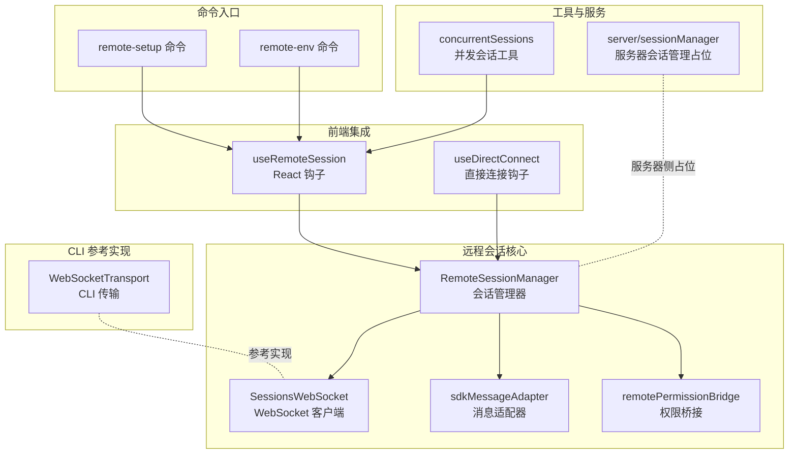
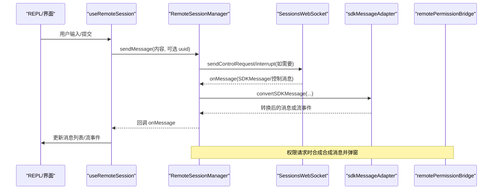
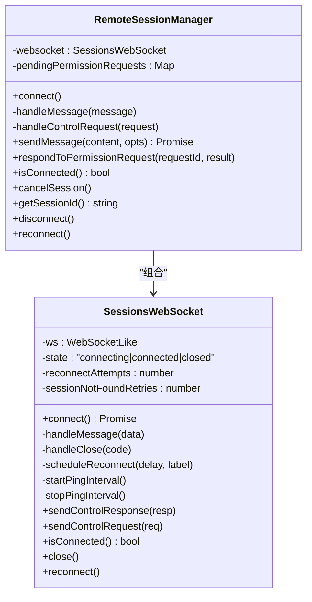
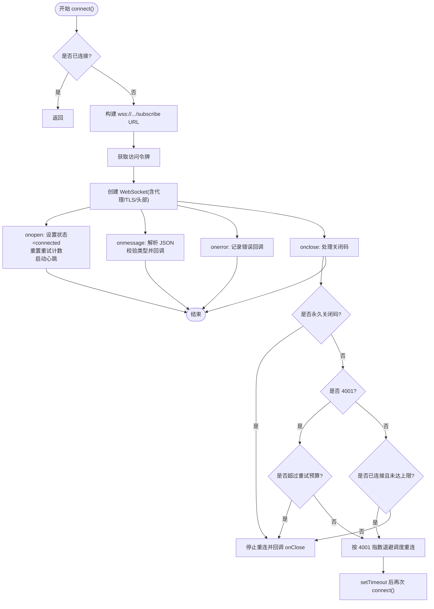
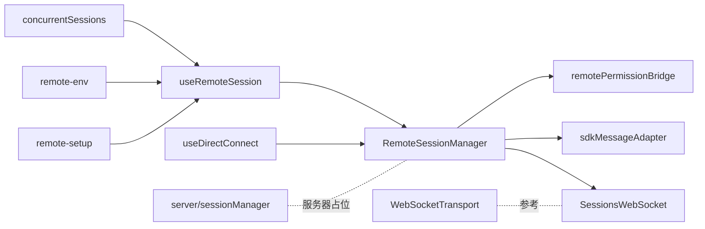

# 远程会话管理

<cite>
**本文引用的文件**
- [src/remote/RemoteSessionManager.ts](file://src/remote/RemoteSessionManager.ts)
- [src/remote/SessionsWebSocket.ts](file://src/remote/SessionsWebSocket.ts)
- [src/remote/sdkMessageAdapter.ts](file://src/remote/sdkMessageAdapter.ts)
- [src/remote/remotePermissionBridge.ts](file://src/remote/remotePermissionBridge.ts)
- [src/hooks/useRemoteSession.ts](file://src/hooks/useRemoteSession.ts)
- [src/hooks/useDirectConnect.ts](file://src/hooks/useDirectConnect.ts)
- [src/commands/remote-setup/index.ts](file://src/commands/remote-setup/index.ts)
- [src/commands/remote-env/index.ts](file://src/commands/remote-env/index.ts)
- [src/cli/transports/WebSocketTransport.ts](file://src/cli/transports/WebSocketTransport.ts)
- [src/utils/concurrentSessions.ts](file://src/utils/concurrentSessions.ts)
- [src/server/sessionManager.ts](file://src/server/sessionManager.ts)
</cite>

## 目录
1. [引言](#引言)
2. [项目结构](#项目结构)
3. [核心组件](#核心组件)
4. [架构总览](#架构总览)
5. [详细组件分析](#详细组件分析)
6. [依赖关系分析](#依赖关系分析)
7. [性能考量](#性能考量)
8. [故障排除指南](#故障排除指南)
9. [结论](#结论)
10. [附录](#附录)

## 引言
本文件面向“远程会话管理”子系统，围绕 RemoteSessionManager 与 SessionsWebSocket 的协作，系统性阐述远程会话的生命周期管理、连接状态维护、权限控制、消息转换与回放、心跳与断线重连、以及在 REPL 等前端中的集成方式。文档同时给出服务器端会话管理的现状说明、状态同步机制要点、配置与部署建议、常见问题排查方法，并通过图示帮助读者快速理解整体架构。

## 项目结构
远程会话相关的核心代码位于 src/remote 目录，配合 src/hooks/useRemoteSession.ts 在前端 REPL 中进行集成；src/cli/transports/WebSocketTransport.ts 提供了 CLI 场景下的 WebSocket 传输实现，可作为断线重连与心跳策略的参考；部分命令入口用于启用远程会话能力与默认环境配置。

图表来源
- [src/remote/RemoteSessionManager.ts:95-325](file://src/remote/RemoteSessionManager.ts#L95-L325)
- [src/remote/SessionsWebSocket.ts:82-404](file://src/remote/SessionsWebSocket.ts#L82-L404)
- [src/remote/sdkMessageAdapter.ts:29-282](file://src/remote/sdkMessageAdapter.ts#L29-L282)
- [src/remote/remotePermissionBridge.ts:12-79](file://src/remote/remotePermissionBridge.ts#L12-L79)
- [src/hooks/useRemoteSession.ts:86-607](file://src/hooks/useRemoteSession.ts#L86-L607)
- [src/hooks/useDirectConnect.ts:202-229](file://src/hooks/useDirectConnect.ts#L202-L229)
- [src/cli/transports/WebSocketTransport.ts:170-735](file://src/cli/transports/WebSocketTransport.ts#L170-L735)
- [src/commands/remote-setup/index.ts:5-18](file://src/commands/remote-setup/index.ts#L5-L18)
- [src/commands/remote-env/index.ts:5-15](file://src/commands/remote-env/index.ts#L5-L15)
- [src/utils/concurrentSessions.ts:111-148](file://src/utils/concurrentSessions.ts#L111-L148)
- [src/server/sessionManager.ts:1-3](file://src/server/sessionManager.ts#L1-L3)

章节来源
- [src/remote/RemoteSessionManager.ts:95-325](file://src/remote/RemoteSessionManager.ts#L95-L325)
- [src/remote/SessionsWebSocket.ts:82-404](file://src/remote/SessionsWebSocket.ts#L82-L404)
- [src/hooks/useRemoteSession.ts:86-607](file://src/hooks/useRemoteSession.ts#L86-L607)

## 核心组件
- RemoteSessionManager：负责与远端 CCR 会话交互，协调 WebSocket 订阅、HTTP POST 发送用户消息、权限请求/响应流程。
- SessionsWebSocket：封装 WebSocket 连接、认证、消息解析、心跳、断线重连与关闭。
- sdkMessageAdapter：将 SDKMessage 转换为 REPL 内部消息类型，处理流式事件与系统消息。
- remotePermissionBridge：在本地合成权限请求所需的辅助消息与工具桩，支持未知工具名的降级处理。
- useRemoteSession：前端集成钩子，负责连接、消息转换、权限弹窗、标题更新、超时与重连、任务计数等。
- useDirectConnect：直接连接场景下的发送与中断控制。
- CLI WebSocketTransport：CLI 侧的 WebSocket 实现，包含更丰富的断线重连与睡眠检测策略，可作为服务端实现的参考。

章节来源
- [src/remote/RemoteSessionManager.ts:95-325](file://src/remote/RemoteSessionManager.ts#L95-L325)
- [src/remote/SessionsWebSocket.ts:82-404](file://src/remote/SessionsWebSocket.ts#L82-L404)
- [src/remote/sdkMessageAdapter.ts:29-282](file://src/remote/sdkMessageAdapter.ts#L29-L282)
- [src/remote/remotePermissionBridge.ts:12-79](file://src/remote/remotePermissionBridge.ts#L12-L79)
- [src/hooks/useRemoteSession.ts:86-607](file://src/hooks/useRemoteSession.ts#L86-L607)
- [src/hooks/useDirectConnect.ts:202-229](file://src/hooks/useDirectConnect.ts#L202-L229)
- [src/cli/transports/WebSocketTransport.ts:170-735](file://src/cli/transports/WebSocketTransport.ts#L170-L735)

## 架构总览
下图展示了从 REPL 到远端 CCR 的完整调用链路：前端通过 useRemoteSession 初始化 RemoteSessionManager，后者通过 SessionsWebSocket 建立并维护 WebSocket 连接；消息经由 sdkMessageAdapter 转换后渲染；权限请求通过 remotePermissionBridge 合成并在本地弹窗确认，随后 RemoteSessionManager 将结果回传给远端。

图表来源
- [src/hooks/useRemoteSession.ts:474-568](file://src/hooks/useRemoteSession.ts#L474-L568)
- [src/remote/RemoteSessionManager.ts:108-141](file://src/remote/RemoteSessionManager.ts#L108-L141)
- [src/remote/SessionsWebSocket.ts:100-205](file://src/remote/SessionsWebSocket.ts#L100-L205)
- [src/remote/sdkMessageAdapter.ts:169-282](file://src/remote/sdkMessageAdapter.ts#L169-L282)
- [src/remote/remotePermissionBridge.ts:12-79](file://src/remote/remotePermissionBridge.ts#L12-L79)

## 详细组件分析

### RemoteSessionManager：会话生命周期与权限控制
- 连接建立：构造 SessionsWebSocket 并发起连接，回调中转发连接状态与错误。
- 消息处理：区分 SDKMessage 与控制类消息（请求/响应/取消），对权限请求进行缓存与回调触发。
- 权限响应：根据用户决策生成 SDKControlResponse 并通过 WebSocket 发送。
- 中断与取消：向远端发送控制请求以中断当前请求。
- 断开与重连：关闭连接并清空待处理权限；提供强制重连接口以应对订阅过期。

图表来源
- [src/remote/RemoteSessionManager.ts:95-325](file://src/remote/RemoteSessionManager.ts#L95-L325)
- [src/remote/SessionsWebSocket.ts:82-404](file://src/remote/SessionsWebSocket.ts#L82-L404)

章节来源
- [src/remote/RemoteSessionManager.ts:95-325](file://src/remote/RemoteSessionManager.ts#L95-L325)

### SessionsWebSocket：WebSocket 通信机制
- 连接与认证：基于 OAuth 获取访问令牌，通过请求头携带认证信息；支持代理与 mTLS 参数。
- 消息解析：统一解析 JSON 字符串，过滤非 SessionsMessage 类型，避免新消息类型导致崩溃。
- 心跳与保活：周期性发送 ping，接收 pong；异常时停止保活并进入重连流程。
- 断线重连：针对不同关闭码采取差异化策略，4001（会话不存在）在有限次数内重试；其他永久关闭码直接终止。
- 强制重连：在订阅过期（容器重启）等场景主动重建连接。

图表来源
- [src/remote/SessionsWebSocket.ts:100-288](file://src/remote/SessionsWebSocket.ts#L100-L288)
- [src/remote/SessionsWebSocket.ts:290-403](file://src/remote/SessionsWebSocket.ts#L290-L403)

章节来源
- [src/remote/SessionsWebSocket.ts:82-404](file://src/remote/SessionsWebSocket.ts#L82-L404)

### 消息转换与显示：sdkMessageAdapter
- 将 SDKMessage 转换为 REPL 内部消息类型，支持助手消息、流事件、系统消息、工具进度、压缩边界等。
- 对用户消息中的 tool_result 块进行识别与转换，确保远端工具结果在本地正确渲染。
- 对未知消息类型进行忽略并记录调试日志，避免影响会话稳定性。

章节来源
- [src/remote/sdkMessageAdapter.ts:29-282](file://src/remote/sdkMessageAdapter.ts#L29-L282)

### 权限桥接：remotePermissionBridge
- 合成权限请求对应的 AssistantMessage，以便本地弹窗展示工具使用详情。
- 当远端存在本地未加载的工具时，创建工具桩以引导到通用权限处理路径。

章节来源
- [src/remote/remotePermissionBridge.ts:12-79](file://src/remote/remotePermissionBridge.ts#L12-L79)

### 前端集成：useRemoteSession
- 生命周期：初始化 RemoteSessionManager，注册 onMessage/onPermissionRequest 等回调，建立消息转换与 UI 更新。
- 消息去重：通过 BoundedUUIDSet 过滤本地发送的 WS 回显，避免重复渲染。
- 权限弹窗：根据权限请求合成消息与工具对象，交由本地 UI 弹窗确认，再回传 RemoteSessionManager。
- 标题更新：首次发送消息后为会话生成标题并更新。
- 超时与重连：在无响应时插入警告消息并尝试 WebSocket 重连；在压缩期间延长等待时间。
- 任务计数与工具使用状态：跟踪后台任务与工具执行状态，保持 UI 一致。

章节来源
- [src/hooks/useRemoteSession.ts:86-607](file://src/hooks/useRemoteSession.ts#L86-L607)

### 直接连接：useDirectConnect
- 提供直接发送消息与中断请求的能力，便于非 REPL 场景使用。

章节来源
- [src/hooks/useDirectConnect.ts:202-229](file://src/hooks/useDirectConnect.ts#L202-L229)

### CLI 参考实现：WebSocketTransport
- 更完善的断线重连策略：指数退避+抖动、睡眠检测、时间预算、动态刷新头部。
- 心跳与睡眠检测：通过 ping/pong 与 tick 间隔检测进程挂起，及时触发重连。
- 消息回放：基于 lastId 进行已确认消息的剔除与剩余消息回放。

章节来源
- [src/cli/transports/WebSocketTransport.ts:170-735](file://src/cli/transports/WebSocketTransport.ts#L170-L735)

## 依赖关系分析
- RemoteSessionManager 依赖 SessionsWebSocket、sdkMessageAdapter、remotePermissionBridge。
- useRemoteSession 依赖 RemoteSessionManager、sdkMessageAdapter、remotePermissionBridge，并与并发会话工具协同。
- CLI 的 WebSocketTransport 与 SessionsWebSocket 具有相似的心跳与重连模式，可互为参考。
- 命令入口 remote-setup 与 remote-env 控制远程会话能力与默认环境，间接影响会话创建与连接。

图表来源
- [src/hooks/useRemoteSession.ts:86-607](file://src/hooks/useRemoteSession.ts#L86-L607)
- [src/remote/RemoteSessionManager.ts:95-325](file://src/remote/RemoteSessionManager.ts#L95-L325)
- [src/remote/SessionsWebSocket.ts:82-404](file://src/remote/SessionsWebSocket.ts#L82-L404)
- [src/remote/sdkMessageAdapter.ts:29-282](file://src/remote/sdkMessageAdapter.ts#L29-L282)
- [src/remote/remotePermissionBridge.ts:12-79](file://src/remote/remotePermissionBridge.ts#L12-L79)
- [src/hooks/useDirectConnect.ts:202-229](file://src/hooks/useDirectConnect.ts#L202-L229)
- [src/cli/transports/WebSocketTransport.ts:170-735](file://src/cli/transports/WebSocketTransport.ts#L170-L735)
- [src/commands/remote-setup/index.ts:5-18](file://src/commands/remote-setup/index.ts#L5-L18)
- [src/commands/remote-env/index.ts:5-15](file://src/commands/remote-env/index.ts#L5-L15)
- [src/utils/concurrentSessions.ts:111-148](file://src/utils/concurrentSessions.ts#L111-L148)
- [src/server/sessionManager.ts:1-3](file://src/server/sessionManager.ts#L1-L3)

章节来源
- [src/hooks/useRemoteSession.ts:86-607](file://src/hooks/useRemoteSession.ts#L86-L607)
- [src/remote/RemoteSessionManager.ts:95-325](file://src/remote/RemoteSessionManager.ts#L95-L325)
- [src/remote/SessionsWebSocket.ts:82-404](file://src/remote/SessionsWebSocket.ts#L82-L404)

## 性能考量
- 心跳与保活：SessionsWebSocket 采用固定周期 ping，降低长连接空闲时的资源占用与 NAT 映射失效风险。
- 断线重连：指数退避与有限重试，避免风暴效应；4001 场景的有限重试窗口兼顾恢复与稳定性。
- 消息去重：BoundedUUIDSet 限制回显消息数量，减少重复渲染与内存压力。
- 流式渲染：通过流事件增量更新 UI，避免一次性渲染大块输出带来的卡顿。
- 超时策略：在压缩期间延长等待时间，避免误判为无响应而频繁重连。

[本节为通用性能讨论，不直接分析具体文件]

## 故障排除指南
- 连接失败/认证错误
  - 检查访问令牌是否有效与最新；SessionsWebSocket 在每次连接前重新获取令牌。
  - 关注 onerror 回调与日志，定位网络/代理/TLS 配置问题。
- 会话不存在（4001）
  - SessionsWebSocket 对该错误码进行有限次重试；若超出预算则不再重连。
  - 前端可在超时后尝试强制重连（manager.reconnect）。
- 长时间无响应
  - useRemoteSession 在超时后插入警告消息并尝试重连；压缩期间会延长等待时间。
  - 若为 viewerOnly 模式，避免自动中断，等待远端响应。
- 权限请求未决
  - 确认本地弹窗队列是否正确添加/移除；拒绝/允许后需清理对应 toolUseID。
- 消息重复
  - 确保 sentUUIDsRef 正确记录本地发送的 uuid，并在 onMessage 中进行过滤。

章节来源
- [src/remote/SessionsWebSocket.ts:234-288](file://src/remote/SessionsWebSocket.ts#L234-L288)
- [src/hooks/useRemoteSession.ts:540-563](file://src/hooks/useRemoteSession.ts#L540-L563)
- [src/remote/RemoteSessionManager.ts:153-172](file://src/remote/RemoteSessionManager.ts#L153-L172)

## 结论
RemoteSessionManager 与 SessionsWebSocket 协同实现了远程会话的稳定连接、消息转换与权限控制；前端 useRemoteSession 将这些能力无缝集成到 REPL 中，提供良好的用户体验。通过心跳、断线重连、消息去重与超时策略，系统在弱网与高负载环境下仍能保持较好的可用性。服务器端会话管理目前为占位实现，后续可在此基础上完善生命周期与资源清理逻辑。

[本节为总结性内容，不直接分析具体文件]

## 附录

### 会话状态同步机制要点
- 状态变更通知：通过 onMessage 回调将远端状态（如压缩、任务状态）传递至前端，驱动 UI 更新。
- 冲突解决：本地发送的消息通过 uuid 去重，避免回显重复；权限请求通过 requestId 管控，避免并发冲突。
- 数据一致性：流事件增量更新；压缩边界与状态消息用于同步远端生命周期阶段。

章节来源
- [src/hooks/useRemoteSession.ts:227-237](file://src/hooks/useRemoteSession.ts#L227-L237)
- [src/remote/sdkMessageAdapter.ts:129-141](file://src/remote/sdkMessageAdapter.ts#L129-L141)

### 服务器端会话管理现状
- 当前 server/sessionManager 为占位实现，尚未提供具体逻辑；实际会话生命周期与资源清理由远端 CCR 承担。
- 建议在服务器侧实现与 RemoteSessionManager 对应的生命周期管理，包括会话创建、权限验证、状态同步与资源回收。

章节来源
- [src/server/sessionManager.ts:1-3](file://src/server/sessionManager.ts#L1-L3)

### 配置与部署指南
- 启用远程会话
  - 使用 remote-setup 命令完成 Web 端远程会话初始化；受策略限制与特性开关控制。
- 默认远程环境
  - 使用 remote-env 命令配置默认远程环境，便于快速建立会话。
- 并发会话与会话命名
  - concurrentSessions 工具用于更新会话名称与桥接 ID，便于多会话场景下的去重与展示。
- 网络与代理
  - SessionsWebSocket 支持代理与 mTLS 参数；CLI 的 WebSocketTransport 提供更全面的网络健壮性策略（参考实现）。

章节来源
- [src/commands/remote-setup/index.ts:5-18](file://src/commands/remote-setup/index.ts#L5-L18)
- [src/commands/remote-env/index.ts:5-15](file://src/commands/remote-env/index.ts#L5-L15)
- [src/utils/concurrentSessions.ts:111-148](file://src/utils/concurrentSessions.ts#L111-L148)
- [src/remote/SessionsWebSocket.ts:108-127](file://src/remote/SessionsWebSocket.ts#L108-L127)
- [src/cli/transports/WebSocketTransport.ts:170-193](file://src/cli/transports/WebSocketTransport.ts#L170-L193)