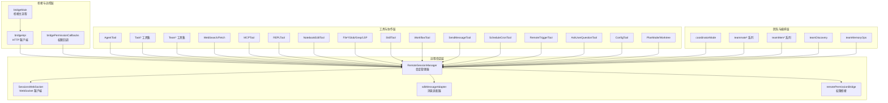
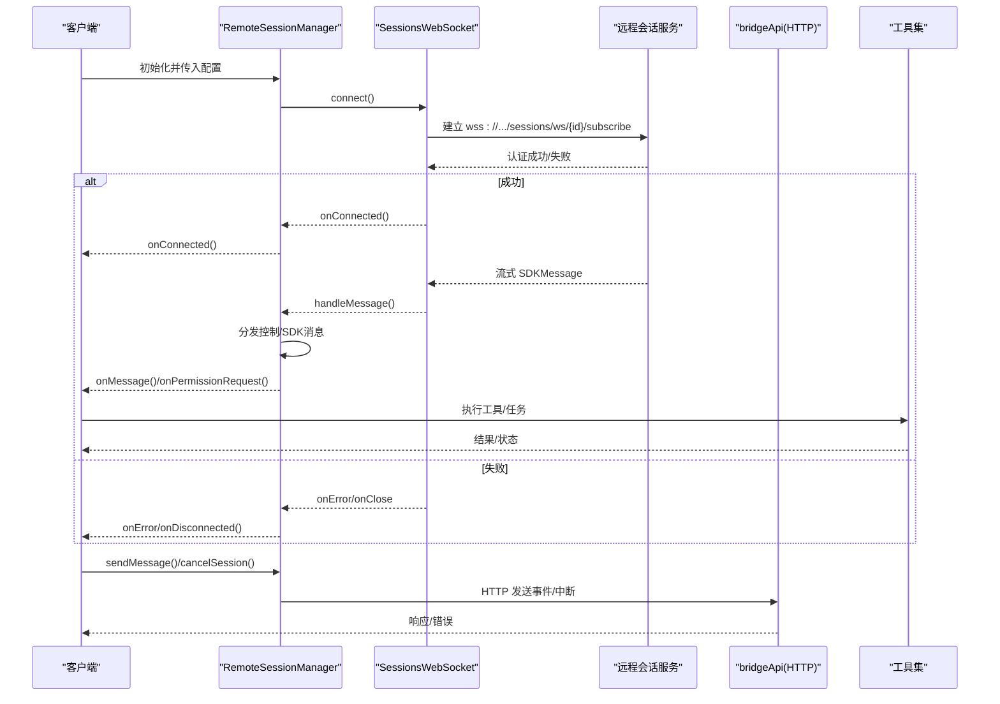
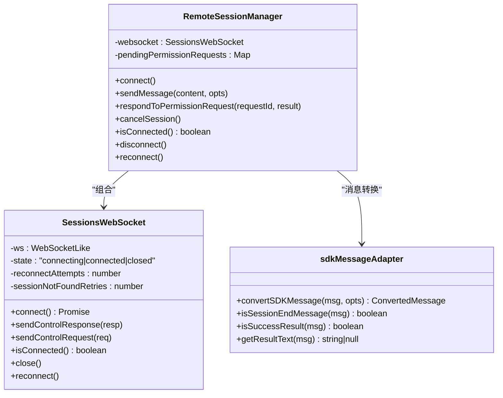
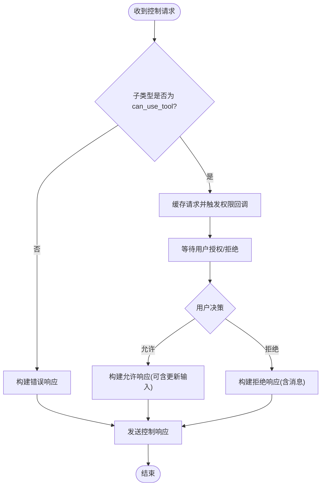
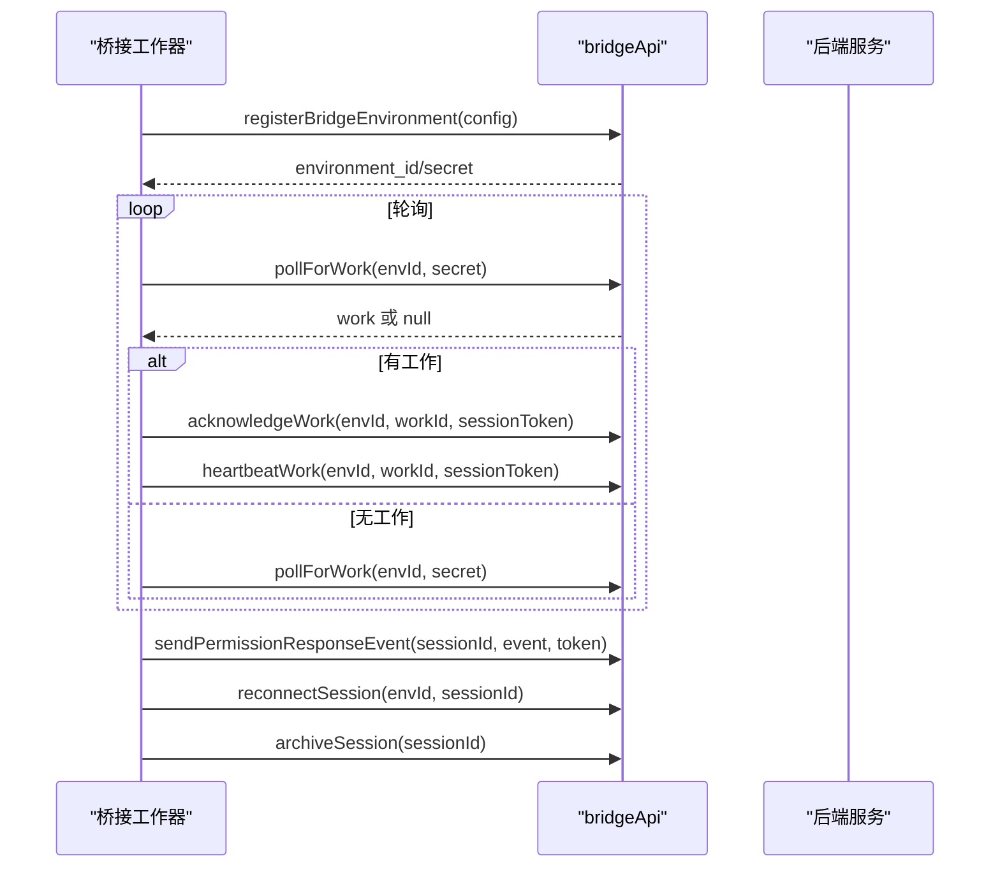
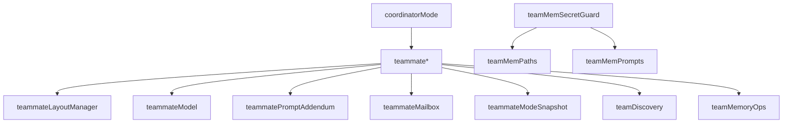
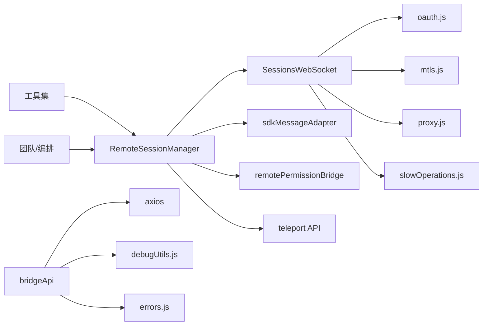

# 远程协作功能

<cite>
**本文引用的文件**
- [src/remote/RemoteSessionManager.ts](file://src/remote/RemoteSessionManager.ts)
- [src/remote/SessionsWebSocket.ts](file://src/remote/SessionsWebSocket.ts)
- [src/remote/remotePermissionBridge.ts](file://src/remote/remotePermissionBridge.ts)
- [src/remote/sdkMessageAdapter.ts](file://src/remote/sdkMessageAdapter.ts)
- [src/bridge/bridgeApi.ts](file://src/bridge/bridgeApi.ts)
- [src/commands/remote-setup/index.ts](file://src/commands/remote-setup/index.ts)
- [src/assistant/AssistantSessionChooser.ts](file://src/assistant/AssistantSessionChooser.ts)
- [src/bootstrap/src/entrypoints/agentSdkTypes.ts](file://src/bootstrap/src/entrypoints/agentSdkTypes.ts)
- [src/entrypoints/sdk/controlTypes.js](file://src/entrypoints/sdk/controlTypes.js)
- [src/utils/teleport/api.js](file://src/utils/teleport/api.js)
- [src/constants/oauth.js](file://src/constants/oauth.js)
- [src/utils/mtls.js](file://src/utils/mtls.js)
- [src/utils/proxy.js](file://src/utils/proxy.js)
- [src/utils/slowOperations.js](file://src/utils/slowOperations.js)
- [src/utils/debug.js](file://src/utils/debug.js)
- [src/utils/log.js](file://src/utils/log.js)
- [src/utils/errors.js](file://src/utils/errors.js)
- [src/cli/remoteIO.ts](file://src/cli/remoteIO.ts)
- [src/utils/background/remote/remoteSession.ts](file://src/utils/background/remote/remoteSession.ts)
- [src/services/teamMemorySync/teamMemSecretGuard.ts](file://src/services/teamMemorySync/teamMemSecretGuard.ts)
- [src/memdir/teamMemPaths.ts](file://src/memdir/teamMemPaths.ts)
- [src/memdir/teamMemPrompts.ts](file://src/memdir/teamMemPrompts.ts)
- [src/utils/teamDiscovery.ts](file://src/utils/teamDiscovery.ts)
- [src/utils/teamMemoryOps.ts](file://src/utils/teamMemoryOps.ts)
- [src/utils/teammate.ts](file://src/utils/teammate.ts)
- [src/utils/teammateContext.ts](file://src/utils/teammateContext.ts)
- [src/utils/teammateMailbox.ts](file://src/utils/teammateMailbox.ts)
- [src/utils/swarm/teamHelpers.ts](file://src/utils/swarm/teamHelpers.ts)
- [src/utils/swarm/teammateInit.ts](file://src/utils/swarm/teammateInit.ts)
- [src/utils/swarm/teammateLayoutManager.ts](file://src/utils/swarm/teammateLayoutManager.ts)
- [src/utils/swarm/teammateModel.ts](file://src/utils/swarm/teammateModel.ts)
- [src/utils/swarm/teammatePromptAddendum.ts](file://src/utils/swarm/teammatePromptAddendum.ts)
- [src/utils/swarm/backends/teammateModeSnapshot.ts](file://src/utils/swarm/backends/teammateModeSnapshot.ts)
- [src/components/PromptInput/src/utils/teammate.ts](file://src/components/PromptInput/src/utils/teammate.ts)
- [src/components/Spinner/teammateSelectHint.ts](file://src/components/Spinner/teammateSelectHint.ts)
- [src/components/messages/teamMemSaved.ts](file://src/components/messages/teamMemSaved.ts)
- [src/components/tasks/src/state/teammateViewHelpers.ts](file://src/components/tasks/src/state/teammateViewHelpers.ts)
- [src/state/teammateViewHelpers.ts](file://src/state/teammateViewHelpers.ts)
- [src/hooks/toolPermission/handlers/coordinatorHandler.ts](file://src/hooks/toolPermission/handlers/coordinatorHandler.ts)
- [src/coordinator/coordinatorMode.ts](file://src/coordinator/coordinatorMode.ts)
- [src/components/tasks/src/coordinator/coordinatorMode.ts](file://src/components/tasks/src/coordinator/coordinatorMode.ts)
- [src/tools/TeamCreateTool/TeamCreateTool.ts](file://src/tools/TeamCreateTool/TeamCreateTool.ts)
- [src/tools/TeamDeleteTool/TeamDeleteTool.ts](file://src/tools/TeamDeleteTool/TeamDeleteTool.ts)
- [src/tools/TaskCreateTool/TaskCreateTool.ts](file://src/tools/TaskCreateTool/TaskCreateTool.ts)
- [src/tools/TaskListTool/TaskListTool.ts](file://src/tools/TaskListTool/TaskListTool.ts)
- [src/tools/TaskGetTool/TaskGetTool.ts](file://src/tools/TaskGetTool/TaskGetTool.ts)
- [src/tools/TaskUpdateTool/TaskUpdateTool.ts](file://src/tools/TaskUpdateTool/TaskUpdateTool.ts)
- [src/tools/TaskStopTool/TaskStopTool.ts](file://src/tools/TaskStopTool/TaskStopTool.ts)
- [src/tools/TaskOutputTool/TaskOutputTool.ts](file://src/tools/TaskOutputTool/TaskOutputTool.ts)
- [src/tools/AgentTool/AgentTool.ts](file://src/tools/AgentTool/AgentTool.ts)
- [src/tools/BashTool/BashTool.ts](file://src/tools/BashTool/BashTool.ts)
- [src/tools/PowerShellTool/PowerShellTool.ts](file://src/tools/PowerShellTool/PowerShellTool.ts)
- [src/tools/WebSearchTool/WebSearchTool.ts](file://src/tools/WebSearchTool/WebSearchTool.ts)
- [src/tools/WebFetchTool/WebFetchTool.ts](file://src/tools/WebFetchTool/WebFetchTool.ts)
- [src/tools/MCPTool/MCPTool.ts](file://src/tools/MCPTool/MCPTool.ts)
- [src/tools/REPLTool/REPLTool.ts](file://src/tools/REPLTool/REPLTool.ts)
- [src/tools/NotebookEditTool/NotebookEditTool.ts](file://src/tools/NotebookEditTool/NotebookEditTool.ts)
- [src/tools/FileEditTool/FileEditTool.ts](file://src/tools/FileEditTool/FileEditTool.ts)
- [src/tools/FileReadTool/FileReadTool.ts](file://src/tools/FileReadTool/FileReadTool.ts)
- [src/tools/FileWriteTool/FileWriteTool.ts](file://src/tools/FileWriteTool/FileWriteTool.ts)
- [src/tools/GlobTool/GlobTool.ts](file://src/tools/GlobTool/GlobTool.ts)
- [src/tools/GrepTool/GrepTool.ts](file://src/tools/GrepTool/GrepTool.ts)
- [src/tools/LSPTool/LSPTool.ts](file://src/tools/LSPTool/LSPTool.ts)
- [src/tools/ListMcpResourcesTool/ListMcpResourcesTool.ts](file://src/tools/ListMcpResourcesTool/ListMcpResourcesTool.ts)
- [src/tools/ReadMcpResourceTool/ReadMcpResourceTool.ts](file://src/tools/ReadMcpResourceTool/ReadMcpResourceTool.ts)
- [src/tools/SkillTool/SkillTool.ts](file://src/tools/SkillTool/SkillTool.ts)
- [src/tools/WorkflowTool/WorkflowTool.ts](file://src/tools/WorkflowTool/WorkflowTool.ts)
- [src/tools/SendMessageTool/SendMessageTool.ts](file://src/tools/SendMessageTool/SendMessageTool.ts)
- [src/tools/ScheduleCronTool/ScheduleCronTool.ts](file://src/tools/ScheduleCronTool/ScheduleCronTool.ts)
- [src/tools/RemoteTriggerTool/RemoteTriggerTool.ts](file://src/tools/RemoteTriggerTool/RemoteTriggerTool.ts)
- [src/tools/AskUserQuestionTool/AskUserQuestionTool.ts](file://src/tools/AskUserQuestionTool/AskUserQuestionTool.ts)
- [src/tools/ConfigTool/ConfigTool.ts](file://src/tools/ConfigTool/ConfigTool.ts)
- [src/tools/EnterPlanModeTool/EnterPlanModeTool.ts](file://src/tools/EnterPlanModeTool/EnterPlanModeTool.ts)
- [src/tools/ExitPlanModeTool/ExitPlanModeTool.ts](file://src/tools/ExitPlanModeTool/ExitPlanModeTool.ts)
- [src/tools/EnterWorktreeTool/EnterWorktreeTool.ts](file://src/tools/EnterWorktreeTool/EnterWorktreeTool.ts)
- [src/tools/ExitWorktreeTool/ExitWorktreeTool.ts](file://src/tools/ExitWorktreeTool/ExitWorktreeTool.ts)
- [src/tools/TodoWriteTool/TodoWriteTool.ts](file://src/tools/TodoWriteTool/TodoWriteTool.ts)
- [src/tools/ReviewArtifactTool/ReviewArtifactTool.ts](file://src/tools/ReviewArtifactTool/ReviewArtifactTool.ts)
- [src/tools/VerifyPlanExecutionTool/VerifyPlanExecutionTool.ts](file://src/tools/VerifyPlanExecutionTool/VerifyPlanExecutionTool.ts)
- [src/tools/WorkflowTool/WorkflowTool.ts](file://src/tools/WorkflowTool/WorkflowTool.ts)
- [src/tools/shared/](file://src/tools/shared/)
- [src/tools/testing/](file://src/tools/testing/)
- [src/tools/src/types/](file://src/tools/src/types/)
- [src/tools/utils.ts](file://src/tools/utils.ts)
</cite>

## 目录
1. [简介](#简介)
2. [项目结构](#项目结构)
3. [核心组件](#核心组件)
4. [架构总览](#架构总览)
5. [详细组件分析](#详细组件分析)
6. [依赖关系分析](#依赖关系分析)
7. [性能考量](#性能考量)
8. [故障排查指南](#故障排查指南)
9. [结论](#结论)
10. [附录](#附录)

## 简介
本文件系统性梳理 Claude Code 的远程协作能力，围绕“远程会话管理”“协作工具与团队编排”“远程控制与权限”“安全与合规”“部署与配置”等维度展开，帮助开发者与运维人员快速理解并落地远程协作方案。内容覆盖会话同步机制、权限共享策略、状态同步协议、网络通信、团队管理（Teams）、代理系统（AgentTool）、任务分配（Coordinator）、实时通信、远程控制流程、身份认证与访问控制、数据加密与审计等。

## 项目结构
远程协作相关代码主要分布在以下模块：
- 会话与消息：RemoteSessionManager、SessionsWebSocket、sdkMessageAdapter、remotePermissionBridge
- 桥接与远控：bridgeApi、bridgeMain、bridgeMessaging、bridgePermissionCallbacks
- 工具与协作：AgentTool、Task*、Team*、WebSearch/Fetch、MCPTool、REPLTool、NotebookEditTool、File*、Glob/Grep/LSP、ListMcpResources/ReadMcpResource、SkillTool、WorkflowTool、SendMessageTool、ScheduleCronTool、RemoteTriggerTool、AskUserQuestionTool、ConfigTool、Enter/Exit PlanMode、Enter/Exit Worktree、TodoWrite、ReviewArtifact、VerifyPlanExecution
- 团队与编排：coordinatorMode、teammate*、teamMem*、teamDiscovery、teamMemoryOps、teammateMailbox、teammatePromptAddendum、teammateLayoutManager、teammateModel、teammateInit、teammateModeSnapshot
- 命令入口与前端集成：commands/remote-setup、assistant/AssistantSessionChooser、cli/remoteIO、utils/background/remote/remoteSession
- 类型与协议：bootstrap/src/entrypoints/agentSdkTypes、entrypoints/sdk/controlTypes

图表来源
- [src/remote/RemoteSessionManager.ts:95-325](file://src/remote/RemoteSessionManager.ts#L95-L325)
- [src/remote/SessionsWebSocket.ts:82-404](file://src/remote/SessionsWebSocket.ts#L82-L404)
- [src/remote/sdkMessageAdapter.ts:28-307](file://src/remote/sdkMessageAdapter.ts#L28-L307)
- [src/remote/remotePermissionBridge.ts:1-79](file://src/remote/remotePermissionBridge.ts#L1-L79)
- [src/bridge/bridgeApi.ts:68-451](file://src/bridge/bridgeApi.ts#L68-L451)
- [src/tools/AgentTool/AgentTool.ts](file://src/tools/AgentTool/AgentTool.ts)
- [src/tools/TaskCreateTool/TaskCreateTool.ts](file://src/tools/TaskCreateTool/TaskCreateTool.ts)
- [src/tools/TeamCreateTool/TeamCreateTool.ts](file://src/tools/TeamCreateTool/TeamCreateTool.ts)
- [src/tools/WebSearchTool/WebSearchTool.ts](file://src/tools/WebSearchTool/WebSearchTool.ts)
- [src/tools/MCPTool/MCPTool.ts](file://src/tools/MCPTool/MCPTool.ts)
- [src/tools/REPLTool/REPLTool.ts](file://src/tools/REPLTool/REPLTool.ts)
- [src/tools/NotebookEditTool/NotebookEditTool.ts](file://src/tools/NotebookEditTool/NotebookEditTool.ts)
- [src/tools/FileEditTool/FileEditTool.ts](file://src/tools/FileEditTool/FileEditTool.ts)
- [src/tools/GlobTool/GlobTool.ts](file://src/tools/GlobTool/GlobTool.ts)
- [src/tools/GrepTool/GrepTool.ts](file://src/tools/GrepTool/GrepTool.ts)
- [src/tools/LSPTool/LSPTool.ts](file://src/tools/LSPTool/LSPTool.ts)
- [src/tools/ListMcpResourcesTool/ListMcpResourcesTool.ts](file://src/tools/ListMcpResourcesTool/ListMcpResourcesTool.ts)
- [src/tools/ReadMcpResourceTool/ReadMcpResourceTool.ts](file://src/tools/ReadMcpResourceTool/ReadMcpResourceTool.ts)
- [src/tools/SkillTool/SkillTool.ts](file://src/tools/SkillTool/SkillTool.ts)
- [src/tools/WorkflowTool/WorkflowTool.ts](file://src/tools/WorkflowTool/WorkflowTool.ts)
- [src/tools/SendMessageTool/SendMessageTool.ts](file://src/tools/SendMessageTool/SendMessageTool.ts)
- [src/tools/ScheduleCronTool/ScheduleCronTool.ts](file://src/tools/ScheduleCronTool/ScheduleCronTool.ts)
- [src/tools/RemoteTriggerTool/RemoteTriggerTool.ts](file://src/tools/RemoteTriggerTool/RemoteTriggerTool.ts)
- [src/tools/AskUserQuestionTool/AskUserQuestionTool.ts](file://src/tools/AskUserQuestionTool/AskUserQuestionTool.ts)
- [src/tools/ConfigTool/ConfigTool.ts](file://src/tools/ConfigTool/ConfigTool.ts)
- [src/tools/EnterPlanModeTool/EnterPlanModeTool.ts](file://src/tools/EnterPlanModeTool/EnterPlanModeTool.ts)
- [src/tools/ExitPlanModeTool/ExitPlanModeTool.ts](file://src/tools/ExitPlanModeTool/ExitPlanModeTool.ts)
- [src/tools/EnterWorktreeTool/EnterWorktreeTool.ts](file://src/tools/EnterWorktreeTool/EnterWorktreeTool.ts)
- [src/tools/ExitWorktreeTool/ExitWorktreeTool.ts](file://src/tools/ExitWorktreeTool/ExitWorktreeTool.ts)
- [src/tools/TodoWriteTool/TodoWriteTool.ts](file://src/tools/TodoWriteTool/TodoWriteTool.ts)
- [src/tools/ReviewArtifactTool/ReviewArtifactTool.ts](file://src/tools/ReviewArtifactTool/ReviewArtifactTool.ts)
- [src/tools/VerifyPlanExecutionTool/VerifyPlanExecutionTool.ts](file://src/tools/VerifyPlanExecutionTool/VerifyPlanExecutionTool.ts)
- [src/coordinator/coordinatorMode.ts](file://src/coordinator/coordinatorMode.ts)
- [src/utils/teammate.ts](file://src/utils/teammate.ts)
- [src/services/teamMemorySync/teamMemSecretGuard.ts](file://src/services/teamMemorySync/teamMemSecretGuard.ts)
- [src/memdir/teamMemPaths.ts](file://src/memdir/teamMemPaths.ts)
- [src/memdir/teamMemPrompts.ts](file://src/memdir/teamMemPrompts.ts)
- [src/utils/teamDiscovery.ts](file://src/utils/teamDiscovery.ts)
- [src/utils/teamMemoryOps.ts](file://src/utils/teamMemoryOps.ts)

章节来源
- [src/remote/RemoteSessionManager.ts:95-325](file://src/remote/RemoteSessionManager.ts#L95-L325)
- [src/remote/SessionsWebSocket.ts:82-404](file://src/remote/SessionsWebSocket.ts#L82-L404)
- [src/remote/sdkMessageAdapter.ts:28-307](file://src/remote/sdkMessageAdapter.ts#L28-L307)
- [src/remote/remotePermissionBridge.ts:1-79](file://src/remote/remotePermissionBridge.ts#L1-L79)
- [src/bridge/bridgeApi.ts:68-451](file://src/bridge/bridgeApi.ts#L68-L451)

## 核心组件
- 远程会话管理器（RemoteSessionManager）：负责 WebSocket 订阅、HTTP 发送用户消息、权限请求处理与响应、中断信号发送、连接状态维护与重连。
- 会话 WebSocket（SessionsWebSocket）：封装 WebSocket 连接、鉴权、心跳、断线重连、控制请求/响应发送、消息解析与分发。
- SDK 消息适配器（sdkMessageAdapter）：将 CCR 发来的 SDKMessage 转换为 REPL 内部消息类型，支持流式事件、结果消息、系统消息、工具进度消息、压缩边界消息等。
- 权限桥接（remotePermissionBridge）：在远程模式下生成合成的助理消息与工具桩，用于权限确认与回退处理。
- 桥接 API（bridgeApi）：提供环境注册、工作轮询、任务确认/停止、会话归档/重连、心跳、权限事件上报等 HTTP 接口封装与错误处理。
- 协作工具集：AgentTool、Task*、Team*、WebSearch/Fetch、MCPTool、REPLTool、NotebookEditTool、File*/Glob/Grep/LSP、ListMcpResources/ReadMcpResource、SkillTool、WorkflowTool、SendMessageTool、ScheduleCronTool、RemoteTriggerTool、AskUserQuestionTool、ConfigTool、PlanMode/Worktree 等，覆盖远程执行、文件操作、知识检索、技能调用、工作流编排等场景。
- 团队与编排：coordinatorMode、teammate*、teamMem*、teamDiscovery、teamMemoryOps 等，支撑多智能体协作、团队记忆与上下文同步。
- 命令入口与前端集成：commands/remote-setup、assistant/AssistantSessionChooser、cli/remoteIO、utils/background/remote/remoteSession 提供远程会话的启动、选择与后台运行能力。

章节来源
- [src/remote/RemoteSessionManager.ts:95-325](file://src/remote/RemoteSessionManager.ts#L95-L325)
- [src/remote/SessionsWebSocket.ts:82-404](file://src/remote/SessionsWebSocket.ts#L82-L404)
- [src/remote/sdkMessageAdapter.ts:28-307](file://src/remote/sdkMessageAdapter.ts#L28-L307)
- [src/remote/remotePermissionBridge.ts:1-79](file://src/remote/remotePermissionBridge.ts#L1-L79)
- [src/bridge/bridgeApi.ts:68-451](file://src/bridge/bridgeApi.ts#L68-L451)

## 架构总览
远程协作由“会话层 + 桥接层 + 工具层 + 团队层”构成，通过 WebSocket 实时订阅 CCR 会话，借助 HTTP 桥接 API 管理环境与工作流，配合 SDK 消息适配器渲染到 REPL，并以 AgentTool/Task/Team 等工具完成具体任务执行与协作。

图表来源
- [src/remote/RemoteSessionManager.ts:108-141](file://src/remote/RemoteSessionManager.ts#L108-L141)
- [src/remote/SessionsWebSocket.ts:100-205](file://src/remote/SessionsWebSocket.ts#L100-L205)
- [src/bridge/bridgeApi.ts:141-451](file://src/bridge/bridgeApi.ts#L141-L451)

## 详细组件分析

### 会话管理与消息适配
- RemoteSessionManager
  - 负责 WebSocket 生命周期、消息分发、权限请求/取消/响应、中断信号、连接状态查询与强制重连。
  - 对 SDK 控制消息进行分流：权限请求缓存、取消请求清理、未知子类型返回错误响应，确保服务器不会挂起等待。
  - 通过 HTTP 将用户消息投递至远程会话，失败时记录错误日志。
- SessionsWebSocket
  - 支持浏览器与 Node 环境，统一 WebSocket 行为；支持代理与 mTLS 配置。
  - 实现指数退避重连、4001 特例重试、永久关闭码短路、心跳保活、控制请求/响应发送。
  - 解析 JSON 并按消息类型分发，未知类型静默忽略，避免版本升级导致的会话中断。
- sdkMessageAdapter
  - 将 SDKMessage 映射为 REPL 内部消息：助理消息、流式事件、系统信息、工具进度、压缩边界等。
  - 用户消息中包含工具结果或文本内容时，按需转换为用户消息以便本地渲染；默认忽略本地已产生的用户消息。
  - 提供会话结束判断、成功结果提取等辅助函数。

图表来源
- [src/remote/RemoteSessionManager.ts:95-325](file://src/remote/RemoteSessionManager.ts#L95-L325)
- [src/remote/SessionsWebSocket.ts:82-404](file://src/remote/SessionsWebSocket.ts#L82-L404)
- [src/remote/sdkMessageAdapter.ts:28-307](file://src/remote/sdkMessageAdapter.ts#L28-L307)

章节来源
- [src/remote/RemoteSessionManager.ts:95-325](file://src/remote/RemoteSessionManager.ts#L95-L325)
- [src/remote/SessionsWebSocket.ts:82-404](file://src/remote/SessionsWebSocket.ts#L82-L404)
- [src/remote/sdkMessageAdapter.ts:28-307](file://src/remote/sdkMessageAdapter.ts#L28-L307)

### 权限与控制协议
- 权限桥接
  - 在远程模式下，当本地 CLI 不具备某些工具时，创建工具桩以路由到回退权限请求，保证交互连续性。
  - 为远程权限请求构造合成的助理消息，使 UI 可以一致地呈现工具使用确认。
- 控制消息类型
  - RemoteSessionManager 识别 control_request/control_response/control_cancel_request，对 can_use_tool 子类型发起权限确认，其他子类型返回错误响应。
  - SessionsWebSocket 支持发送控制请求（如中断）与控制响应，确保双向控制通道可用。
- SDK 类型与消息
  - 使用 SDKMessage 与 controlTypes 中的控制消息类型，确保前后端协议一致性。

图表来源
- [src/remote/RemoteSessionManager.ts:189-215](file://src/remote/RemoteSessionManager.ts#L189-L215)
- [src/remote/remotePermissionBridge.ts:12-46](file://src/remote/remotePermissionBridge.ts#L12-L46)
- [src/entrypoints/sdk/controlTypes.js](file://src/entrypoints/sdk/controlTypes.js)

章节来源
- [src/remote/remotePermissionBridge.ts:1-79](file://src/remote/remotePermissionBridge.ts#L1-L79)
- [src/remote/RemoteSessionManager.ts:189-215](file://src/remote/RemoteSessionManager.ts#L189-L215)
- [src/entrypoints/sdk/controlTypes.js](file://src/entrypoints/sdk/controlTypes.js)

### 桥接与远控
- bridgeApi
  - 提供环境注册、工作轮询、任务确认/停止、会话归档/重连、心跳、权限事件上报等接口。
  - 统一 401 刷新策略：若提供刷新回调则自动重试一次；否则抛出致命错误。
  - 错误分类：401（登录/鉴权失败）、403（权限不足/过期）、404/410（资源不存在/过期）、429（频率限制），并区分可抑制的 403。
- bridgeMain/bridgeMessaging/bridgePermissionCallbacks
  - 主流程负责环境与会话生命周期管理，消息通道负责与后端通信，权限回调负责处理授权决策与事件上报。

图表来源
- [src/bridge/bridgeApi.ts:141-451](file://src/bridge/bridgeApi.ts#L141-L451)

章节来源
- [src/bridge/bridgeApi.ts:68-451](file://src/bridge/bridgeApi.ts#L68-L451)

### 协作工具与团队编排
- AgentTool：作为通用代理入口，承载工具调用与权限协调。
- Task*：任务创建、列表、获取、更新、停止、输出等，支撑任务驱动的协作流程。
- Team*：团队创建、删除等，结合 teammate* 系列实现成员管理与上下文同步。
- WebSearch/Fetch：网络检索与抓取，支持远程知识获取。
- MCPTool：MCP 服务器接入与资源读取，扩展远程能力边界。
- REPLTool/NotebookEditTool：终端与笔记本编辑，提升远程交互效率。
- File*/Glob/Grep/LSP：文件操作与代码导航，满足远程开发需求。
- ListMcpResources/ReadMcpResource：资源枚举与读取，便于远程发现与使用。
- SkillTool/WorkflowTool：技能与工作流编排，形成可复用的协作范式。
- SendMessageTool/ScheduleCronTool/RemoteTriggerTool/AskUserQuestionTool/ConfigTool/PlanMode/Worktree：消息通知、定时调度、远程触发、问答收集、配置管理、计划模式与工作树切换，完善协作闭环。

```mermaid
classDiagram
class AgentTool {
+call(input) Promise
+needsPermissions() boolean
}
class TaskCreateTool {
+call(input) Promise
}
class TeamCreateTool {
+call(input) Promise
}
class WebSearchTool {
+call(input) Promise
}
class MCPTool {
+call(input) Promise
}
class REPLTool {
+call(input) Promise
}
class NotebookEditTool {
+call(input) Promise
}
class FileEditTool {
+call(input) Promise
}
class GlobTool {
+call(input) Promise
}
class GrepTool {
+call(input) Promise
}
class LSPTool {
+call(input) Promise
}
class ListMcpResourcesTool {
+call(input) Promise
}
class ReadMcpResourceTool {
+call(input) Promise
}
class SkillTool {
+call(input) Promise
}
class WorkflowTool {
+call(input) Promise
}
class SendMessageTool {
+call(input) Promise
}
class ScheduleCronTool {
+call(input) Promise
}
class RemoteTriggerTool {
+call(input) Promise
}
class AskUserQuestionTool {
+call(input) Promise
}
class ConfigTool {
+call(input) Promise
}
class EnterPlanModeTool {
+call(input) Promise
}
class ExitPlanModeTool {
+call(input) Promise
}
class EnterWorktreeTool {
+call(input) Promise
}
class ExitWorktreeTool {
+call(input) Promise
}
class TodoWriteTool {
+call(input) Promise
}
class ReviewArtifactTool {
+call(input) Promise
}
class VerifyPlanExecutionTool {
+call(input) Promise
}
AgentTool <.. TaskCreateTool : "协作"
AgentTool <.. TeamCreateTool : "协作"
AgentTool <.. WebSearchTool : "协作"
AgentTool <.. MCPTool : "协作"
AgentTool <.. REPLTool : "协作"
AgentTool <.. NotebookEditTool : "协作"
AgentTool <.. FileEditTool : "协作"
AgentTool <.. GlobTool : "协作"
AgentTool <.. GrepTool : "协作"
AgentTool <.. LSPTool : "协作"
AgentTool <.. ListMcpResourcesTool : "协作"
AgentTool <.. ReadMcpResourceTool : "协作"
AgentTool <.. SkillTool : "协作"
AgentTool <.. WorkflowTool : "协作"
AgentTool <.. SendMessageTool : "协作"
AgentTool <.. ScheduleCronTool : "协作"
AgentTool <.. RemoteTriggerTool : "协作"
AgentTool <.. AskUserQuestionTool : "协作"
AgentTool <.. ConfigTool : "协作"
AgentTool <.. EnterPlanModeTool : "协作"
AgentTool <.. ExitPlanModeTool : "协作"
AgentTool <.. EnterWorktreeTool : "协作"
AgentTool <.. ExitWorktreeTool : "协作"
AgentTool <.. TodoWriteTool : "协作"
AgentTool <.. ReviewArtifactTool : "协作"
AgentTool <.. VerifyPlanExecutionTool : "协作"
```

图表来源
- [src/tools/AgentTool/AgentTool.ts](file://src/tools/AgentTool/AgentTool.ts)
- [src/tools/TaskCreateTool/TaskCreateTool.ts](file://src/tools/TaskCreateTool/TaskCreateTool.ts)
- [src/tools/TeamCreateTool/TeamCreateTool.ts](file://src/tools/TeamCreateTool/TeamCreateTool.ts)
- [src/tools/WebSearchTool/WebSearchTool.ts](file://src/tools/WebSearchTool/WebSearchTool.ts)
- [src/tools/MCPTool/MCPTool.ts](file://src/tools/MCPTool/MCPTool.ts)
- [src/tools/REPLTool/REPLTool.ts](file://src/tools/REPLTool/REPLTool.ts)
- [src/tools/NotebookEditTool/NotebookEditTool.ts](file://src/tools/NotebookEditTool/NotebookEditTool.ts)
- [src/tools/FileEditTool/FileEditTool.ts](file://src/tools/FileEditTool/FileEditTool.ts)
- [src/tools/GlobTool/GlobTool.ts](file://src/tools/GlobTool/GlobTool.ts)
- [src/tools/GrepTool/GrepTool.ts](file://src/tools/GrepTool/GrepTool.ts)
- [src/tools/LSPTool/LSPTool.ts](file://src/tools/LSPTool/LSPTool.ts)
- [src/tools/ListMcpResourcesTool/ListMcpResourcesTool.ts](file://src/tools/ListMcpResourcesTool/ListMcpResourcesTool.ts)
- [src/tools/ReadMcpResourceTool/ReadMcpResourceTool.ts](file://src/tools/ReadMcpResourceTool/ReadMcpResourceTool.ts)
- [src/tools/SkillTool/SkillTool.ts](file://src/tools/SkillTool/SkillTool.ts)
- [src/tools/WorkflowTool/WorkflowTool.ts](file://src/tools/WorkflowTool/WorkflowTool.ts)
- [src/tools/SendMessageTool/SendMessageTool.ts](file://src/tools/SendMessageTool/SendMessageTool.ts)
- [src/tools/ScheduleCronTool/ScheduleCronTool.ts](file://src/tools/ScheduleCronTool/ScheduleCronTool.ts)
- [src/tools/RemoteTriggerTool/RemoteTriggerTool.ts](file://src/tools/RemoteTriggerTool/RemoteTriggerTool.ts)
- [src/tools/AskUserQuestionTool/AskUserQuestionTool.ts](file://src/tools/AskUserQuestionTool/AskUserQuestionTool.ts)
- [src/tools/ConfigTool/ConfigTool.ts](file://src/tools/ConfigTool/ConfigTool.ts)
- [src/tools/EnterPlanModeTool/EnterPlanModeTool.ts](file://src/tools/EnterPlanModeTool/EnterPlanModeTool.ts)
- [src/tools/ExitPlanModeTool/ExitPlanModeTool.ts](file://src/tools/ExitPlanModeTool/ExitPlanModeTool.ts)
- [src/tools/EnterWorktreeTool/EnterWorktreeTool.ts](file://src/tools/EnterWorktreeTool/EnterWorktreeTool.ts)
- [src/tools/ExitWorktreeTool/ExitWorktreeTool.ts](file://src/tools/ExitWorktreeTool/ExitWorktreeTool.ts)
- [src/tools/TodoWriteTool/TodoWriteTool.ts](file://src/tools/TodoWriteTool/TodoWriteTool.ts)
- [src/tools/ReviewArtifactTool/ReviewArtifactTool.ts](file://src/tools/ReviewArtifactTool/ReviewArtifactTool.ts)
- [src/tools/VerifyPlanExecutionTool/VerifyPlanExecutionTool.ts](file://src/tools/VerifyPlanExecutionTool/VerifyPlanExecutionTool.ts)

章节来源
- [src/tools/AgentTool/AgentTool.ts](file://src/tools/AgentTool/AgentTool.ts)
- [src/tools/TaskCreateTool/TaskCreateTool.ts](file://src/tools/TaskCreateTool/TaskCreateTool.ts)
- [src/tools/TeamCreateTool/TeamCreateTool.ts](file://src/tools/TeamCreateTool/TeamCreateTool.ts)
- [src/tools/WebSearchTool/WebSearchTool.ts](file://src/tools/WebSearchTool/WebSearchTool.ts)
- [src/tools/MCPTool/MCPTool.ts](file://src/tools/MCPTool/MCPTool.ts)
- [src/tools/REPLTool/REPLTool.ts](file://src/tools/REPLTool/REPLTool.ts)
- [src/tools/NotebookEditTool/NotebookEditTool.ts](file://src/tools/NotebookEditTool/NotebookEditTool.ts)
- [src/tools/FileEditTool/FileEditTool.ts](file://src/tools/FileEditTool/FileEditTool.ts)
- [src/tools/GlobTool/GlobTool.ts](file://src/tools/GlobTool/GlobTool.ts)
- [src/tools/GrepTool/GrepTool.ts](file://src/tools/GrepTool/GrepTool.ts)
- [src/tools/LSPTool/LSPTool.ts](file://src/tools/LSPTool/LSPTool.ts)
- [src/tools/ListMcpResourcesTool/ListMcpResourcesTool.ts](file://src/tools/ListMcpResourcesTool/ListMcpResourcesTool.ts)
- [src/tools/ReadMcpResourceTool/ReadMcpResourceTool.ts](file://src/tools/ReadMcpResourceTool/ReadMcpResourceTool.ts)
- [src/tools/SkillTool/SkillTool.ts](file://src/tools/SkillTool/SkillTool.ts)
- [src/tools/WorkflowTool/WorkflowTool.ts](file://src/tools/WorkflowTool/WorkflowTool.ts)
- [src/tools/SendMessageTool/SendMessageTool.ts](file://src/tools/SendMessageTool/SendMessageTool.ts)
- [src/tools/ScheduleCronTool/ScheduleCronTool.ts](file://src/tools/ScheduleCronTool/ScheduleCronTool.ts)
- [src/tools/RemoteTriggerTool/RemoteTriggerTool.ts](file://src/tools/RemoteTriggerTool/RemoteTriggerTool.ts)
- [src/tools/AskUserQuestionTool/AskUserQuestionTool.ts](file://src/tools/AskUserQuestionTool/AskUserQuestionTool.ts)
- [src/tools/ConfigTool/ConfigTool.ts](file://src/tools/ConfigTool/ConfigTool.ts)
- [src/tools/EnterPlanModeTool/EnterPlanModeTool.ts](file://src/tools/EnterPlanModeTool/EnterPlanModeTool.ts)
- [src/tools/ExitPlanModeTool/ExitPlanModeTool.ts](file://src/tools/ExitPlanModeTool/ExitPlanModeTool.ts)
- [src/tools/EnterWorktreeTool/EnterWorktreeTool.ts](file://src/tools/EnterWorktreeTool/EnterWorktreeTool.ts)
- [src/tools/ExitWorktreeTool/ExitWorktreeTool.ts](file://src/tools/ExitWorktreeTool/ExitWorktreeTool.ts)
- [src/tools/TodoWriteTool/TodoWriteTool.ts](file://src/tools/TodoWriteTool/TodoWriteTool.ts)
- [src/tools/ReviewArtifactTool/ReviewArtifactTool.ts](file://src/tools/ReviewArtifactTool/ReviewArtifactTool.ts)
- [src/tools/VerifyPlanExecutionTool/VerifyPlanExecutionTool.ts](file://src/tools/VerifyPlanExecutionTool/VerifyPlanExecutionTool.ts)

### 团队与编排
- coordinatorMode：协调者模式，驱动多智能体协作与任务分派。
- teammate*：团队成员管理、布局、模型、提示词、邮件箱、快照等，支撑多人协同。
- teamMem*：团队记忆的密钥保护、路径与提示词管理，保障团队知识的安全与可复用。
- teamDiscovery/teamMemoryOps：团队发现与记忆操作，实现跨会话的知识沉淀与共享。

图表来源
- [src/coordinator/coordinatorMode.ts](file://src/coordinator/coordinatorMode.ts)
- [src/utils/teammate.ts](file://src/utils/teammate.ts)
- [src/utils/teammateLayoutManager.ts](file://src/utils/teammateLayoutManager.ts)
- [src/utils/teammateModel.ts](file://src/utils/teammateModel.ts)
- [src/utils/teammatePromptAddendum.ts](file://src/utils/teammatePromptAddendum.ts)
- [src/utils/teammateMailbox.ts](file://src/utils/teammateMailbox.ts)
- [src/utils/swarm/teammateModeSnapshot.ts](file://src/utils/swarm/teammateModeSnapshot.ts)
- [src/services/teamMemorySync/teamMemSecretGuard.ts](file://src/services/teamMemorySync/teamMemSecretGuard.ts)
- [src/memdir/teamMemPaths.ts](file://src/memdir/teamMemPaths.ts)
- [src/memdir/teamMemPrompts.ts](file://src/memdir/teamMemPrompts.ts)
- [src/utils/teamDiscovery.ts](file://src/utils/teamDiscovery.ts)
- [src/utils/teamMemoryOps.ts](file://src/utils/teamMemoryOps.ts)

章节来源
- [src/coordinator/coordinatorMode.ts](file://src/coordinator/coordinatorMode.ts)
- [src/utils/teammate.ts](file://src/utils/teammate.ts)
- [src/utils/teammateLayoutManager.ts](file://src/utils/teammateLayoutManager.ts)
- [src/utils/teammateModel.ts](file://src/utils/teammateModel.ts)
- [src/utils/teammatePromptAddendum.ts](file://src/utils/teammatePromptAddendum.ts)
- [src/utils/teammateMailbox.ts](file://src/utils/teammateMailbox.ts)
- [src/utils/swarm/teammateModeSnapshot.ts](file://src/utils/swarm/teammateModeSnapshot.ts)
- [src/services/teamMemorySync/teamMemSecretGuard.ts](file://src/services/teamMemorySync/teamMemSecretGuard.ts)
- [src/memdir/teamMemPaths.ts](file://src/memdir/teamMemPaths.ts)
- [src/memdir/teamMemPrompts.ts](file://src/memdir/teamMemPrompts.ts)
- [src/utils/teamDiscovery.ts](file://src/utils/teamDiscovery.ts)
- [src/utils/teamMemoryOps.ts](file://src/utils/teamMemoryOps.ts)

## 依赖关系分析
- RemoteSessionManager 依赖 SessionsWebSocket、sdkMessageAdapter、remotePermissionBridge、teleport API、控制类型定义。
- SessionsWebSocket 依赖 OAuth 配置、mTLS、代理、JSON 序列化、调试与日志。
- bridgeApi 依赖 axios、调试工具、错误提取、受信设备令牌。
- 工具集广泛依赖 RemoteSessionManager 与 SessionsWebSocket，以实现远程执行与权限控制。
- 团队与编排模块依赖 teammate* 与 teamMem*，以及 coordinatorMode。

图表来源
- [src/remote/RemoteSessionManager.ts:1-345](file://src/remote/RemoteSessionManager.ts#L1-L345)
- [src/remote/SessionsWebSocket.ts:1-405](file://src/remote/SessionsWebSocket.ts#L1-L405)
- [src/remote/sdkMessageAdapter.ts:1-307](file://src/remote/sdkMessageAdapter.ts#L1-L307)
- [src/remote/remotePermissionBridge.ts:1-79](file://src/remote/remotePermissionBridge.ts#L1-L79)
- [src/bridge/bridgeApi.ts:1-540](file://src/bridge/bridgeApi.ts#L1-L540)
- [src/utils/teleport/api.js](file://src/utils/teleport/api.js)
- [src/constants/oauth.js](file://src/constants/oauth.js)
- [src/utils/mtls.js](file://src/utils/mtls.js)
- [src/utils/proxy.js](file://src/utils/proxy.js)
- [src/utils/slowOperations.js](file://src/utils/slowOperations.js)
- [src/utils/debug.js](file://src/utils/debug.js)
- [src/utils/log.js](file://src/utils/log.js)
- [src/utils/errors.js](file://src/utils/errors.js)

章节来源
- [src/remote/RemoteSessionManager.ts:1-345](file://src/remote/RemoteSessionManager.ts#L1-L345)
- [src/remote/SessionsWebSocket.ts:1-405](file://src/remote/SessionsWebSocket.ts#L1-L405)
- [src/remote/sdkMessageAdapter.ts:1-307](file://src/remote/sdkMessageAdapter.ts#L1-L307)
- [src/remote/remotePermissionBridge.ts:1-79](file://src/remote/remotePermissionBridge.ts#L1-L79)
- [src/bridge/bridgeApi.ts:1-540](file://src/bridge/bridgeApi.ts#L1-L540)

## 性能考量
- 连接与重连
  - SessionsWebSocket 使用指数退避与有限重试次数，避免风暴式重连；对 4001（会话未找到）采用有限重试窗口，兼顾瞬时性与稳定性。
  - 心跳间隔固定，减少空闲带宽占用；断线时清理定时器与事件监听，防止内存泄漏。
- 消息处理
  - sdkMessageAdapter 对未知消息类型静默忽略，避免因协议升级导致的崩溃；仅在必要时转换消息，降低渲染开销。
- 网络与代理
  - 支持代理与 mTLS，确保在受限网络环境下稳定连接；按平台选择原生 WebSocket 或 ws 包，优化性能与兼容性。
- 权限与工具
  - 工具桩与合成消息减少本地缺失工具带来的阻塞；权限请求异步化，避免阻塞主消息流。

[本节为通用指导，不直接分析具体文件]

## 故障排查指南
- 连接问题
  - 检查 OAuth 配置与令牌有效性；确认组织 UUID 正确；查看代理与 mTLS 设置是否匹配后端要求。
  - 观察 SessionsWebSocket 的重连日志与关闭码，4003（未授权）为永久关闭码，需重新登录；4001（会话未找到）在重试窗口内可恢复。
- 权限问题
  - 若出现“不受支持的控制请求子类型”，检查后端是否推送了新协议类型，客户端需升级以识别该类型。
  - 对于 403/401/410，依据 bridgeApi 的错误分类定位原因并采取相应措施（刷新令牌、检查角色权限、重启会话）。
- 消息异常
  - 若消息无法解析，检查 JSON 序列化与反序列化逻辑；确认消息类型映射表是否覆盖所有 SDKMessage 子类型。
- CLI 与后台
  - 使用 cli/remoteIO 与 utils/background/remote/remoteSession 确认远程会话的启动与后台运行状态；必要时强制重连。

章节来源
- [src/remote/SessionsWebSocket.ts:234-288](file://src/remote/SessionsWebSocket.ts#L234-L288)
- [src/bridge/bridgeApi.ts:454-500](file://src/bridge/bridgeApi.ts#L454-L500)
- [src/remote/sdkMessageAdapter.ts:272-282](file://src/remote/sdkMessageAdapter.ts#L272-L282)
- [src/cli/remoteIO.ts](file://src/cli/remoteIO.ts)
- [src/utils/background/remote/remoteSession.ts](file://src/utils/background/remote/remoteSession.ts)

## 结论
Claude Code 的远程协作以“会话层 + 桥接层 + 工具层 + 团队层”为核心，通过 WebSocket 实时订阅与 HTTP 桥接 API 管理，结合 SDK 消息适配器与权限桥接，实现了从远程会话建立、权限验证、命令转发到状态反馈的完整闭环。工具集与团队编排进一步增强了多智能体协作与知识共享能力。建议在生产环境中关注连接稳定性、权限策略与审计日志，确保安全与可运维性。

[本节为总结性内容，不直接分析具体文件]

## 附录

### 命令入口与前端集成
- commands/remote-setup：远程设置命令，基于特性开关与策略限制决定可用性。
- assistant/AssistantSessionChooser：助手会话选择器占位实现，后续替换为真实实现。
- cli/remoteIO：CLI 远程输入输出，支撑命令行远程控制。
- utils/background/remote/remoteSession：后台远程会话管理，支持持久化与恢复。

章节来源
- [src/commands/remote-setup/index.ts:1-21](file://src/commands/remote-setup/index.ts#L1-L21)
- [src/assistant/AssistantSessionChooser.ts:1-4](file://src/assistant/AssistantSessionChooser.ts#L1-L4)
- [src/cli/remoteIO.ts](file://src/cli/remoteIO.ts)
- [src/utils/background/remote/remoteSession.ts](file://src/utils/background/remote/remoteSession.ts)

### 类型与协议参考
- SDKMessage 与 controlTypes：定义远程会话的消息与控制协议，确保前后端一致性。
- agentSdkTypes：SDK 类型定义，用于桥接与工具层的数据交换。

章节来源
- [src/bootstrap/src/entrypoints/agentSdkTypes.ts](file://src/bootstrap/src/entrypoints/agentSdkTypes.ts)
- [src/entrypoints/sdk/controlTypes.js](file://src/entrypoints/sdk/controlTypes.js)