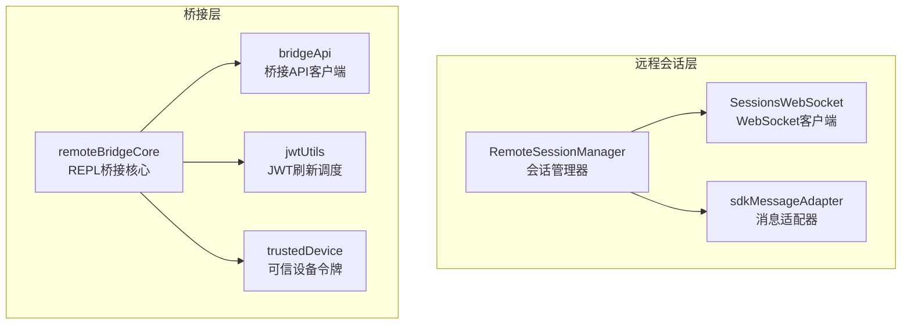
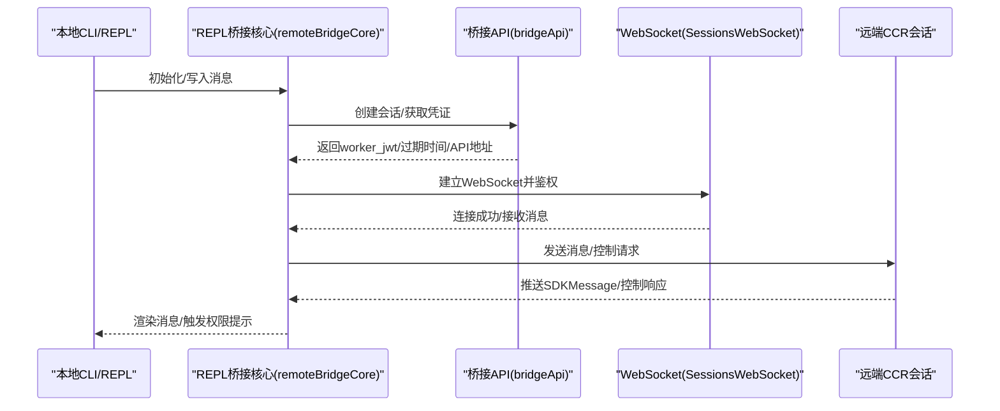
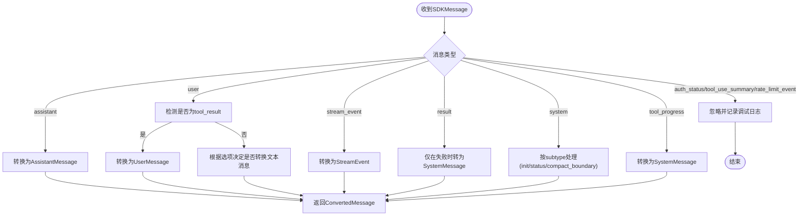
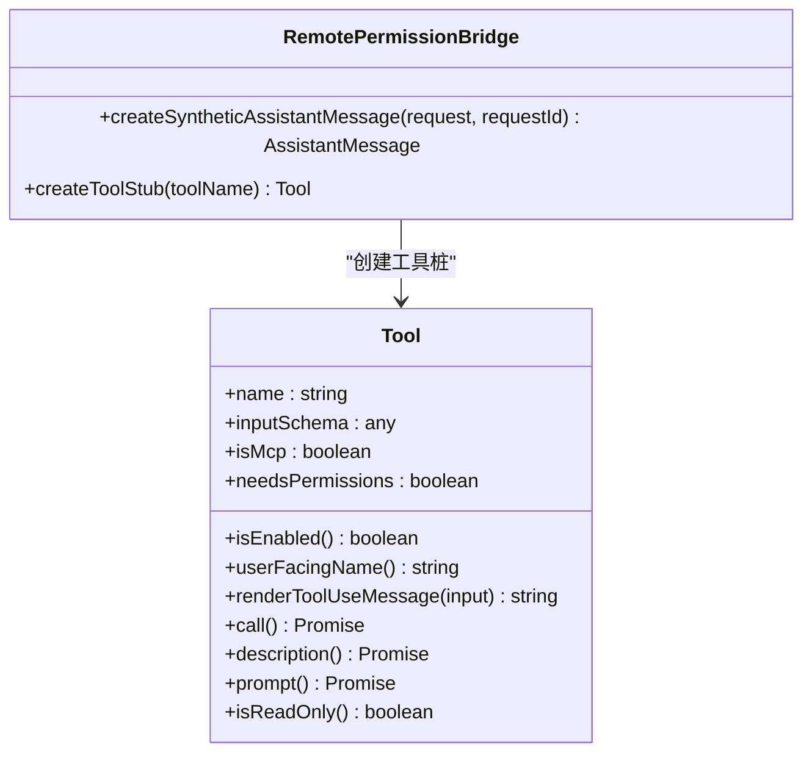
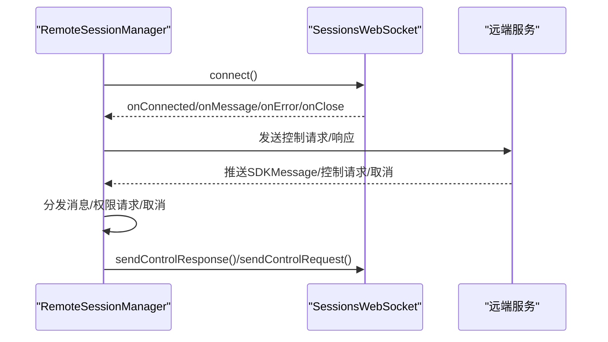
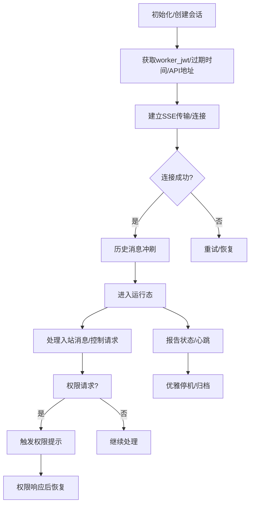
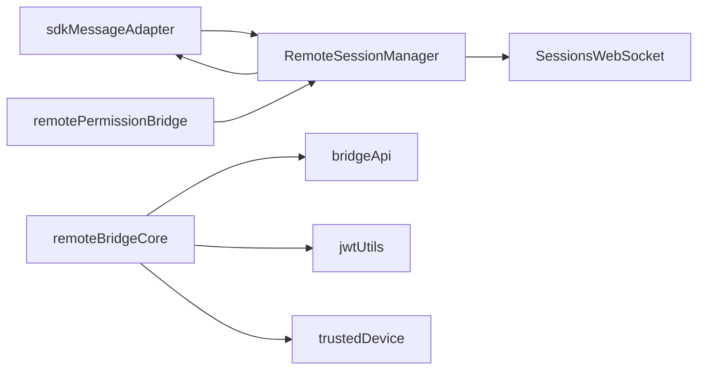

# 远程控制功能

<cite>
**本文档引用的文件**
- [sdkMessageAdapter.ts](file://src/remote/sdkMessageAdapter.ts)
- [remotePermissionBridge.ts](file://src/remote/remotePermissionBridge.ts)
- [RemoteSessionManager.ts](file://src/remote/RemoteSessionManager.ts)
- [SessionsWebSocket.ts](file://src/remote/SessionsWebSocket.ts)
- [remoteBridgeCore.ts](file://src/bridge/remoteBridgeCore.ts)
- [bridgeApi.ts](file://src/bridge/bridgeApi.ts)
- [bridgeConfig.ts](file://src/bridge/bridgeConfig.ts)
- [bridgePermissionCallbacks.ts](file://src/bridge/bridgePermissionCallbacks.ts)
- [jwtUtils.ts](file://src/bridge/jwtUtils.ts)
- [trustedDevice.ts](file://src/bridge/trustedDevice.ts)
- [index.ts](file://src/commands/bridge/index.ts)
- [bridge.ts](file://src/commands/bridge/bridge.ts)
</cite>

## 目录
1. [简介](#简介)
2. [项目结构](#项目结构)
3. [核心组件](#核心组件)
4. [架构总览](#架构总览)
5. [详细组件分析](#详细组件分析)
6. [依赖关系分析](#依赖关系分析)
7. [性能考量](#性能考量)
8. [故障排查指南](#故障排查指南)
9. [结论](#结论)
10. [附录：配置与使用指南](#附录配置与使用指南)

## 简介
本文件系统性阐述远程控制功能的设计与实现，重点覆盖以下方面：
- SDK 消息适配器（sdkMessageAdapter）的消息格式转换、协议封装与序列化机制
- 远程权限桥接（remotePermissionBridge）的权限验证流程、访问控制策略与安全令牌管理
- 远程命令执行机制（结合 REPL 桥接与控制请求流）的命令解析、权限检查、执行调度与结果返回
- 远程会话控制（RemoteSessionManager + SessionsWebSocket）的会话启动、状态监控、异常处理与资源回收
- 安全机制（身份认证、访问授权、数据加密、审计日志）
- 配置指南（连接设置、权限配置、网络参数、调试选项）
- 使用示例与安全最佳实践

## 项目结构
远程控制功能由“远程会话层”和“桥接层”协同构成：
- 远程会话层：负责与远端 CCR 会话建立连接、接收/发送消息、处理控制请求与响应
- 桥接层：负责本地 REPL 与远端会话之间的消息编解码、权限桥接、令牌刷新与生命周期管理

图表来源
- [RemoteSessionManager.ts:95-325](file://src/remote/RemoteSessionManager.ts#L95-L325)
- [SessionsWebSocket.ts:82-404](file://src/remote/SessionsWebSocket.ts#L82-L404)
- [sdkMessageAdapter.ts:169-282](file://src/remote/sdkMessageAdapter.ts#L169-L282)
- [remoteBridgeCore.ts:140-800](file://src/bridge/remoteBridgeCore.ts#L140-L800)
- [bridgeApi.ts:68-451](file://src/bridge/bridgeApi.ts#L68-L451)
- [jwtUtils.ts:72-256](file://src/bridge/jwtUtils.ts#L72-L256)
- [trustedDevice.ts:54-87](file://src/bridge/trustedDevice.ts#L54-L87)

章节来源
- [RemoteSessionManager.ts:95-325](file://src/remote/RemoteSessionManager.ts#L95-L325)
- [SessionsWebSocket.ts:82-404](file://src/remote/SessionsWebSocket.ts#L82-L404)
- [sdkMessageAdapter.ts:169-282](file://src/remote/sdkMessageAdapter.ts#L169-L282)
- [remoteBridgeCore.ts:140-800](file://src/bridge/remoteBridgeCore.ts#L140-L800)
- [bridgeApi.ts:68-451](file://src/bridge/bridgeApi.ts#L68-L451)
- [jwtUtils.ts:72-256](file://src/bridge/jwtUtils.ts#L72-L256)
- [trustedDevice.ts:54-87](file://src/bridge/trustedDevice.ts#L54-L87)

## 核心组件
- SDK 消息适配器（sdkMessageAdapter）
  - 负责将 CCR 后端发送的 SDKMessage 转换为 REPL 内部 Message 类型，或转换为流事件与系统消息；同时过滤掉不显示的事件类型（如 auth_status、tool_use_summary、rate_limit_event）
  - 提供会话结束判断、成功结果提取等辅助函数
- 远程权限桥接（remotePermissionBridge）
  - 为远程模式构造合成的 AssistantMessage 以满足 ToolUseConfirm 的输入要求
  - 为未加载到本地的工具创建最小化工具桩，路由到回退权限请求
- 远程会话管理（RemoteSessionManager + SessionsWebSocket）
  - RemoteSessionManager：协调 WebSocket 订阅、HTTP 发送用户消息、权限请求/响应流程
  - SessionsWebSocket：封装 WebSocket 连接、鉴权、消息收发、重连与心跳、错误处理
- REPL 桥接核心（remoteBridgeCore）
  - 直接连接远端会话入口，无需环境工作分发层，支持 v2 协议与 SSE 传输
  - 处理入站消息、服务器控制请求、权限响应、中断与模型参数调整
- 桥接 API 客户端（bridgeApi）
  - 封装 OAuth 鉴权、重试与 401 刷新、错误分类与致命错误抛出
  - 提供注册/注销环境、轮询工作、确认/停止工作、心跳、归档会话等接口
- 权限回调与配置（bridgePermissionCallbacks、bridgeConfig）
  - 定义权限请求/响应的回调契约与类型校验
  - 统一桥接访问令牌与基础地址解析，支持开发环境覆盖
- 安全与令牌（jwtUtils、trustedDevice）
  - JWT 解析与过期时间计算、基于到期前的主动刷新调度
  - 可信设备令牌（Elevated Tier）的获取、缓存与登录时自动注册

章节来源
- [sdkMessageAdapter.ts:169-307](file://src/remote/sdkMessageAdapter.ts#L169-L307)
- [remotePermissionBridge.ts:12-78](file://src/remote/remotePermissionBridge.ts#L12-L78)
- [RemoteSessionManager.ts:95-325](file://src/remote/RemoteSessionManager.ts#L95-L325)
- [SessionsWebSocket.ts:82-404](file://src/remote/SessionsWebSocket.ts#L82-L404)
- [remoteBridgeCore.ts:140-800](file://src/bridge/remoteBridgeCore.ts#L140-L800)
- [bridgeApi.ts:68-451](file://src/bridge/bridgeApi.ts#L68-L451)
- [bridgePermissionCallbacks.ts:10-44](file://src/bridge/bridgePermissionCallbacks.ts#L10-L44)
- [bridgeConfig.ts:38-48](file://src/bridge/bridgeConfig.ts#L38-L48)
- [jwtUtils.ts:72-256](file://src/bridge/jwtUtils.ts#L72-L256)
- [trustedDevice.ts:54-87](file://src/bridge/trustedDevice.ts#L54-L87)

## 架构总览
远程控制采用“本地 REPL + 远端 CCR 会话”的双层架构：
- 本地层：REPL 与桥接核心负责消息编排、权限桥接、令牌刷新与生命周期管理
- 远端层：CCR 会话通过 WebSocket 推送 SDKMessage，通过控制通道处理权限与中断

图表来源
- [remoteBridgeCore.ts:140-256](file://src/bridge/remoteBridgeCore.ts#L140-L256)
- [bridgeApi.ts:142-197](file://src/bridge/bridgeApi.ts#L142-L197)
- [SessionsWebSocket.ts:100-205](file://src/remote/SessionsWebSocket.ts#L100-L205)

## 详细组件分析

### SDK 消息适配器（sdkMessageAdapter）
- 设计目标
  - 将 CCR 后端的 SDKMessage 转换为 REPL 内部 Message 类型，以便渲染与交互
  - 对流式片段、结果、状态、工具进度、紧凑边界等进行差异化处理
  - 严格过滤不需显示的事件类型，避免干扰用户界面
- 关键机制
  - 类型分支转换：assistant、user、stream_event、result、system、tool_progress、auth_status、tool_use_summary、rate_limit_event
  - 用户消息转换：在直连模式下将包含 tool_result 的用户消息转换为本地可渲染的 UserMessage
  - 结果与状态：仅在错误场景显示 result；status 与 compact_boundary 映射为系统消息
  - 会话结束判定：result 类型即视为会话结束信号
- 数据序列化
  - 依赖通用 JSON 序列化/反序列化工具进行消息解析与发送

图表来源
- [sdkMessageAdapter.ts:169-282](file://src/remote/sdkMessageAdapter.ts#L169-L282)

章节来源
- [sdkMessageAdapter.ts:169-307](file://src/remote/sdkMessageAdapter.ts#L169-L307)

### 远程权限桥接（remotePermissionBridge）
- 合成助理消息
  - 在远程模式下，ToolUseConfirm 需要 AssistantMessage，但实际运行在远端 CCR 容器中
  - 通过 createSyntheticAssistantMessage 构造最小化的合成消息，包含工具调用元数据
- 工具桩与回退策略
  - 对本地未加载的工具（如远端 MCP 工具），创建最小化工具桩
  - 将权限请求路由至回退处理，确保远端工具也能被正确拦截与审批

图表来源
- [remotePermissionBridge.ts:12-78](file://src/remote/remotePermissionBridge.ts#L12-L78)

章节来源
- [remotePermissionBridge.ts:12-78](file://src/remote/remotePermissionBridge.ts#L12-L78)

### 远程会话控制（RemoteSessionManager + SessionsWebSocket）
- 会话管理器（RemoteSessionManager）
  - 负责 WebSocket 连接、消息分发、权限请求/取消/响应、中断发送、断开与重连
  - 维护待处理权限请求映射，确保响应与请求一一对应
- WebSocket 客户端（SessionsWebSocket）
  - 支持浏览器与 Node 环境的 WebSocket 实现
  - 实现鉴权头传递、消息解析、错误与关闭处理、指数退避重连、心跳保活
  - 对特定关闭码（如 4001、4003）进行特殊处理与有限重试

图表来源
- [RemoteSessionManager.ts:108-141](file://src/remote/RemoteSessionManager.ts#L108-L141)
- [SessionsWebSocket.ts:100-205](file://src/remote/SessionsWebSocket.ts#L100-L205)

章节来源
- [RemoteSessionManager.ts:95-325](file://src/remote/RemoteSessionManager.ts#L95-L325)
- [SessionsWebSocket.ts:82-404](file://src/remote/SessionsWebSocket.ts#L82-L404)

### REPL 桥接核心（remoteBridgeCore）
- 无环境层桥接
  - 直接调用会话入口，无需环境工作分发层，减少延迟与复杂度
  - 支持 v2 协议与 SSE 传输，具备主动 JWT 刷新与 401 自恢复能力
- 控制请求处理
  - 入站控制请求（如 can_use_tool）触发权限提示，权限响应后恢复会话
  - 支持中断、模型切换、最大思考令牌数调整、权限模式设置等
- 生命周期与清理
  - 历史消息冲刷、去重、超时与优雅停机，确保结果消息在归档前发出

图表来源
- [remoteBridgeCore.ts:140-256](file://src/bridge/remoteBridgeCore.ts#L140-L256)
- [remoteBridgeCore.ts:422-448](file://src/bridge/remoteBridgeCore.ts#L422-L448)
- [remoteBridgeCore.ts:530-590](file://src/bridge/remoteBridgeCore.ts#L530-L590)

章节来源
- [remoteBridgeCore.ts:140-800](file://src/bridge/remoteBridgeCore.ts#L140-L800)

### 权限回调与配置（bridgePermissionCallbacks、bridgeConfig）
- 权限回调契约
  - 定义权限请求/响应的回调接口，支持取消待处理请求与响应订阅
  - 类型守卫用于安全校验控制响应负载
- 桥接配置
  - 统一访问令牌与基础地址解析，优先使用开发环境覆盖变量
  - 支持可信设备令牌注入到桥接 API 请求头

章节来源
- [bridgePermissionCallbacks.ts:10-44](file://src/bridge/bridgePermissionCallbacks.ts#L10-L44)
- [bridgeConfig.ts:38-48](file://src/bridge/bridgeConfig.ts#L38-L48)
- [bridgeApi.ts:76-89](file://src/bridge/bridgeApi.ts#L76-L89)

### 安全与令牌（jwtUtils、trustedDevice）
- JWT 刷新调度
  - 解析 JWT 过期时间，提前固定窗口触发刷新，避免过期导致的 401
  - 支持连续失败上限与重试间隔，保证长会话稳定性
- 可信设备令牌
  - Elevated Tier 会话在桥接 API 请求头中携带 X-Trusted-Device-Token
  - 登录时自动注册并持久化，支持环境变量覆盖测试

章节来源
- [jwtUtils.ts:72-256](file://src/bridge/jwtUtils.ts#L72-L256)
- [trustedDevice.ts:54-87](file://src/bridge/trustedDevice.ts#L54-L87)
- [bridgeApi.ts:76-89](file://src/bridge/bridgeApi.ts#L76-L89)

## 依赖关系分析
- 组件耦合
  - RemoteSessionManager 依赖 SessionsWebSocket 与消息适配器
  - remoteBridgeCore 依赖 bridgeApi、jwtUtils、trustedDevice
  - sdkMessageAdapter 与 remotePermissionBridge 作为上层渲染与权限桥接的支撑
- 外部依赖
  - WebSocket（浏览器原生或 ws 包）、HTTP 客户端（axios）、JSON 序列化工具
- 循环依赖
  - 文件间通过导出类型与函数避免循环导入；各模块职责清晰，耦合度低

图表来源
- [sdkMessageAdapter.ts:169-282](file://src/remote/sdkMessageAdapter.ts#L169-L282)
- [RemoteSessionManager.ts:95-325](file://src/remote/RemoteSessionManager.ts#L95-L325)
- [SessionsWebSocket.ts:82-404](file://src/remote/SessionsWebSocket.ts#L82-L404)
- [remoteBridgeCore.ts:140-256](file://src/bridge/remoteBridgeCore.ts#L140-L256)
- [bridgeApi.ts:68-451](file://src/bridge/bridgeApi.ts#L68-L451)
- [jwtUtils.ts:72-256](file://src/bridge/jwtUtils.ts#L72-L256)
- [trustedDevice.ts:54-87](file://src/bridge/trustedDevice.ts#L54-L87)

## 性能考量
- 连接与重连
  - SessionsWebSocket 使用指数退避与有限重试，避免雪崩效应
  - 心跳保活降低空闲连接断开概率
- 刷新与一致性
  - 主动 JWT 刷新避免 401 导致的往返延迟
  - 401 恢复路径重建传输，确保 epoch 一致，避免历史重放
- 历史冲刷与去重
  - remoteBridgeCore 对入站/出站消息进行去重与顺序保证，减少重复渲染与无效请求

## 故障排查指南
- 常见错误与处理
  - 401 未授权：通过 withOAuthRetry 或 401 恢复路径刷新 OAuth 并重建传输
  - 403 访问拒绝：区分可抑制的 403（如外部轮询权限不足）与不可抑制错误
  - 404/410：会话不存在或已过期，提示重启远程控制
  - 4001：会话未找到（可能由压缩期间短暂出现），进行有限重试
- 日志与诊断
  - 丰富的调试日志与诊断事件，便于定位连接、权限与刷新问题
  - 通过 BridgeFatalError 抛出致命错误，便于上层统一处理

章节来源
- [bridgeApi.ts:454-500](file://src/bridge/bridgeApi.ts#L454-L500)
- [SessionsWebSocket.ts:234-288](file://src/remote/SessionsWebSocket.ts#L234-L288)

## 结论
远程控制功能通过“消息适配 + 权限桥接 + 会话管理 + 桥接核心 + 安全令牌”的完整链路，实现了从本地 REPL 到远端 CCR 会话的稳定、安全与可扩展连接。其设计强调：
- 明确的职责分离与低耦合
- 主动式令牌刷新与 401 自恢复
- 严格的权限控制与可视化反馈
- 完善的生命周期管理与可观测性

## 附录：配置与使用指南

### 命令入口与启用
- 命令入口
  - 通过命令注册暴露远程控制入口，支持别名与条件启用
- 启用方式
  - 通过全局配置项控制“启动时启用远程控制”，支持默认/开启/关闭三种取值

章节来源
- [index.ts:12-26](file://src/commands/bridge/index.ts#L12-L26)
- [Config.tsx:930-966](file://src/components/Settings/Config.tsx#L930-L966)
- [ConfigTool.ts:147-180](file://src/tools/ConfigTool/ConfigTool.ts#L147-L180)

### 连接设置
- 基础地址与令牌
  - 优先使用开发环境覆盖变量，否则使用 OAuth 存储中的访问令牌与基础地址
- 可信设备令牌
  - 在 Elevated Tier 下自动注入 X-Trusted-Device-Token，提升会话安全性

章节来源
- [bridgeConfig.ts:38-48](file://src/bridge/bridgeConfig.ts#L38-L48)
- [trustedDevice.ts:54-87](file://src/bridge/trustedDevice.ts#L54-L87)
- [bridgeApi.ts:76-89](file://src/bridge/bridgeApi.ts#L76-L89)

### 权限配置
- 权限回调
  - 注册权限请求/响应回调，支持取消待处理请求与订阅响应
- 工具桩策略
  - 未加载工具通过工具桩路由至回退权限处理，确保远端工具同样受控

章节来源
- [bridgePermissionCallbacks.ts:10-44](file://src/bridge/bridgePermissionCallbacks.ts#L10-L44)
- [remotePermissionBridge.ts:53-78](file://src/remote/remotePermissionBridge.ts#L53-L78)

### 网络参数与调试
- WebSocket 参数
  - 重连延迟、最大重试次数、心跳间隔、代理与 mTLS 配置
- 调试选项
  - 详细的日志输出、诊断事件与错误详情，便于问题定位

章节来源
- [SessionsWebSocket.ts:17-36](file://src/remote/SessionsWebSocket.ts#L17-L36)
- [bridgeApi.ts:68-139](file://src/bridge/bridgeApi.ts#L68-L139)

### 使用示例与最佳实践
- 启动远程控制
  - 通过命令入口启动，或在设置中启用“启动时启用远程控制”
- 安全最佳实践
  - 使用可信设备令牌（Elevated Tier）
  - 启用主动 JWT 刷新，避免长时间会话过期
  - 仅授予必要权限，利用工具桩与回退策略统一权限管理
- 故障处理
  - 遇到 401/403/404/410 等错误时，遵循桥接 API 的错误分类与处理流程
  - 出现会话未找到（4001）时，等待有限重试后自动恢复

章节来源
- [bridgeApi.ts:454-500](file://src/bridge/bridgeApi.ts#L454-L500)
- [jwtUtils.ts:165-230](file://src/bridge/jwtUtils.ts#L165-L230)
- [trustedDevice.ts:98-211](file://src/bridge/trustedDevice.ts#L98-L211)