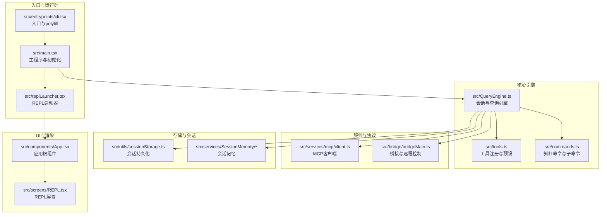
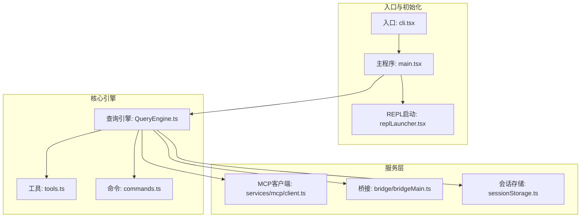
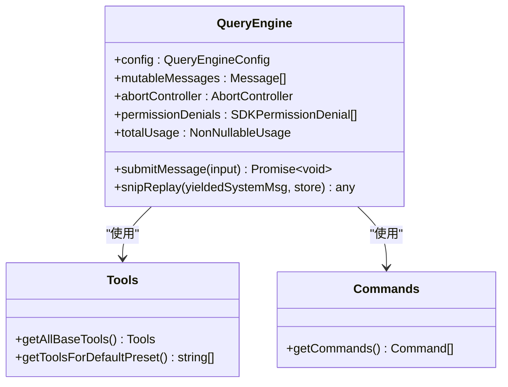
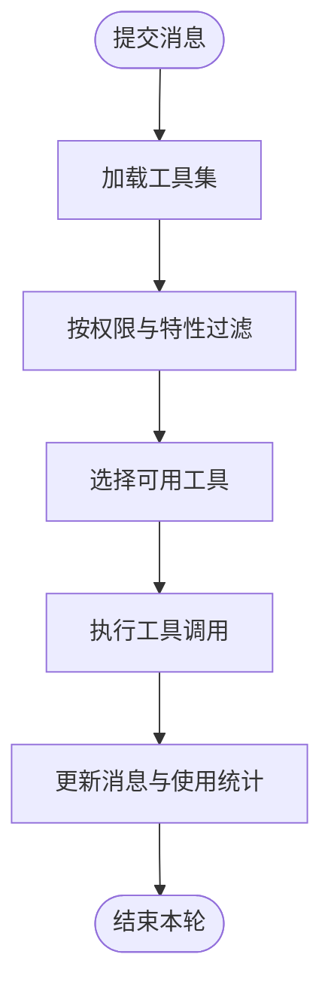
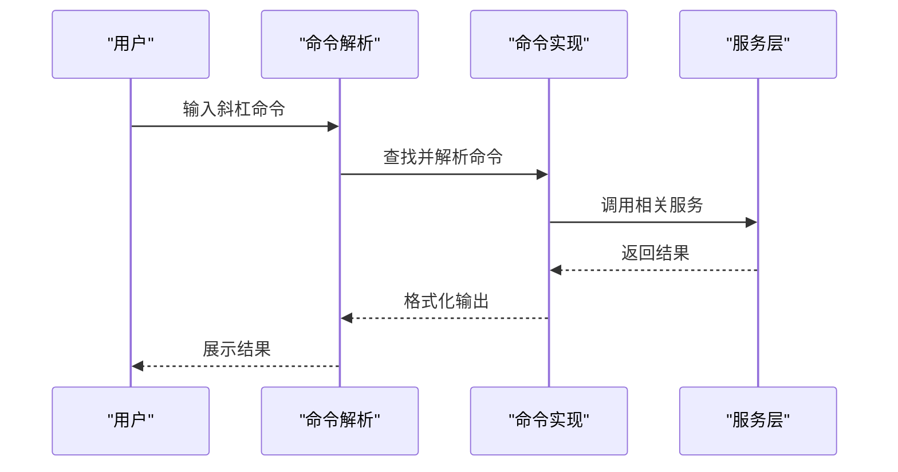
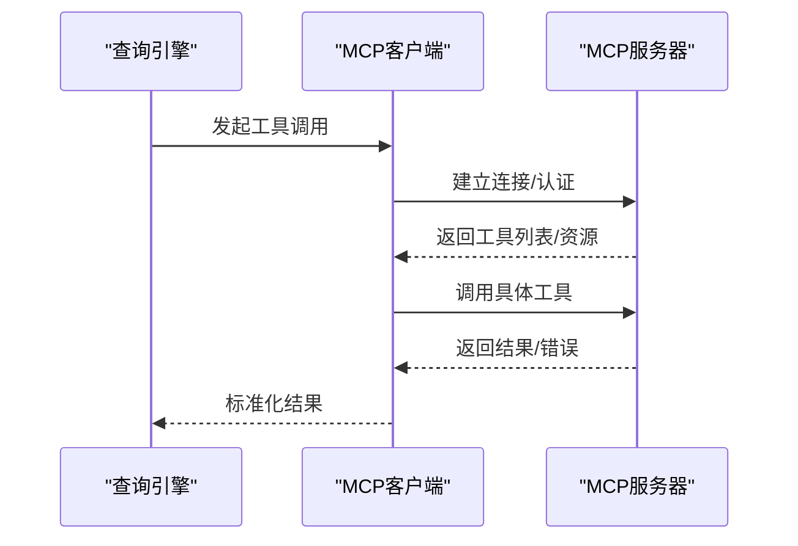
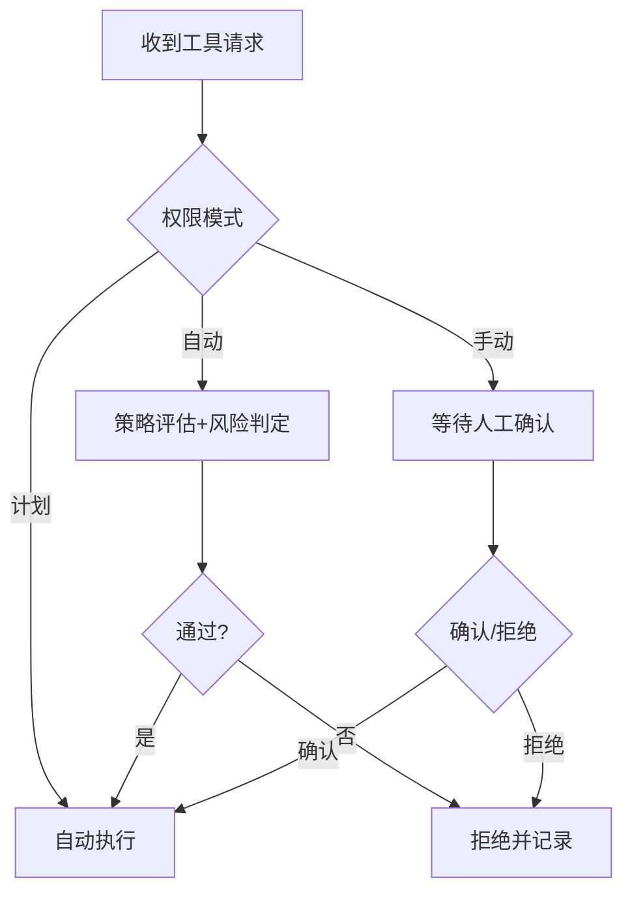
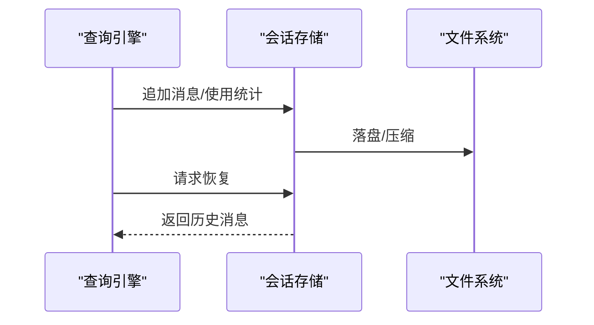
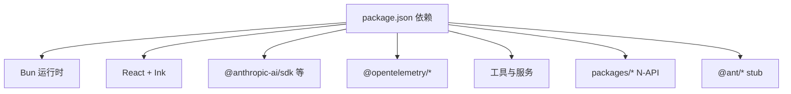

# 项目介绍

<cite>
**本文引用的文件**
- [README.md](file://README.md)
- [package.json](file://package.json)
- [src/main.tsx](file://src/main.tsx)
- [src/QueryEngine.ts](file://src/QueryEngine.ts)
- [src/tools.ts](file://src/tools.ts)
- [src/commands.ts](file://src/commands.ts)
- [src/bridge/bridgeMain.ts](file://src/bridge/bridgeMain.ts)
- [src/services/mcp/client.ts](file://src/services/mcp/client.ts)
- [src/replLauncher.tsx](file://src/replLauncher.tsx)
</cite>

## 目录
1. [简介](#简介)
2. [项目结构](#项目结构)
3. [核心组件](#核心组件)
4. [架构总览](#架构总览)
5. [详细组件分析](#详细组件分析)
6. [依赖关系分析](#依赖关系分析)
7. [性能考量](#性能考量)
8. [故障排查指南](#故障排查指南)
9. [结论](#结论)
10. [附录](#附录)

## 简介
Claude Code 是一款面向开发者的命令行智能代码助手，旨在通过 AI 驱动的交互式对话显著提升研发效率。该项目以“可复现”的方式重构了 Anthropic 官方 Claude Code CLI 的核心能力，强调工程化落地与可观测性，覆盖从上下文构建、权限控制、工具链集成到会话持久化的完整闭环。

- 核心价值主张
  - 以终端为载体的 AI 编码助手：提供 REPL 交互体验，支持流式对话与工具调用循环，帮助开发者在命令行环境中高效完成代码编写、问题排查、文件操作与远程协作。
  - 多工具集成与扩展：内置丰富的工具集（如 Bash、文件读写、网页抓取/搜索、任务管理、定时任务等），并支持通过 MCP（Model Context Protocol）协议接入第三方资源与能力，形成开放的工具生态。
  - 安全与可控：提供三层权限模式（计划/自动/手动），结合沙箱策略与路径校验，确保在复杂工程场景下的安全执行；同时支持会话恢复、压缩与持久化，保障长期工作的连续性与可追溯性。
  - 工程化与可观测：完善的诊断工具、性能指标与遥测埋点，便于在生产或复杂环境下进行健康检查与问题定位。

- 设计理念
  - 以“对话即流程”为核心：将自然语言指令转化为可执行的工具调用序列，结合上下文压缩与成本跟踪，平衡效果与开销。
  - 以“终端为 UI”：采用 Ink 终端渲染框架，提供高保真交互体验，兼顾轻量化与可访问性。
  - 以“可插拔”为扩展：通过命令系统、技能（skills）、插件与 MCP 服务器，实现能力的按需加载与动态组合。

- 目标用户与典型场景
  - 目标用户：需要在终端中进行高效编码、检索与协作的开发者与工程团队。
  - 典型场景：代码编写辅助、问题定位与修复、批量文件操作、跨主机远程协作、与外部工具链（CI/CD、IDE、知识库）联动、自动化任务编排等。

- 技术选型与架构优势
  - 运行时：Bun 作为高性能运行时，具备极佳的冷启动与模块加载性能，适合 CLI 场景。
  - 前端渲染：React + Ink 组件系统，提供流畅的 REPL 交互与可视化反馈。
  - 类型安全：TypeScript 全面覆盖，配合严格的类型约束与工具链检查，降低维护成本。
  - 架构优势：模块化设计、按需加载、特征开关（feature flags）与死代码消除，兼顾功能完整性与体积控制。

- 开源与社区
  - 本项目仅供学习研究使用，版权归属 Anthropic。欢迎通过 Issues 反馈问题与建议，PR 提交暂不接受，但鼓励社区贡献与二次创作。

**章节来源**
- [README.md:1-436](file://README.md#L1-L436)
- [package.json:1-166](file://package.json#L1-L166)

## 项目结构
项目采用 Monorepo 结构，核心代码位于 src/，包含入口、命令系统、工具体系、服务层、权限与安全、会话与存储、MCP 客户端、桥接与远程控制等多个子域。packages/ 下为内部 N-API 包与 @ant 前缀的 stub 包，scripts/ 提供构建与健康检查脚本，dist/ 为构建产物目录。

**图表来源**
- [src/main.tsx:585-800](file://src/main.tsx#L585-L800)
- [src/replLauncher.tsx:12-23](file://src/replLauncher.tsx#L12-L23)
- [src/QueryEngine.ts:186-200](file://src/QueryEngine.ts#L186-L200)
- [src/tools.ts:191-200](file://src/tools.ts#L191-L200)
- [src/commands.ts:1-200](file://src/commands.ts#L1-L200)
- [src/services/mcp/client.ts:1-200](file://src/services/mcp/client.ts#L1-L200)
- [src/bridge/bridgeMain.ts:141-200](file://src/bridge/bridgeMain.ts#L141-L200)

**章节来源**
- [README.md:326-354](file://README.md#L326-L354)
- [package.json:30-36](file://package.json#L30-L36)

## 核心组件
- REPL 交互界面（Ink 终端渲染）
  - 通过 React + Ink 提供高保真终端 UI，支持消息滚动、状态栏、快捷键与主题切换，满足长时间对话与多轮迭代需求。
- 查询引擎（QueryEngine）
  - 负责一次会话的生命周期管理，包括消息状态、工具调用、权限控制、上下文压缩与成本跟踪，并支持会话恢复与持久化。
- 工具体系（Tools）
  - 内置 Bash、文件读写、网页抓取/搜索、任务管理、定时任务、计划模式、工作树切换等工具；支持条件启用与死代码消除，按需加载。
- 命令系统（Commands）
  - 提供斜杠命令与子命令，覆盖配置、上下文、会话、权限、插件、MCP、诊断、远程控制等功能，支持动态加载与特性开关。
- MCP 客户端（Model Context Protocol）
  - 通过标准协议连接外部资源与工具，支持 HTTP/WS/STDIO 传输，提供认证、会话管理与结果持久化。
- 权限与安全（Permissions）
  - 三层权限模式（计划/自动/手动），结合沙箱策略、路径校验与规则匹配，确保在复杂工程中的安全执行。
- 会话与存储（Session Storage）
  - 支持会话持久化、消息追加、压缩与恢复，提供内存缓存与磁盘落盘的平衡策略。

**章节来源**
- [README.md:79-172](file://README.md#L79-L172)
- [src/QueryEngine.ts:186-200](file://src/QueryEngine.ts#L186-L200)
- [src/tools.ts:191-200](file://src/tools.ts#L191-L200)
- [src/commands.ts:1-200](file://src/commands.ts#L1-L200)
- [src/services/mcp/client.ts:1-200](file://src/services/mcp/client.ts#L1-L200)

## 架构总览
整体架构围绕“入口 -> 初始化 -> REPL/查询引擎 -> 工具与命令 -> 服务层（MCP/桥接/存储）”展开，采用模块化与按需加载策略，结合特征开关实现功能的灵活裁剪。

**图表来源**
- [src/main.tsx:585-800](file://src/main.tsx#L585-L800)
- [src/replLauncher.tsx:12-23](file://src/replLauncher.tsx#L12-L23)
- [src/QueryEngine.ts:186-200](file://src/QueryEngine.ts#L186-L200)
- [src/tools.ts:191-200](file://src/tools.ts#L191-L200)
- [src/commands.ts:1-200](file://src/commands.ts#L1-L200)
- [src/services/mcp/client.ts:1-200](file://src/services/mcp/client.ts#L1-200)
- [src/bridge/bridgeMain.ts:141-200](file://src/bridge/bridgeMain.ts#L141-L200)

## 详细组件分析

### 查询引擎（QueryEngine）分析
- 角色与职责
  - 管理一次会话的完整生命周期，负责消息状态、工具调用、权限控制、上下文压缩与成本跟踪。
  - 支持会话恢复、压缩边界处理与 SDK 兼容的消息映射。
- 关键特性
  - 会话状态持久化：通过会话存储模块记录消息与使用情况，支持恢复与导出。
  - 工具调用循环：与工具注册中心协同，按权限与上下文决定工具可用性与执行顺序。
  - 上下文压缩：在长对话中自动压缩历史，降低 token 消耗与延迟。
  - 成本与配额：集成成本跟踪与限额检查，避免超支。
- 数据结构与复杂度
  - 消息数组与使用统计：时间复杂度 O(n) 遍历与更新；压缩与持久化涉及 IO，受磁盘与网络影响。
  - 工具发现与权限判定：按需加载与缓存，避免重复计算。

**图表来源**
- [src/QueryEngine.ts:186-200](file://src/QueryEngine.ts#L186-L200)
- [src/tools.ts:191-200](file://src/tools.ts#L191-L200)
- [src/commands.ts:1-200](file://src/commands.ts#L1-L200)

**章节来源**
- [src/QueryEngine.ts:186-200](file://src/QueryEngine.ts#L186-L200)

### 工具体系（Tools）分析
- 设计模式
  - 工具注册与预设：集中管理工具清单，支持按环境与特性开关启用/禁用。
  - 死代码消除：通过特征开关与条件导入，在构建阶段剔除未启用的功能，减少体积。
- 典型工具
  - BashTool：安全沙箱执行 Shell 命令，支持权限检查与输出截断。
  - FileReadTool/FileEditTool/FileWriteTool：文件读取、字符串替换式编辑与创建覆写，配套 diff 追踪。
  - WebFetchTool/WebSearchTool：网页抓取与搜索，支持域名过滤与摘要生成。
  - AgentTool：派生子代理，支持异步/后台/远程执行。
  - Task* 与 Cron*：任务创建/查询/停止与定时任务管理。
- 复杂度与性能
  - 工具发现与权限判定：O(n) 遍历工具集合；条件启用减少运行时开销。

**图表来源**
- [src/tools.ts:191-200](file://src/tools.ts#L191-L200)
- [src/QueryEngine.ts:186-200](file://src/QueryEngine.ts#L186-L200)

**章节来源**
- [src/tools.ts:191-200](file://src/tools.ts#L191-L200)

### 命令系统（Commands）分析
- 设计要点
  - 斜杠命令与子命令统一注册，支持动态加载与特性开关。
  - 与技能（skills）与插件（plugins）联动，扩展命令能力。
- 典型命令
  - 配置与上下文：/config、/context、/memory
  - 会话与恢复：/resume、/session、/export、/stats
  - 权限与安全：/permissions、/sandbox-toggle、/security-review
  - 远程与桥接：/mcp、/bridge、/remote-control、/daemon
  - 辅助工具：/doctor、/help、/status、/upgrade、/usage

**图表来源**
- [src/commands.ts:1-200](file://src/commands.ts#L1-L200)

**章节来源**
- [src/commands.ts:1-200](file://src/commands.ts#L1-L200)

### MCP 客户端（Model Context Protocol）分析
- 协议支持
  - 支持 HTTP、SSE、WebSocket、STDIO 等多种传输方式，适配不同部署形态。
  - 提供认证、会话管理、工具枚举与资源读取能力。
- 安全与可靠性
  - 认证错误检测与重试、会话过期处理、结果持久化与大小截断。
- 扩展性
  - 通过 MCP 服务器注册工具与资源，实现与外部系统的无缝对接。

**图表来源**
- [src/services/mcp/client.ts:1-200](file://src/services/mcp/client.ts#L1-L200)

**章节来源**
- [src/services/mcp/client.ts:1-200](file://src/services/mcp/client.ts#L1-L200)

### 权限控制系统分析
- 三层权限模式
  - 计划模式：预设计划，自动执行，适合批量任务。
  - 自动模式：根据上下文与策略自动决策，兼顾灵活性与安全性。
  - 手动模式：严格的人工确认，适合高风险操作。
- 安全措施
  - 沙箱策略：限制命令执行范围与权限。
  - 路径校验：防止越权访问与路径遍历。
  - 规则匹配：基于规则集与 YOLO 分类器进行风险评估。

**图表来源**
- [src/QueryEngine.ts:186-200](file://src/QueryEngine.ts#L186-L200)

**章节来源**
- [src/QueryEngine.ts:186-200](file://src/QueryEngine.ts#L186-L200)

### 会话持久化与恢复分析
- 持久化策略
  - 会话消息与使用统计落盘，支持增量追加与压缩。
  - 提供会话恢复、导出与统计功能，便于审计与复盘。
- 性能与可靠性
  - 内存缓存与磁盘落盘结合，避免频繁 IO；在 409 冲突场景下具备状态恢复能力。

**图表来源**
- [src/utils/sessionStorage.ts:1114-1156](file://src/utils/sessionStorage.ts#L1114-L1156)

**章节来源**
- [src/utils/sessionStorage.ts:1114-1156](file://src/utils/sessionStorage.ts#L1114-L1156)

## 依赖关系分析
- 运行时与构建
  - Bun 作为运行时与构建工具，提供快速模块加载与代码分割能力。
  - 构建产物包含主入口与约 450 个分片文件，支持 Node/Bun 双环境运行。
- 外部依赖
  - 与 Anthropic SDK、AWS/Azure/GCP 凭据体系、OpenTelemetry、React/Ink 等广泛集成。
- 内部包
  - packages/ 下的 N-API 包（如 color-diff、audio-capture、image-processor、modifiers、url-handler）提供终端增强能力；@ant/ 下为 stub 包，保留类型与接口以便扩展。

**图表来源**
- [package.json:51-164](file://package.json#L51-L164)

**章节来源**
- [package.json:51-164](file://package.json#L51-L164)
- [README.md:355-356](file://README.md#L355-L356)

## 性能考量
- 启动与首帧
  - 通过并行预取（Keychain、MDM、用户与上下文）与延迟预取（tips、模型能力、变更检测）优化启动路径，减少阻塞。
  - REPL 首帧渲染后才触发非关键后台任务，避免抢占主线程。
- 工具与查询
  - 工具调用采用按需加载与死代码消除，减少运行时体积与启动时间。
  - 查询引擎支持上下文压缩与成本跟踪，降低长会话的 token 与延迟。
- I/O 与存储
  - 会话存储采用增量追加与压缩策略，结合内存缓存与磁盘落盘，平衡吞吐与可靠性。

[本节为通用性能讨论，无需特定文件分析]

## 故障排查指南
- 健康检查
  - 使用 /doctor 命令检查版本、API、插件、沙箱与系统状态，定位常见问题。
- 权限与沙箱
  - 若工具调用被拒，检查权限模式与沙箱设置；必要时切换至手动模式或调整策略。
- MCP 连接
  - 检查认证状态与会话有效性；若出现“会话不存在”，尝试重新建立连接或清理缓存。
- 会话恢复
  - 使用 /resume 恢复历史会话；若异常，查看会话存储状态与压缩边界。

**章节来源**
- [src/commands.ts:1-200](file://src/commands.ts#L1-L200)
- [src/services/mcp/client.ts:194-200](file://src/services/mcp/client.ts#L194-L200)
- [src/utils/sessionStorage.ts:1114-1156](file://src/utils/sessionStorage.ts#L1114-L1156)

## 结论
Claude Code 项目以“终端 AI 编码助手”为定位，通过 REPL 交互、工具链集成、MCP 协议支持、权限控制与会话持久化等能力，构建了面向开发者的高效协作与自动化平台。依托 Bun 运行时、React/Ink 渲染与 TypeScript 类型安全，项目在功能完整性与工程化落地之间取得良好平衡。对于希望在命令行环境中提升研发效率的团队与个人开发者而言，该项目提供了可复用、可扩展、可观测的解决方案。

[本节为总结性内容，无需特定文件分析]

## 附录
- 快速开始与安装
  - 环境要求：Bun >= 1.3.11；安装与运行参考 README。
- 能力清单与特性开关
  - README 中列出了核心系统、工具、命令与服务的状态与启用条件，便于按需裁剪与扩展。
- 开源与社区
  - 项目仅供学习研究使用；欢迎通过 Issues 反馈问题与建议，PR 暂不接受。

**章节来源**
- [README.md:30-60](file://README.md#L30-L60)
- [README.md:75-325](file://README.md#L75-L325)