# 项目概述

<cite>
**本文档引用的文件**
- [package.json](file://package.json)
- [README.md](file://README.md)
- [CLAUDE.md](file://CLAUDE.md)
- [src/entrypoints/cli.tsx](file://src/entrypoints/cli.tsx)
- [src/main.tsx](file://src/main.tsx)
- [src/query.ts](file://src/query.ts)
- [src/QueryEngine.ts](file://src/QueryEngine.ts)
- [src/Tool.ts](file://src/Tool.ts)
- [src/tools.ts](file://src/tools.ts)
- [src/services/mcp/types.ts](file://src/services/mcp/types.ts)
- [src/commands.ts](file://src/commands.ts)
- [docs/extensibility/mcp-protocol.mdx](file://docs/extensibility/mcp-protocol.mdx)
</cite>

## 目录
1. [简介](#简介)
2. [项目结构](#项目结构)
3. [核心组件](#核心组件)
4. [架构总览](#架构总览)
5. [详细组件分析](#详细组件分析)
6. [依赖关系分析](#依赖关系分析)
7. [性能考量](#性能考量)
8. [故障排除指南](#故障排除指南)
9. [结论](#结论)
10. [附录](#附录)

## 简介

Claude Code 是一个基于命令行的智能代码助手，采用 Anthropic Claude 的 AI 能力，为开发者提供强大的代码对话、多工具集成和 MCP（Model Context Protocol）协议支持。该项目是 Anthropic 官方 Claude Code CLI 工具的源码逆向还原项目，目标是将 Claude Code 的大部分功能及工程化能力进行复现。

### 核心价值主张

- **AI 驱动的代码对话**：通过流式对话和工具调用循环，实现自然语言到代码操作的无缝转换
- **多工具集成**：内置 50+ 个实用工具，涵盖文件操作、Shell 执行、网络搜索、任务管理等
- **MCP 协议支持**：通过 Model Context Protocol 扩展第三方工具和服务
- **终端友好**：基于 Ink 的终端渲染，提供丰富的交互体验
- **安全可控**：完善的权限系统和沙箱机制，确保操作安全

### 目标用户群体

- **专业开发者**：需要高效代码编写和调试辅助的工程师
- **技术团队**：寻求团队协作和知识管理的开发团队
- **AI 应用开发者**：希望集成 Claude 能力的 AI 应用开发者
- **系统管理员**：需要自动化运维和系统管理的 IT 专业人员

### 使用场景

- 代码补全和重构建议
- 项目结构理解和导航
- 多语言代码翻译和转换
- 数据库查询和 API 调用
- 任务自动化和批处理操作
- 代码审查和质量检查

## 项目结构

项目采用模块化的单体架构，主要分为以下几个层次：

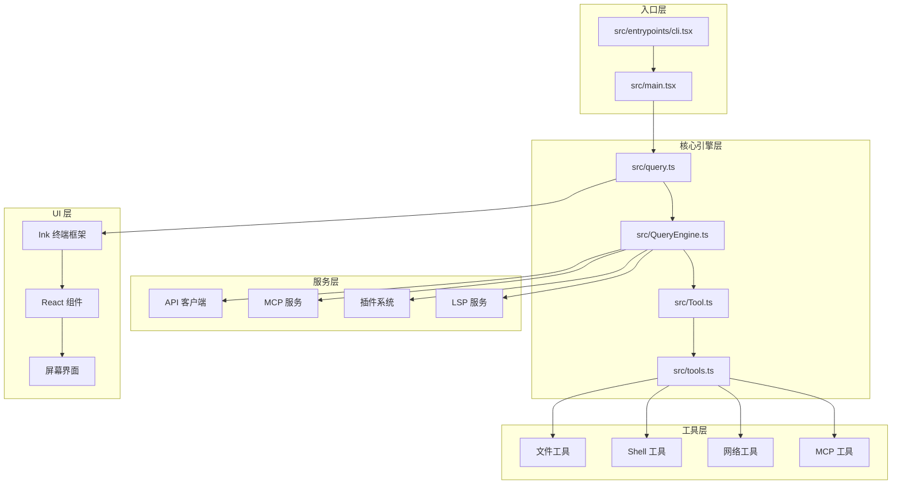

**图表来源**
- [src/entrypoints/cli.tsx:1-321](file://src/entrypoints/cli.tsx#L1-L321)
- [src/main.tsx:1-800](file://src/main.tsx#L1-L800)
- [src/query.ts:1-800](file://src/query.ts#L1-L800)
- [src/QueryEngine.ts:1-800](file://src/QueryEngine.ts#L1-L800)

### 核心模块职责

- **入口模块**：处理命令行参数解析和初始化流程
- **查询引擎**：管理对话循环和工具调用协调
- **工具系统**：提供统一的工具接口和执行框架
- **服务层**：封装各种外部服务的访问接口
- **UI 层**：基于 Ink 的终端用户界面渲染

**章节来源**
- [CLAUDE.md:28-116](file://CLAUDE.md#L28-L116)
- [README.md:326-353](file://README.md#L326-L353)

## 核心组件

### 查询引擎（QueryEngine）

查询引擎是整个系统的中枢，负责管理对话生命周期和会话状态。它将核心逻辑从交互式路径中抽取出来，形成一个可以在不同环境中使用的独立组件。

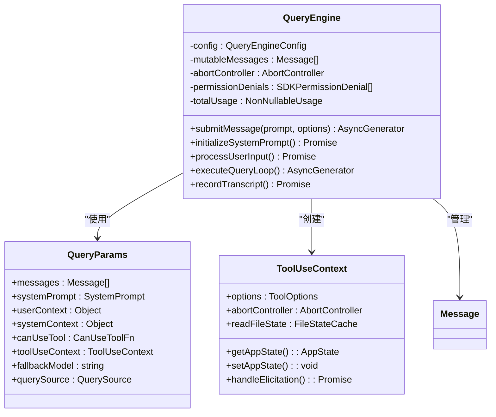

**图表来源**
- [src/QueryEngine.ts:186-800](file://src/QueryEngine.ts#L186-L800)
- [src/query.ts:181-240](file://src/query.ts#L181-L240)

### 工具系统（Tool System）

工具系统提供了统一的抽象层，使得所有工具（内置工具、MCP 工具、插件工具）都能以一致的方式被发现、验证、执行和呈现。

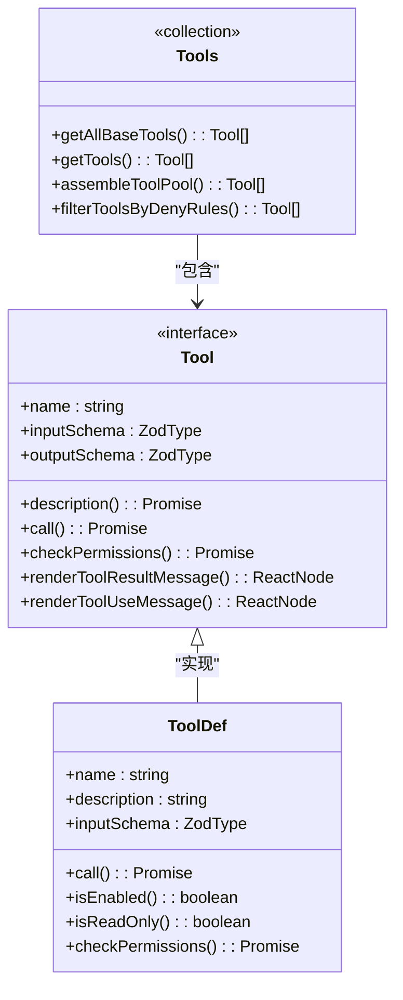

**图表来源**
- [src/Tool.ts:362-793](file://src/Tool.ts#L362-L793)
- [src/tools.ts:191-388](file://src/tools.ts#L191-L388)

### MCP 协议集成

MCP（Model Context Protocol）为 Claude Code 提供了强大的扩展能力，允许连接各种外部服务和工具。

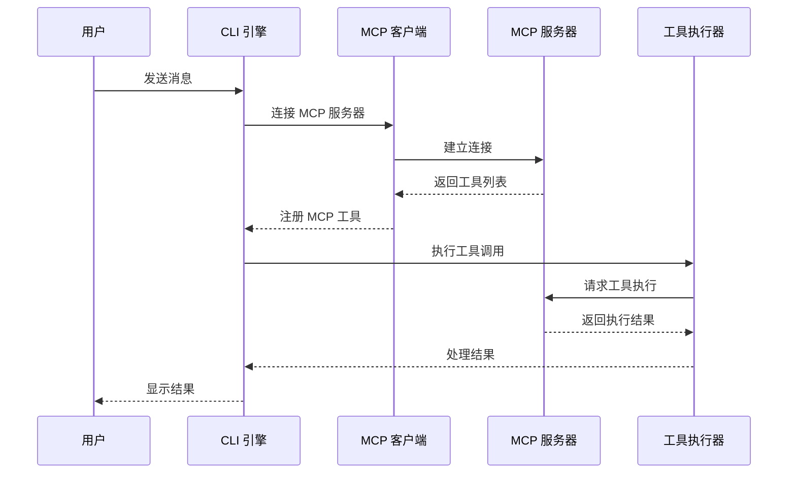

**图表来源**
- [docs/extensibility/mcp-protocol.mdx:11-31](file://docs/extensibility/mcp-protocol.mdx#L11-L31)
- [src/services/mcp/types.ts:180-227](file://src/services/mcp/types.ts#L180-L227)

**章节来源**
- [src/QueryEngine.ts:1-800](file://src/QueryEngine.ts#L1-L800)
- [src/Tool.ts:1-793](file://src/Tool.ts#L1-L793)
- [src/tools.ts:1-388](file://src/tools.ts#L1-L388)
- [docs/extensibility/mcp-protocol.mdx:1-192](file://docs/extensibility/mcp-protocol.mdx#L1-L192)

## 架构总览

Claude Code 采用分层架构设计，从底层的工具执行到顶层的用户交互，形成了完整的 AI 辅助开发生态系统。

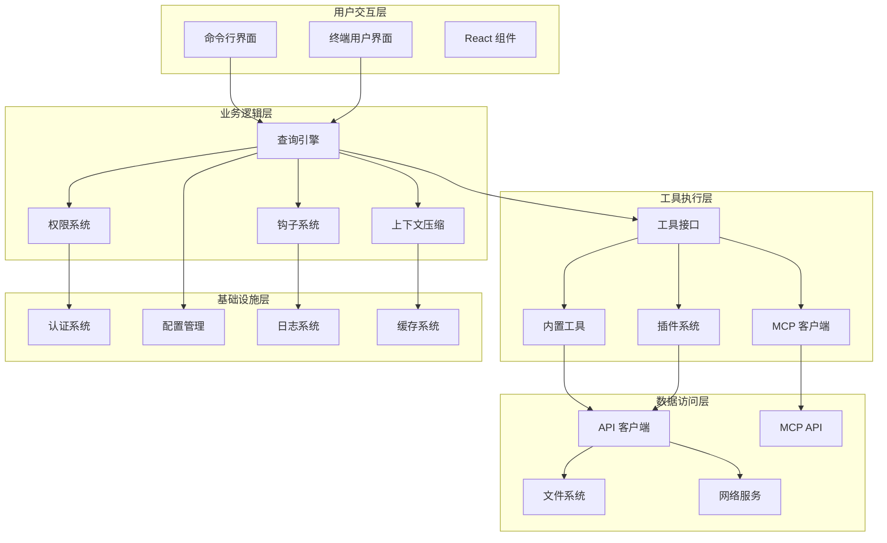

**图表来源**
- [src/main.tsx:585-800](file://src/main.tsx#L585-L800)
- [src/query.ts:219-800](file://src/query.ts#L219-L800)

### 设计理念

1. **模块化设计**：每个组件都有明确的职责边界，便于维护和扩展
2. **统一抽象**：通过 Tool 接口统一所有工具的访问方式
3. **可插拔架构**：支持 MCP 协议和插件系统，提供强大的扩展能力
4. **安全性优先**：内置权限系统和沙箱机制，确保操作安全
5. **性能优化**：采用缓存、预取和延迟加载等技术提升响应速度

**章节来源**
- [CLAUDE.md:28-116](file://CLAUDE.md#L28-L116)
- [README.md:355-436](file://README.md#L355-L436)

## 详细组件分析

### 命令行入口（CLI Entrypoint）

CLI 入口模块负责处理命令行参数、初始化运行环境，并根据不同的标志选择相应的执行路径。

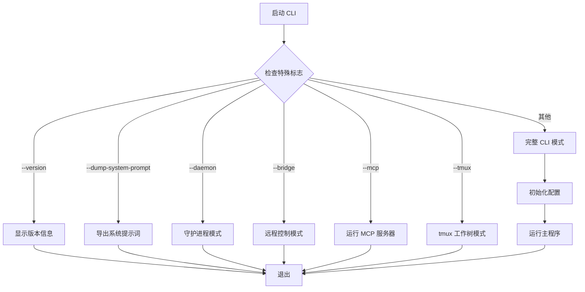

**图表来源**
- [src/entrypoints/cli.tsx:60-321](file://src/entrypoints/cli.tsx#L60-L321)

### 查询循环（Query Loop）

查询循环是 Claude Code 的核心执行引擎，负责处理用户的输入、调用工具、管理对话状态，并输出结果。

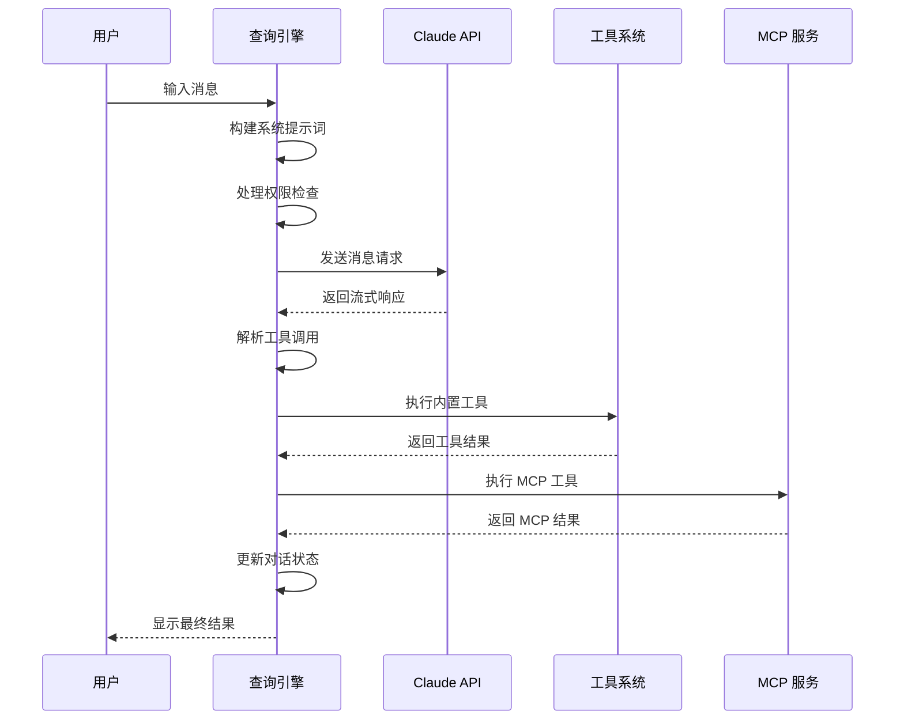

**图表来源**
- [src/query.ts:241-800](file://src/query.ts#L241-L800)
- [src/QueryEngine.ts:211-800](file://src/QueryEngine.ts#L211-L800)

### 权限系统（Permission System）

权限系统确保所有工具调用都经过适当的授权和验证，提供多层次的安全保障。

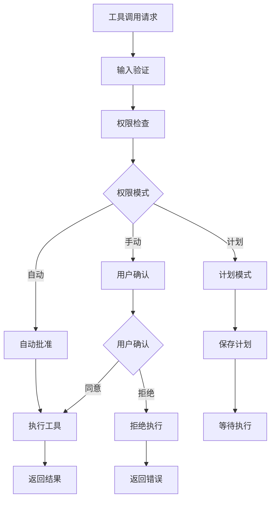

**图表来源**
- [src/Tool.ts:123-148](file://src/Tool.ts#L123-L148)
- [src/tools.ts:260-267](file://src/tools.ts#L260-L267)

### 上下文压缩（Context Compression）

为了优化性能和成本，Claude Code 实现了多种上下文压缩策略，包括自动压缩、微压缩和手动压缩。

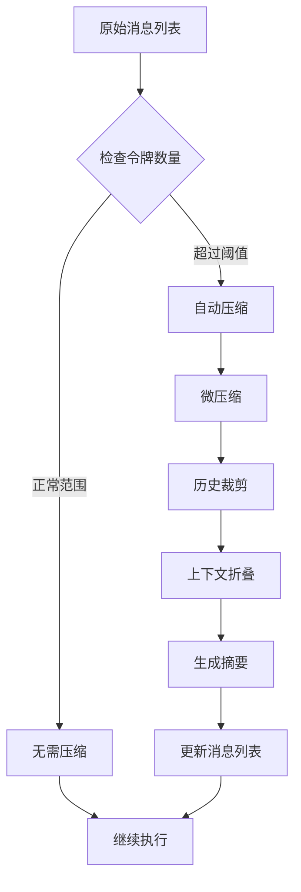

**图表来源**
- [src/query.ts:412-544](file://src/query.ts#L412-L544)
- [src/QueryEngine.ts:679-756](file://src/QueryEngine.ts#L679-L756)

**章节来源**
- [src/entrypoints/cli.tsx:1-321](file://src/entrypoints/cli.tsx#L1-L321)
- [src/query.ts:1-800](file://src/query.ts#L1-L800)
- [src/QueryEngine.ts:1-800](file://src/QueryEngine.ts#L1-L800)
- [src/Tool.ts:1-793](file://src/Tool.ts#L1-L793)

## 依赖关系分析

项目采用模块化的依赖管理策略，通过清晰的接口定义和依赖注入机制实现松耦合的设计。

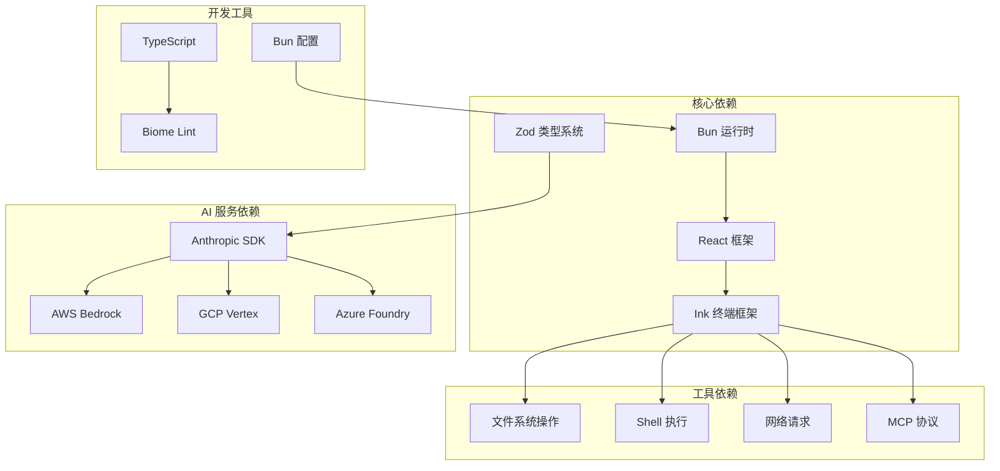

**图表来源**
- [package.json:50-164](file://package.json#L50-L164)
- [src/main.tsx:21-67](file://src/main.tsx#L21-L67)

### 外部服务集成

项目支持多种 AI 服务提供商，通过统一的接口适配不同的认证方式和 API 规范。

| 服务提供商 | 支持的认证方式 | 特殊功能 |
|-----------|---------------|----------|
| Anthropic Direct | API Key, OAuth | 完整功能支持 |
| AWS Bedrock | IAM, STS, Bearer Token | 凭据刷新 |
| Google Vertex | GCP 凭据 | 自动认证 |
| Azure Foundry | API Key, Azure AD | 企业集成 |

**章节来源**
- [package.json:51-164](file://package.json#L51-L164)
- [src/main.tsx:36-86](file://src/main.tsx#L36-L86)

## 性能考量

### 启动性能优化

项目采用了多种启动性能优化技术，包括模块懒加载、并行初始化和缓存预热。

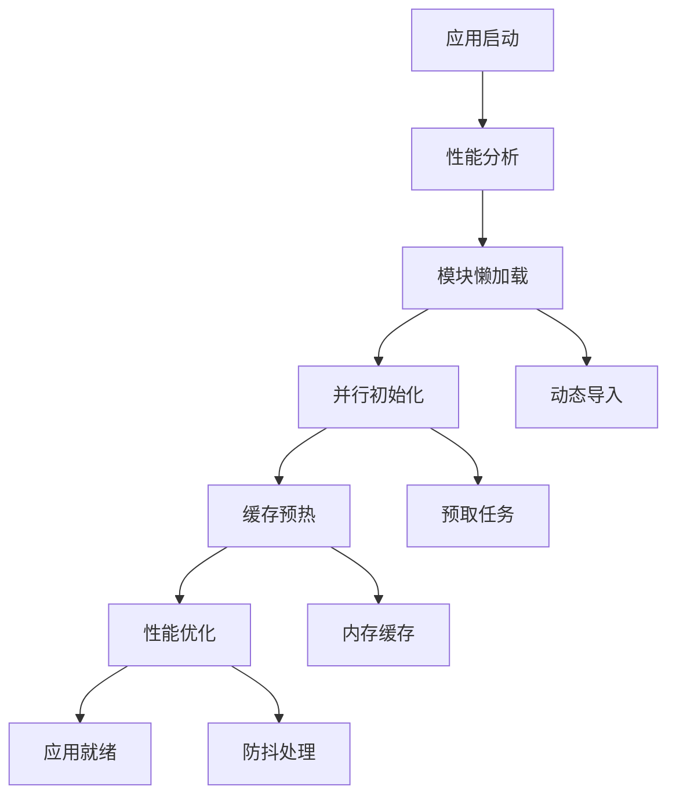

### 内存管理

通过智能的内存管理和垃圾回收策略，确保长时间运行的会话也能保持稳定的性能表现。

### 网络优化

采用连接池、请求合并和超时控制等技术，优化网络请求的性能和可靠性。

## 故障排除指南

### 常见问题诊断

1. **启动失败**：检查 Bun 版本兼容性和依赖安装
2. **API 调用错误**：验证认证配置和网络连接
3. **工具执行异常**：检查权限设置和沙箱配置
4. **性能问题**：分析内存使用和缓存命中率

### 调试工具

- **启动性能分析**：使用内置的性能分析工具
- **网络请求跟踪**：监控 API 调用和响应时间
- **内存使用监控**：跟踪内存分配和泄漏
- **日志系统**：详细的错误日志和调试信息

**章节来源**
- [README.md:59-60](file://README.md#L59-L60)
- [src/main.tsx:265-271](file://src/main.tsx#L265-L271)

## 结论

Claude Code 项目展现了现代 AI 辅助开发工具的完整架构和实现细节。通过模块化设计、统一抽象和强大的扩展能力，该项目为开发者提供了一个功能丰富、性能优异的代码助手平台。

### 主要优势

1. **功能完整性**：涵盖了从基础代码编辑到复杂任务自动化的所有核心功能
2. **扩展性强**：通过 MCP 协议和插件系统，支持无限的功能扩展
3. **性能优化**：采用多种优化技术，确保在大规模项目中的流畅体验
4. **安全性保障**：完善的权限系统和沙箱机制，确保操作安全可靠
5. **用户体验**：基于 Ink 的终端界面，提供现代化的交互体验

### 技术特色

- **AI 驱动的对话系统**：支持自然语言到代码操作的无缝转换
- **多工具集成平台**：统一的工具接口，支持 50+ 种不同类型的工具
- **MCP 协议支持**：标准的扩展协议，便于集成第三方服务
- **智能上下文管理**：自动压缩和优化对话上下文，提升性能
- **安全可控的执行环境**：严格的权限控制和沙箱隔离

## 附录

### 快速开始指南

#### 环境要求
- **Bun** >= 1.3.11
- **Node.js** >= 18（用于某些功能）
- **操作系统**：Linux、macOS 或 Windows

#### 安装步骤

1. **克隆仓库**
```bash
git clone https://github.com/claude-code-best/claude-code.git
cd claude-code
```

2. **安装依赖**
```bash
bun install
```

3. **开发模式运行**
```bash
bun run dev
```

4. **构建生产版本**
```bash
bun run build
```

#### 基本使用

1. **启动 CLI**
```bash
bun run dev
```

2. **查看帮助**
```
claude help
```

3. **执行简单命令**
```
claude /help
```

4. **查看会话历史**
```
claude /resume
```

### 高级配置

#### MCP 服务器配置

```json
{
  "mcpServers": {
    "database": {
      "command": "npx",
      "args": ["@my-org/db-mcp-server"],
      "env": {
        "DATABASE_URL": "postgres://localhost:5432/mydb"
      }
    }
  }
}
```

#### 权限配置

```json
{
  "toolPermissions": {
    "FileEditTool": {
      "behavior": "allow",
      "rules": [
        "/src/**",
        "!/src/vendor/**"
      ]
    }
  }
}
```

### 开发者指南

#### 添加新工具

1. **创建工具类**
```typescript
import { buildTool } from './Tool'

export const MyNewTool = buildTool({
  name: 'my-new-tool',
  description: '描述信息',
  inputSchema: z.object({}),
  async call(input, context) {
    // 工具实现
  }
})
```

2. **注册工具**
```typescript
// 在 tools.ts 中添加
export const getAllBaseTools = () => [
  // ... 其他工具
  MyNewTool
]
```

#### 扩展 MCP 服务器

1. **实现 MCP 服务器**
2. **配置连接参数**
3. **测试连接和工具发现**

### 社区贡献

项目欢迎社区贡献，包括但不限于：
- 新工具开发
- 文档改进
- 错误修复
- 功能增强

**章节来源**
- [README.md:30-60](file://README.md#L30-L60)
- [CLAUDE.md:9-27](file://CLAUDE.md#L9-L27)
- [package.json:1-49](file://package.json#L1-L49)